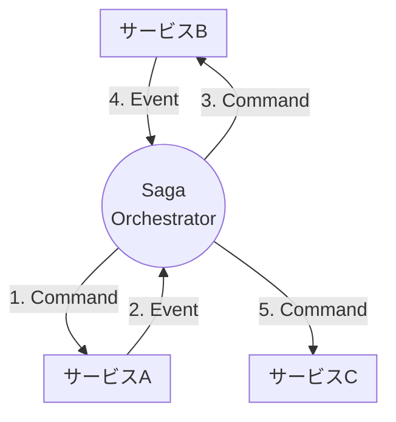
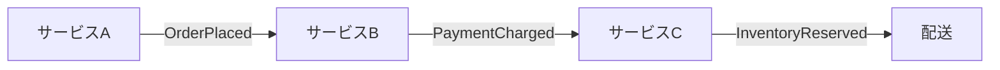

# 第05章：Sagaの2方式を知る（Orchestration / Choreography）🧑‍✈️💃


## まずは一言でイメージしよう！🎬✨

* **Orchestration（オーケストレーション）**＝「司令塔がいて、みんなに指示を出す」🧑‍✈️📣
* **Choreography（コレオグラフィー）**＝「司令塔なし。イベントを見て各自が動く」💃🕺📨

Sagaパターンには、主にこの2つの進め方があるよ〜ってことが公式系の資料でも整理されてるよ📚✨ ([microservices.io][1])

---

# 1) たとえ話で一発理解🍔🛒

## 🧑‍✈️ Orchestration：レストランの店長方式


* 店長（オーケストレーター）が「注文入ったよ！調理お願い！」→「会計お願い！」→「配達お願い！」って順番に指示📣
* 失敗したら「じゃあ返金ね」「在庫戻してね」って補償も店長が決める🔁

## 💃 Choreography：フードコートの“呼び出しベル”方式

* 「注文完了イベント」が鳴る🔔
* それを聞いた**決済サービス**が動いて「決済完了イベント」を出す📨
* それを聞いた**在庫サービス**が動いて…って連鎖していく✨
* みんなは“ベル（イベント）”だけ見て動く（司令塔はいない）💃

---

### Orchestration（オーケストレーション） 🧑‍✈️


### Choreography（コレオグラフィー） 💃

 ---

# 3) 比較表（メリデメ早見表）📋✨

| 観点           | Orchestration 🧑‍✈️   | Choreography 💃                                      |
| ------------ | --------------------- | ---------------------------------------------------- |
| 全体の流れの分かりやすさ | ✅ かなり分かりやすい（司令塔に集まる）  | △ 分かりにくくなりがち（分散）                                     |
| 変更のしやすさ      | △ 司令塔の変更が中心（影響は読みやすい） | ✅ 各サービスが独立しやすい（ただし連鎖に注意）                             |
| 依存関係（結合）     | △ 司令塔が各参加者を知りやすい      | ✅ publish/subscribeで疎結合になりやすい ([Microsoft Learn][3]) |
| 監視・デバッグ      | ✅ 追いやすい（中心がある）        | △ 追うのが大変（ログ・相関ID必須になりがち）                             |
| テストのしやすさ     | ✅ ワークフローを単体テストしやすい    | △ 統合テスト寄りになりがち                                       |
| チーム規模が大きいと…  | △ 司令塔がボトルネックになりうる     | ✅ チーム自律と相性よい                                         |

Temporalの解説でも、**Choreographyは疎結合だけど追いにくく、Orchestrationは観測しやすいが中央集権**になりやすい、って整理されてるよ🧠 ([temporal.io][4])

---

# 4) ここが超重要：Command と Event の違いを混ぜない🎯📨


* **Command（コマンド）**：お願い・指示（未来）
  例：`ReserveInventory`（在庫確保して！）
* **Event（イベント）**：起きた事実（過去）
  例：`InventoryReserved`（在庫確保できたよ！）

OrchestrationはCommand中心になりやすいし、ChoreographyはEvent中心になりやすいよ〜って整理がしやすい✨ ([milanjovanovic.tech][5])

---

# 5) C#でミニ例：まずは型（メッセージ）を作ろう🔧✨

※ここは“雰囲気を掴む用”のミニコードだよ😊
（実運用はメッセージング基盤・永続化・再試行などが必要になるよ〜）

```csharp
// Command（お願い）
public sealed record StartOrderSaga(Guid OrderId);
public sealed record ChargePayment(Guid OrderId, decimal Amount);
public sealed record ReserveInventory(Guid OrderId);
public sealed record ShipOrder(Guid OrderId);

// Compensation（補償のお願い）
public sealed record RefundPayment(Guid OrderId);
public sealed record ReleaseInventory(Guid OrderId);

// Event（起きた事実）
public sealed record PaymentCharged(Guid OrderId);
public sealed record PaymentFailed(Guid OrderId, string Reason);
public sealed record InventoryReserved(Guid OrderId);
public sealed record InventoryFailed(Guid OrderId, string Reason);
public sealed record OrderShipped(Guid OrderId);
```

---

# 6) Orchestrationのミニ例：司令塔（オーケストレーター）を書いてみる🧑‍✈️🧠

ポイントはこれ👇

* 司令塔が「今どの段階？」を覚えて進める（状態）📌
* 失敗したら補償コマンドを出す🔁

```csharp
public enum SagaStep { None, Payment, Inventory, Shipping, Completed, Compensating, Failed }

public sealed class OrderSagaOrchestrator
{
    private readonly IMessageBus _bus;
    private SagaStep _step = SagaStep.None;
    private Guid _orderId;
    private decimal _amount;

    public OrderSagaOrchestrator(IMessageBus bus) => _bus = bus;

    public Task Handle(StartOrderSaga cmd)
    {
        _orderId = cmd.OrderId;
        _amount = 1200m;
        _step = SagaStep.Payment;

        return _bus.Send(new ChargePayment(_orderId, _amount));
    }

    public Task Handle(PaymentCharged ev)
    {
        if (_step != SagaStep.Payment) return Task.CompletedTask;

        _step = SagaStep.Inventory;
        return _bus.Send(new ReserveInventory(_orderId));
    }

    public Task Handle(PaymentFailed ev)
    {
        // ここは「まだ何も確保してない」ので、補償不要 or 別対応
        _step = SagaStep.Failed;
        return Task.CompletedTask;
    }

    public Task Handle(InventoryReserved ev)
    {
        if (_step != SagaStep.Inventory) return Task.CompletedTask;

        _step = SagaStep.Shipping;
        return _bus.Send(new ShipOrder(_orderId));
    }

    public Task Handle(InventoryFailed ev)
    {
        // 決済は成功してる → 返金で帳尻合わせ
        _step = SagaStep.Compensating;
        return _bus.Send(new RefundPayment(_orderId));
    }

    public Task Handle(OrderShipped ev)
    {
        _step = SagaStep.Completed;
        return Task.CompletedTask;
    }
}

public interface IMessageBus
{
    Task Send<T>(T message);
}
```

## Orchestrationのコツ🌟

* **ワークフローが1か所に集まる**から、初心者でも追いやすい😊
* ただし「司令塔が全部知ってる」構造になりやすいので、巨大化したら分割が必要🧩

---

# 7) Choreographyのミニ例：イベントで連鎖させる💃📨

Choreographyの雰囲気はこんな感じ👇

* 「OrderStarted」イベントを見た決済が動く
* 「PaymentCharged」イベントを見た在庫が動く
* 司令塔はいない（流れが分散する）

```csharp
public sealed record OrderStarted(Guid OrderId, decimal Amount);

public sealed class PaymentService
{
    private readonly IEventBus _bus;
    public PaymentService(IEventBus bus) => _bus = bus;

    public async Task Handle(OrderStarted ev)
    {
        var ok = true; // 例：決済できた体にする
        if (ok) await _bus.Publish(new PaymentCharged(ev.OrderId));
        else    await _bus.Publish(new PaymentFailed(ev.OrderId, "Card declined"));
    }
}

public sealed class InventoryService
{
    private readonly IEventBus _bus;
    public InventoryService(IEventBus bus) => _bus = bus;

    public async Task Handle(PaymentCharged ev)
    {
        var ok = true; // 例：在庫確保できた体にする
        if (ok) await _bus.Publish(new InventoryReserved(ev.OrderId));
        else    await _bus.Publish(new InventoryFailed(ev.OrderId, "Out of stock"));
    }
}

public interface IEventBus
{
    Task Publish<T>(T @event);
}
```

## Choreographyのコツ🌟

* publish/subscribeで疎結合になりやすい💞 ([Microsoft Learn][3])
* でも「どこで何が起きてる？」が散らばりやすいから、ログやトレース設計が重要になりがち🧾🔗

---

# 8) 実装フレームワーク例（名前だけ知っておくと強い）🧰✨

「手書きで全部やる」のは大変なので、現場ではライブラリ／基盤を使うことが多いよ〜📦

* **AzureのSagaパターン資料**：Sagaの実装方式として choreo/orch の2つを整理してる📚 ([Microsoft Learn][6])
* **MassTransit**：

  * Saga State Machineは **オーケストレーション寄り**として整理されてる📌 ([MassTransit Documentation][7])
  * Routing Slipは、分散トランザクション＆補償（fault compensation）に寄せた仕組みとして説明されてるよ📦 ([masstransit.io][8])
* **NServiceBus**：ワークフロー/サガで“オーケストレーションも、コレオグラフィーも”説明がまとまってるよ📚 ([docs.particular.net][2])

---

# 9) やりがち落とし穴コーナー🕳️😵‍💫（ここ超大事）

## 落とし穴①：イベントに情報を詰め込みすぎる📦💥

「便利だから全部入れよ！」ってやると、結局イベントが重くなって結合が戻りがち😇
NServiceBusでも「イベントにデータ載せすぎ注意」って方向性が出てるよ⚠️ ([docs.particular.net][2])

## 落とし穴②：Choreographyが“イベントスパゲッティ”になる🍝


イベントが増えるほど「どれがどれに繋がってるの…？」ってなりやすい😵‍💫
→ ルール：**イベント名は“過去形の事実”**に寄せる、図で管理する🗺️

## 落とし穴③：Orchestrationの司令塔が“神クラス”化する👑💥


司令塔が何でも知ってて巨大になると、変更が怖くなる😇
→ ルール：**長いSagaは分割**（サブSaga化・境界を切る）🧩

---

# 10) どっちを選ぶ？初心者向けの“迷わない判断軸”🧭💡


## まず結論（初心者が事故りにくい順）🥇

1. **Orchestrationから入る**🧑‍✈️（流れが見えるから）
2. 慣れてきたら、領域やチーム事情で **Choreographyを混ぜる**💃

microservices.ioでも「Sagaの協調方法は2つ」って整理されてるよ📚 ([microservices.io][1])

## 判断チェック✅（YESが多い方に寄せてOK）

**Orchestrationに寄せたいとき🧑‍✈️**

* 全体の流れを1つにまとめて管理したい✅
* 補償の分岐が多い✅
* 仕様変更が頻繁で、影響を追いたい✅

**Choreographyに寄せたいとき💃**

* サービスが多く、各チームが自律してる✅
* 中央の“司令塔”を置きたくない✅
* イベント駆動の文化が整ってる✅

---

# 11) ミニ演習（5〜10分）📝😊

## 演習A：方式を選んで理由を書く🧠✍️

次のケースで、**Orchestration / Choreography どっちが良さそう？**理由も1〜2行で書こう✨

1. 小さなEC（注文→決済→在庫→配送）。開発は2人👭
2. 大きな組織。決済・在庫・配送は別チームで、リリース頻度も別々🏢
3. 補償が複雑（返金だけじゃなく、クーポン、部分返金、手動対応がある）🎫🧾

## 演習B：イベントとコマンドの分類クイズ🎲

次を **Command / Event** に分けてみよう😊

* `CancelOrder`
* `OrderCanceled`
* `ChargePayment`
* `PaymentCharged`

---

# 12) AI活用（コピペでOK）🤖✨

## メリデメ表を作らせる📋

* 「SagaのOrchestrationとChoreographyを、初心者向けに比較表で。観点は“分かりやすさ・変更容易性・監視・テスト・結合度”。」

## 図にしてもらう🗺️

* 「ECの注文Sagaを、OrchestrationとChoreographyの2種類で、登場メッセージ（Command/Event）込みのシーケンス図にして。」

## レビューしてもらう🔍

* 「このイベント設計、情報詰め込みすぎてない？依存が増えそうな点を指摘して、軽量化案も出して。」

---

# 13) 今回のまとめ（覚えるのはこの3つだけでOK）🎀✨

1. **Orchestration＝司令塔が指示する**🧑‍✈️
2. **Choreography＝イベントを見て各自が動く**💃
3. 初心者はまず **Orchestrationで“流れ”を掴む**のが安心😊

ちなみに、いまのC#は **C# 14（.NET 10対応）** が最新として案内されてるよ📌 ([Microsoft Learn][9])

[1]: https://microservices.io/patterns/data/saga.html?utm_source=chatgpt.com "Pattern: Saga"
[2]: https://docs.particular.net/architecture/workflows?utm_source=chatgpt.com "Workflows • NServiceBus"
[3]: https://learn.microsoft.com/en-us/azure/architecture/patterns/choreography?utm_source=chatgpt.com "Choreography pattern - Azure Architecture Center"
[4]: https://temporal.io/blog/to-choreograph-or-orchestrate-your-saga-that-is-the-question?utm_source=chatgpt.com "Saga Orchestration vs Choreography"
[5]: https://www.milanjovanovic.tech/blog/orchestration-vs-choreography?utm_source=chatgpt.com "Orchestration vs Choreography"
[6]: https://learn.microsoft.com/en-us/azure/architecture/patterns/saga?utm_source=chatgpt.com "Saga Design Pattern - Azure Architecture Center"
[7]: https://masstransit.massient.com/concepts/saga-state-machines?utm_source=chatgpt.com "Saga State Machines | MassTransit Documentation - Massient"
[8]: https://masstransit.io/documentation/concepts/routing-slips?utm_source=chatgpt.com "Routing Slips"
[9]: https://learn.microsoft.com/en-us/dotnet/csharp/whats-new/csharp-14?utm_source=chatgpt.com "What's new in C# 14"
