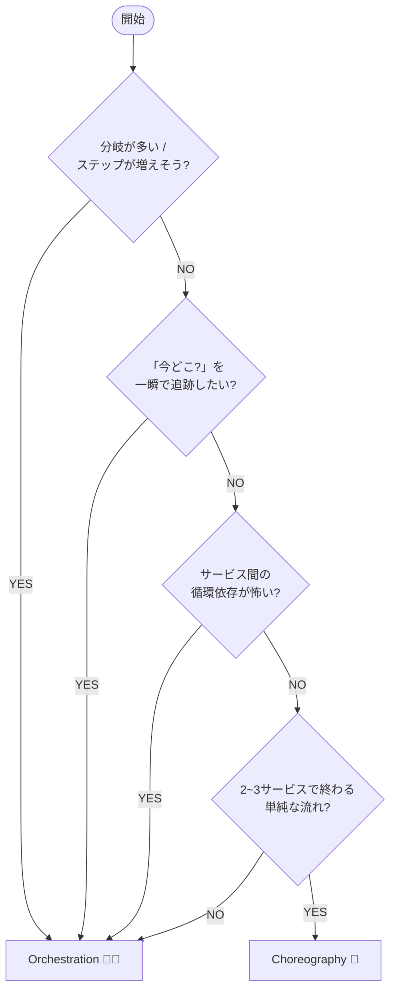

# 第06章：方式の選び方（初心者が迷わない判断軸）🧭✨


## この章のゴール🎯😊

* **Orchestration（司令塔）** と **Choreography（イベント自律）** のどっちを選ぶべきか、**判断できる**ようになる✨
* 「なんとなく」じゃなくて、**理由つきで選べる**ようになる🧠💡
* 選んだ方式で、次の章以降（用語・境界・補償・冪等性…）にスムーズに進める🚀

---

# 1) まず“超ざっくり結論”😆🧩

**初心者が最初に迷ったら、だいたい Orchestration（司令塔方式）からでOK** になりがちです🧑‍✈️✨
理由はシンプルで、**流れが見える／追える／変更しやすい**から😊
（Choreography はハマると強いけど、最初は「どこで何が起きた？」が迷子になりやすいよ〜😵‍💫）

この“ざっくり結論”は、Microsoft の Saga 解説でも

* Choreography は **少数サービスの単純フロー向き**
* Orchestration は **複雑フローや拡張に向く**
  って整理されてます📚✨ ([Microsoft Learn][1])

---

# 2) 2方式を一言で言うと？🗣️💞

## Orchestration（司令塔）🧑‍✈️🎛️

* **オーケストレーター（司令塔）** が「次はAやって→終わったらB→失敗なら補償C」みたいに指示する✨
* 司令塔が **状態を持って進行管理** する（いわば“進行表”を握ってる）📋
* サービス側は「言われたことをやる」感じで **責務がスッキリ**しやすい🧼
* ただし、司令塔が中心なので **“中心が落ちたら？”** を考える必要はある⚠️ ([Microsoft Learn][1])

## Choreography（イベント自律）💃📣

* 司令塔はいない！
* 各サービスが **イベントを出して**、それを見た別サービスが次の処理をする🎶
* 小さいフローならシンプルで速い✨
* でも、ステップが増えると **「誰が何を受けて動いてる？」が見えづらくなる**問題が出やすい😵‍💫
* 参加者同士が相互に反応し合って **循環（ループ）依存**のリスクもある⚠️ ([Microsoft Learn][1])

（定義の根っこは「ローカルトランザクションの連鎖＋失敗時は補償」だよ、っていうやつね😊） ([microservices.io][2])

---

# 3) 迷わないための判断軸チェックリスト✅🧠✨

下の項目を見て、**多い方に寄せる**のがコツだよ😊💕

## A. フローの複雑さ（ステップ数・分岐）🧩🔀

* ✅ **ステップが少ない（2〜3サービス）**／分岐ほぼ無し → **Choreography 寄り**💃
* ✅ **ステップが多い（4サービス以上）**／分岐・条件が増えそう → **Orchestration 寄り**🧑‍✈️

根拠：Choreography は **「少数・単純」向き**、増えると混乱しやすいって整理されてるよ📚 ([Microsoft Learn][1])

---

## B. 仕様変更の頻度（あとから足す？並び替える？）🔧🧱

* ✅ 変更が少ない／固定の流れ → Choreography でもいける🙆‍♀️
* ✅ **ステップ追加・順番変更が起きやすい** → Orchestration が安定✨

根拠：Choreography は **新しいステップ追加でワークフローが分かりにくくなる**、Orchestration は **複雑化・追加に向く** ([Microsoft Learn][1])

---

## C. 見える化・追跡のしやすさ（運用・障害対応）🔎🧾

* ✅ 「とにかく運用で追えることが最優先！」 → **Orchestration** が楽になりがち😊

  * 司令塔が状態を握るので「今どこ？」が作りやすい
* ✅ 「イベント駆動で自然に拡張、中央に寄せたくない」 → Choreography

根拠：Choreography は **誰がどのコマンド（/イベント）に反応してるか追いにくい**って弱点が明記されてるよ😵‍💫 ([Microsoft Learn][1])

---

## D. テストのやりやすさ🧪😇

* ✅ **統合テストを早く回したい**（初心者ほど大事！） → **Orchestration 寄り**
* ✅ 「全サービス立ち上げ前提でもOK」 → Choreography でも可

根拠：Choreography は **統合テストが難しくなりがち（全サービス必要）**って書かれてるよ📚 ([Microsoft Learn][1])

---

## E. 循環依存（ループ）を避けたい？🔁⚠️

* ✅ 「イベントが回り始めて止まらないの怖い…」 → **Orchestration**
* ✅ 「ルールを強く決めて循環を避ける運用ができる」 → Choreography でもOK

根拠：Choreography は **参加者間の循環依存リスク**がある、Orchestration はそれを避けやすい ([Microsoft Learn][1])

---

## F. “中心が落ちたら？”を許容できる？🧯🏥

* ✅ 中央のコンポーネントを極力持ちたくない → Choreography
* ✅ 中央があっても、冗長化・監視できる → Orchestration

根拠：Orchestration は **司令塔がワークフロー全体を担うので単一障害点になり得る** ([Microsoft Learn][1])

---

### 方式選択の意思決定フロー 🧭✅


（この“寄せ方”は、Microsoft の整理とほぼ一致するよ📚✨） ([Microsoft Learn][1])

---

# 5) 例で体感しよ〜😆📦

## 例1：小さめ（2〜3サービス）🍰

**注文 → 決済 → 在庫**（分岐ほぼ無し）

* Choreography：

  * Order が `OrderPlaced` 出す📣
  * Payment が見て `PaymentAuthorized` 出す📣
  * Inventory が見て `InventoryReserved` 出す📣
    → シンプルなら気持ちいい✨
    （でも「どこで止まった？」が後から困ることも😵‍💫） ([Microsoft Learn][1])

## 例2：中くらい（分岐あり）🍛

**注文 → 決済（失敗なら終了）→ 在庫（失敗なら返金）→ 配送（失敗なら返金＋在庫戻し）**

* もうこの辺から **Orchestration が楽**😊
* 司令塔が「成功/失敗と補償」を一本道で管理できる🧑‍✈️✨ ([Microsoft Learn][1])

## 例3：大きめ（例外だらけ）🏰

**本人確認／クーポン／ポイント／与信／不正検知／配送会社分岐…**

* Choreography だとイベントの絡みが増えて「誰が何の責務？」が崩れやすい😵‍💫
* Orchestration だと「フローの中心線」を保ちやすい✨ ([Microsoft Learn][1])

---

# 6) ミニ演習📝😆：「自分の想定アプリ」で方式決定！

## ステップ1：想定アプリを1つ決める🎮🛍️

例：ミニEC、予約、サブスク、ポイント付与…なんでもOK😊

## ステップ2：下の表を埋める✅

| 質問                  | YES / NO |
| ------------------- | -------- |
| 参加サービスは4つ以上？        |          |
| 分岐（条件）が2つ以上ある？      |          |
| ステップ追加が起きそう？        |          |
| 運用で「今どこ？」を強く求める？    |          |
| 循環依存が怖い？            |          |
| 中央コンポーネントを極力持ちたくない？ |          |

## ステップ3：判定✨

* YES が多いほど **Orchestration** 🧑‍✈️
* 「中央を持ちたくない」が強くて、かつ他が軽いなら **Choreography** 💃

（この章は“決め方”が目的なので、完璧な正解はないよ😊 でも **理由が言える**のが大事！）

---

# 7) C#ミニコード（判断軸を“コードで言語化”してみる）🧑‍💻✨

「決め方」をコードにすると、チームで議論しやすくなるよ〜😊💕

```csharp
public enum SagaStyle
{
    Orchestration,
    Choreography
}

public sealed record SagaChoiceInput(
    int ServiceCount,
    bool HasBranches,
    bool ChangesOften,
    bool NeedEasyTracing,
    bool WorriedAboutCycles,
    bool AvoidCentralComponent
);

public static class SagaStyleChooser
{
    // ※これは“考え方の型”を作る例だよ（正解アルゴリズムじゃないよ😊）
    public static SagaStyle Choose(SagaChoiceInput x)
    {
        var orchestrationScore = 0;
        var choreographyScore = 0;

        if (x.ServiceCount >= 4) orchestrationScore += 2; else choreographyScore += 1;
        if (x.HasBranches) orchestrationScore += 2; else choreographyScore += 1;
        if (x.ChangesOften) orchestrationScore += 2;
        if (x.NeedEasyTracing) orchestrationScore += 2;
        if (x.WorriedAboutCycles) orchestrationScore += 1;
        if (x.AvoidCentralComponent) choreographyScore += 3;

        return orchestrationScore >= choreographyScore
            ? SagaStyle.Orchestration
            : SagaStyle.Choreography;
    }
}
```

使い方（例）👇

```csharp
var input = new SagaChoiceInput(
    ServiceCount: 5,
    HasBranches: true,
    ChangesOften: true,
    NeedEasyTracing: true,
    WorriedAboutCycles: true,
    AvoidCentralComponent: false
);

var style = SagaStyleChooser.Choose(input);
Console.WriteLine(style); // Orchestration
```

---

# 8) AI活用コーナー🤖💖（Copilot / Codex で爆速に決める）

## A. 方式決定をAIにレビューしてもらうプロンプト📝🤖

そのまま貼って使えるよ〜！

* **プロンプト①：おすすめ方式＋理由**

  * 「私の業務フローは『注文→決済→在庫→配送』で、参加サービスは5つ、分岐は2つ、仕様変更が多いです。Saga の Orchestration と Choreography のどちらが良い？理由とリスク、運用の注意点を箇条書きで出して」

* **プロンプト②：落とし穴チェック**

  * 「Choreography を選ぶ場合に初心者がハマるポイント（追跡・循環依存・テスト）をチェックリスト化して」

* **プロンプト③：イベント名・コマンド名の叩き台**

  * 「このフローの Command と Event を名前案として20個出して。Eventは過去形で」

（Saga では “イベント/メッセージで次に進む” が基本なので、命名や責務整理をAIに手伝わせるのは超相性いいよ📨✨） ([microservices.io][2])

## B. Visual Studio の Copilot 便利ネタ🧰✨

Visual Studio 2026 では、Copilot 周りで **NuGet の情報取得や脆弱パッケージ対応を助ける仕組み（NuGet MCP Server）**が案内されてるよ🛡️📦 ([Microsoft Learn][3])
（メッセージング系ライブラリを使うと依存関係が増えがちだから、ここで安全性チェックできるのは地味に助かるやつ😊）

---

# 9) よくある落とし穴（初心者あるある）😵‍💫🕳️

## 落とし穴①：Choreography がいつのまにか“スパゲッティイベント”🍝

* 「AのイベントでBが動き、BのイベントでCが動き…あれ？誰が全体責任？」
* ステップ追加で **全体像が崩れやすい** ([Microsoft Learn][1])
  ✅対策：小さいうちはOK。増えそうなら早めに Orchestration 寄せを検討🧑‍✈️

## 落とし穴②：循環依存でイベントがループ🔁🔥

* 「補償イベントが別の処理を再トリガーして…無限回」みたいな事故⚠️ ([Microsoft Learn][1])
  ✅対策：イベント設計のルール強化＋（不安なら）Orchestration

## 落とし穴③：統合テストが重くて回らない🧪💦

* Choreography は **全部動かさないと再現できない**ことが増える ([Microsoft Learn][1])
  ✅対策：最初は Orchestration で「フロー中心」をテストしやすくする

## 落とし穴④：補償が“できる前提”で考えちゃう🙅‍♀️

Saga は「補償で整合を取る」けど、補償がいつも成功するとは限らない…って注意もあるよ😢 ([Microsoft Learn][1])
✅対策：補償失敗時の“最後の逃げ道”（運用介入・保留状態）を意識する（これは後の章で深掘りするよ✨）

---

# 10) 開発メモ（いまの最新の前提っぽい話）🗓️✨

* .NET の 2026年1月の最新サービスリリースとして **.NET 10.0.2 / 9.0.12 / 8.0.23** が案内されてるよ📦 ([Microsoft for Developers][4])
* Visual Studio 2026 のリリースノートでは **2026/1/20 に 18.2.1** が出てるよ🛠️ ([Microsoft Learn][3])

（この章では方式決定がメインだけど、後のハンズオンで“動く形”にするときに効いてくるよ😊）

---

# まとめ🎀😊

* **Choreography**：少数サービスのシンプルな流れに強い💃✨（でも拡張で混乱・循環・テストが重くなりやすい） ([Microsoft Learn][1])
* **Orchestration**：複雑化・拡張・追跡に強い🧑‍✈️✨（ただし中心の設計と耐障害性は意識） ([Microsoft Learn][1])

次章では、どっちを選んでも事故りにくくするために、**用語と境界（ミニDDD風）**を整えていくよ〜📖🧼✨

[1]: https://learn.microsoft.com/en-us/azure/architecture/patterns/saga "Saga Design Pattern - Azure Architecture Center | Microsoft Learn"
[2]: https://microservices.io/patterns/data/saga.html "Pattern: Saga"
[3]: https://learn.microsoft.com/en-us/visualstudio/releases/2026/release-notes "Visual Studio 2026 Release Notes | Microsoft Learn"
[4]: https://devblogs.microsoft.com/dotnet/dotnet-and-dotnet-framework-january-2026-servicing-updates/ ".NET and .NET Framework January 2026 servicing releases updates - .NET Blog"
