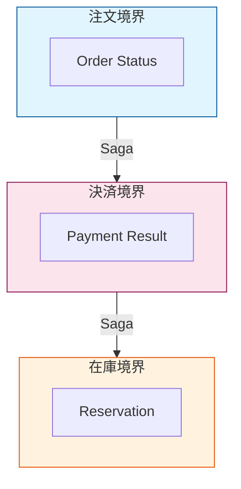

# 第07章：用語と境界をそろえる（ミニDDD風の準備）📖🧼


## この章のゴール🎯✨

* 「注文」「決済」みたいな言葉のブレをなくして、みんなが同じ絵を見れるようになる👀🧠
* 「どこまでが注文？どこからが決済？」みたいな“境界（責務の分け目）”を決められる🧭🧩
* Sagaの後半（補償・冪等・状態機械）で迷子にならない土台を作る🛡️😊

---

# 7-1. まず怖い話：言葉がブレるとSagaが壊れる😱💥


たとえば、こんな会話が起きがち👇

* Aさん「“注文確定”したよ！」📣
* Bさん「え、確定って“決済完了”のこと？」😵
* Cさん「私は“在庫確保できたら確定”って意味で使ってた…」🌀

この状態でSagaを組むと、
✅ 正しい順番
✅ どこで失敗したのか
✅ 何を補償すべきか
が全部あいまいになるの…！😵‍💫💦

なのでこの章は、**Sagaの設計より先に“言葉と境界”をそろえる章**だよ📚✨

---

# 7-2. ミニDDD①：ユビキタス言語（みんなで同じ言葉を使う）🗣️📘


DDDって聞くと難しそうだけど、この章では超ミニでOK🙆‍♀️✨
ここでやるのはシンプルにこれ👇

## ✅ “用語の辞書”を作って、チームの共通語にする📚✨

* 用語（単語）を並べる
* **意味を1行で固定**する
* 似た言い方（同義語）や危険ワードもメモする

これだけで、後の章の理解が爆伸びするよ📈😊

---

# 7-3. ミニDDD②：境界（責務の分け目）をそろえる🧱✂️

境界っていうのは、「ここからここまでは誰の担当？」の線引きだよ🙋‍♀️

## ✅ 境界があると何が嬉しい？🎁

* 変更が楽（1か所直したら全部壊れる…が減る）🛠️
* 事故が小さくなる（影響範囲が限定される）🧯
* Sagaのステップが整理できる（ステップ＝境界をまたぐ動き、になりやすい）🔁

## ✅ 境界の決め方（初心者向け3点セット）🧭


境界にしたい候補が出たら、これでチェックしてね👇

1. **データの持ち主は誰？**（注文データは注文の担当が持つ、みたいに）🗃️👑
2. **一緒に変わるもの同士？**（仕様変更で一緒に直すなら近くに置く）🔧
3. **失敗の種類が違う？**（決済は外部要因が多い、在庫は社内要因が多い…など）⚡

---

# 7-4. 例：ECのSagaを「言葉」と「境界」で整える🛒✨

## まず“流れ”を1行で書く📝

* 注文を作る → 決済する → 在庫を確保する → 配送手配する 🚚

ここから、用語と境界を整えるよ😊

---

# 7-5. ミニ辞書（用語集）を作ろう📚📝✨

## ✅ 用語集テンプレ（そのまま使ってOK）💡

| 用語             | 意味（1行で固定）            | 境界（担当） | 同義語/禁止ワード        | 備考      |
| -------------- | -------------------- | ------ | ---------------- | ------- |
| 注文（Order）      | ユーザーが購入意思を登録したもの     | 注文     | “購入”は曖昧になりがち     | 状態を持つ   |
| 注文確定           | 「決済成功＋在庫確保」まで完了した注文  | 注文     | “確定”の定義を固定！      | 重要ワード   |
| 決済（Payment）    | 支払い処理（外部決済に依存する）     | 決済     | “課金”は二重課金連想で注意   | 失敗が多い   |
| 返金（Refund）     | 決済成功後に金額を戻す処理        | 決済     | “取消”と混ぜない        | 補償候補    |
| 在庫確保（Reserve）  | 在庫を“引き当て”て他者に取られない状態 | 在庫     | “在庫減らす”と別概念      | 先に確保が多い |
| 配送手配（Shipment） | 配送ラベル作成など配送開始前の手続き   | 配送     | “発送”は開始後の意味になりがち | 境界注意    |

## ✅ コツ：意味は「文章じゃなくて“定義”」にする🧊✨

* ❌「注文確定：注文がちゃんとできた状態」←ふわふわ
* ✅「注文確定：決済成功＋在庫確保が両方OKの状態」←判定できる✅

---

# 7-6. “境界マップ”を作ろう（超ミニ版）🗺️🧩


次に、用語を「どの境界が責任を持つか」で配置するよ😊

## ✅ 例：境界を4つに分ける（初心者向け）📦

* 注文（Order）
* 決済（Payment）
* 在庫（Inventory）
* 配送（Shipping）

そして、原則はこれ👇

### 境界と責務のイメージ 🗺️🧩


ここがブレると、Sagaが「誰が正しいの？」って揉めて崩壊しやすい😵‍💫💦

---

# 7-7. C#で“言葉のブレ”を減らす小ワザ🧑‍💻✨


コードでもブレを防げるよ😊
ポイントは **「文字列で状態や種類を持たない」** こと！

## ✅ 例：状態は enum / 値は record で表現する🧩

```csharp
public enum OrderStatus
{
    Created,
    PaymentSucceeded,
    InventoryReserved,
    Confirmed,
    Cancelled
}

public readonly record struct OrderId(Guid Value);
public readonly record struct PaymentId(Guid Value);
```

* `OrderStatus` で「確定って何？」がコード上でも揺れにくい✅
* `OrderId` と `PaymentId` を分けると、取り違え事故が減る🛡️

---

# 7-8. AI活用：用語ブレ＆境界ブレを“先に潰す”🤖✅✨

AIはこの章と相性めちゃ良い！理由は「言葉の整理」が得意だから😊

## ✅ 使えるお願い（コピペOK）📋

* 「ECの注文〜配送の流れで、用語集（用語/定義/同義語注意）を作って」📚
* 「“注文確定”みたいな誤解が起きやすい言葉を10個挙げて、危険ポイントを書いて」⚠️
* 「境界を“注文/決済/在庫/配送”にした場合、責務が被りそうなところを指摘して」🧩
* 「用語集をレビューして、“曖昧な定義”に赤入れして」🟥✍️

## ✅ AIの答えをそのまま採用しないチェック3点🕵️‍♀️

1. **判定できる定義になってる？**（Yes/Noで決められる？）✅
2. **境界の責任者が1つに決まってる？**👑
3. **似た言葉が混ざってない？**（取消/返金/無効化…）🌀

---

# 7-9. ミニ演習：用語集を作ってみよう📚💪✨

## 演習①：用語を20個集める📝

* 名詞（Order/Payment/Reservation…）
* 動詞（Confirm/Cancel/Refund…）
* 状態（Pending/Confirmed/Failed…）

## 演習②：そのうち“危険ワード”を5個選ぶ⚠️

例：確定、取消、完了、成功、反映 など
→ **どう誤解されるか**を書いておく✍️

## 演習③：境界（担当）を必ず1つ付ける👑

「どこが責任を持つの？」を全用語に付ける✨
迷った用語は、それ自体が“設計の宿題”だよ🧠💡

---

# 7-10. まとめ（ここができるとSagaが一気に楽になる）😊🧼✨

* Sagaは“ステップの設計”の前に、**言葉と境界**をそろえるのが超大事📚
* 用語集は、難しいドキュメントじゃなくて「辞書」でOK📘
* 境界は「責任者は1つ」「データの持ち主を決める」が基本👑
* 状態やIDをC#の型で表現すると、ブレと事故が減る🛡️🧑‍💻

---

## 🧁豆知識：2026年のC#まわり（最新）✨

* C#の最新は **C# 14** で、**.NET 10** でサポートされてるよ。([Microsoft Learn][1])
* 公式ドキュメントでは、C# 14を試す方法として **Visual Studio 2026** や .NET 10 SDK が案内されてるよ。([Microsoft Learn][1])

[1]: https://learn.microsoft.com/ja-jp/dotnet/csharp/whats-new/csharp-14?utm_source=chatgpt.com "C# 14 の新機能"
