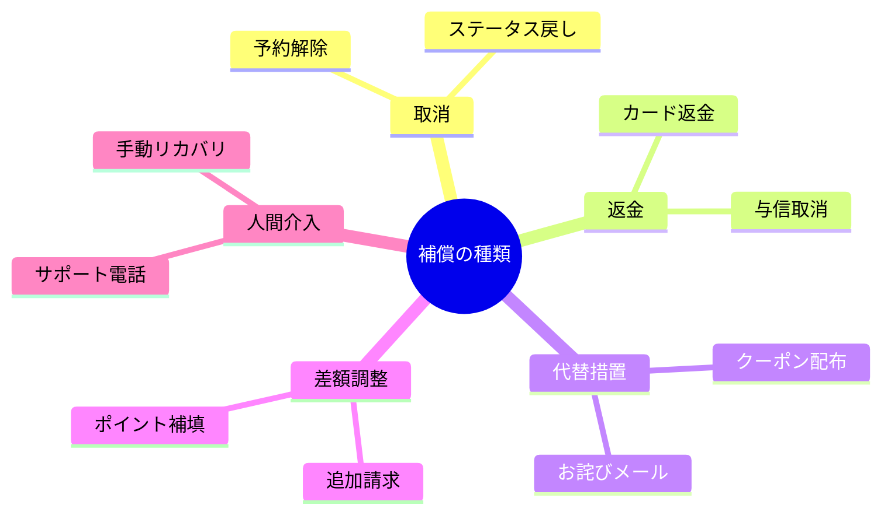

# 第08章：補償の基本（“逆操作”ではなく“帳尻合わせ”）🙅‍♀️🧾


## この章のゴール🎯✨

* 「補償＝元に戻す」だけじゃなく、「ビジネス的に正しい状態に整える（帳尻合わせ）」も補償だとわかる😊
* 補償パターン（返金・取消・無効化・差額調整・代替措置…）を使い分けできるようになる💡
* 「戻せない操作」がある前提で、事故らない補償案を作れるようになる🛡️

---

## 1) まず大事：補償は“Ctrl+Z”じゃない🙅‍♀️🧾


Sagaでは、途中まで成功した処理が「途中で失敗」したときに、すでに確定したステップを“あとから別の処理で”整合するよね🔁
このときの補償（Compensating Transaction）は **ロールバックじゃなくて「新しい処理」** なんだよ〜✨
だから、**完全に元通りにならない**ことも普通にあるよ（むしろそれが現実）😌
補償アクションは「必ずしも以前と同じ状態に戻すわけではない」という前提が超重要！ ([Enterprise Integration Patterns][1])

---

## 2) 「元に戻す」より「正しく着地させる」🧠💡

たとえば、注文フローがこうだとして：

* 注文作成✅
* 決済✅
* 在庫確保✅
* 配送手配❌（ここで失敗😭）

このとき「全部なかったことにする」が常に正解とは限らないよね。
現実では、**ユーザー体験・会計・物流・規約**などの都合で、いろんな“着地”がある👀✨

Sagaは「失敗したら補償を実行して一貫性を保つ」仕組みだよ、というのが基本の位置づけだよ📌 ([Microsoft Learn][2])

---

### 補償（帳尻合わせ）の種類 🏷️✨


### F. 通知＆人間介入（Manual）👩‍💼📞


* 例：発送が止まらないなら「謝罪メール＋返金＋サポート連携」
* 外に出たもの（メール送信など）は“取り消せない”ことがあるから、ここが超現実的💦 ([ウィキペディア][3])

---

## 4) 「戻せる操作」と「戻せない操作」を分けよう✂️🧠


補償設計のコツは、まずここ！

### ✅戻しやすい

* 予約（仮確保）→ 解除
* “未確定”ステータス → 取消
* 仮与信 → 取消（Void）

### ❌戻しにくい / 戻せない

* 送ったメール（取り消せない😇）
* 発送開始（止められない時がある🚚💨）
* 外部システムで「物理的に動いた」もの

だから「逆操作を作る」より先に、**“どこまでなら引き返せるか”**を確認するのが大事だよ🧭

---

## 5) 補償はそれ自体も失敗する😱➡️だから設計がいる

ここ、めちゃ大事！
補償トランザクションは **“最終的整合性の処理”** なので、補償も途中で失敗することがあるよ😭
だから **再開できること**、そして **同じ補償が繰り返されても壊れない（冪等）** ことが重要になる✅
「補償も失敗しうる」「補償の各ステップは冪等に」って明示されてるよ📌 ([Microsoft Learn][4])

---

## 6) C#でのイメージ：補償は“スタック”で覚えると簡単🔁🧠


Sagaの各ステップが成功したら、「成功した順に補償（戻し方）」を積んでいくイメージだよ📚✨
失敗したら、**逆順で補償を実行**する！

```csharp
public interface ICompensationStep
{
    Task CompensateAsync(CancellationToken ct);
}

public sealed class SagaRunner
{
    private readonly Stack<ICompensationStep> _compensations = new();

    public void AddCompensation(ICompensationStep step) => _compensations.Push(step);

    public async Task RunAsync(Func<Task> sagaBody, CancellationToken ct)
    {
        try
        {
            await sagaBody();
        }
        catch
        {
            // 逆順に補償（※ここで補償も失敗しうるので本当はログ・リトライ・保留が必要）
            while (_compensations.Count > 0)
            {
                var step = _compensations.Pop();
                await step.CompensateAsync(ct);
            }
            throw;
        }
    }
}
```

### 「帳尻合わせ」の例：決済の補償💳🧾

* もし「本決済（Capture）」まで行ったなら → **返金（Refund）**
* もし「仮与信（Authorize）」段階なら → **取消（Void）**
  （現実の決済は“段階”があるので、補償も変わるのが普通だよ〜！）

---

## 7) ミニ演習✍️💡：「在庫を戻す」以外の補償を3案出してみよう


シーン：注文は通ったけど、在庫確保のあとに配送が失敗しました😵‍💫

**Q.「在庫を戻す」以外の補償案を3つ！**（正解は1つじゃないよ✨）

例の方向性👇

1. 🎁 代替措置：同価格帯の代替商品を提案（ユーザー確認が必要なら保留状態へ）
2. 🧾 差額調整：上位互換にアップグレードして差額なし（会社負担）
3. 💸 返金＋お詫び：返金しつつクーポン付与（体験を守る）

> ポイント：どれが“良い”かは、UX・コスト・運用・規約で変わるよ😊

---

## 8) AI活用プロンプト集🤖✨（コピペでOK！）

補償設計は「案を増やして比較」すると一気に強くなるよ🧠✨

* 💡案出し

  * 「この処理の補償案を、取消/無効化/返金/差額調整/代替措置の5カテゴリで10個出して」

* 🧑‍⚖️順位づけ

  * 「次の補償案を、ユーザー体験が良い順に並べて。理由も短く」

* 🕳️地雷チェック

  * 「この補償で“戻せない副作用”が起きる可能性を列挙して（メール・外部連携・配送など）」

* 🧾会計っぽい観点

  * 「返金ではなく差額調整にした方が良いケースを、具体例で教えて」

---

## 9) この章のまとめ🧷✨

* 補償は「元に戻す」だけじゃなく、**ビジネス的に正しく着地させる（帳尻合わせ）** こと✨
* 取消・無効化・返金・差額調整・代替措置・人間介入…補償には型がある🏷️
* 補償はそれ自体も失敗しうるので、**再開できる設計**と**冪等**が大事✅ ([Microsoft Learn][4])

[1]: https://www.enterpriseintegrationpatterns.com/patterns/conversation/CompensatingAction.html?utm_source=chatgpt.com "Compensating Action - Enterprise Integration Patterns 2"
[2]: https://learn.microsoft.com/en-us/azure/architecture/patterns/saga?utm_source=chatgpt.com "Saga Design Pattern - Azure Architecture Center"
[3]: https://en.wikipedia.org/wiki/Compensating_transaction?utm_source=chatgpt.com "Compensating transaction"
[4]: https://learn.microsoft.com/en-us/azure/architecture/patterns/compensating-transaction?utm_source=chatgpt.com "Compensating Transaction pattern - Azure"
