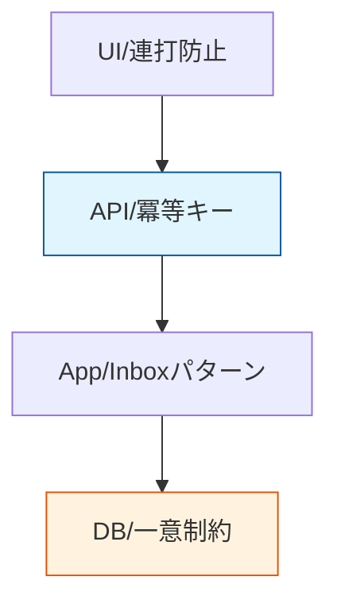

# 第09章：冪等性の超入門（同じのが2回来る世界）🔁😇


## 9.1 この章のゴール🎯✨

* 「同じ要求が2回来る」のが“普通”だと受け入れられる🙂🔁
* 二重実行で起きる事故（特にSagaで致命傷）をイメージできる😱🧨
* 冪等（べきとう）にするための“ざっくり戦略”を持てる🛡️🧠

---

## 9.2 まず結論：ネットの世界は「同じのが2回来る」🌧️📨

現実のシステムは、**タイムアウト・再送・通信切れ・重複配信**が当たり前に起きます📡💥
だから「1回しか来ないはず」って考えると、どこかで必ず事故ります😵‍💫

たとえばこんな感じ👇

* ユーザーがボタン連打（注文ボタン2回押し）👆👆
* アプリが「返事こない…」で自動リトライ🔁
* メッセージングが「届いたか不安」だから再配信（at-least-once系）📨📨
* サーバーは処理できたのに、返事だけ途中で消えた（クライアントは失敗だと思う）🌫️

---

## 9.3 冪等性ってなに？かんたん定義💡😊

**冪等性（Idempotency）**は、超ざっくり言うと👇

> **同じ操作を何回繰り返しても、結果が“増えない”性質**🔁🧾

### 例でわかる冪等/非冪等🧸

* ✅ 冪等：

  * 「既読にする」→ 何回やっても既読のまま📩✅
  * 「エレベーターの“同じ階”ボタン」→ 何回押しても到着は1回🚪⬆️
* ❌ 非冪等：

  * 「課金する」→ 2回呼んだら二重課金💳💳😱
  * 「ポイント付与」→ 2回付けたらポイントが増えすぎ🎁🎁💥

---

## 9.4 “安全(Safe)”と“冪等(Idempotent)”の違い🧠🔍

ここ、ちょい大事です📌✨

* **Safe（安全）**：呼んでも状態が変わらない（読むだけ）📖
* **Idempotent（冪等）**：状態は変わることがあるけど、**同じ操作の繰り返しで増えない**🔁

RESTの定番ルールだと、**PUTは冪等であるべき**とされています🧭✨ ([Microsoft Learn][1])
（「同じ内容でPUTを何回しても、最終状態は同じ」ってイメージ🙂）

---

## 9.5 Sagaで冪等性が必須な理由（事故がデカい）🧨🧩

Sagaは「ステップが連鎖」するので、**どこかが二重実行すると被害が倍増**しやすいです😱📈

たとえば（注文Saga）🛒💳📦🚚

```text
注文作成 → 決済 → 在庫引当 → 配送手配
   ↑         ↑         ↑         ↑
どれかが2回走ると…二重注文/二重課金/在庫ズレ/配送2回 など💥
```

しかも、失敗したら「補償」も走りますよね？
この補償が二重で走ったら… **返金を2回**とか普通に起こり得ます💸💸😇（地獄）

---

## 9.6 じゃあどう守る？冪等にする“ざっくり5つの武器”🛡️🧰

ここは“超入門”として、まず道具の名前と役割だけ押さえればOKです🙆‍♀️✨

### ① 冪等キー（Idempotency Key）🔑

「この操作は同じものですよ」を識別するキーを送る/持つ方法です🔁
決済APIなどは **Idempotency-Key** みたいなキーでリトライを安全にします💳🛡️
Stripeは、同じキーのリクエストには**最初の結果（成功/失敗含む）を返す**方式を説明しています📌 ([Stripe ドキュメント][2])

### ② 一意制約（ユニーク制約）🧱

DBで「同じ注文番号は1つだけ」みたいに縛る✨
最強の最後の砦です🛡️

### ③ Upsert（同じなら更新、なければ作成）🧩

「作る系」を“上書きOK”に寄せると冪等にしやすいです🙂

### ④ Inbox / 重複排除（メッセージ側の対策）📨🧹

「このメッセージIDは処理済み？」を保存して、2回目以降は捨てる/同じ結果を返す🗑️✅
（Sagaだと超よく使います）

### 冪等性を守る多層防御 🛡️🧰


（この先の章でガッツリやるところ！）

---

## 9.7 ミニ演習①：二重実行で困る操作を洗い出そう📝😵

次の分類で、手元のアプリ（想像でOK）を棚卸ししてみてください👇✨

| 操作       | 二重実行すると…       | 危険度 |
| -------- | -------------- | --- |
| 課金する💳   | 二重課金💥         | SSS |
| 在庫を減らす📦 | 在庫マイナス/欠品の嘘😱  | SS  |
| メール送信📧  | 同じメール2通で信用低下🥲 | S   |
| 注文作成🛒   | 注文が2件できる💥     | SS  |
| 既読にする📩  | まあ困らない🙂       | A   |

🌟コツ：**お金・在庫・配送・ポイント**が絡むものはだいたい最上位危険です💥💥💥

---

## 9.8 ミニ演習②：わざと「同じ要求2回」を起こしてみる🎮🔁

ここは“体感”が一番早いです😊✨
最小のAPIを作って、**同じPOSTを2回**叩いてみます！

### ① 超ミニAPI（冪等じゃない版）😇💥

```csharp
using System.Collections.Concurrent;

var builder = WebApplication.CreateBuilder(args);
var app = builder.Build();

var orders = new ConcurrentBag<Guid>();

app.MapPost("/orders", () =>
{
    var orderId = Guid.NewGuid();
    orders.Add(orderId);

    return Results.Ok(new
    {
        orderId,
        message = "注文を作ったよ🛒✨（冪等じゃない版）"
    });
});

app.MapGet("/orders/count", () => Results.Ok(new { count = orders.Count }));

app.Run();
```

### ② 同じPOSTを2回叩く（PowerShell例）💻🔁

（URLは自分のポートに合わせてくださいね🙂）

```powershell
Invoke-RestMethod -Method Post -Uri http://localhost:5000/orders
Invoke-RestMethod -Method Post -Uri http://localhost:5000/orders
Invoke-RestMethod -Method Get  -Uri http://localhost:5000/orders/count
```

✅ たぶん count が **2** になります。
「同じことしたつもりでも、注文が2個できた」＝非冪等💥😇

---

## 9.9 冪等にする最小アイデア：冪等キーで“同じ結果”を返す🔑🔁

ここでは“雰囲気を掴む”ために、超シンプルにやります🙂✨
（本格設計は次章で強化！）

### ① 冪等キー対応（超ミニ版）🛡️

```csharp
using System.Collections.Concurrent;

var builder = WebApplication.CreateBuilder(args);
var app = builder.Build();

var processed = new ConcurrentDictionary<string, Guid>();

app.MapPost("/orders", (HttpContext ctx) =>
{
    // ヘッダーから冪等キーをもらう（なければエラーにしちゃう）
    var key = ctx.Request.Headers["Idempotency-Key"].ToString();
    if (string.IsNullOrWhiteSpace(key))
        return Results.BadRequest(new { message = "Idempotency-Key が必要だよ🔑😵" });

    // すでに処理済みなら同じOrderIdを返す（=増えない！）
    if (processed.TryGetValue(key, out var existingOrderId))
    {
        return Results.Ok(new
        {
            orderId = existingOrderId,
            message = "同じキーだから前回の結果を返したよ🔁😊"
        });
    }

    // 初回だけ新規作成
    var orderId = Guid.NewGuid();
    processed[key] = orderId;

    return Results.Ok(new
    {
        orderId,
        message = "注文を作ったよ🛒✨（冪等キー対応）"
    });
});

app.Run();
```

### ② 同じキーで2回叩く🔁🔑

```powershell
$k = [guid]::NewGuid().ToString()

Invoke-RestMethod -Method Post -Uri http://localhost:5000/orders -Headers @{ "Idempotency-Key" = $k }
Invoke-RestMethod -Method Post -Uri http://localhost:5000/orders -Headers @{ "Idempotency-Key" = $k }
```

✅ 2回目は「同じorderId」が返ってきたら勝ちです🎉😆
「2回来ても増えない」＝冪等🛡️

> ちなみに有名な決済APIでは、冪等キーで**同じ結果を返す**やり方が説明されています🔁 ([Stripe ドキュメント][2])

---

## 9.10 よくある落とし穴（初心者がハマりやすい）🕳️😵‍💫

### ❌ 落とし穴1：冪等キーが“本当に同じ操作”を表してない

* 毎回新しいキーを作ったら冪等にならないよ〜！😇🔑

### ❌ 落とし穴2：キーの保存先が揮発（メモリだけ）で、再起動で忘れる

* 本番はDB/Redisなど「落ちても残る場所」が必要になりがち🧱💾
  （サーバレスの世界でも、結果を一定時間保存して同じ結果を返す仕組みが紹介されています⏳ ([AWS ドキュメント][3])）

### ❌ 落とし穴3：同時に2リクエストが来たときのレース

* “ほぼ同時”だと両方が「初回」と思って二重作成することがある⚡
  （次章以降でちゃんと潰します🛡️）

---

## 9.11 AI活用（Copilot/Codex）🤖✨

### ① 二重実行で事故る操作の洗い出し📝

**プロンプト例：**

* 「ECサイトの注文処理で、二重実行が致命的な操作を10個列挙して。理由も一言で」

### ② “冪等/非冪等”クイズ作成🎲

* 「冪等な操作と非冪等な操作を混ぜたクイズを20問作って。解答と解説つきで」

### ③ さっきのAPIをテストしやすく整形🧪

* 「このMinimal APIに、冪等キーがない場合のテストと、同じキー2回のテストを書いて（xUnit想定）」

---

## 9.12 まとめ（この章で持ち帰る感覚）🎁😊

* 「同じのが2回来る」は事故じゃなくて日常🔁🌧️
* 冪等性は「同じ操作で増えない」ための安全装置🛡️
* Sagaは連鎖するから、二重実行の被害がデカい💥🧨
* まずは **冪等キー / 一意制約 / 重複排除 / 状態チェック** の存在を覚える🔑🧱📨⚙️

---

## （小さな最新メモ）📌🆕

2026年1月時点で、**C# 14 は .NET 10 でサポート**され、Visual Studio 2026 から利用できる旨が案内されています💻✨ ([Microsoft Learn][4])

[1]: https://learn.microsoft.com/en-us/azure/architecture/best-practices/api-design?utm_source=chatgpt.com "Best practices for RESTful web API design - Azure"
[2]: https://docs.stripe.com/api/idempotent_requests?utm_source=chatgpt.com "Idempotent requests | Stripe API Reference"
[3]: https://docs.aws.amazon.com/powertools/python/latest/utilities/idempotency/?utm_source=chatgpt.com "Idempotency - Powertools for AWS Lambda (Python)"
[4]: https://learn.microsoft.com/en-us/dotnet/csharp/whats-new/csharp-14?utm_source=chatgpt.com "What's new in C# 14"
