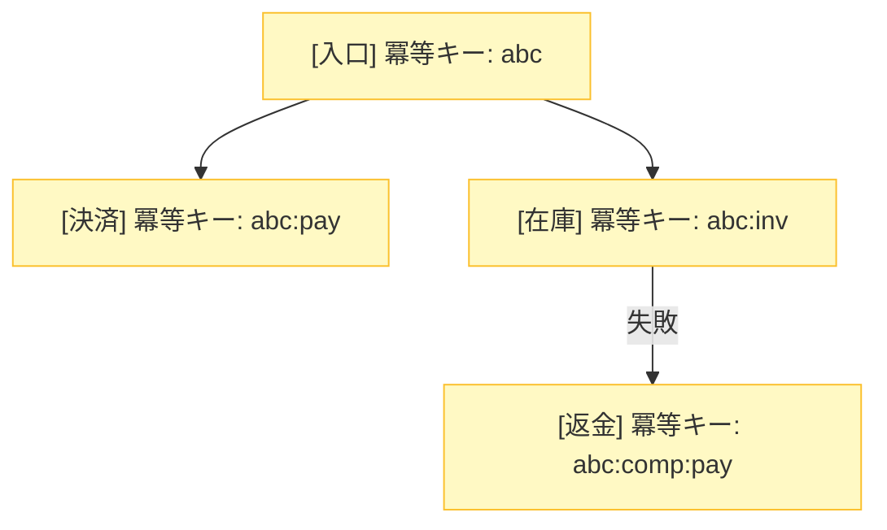

# 第10章：Sagaでの冪等性（冪等キーと二重補償防止）🔑🛡️


## この章でできるようになること🎯✨

* 「同じ要求が2回以上来る」前提で、Sagaを安全に動かせるようになる🔁😊
* **冪等キー（Idempotency Key）**の作り方・スコープ・保存方法がわかる🧠🔑
* **二重補償（例：返金が2回走る😱）**を、設計とコードで防げるようになる🧯🛡️

---

# 1. Sagaで“冪等”が超重要な理由（進むも戻すも二重が起きる）😵‍💫🔁

Sagaはざっくり言うと、

* 進む（例：注文→決済→在庫確保）➡️
* 失敗したら戻す（例：返金→在庫戻し）⬅️

…って流れですよね😊

でも現実のシステムは、**リトライ**や**重複メッセージ（at-least-once）**が普通に起きます🔁📨
つまり、こんな事故が起きやすいの…👇

* 決済が **2回** 実行される💸💸（二重課金）
* 返金が **2回** 走る💸➡️💸➡️（二重返金）
* 状態が **2回** 遷移して、Sagaが迷子になる🌀

だから、Sagaでは「進む操作」だけじゃなくて、**“補償（戻す操作）”も冪等にする**のが超大事です🛡️✨
（冪等キーで「それ、もうやったよ」を判定できるようにする感じ！）
※APIのリトライを安全にする考え方は、AWSの解説がまさにこの話です。([Amazon Web Services, Inc.][1])

---

# 2. Sagaの冪等性は「3段重ね」で守る🧁🧁🧁

Sagaの冪等は、ここを押さえると強いよ💪✨

## ① 入口の冪等（“同じ注文開始”を2回やらない）🚪🔑

* HTTPのPOST（注文作成）や、Command（PlaceOrder）で重複が来る
* ここで **冪等キーを受け取り、結果を再利用**できるようにする

## ② ステップの冪等（“同じステップ”を2回やらない）🧩🔑

* 決済API呼び出し、在庫確保など「外部に副作用」がある箇所
* ステップごとに **ステップ用の冪等キー**を作って渡す

## ③ 補償の冪等（“返金”を2回やらない）🧾🔑

* 補償は怖い：2回走るとお金や在庫が壊れる😱
* 補償にも **補償用の冪等キー**＋ **“補償済み”記録** が必須！

### Saga内の冪等キー層 🔑✨


---

# 3. 冪等キー設計のコツ（Saga向け🔑✨）

## 3.1 まず結論：キーは「業務の1回の意図」を表す💡

冪等キーは、こういう“意図”を表すのが正解に近いです👇

* ✅「この注文を作る」1回の意図
* ✅「この注文の決済を作る」1回の意図
* ✅「この決済を返金する」1回の意図

「同じ意図のリトライ」なら、**同じキー**を使う
「別の新しい操作」なら、**別のキー**を使う
これが基本だよ😊🔁

## 3.2 形式はどうする？（UUIDが安牌🎲）

多くのAPIでは UUID（ランダム文字列）がよく使われます。Stripeも UUID v4 を推奨してます。([Stripe Documentation][2])

* ✅ 衝突しにくい（かぶりにくい）
* ✅ 推測されにくい（セキュリティ的にも安心）

## 3.3 “同じキーに別の内容”は事故るので、サーバー側で拒否する🙅‍♀️🧨

超大事ポイント！
もし同じキーで **違うリクエスト内容** が来たら、それは「不正」か「バグ」か「誤用」です😇

Stripeも、**同じ冪等キーでパラメータが違うとエラー**にして事故を防ぎます。([Stripe Documentation][2])

なのでサーバー側はこうします👇

* 冪等キーと一緒に **RequestHash（内容のハッシュ）** を保存
* 同じキーで来たとき、ハッシュが違えば **409 Conflict** などで拒否🚫

## 3.4 いつまで保存する？（TTLの考え方）⏳🧠

冪等キーは永遠に保存しなくてOKです😊
リトライに耐える期間があれば十分。

例：

* Stripeは「少なくとも24時間経ったキーは自動削除してOK」と書いてます。([Stripe Documentation][2])
* もっと短く「1時間だけ有効」にしている運用例もあります。([brandur.org][3])

**目安**（ざっくり）：

* UIの二重クリック対策：数分〜数十分
* 分散処理の遅延や再送対策：数時間〜24時間

---

# 4. 実装パターン：Idempotency Store（保存して“同じ結果”を返す）💾🔁

## 4.1 最低限のテーブル（DBに保存する例）🗃️

入口の冪等を実現するために、こんなテーブルを作ります👇

* `Scope`（どのAPI/どの操作か）
* `IdempotencyKey`
* `RequestHash`（中身チェック用）
* `Status`（Processing / Completed）
* `ResponseCode` / `ResponseBody`（同じ結果を返すため）
* `CreatedAt` / `CompletedAt`

**ポイント**：`(Scope, IdempotencyKey)` に **ユニーク制約**を張るのが強いです💪✨
（同時に2個入れようとしても、DBが1個しか許さない＝勝ち🏆）

---

# 5. C#コード例：入口の冪等（同じPOSTに同じレスポンスを返す）🧑‍💻🔁

ここでは、わかりやすさ優先で「Controller + ActionFilter」っぽく書きます😊
（本番では Middleware / Minimal API の Filter でもOK！）

## 5.1 モデル（EF Core想定）🧾

```csharp
using System.ComponentModel.DataAnnotations;
using System.ComponentModel.DataAnnotations.Schema;

public enum IdempotencyStatus
{
    Processing = 0,
    Completed = 1
}

public class IdempotencyRecord
{
    [Key]
    public long Id { get; set; }

    [MaxLength(200)]
    public required string Scope { get; set; } // 例: "POST:/orders"

    [MaxLength(255)]
    public required string IdempotencyKey { get; set; }

    [MaxLength(64)]
    public required string RequestHash { get; set; } // SHA-256 を hex などで

    public IdempotencyStatus Status { get; set; } = IdempotencyStatus.Processing;

    public int? ResponseStatusCode { get; set; }

    public string? ResponseBodyJson { get; set; }

    public DateTimeOffset CreatedAt { get; set; } = DateTimeOffset.UtcNow;
    public DateTimeOffset? CompletedAt { get; set; }

    // 競合対策（楽になる）
    [Timestamp]
    public byte[] RowVersion { get; set; } = Array.Empty<byte>();
}
```

## 5.2 ストア（キーの開始・完了を管理）🔑✅

```csharp
using System.Security.Cryptography;
using System.Text;

public sealed class IdempotencyDecision
{
    private IdempotencyDecision() { }

    public bool IsDuplicateCompleted { get; init; }
    public int? SavedStatusCode { get; init; }
    public string? SavedBodyJson { get; init; }

    public bool IsDuplicateButProcessing { get; init; }

    public bool RequestHashMismatch { get; init; }

    public long? RecordId { get; init; }

    public static IdempotencyDecision New(long recordId) => new() { RecordId = recordId };
    public static IdempotencyDecision DuplicateCompleted(int code, string body) => new()
    {
        IsDuplicateCompleted = true,
        SavedStatusCode = code,
        SavedBodyJson = body
    };
    public static IdempotencyDecision DuplicateProcessing() => new() { IsDuplicateButProcessing = true };
    public static IdempotencyDecision HashMismatch() => new() { RequestHashMismatch = true };
}

public interface IIdempotencyStore
{
    Task<IdempotencyDecision> BeginAsync(string scope, string key, string requestHash, CancellationToken ct);
    Task CompleteAsync(long recordId, int statusCode, string bodyJson, CancellationToken ct);
}

public static class HashUtil
{
    public static string Sha256Hex(string s)
    {
        var bytes = Encoding.UTF8.GetBytes(s);
        var hash = SHA256.HashData(bytes);
        return Convert.ToHexString(hash); // 64 chars
    }
}
```

※ `BeginAsync` の中身はDB都合で色々あるけど、考え方はこれ👇

* まず `(scope, key)` で探す
* 無ければ `Processing` で新規作成（ユニーク制約で競合を止める）
* あれば `RequestHash` を比較
* 完了済みなら保存レスポンスを返す
* Processingなら「処理中だよ」返す

ここは擬似コードで示すね（雰囲気を掴めればOK！）😊✨

```csharp
public sealed class EfIdempotencyStore : IIdempotencyStore
{
    private readonly AppDbContext _db;
    public EfIdempotencyStore(AppDbContext db) => _db = db;

    public async Task<IdempotencyDecision> BeginAsync(string scope, string key, string requestHash, CancellationToken ct)
    {
        var existing = await _db.IdempotencyRecords
            .FirstOrDefaultAsync(x => x.Scope == scope && x.IdempotencyKey == key, ct);

        if (existing is null)
        {
            var record = new IdempotencyRecord
            {
                Scope = scope,
                IdempotencyKey = key,
                RequestHash = requestHash,
                Status = IdempotencyStatus.Processing
            };

            _db.IdempotencyRecords.Add(record);

            try
            {
                await _db.SaveChangesAsync(ct); // ユニーク制約で同時作成を防ぐ
                return IdempotencyDecision.New(record.Id);
            }
            catch (DbUpdateException)
            {
                // 競合したら取り直す
            }

            existing = await _db.IdempotencyRecords
                .FirstAsync(x => x.Scope == scope && x.IdempotencyKey == key, ct);
        }

        if (!string.Equals(existing.RequestHash, requestHash, StringComparison.Ordinal))
        {
            return IdempotencyDecision.HashMismatch();
        }

        if (existing.Status == IdempotencyStatus.Completed && existing.ResponseStatusCode is int code && existing.ResponseBodyJson is string body)
        {
            return IdempotencyDecision.DuplicateCompleted(code, body);
        }

        return IdempotencyDecision.DuplicateProcessing();
    }

    public async Task CompleteAsync(long recordId, int statusCode, string bodyJson, CancellationToken ct)
    {
        var record = await _db.IdempotencyRecords.FirstAsync(x => x.Id == recordId, ct);
        record.Status = IdempotencyStatus.Completed;
        record.ResponseStatusCode = statusCode;
        record.ResponseBodyJson = bodyJson;
        record.CompletedAt = DateTimeOffset.UtcNow;
        await _db.SaveChangesAsync(ct);
    }
}
```

## 5.3 Controller側：冪等キーで結果を再利用する🌈

```csharp
using System.Text.Json;
using Microsoft.AspNetCore.Mvc;

public record PlaceOrderRequest(string UserId, decimal Amount);
public record PlaceOrderResponse(string OrderId, string SagaId);

[ApiController]
public class OrdersController : ControllerBase
{
    private readonly IIdempotencyStore _idem;
    private readonly OrderSagaOrchestrator _orchestrator;

    public OrdersController(IIdempotencyStore idem, OrderSagaOrchestrator orchestrator)
    {
        _idem = idem;
        _orchestrator = orchestrator;
    }

    [HttpPost("/orders")]
    public async Task<IActionResult> PlaceOrder([FromBody] PlaceOrderRequest req, CancellationToken ct)
    {
        // 1) 冪等キーを受け取る（ヘッダにするのが定番）
        if (!Request.Headers.TryGetValue("Idempotency-Key", out var keyValues))
            return BadRequest(new { message = "Idempotency-Key header is required." });

        var key = keyValues.ToString();
        if (key.Length is 0 or > 255) return BadRequest(new { message = "Invalid Idempotency-Key." });

        // 2) スコープ（APIごとに分ける）
        var scope = "POST:/orders";

        // 3) 同じキーでも内容が違うのを防ぐ（ハッシュ）
        var requestJson = JsonSerializer.Serialize(req);
        var requestHash = HashUtil.Sha256Hex(requestJson);

        // 4) 既に処理済みなら“同じ結果”を返す
        var decision = await _idem.BeginAsync(scope, key, requestHash, ct);

        if (decision.RequestHashMismatch)
            return Conflict(new { message = "Same Idempotency-Key used with different request body." });

        if (decision.IsDuplicateCompleted)
        {
            // 前回の結果をそのまま返す
            return StatusCode(decision.SavedStatusCode!.Value, JsonSerializer.Deserialize<object>(decision.SavedBodyJson!));
        }

        if (decision.IsDuplicateButProcessing)
        {
            // 処理中（好きな方針でOK：409/202など）
            return StatusCode(409, new { message = "Request is still processing. Please retry later with same Idempotency-Key." });
        }

        // 5) 新規：Saga開始（この章の主役はここから先の“二重補償防止”にも繋がる✨）
        var result = await _orchestrator.StartAsync(req, idempotencyKey: key, ct);

        var response = new PlaceOrderResponse(result.OrderId, result.SagaId);

        // 6) レスポンス保存（次回同じキーが来たら同じ結果を返せる）
        var bodyJson = JsonSerializer.Serialize(response);
        await _idem.CompleteAsync(decision.RecordId!.Value, statusCode: 200, bodyJson, ct);

        return Ok(response);
    }
}
```

✅ これで「二重クリック」「タイムアウト後の再送」でも、**同じキーなら同じレスポンス**が返せます😊🔁
（Stripeも同じ発想で、同じキーなら同じ結果を返す設計を説明しています。([Stripe][4])）

---

# 6. 二重補償（返金2回😱）を防ぐ設計：補償も“冪等”にする🧾🛡️

ここがSagaの本番🔥

## 6.1 まずやること：Sagaの中で「どこまで進んだか」を記録する📝

Sagaは、進んだステップだけ補償する必要があります。

例：

* 決済成功 ✅
* 在庫確保で失敗 ❌
  → 補償は「返金」だけやればいい（在庫は確保してないので戻さない）

そして補償は、**同じ補償が2回走っても1回しか効果が出ない**ようにするのがポイント！

---

# 7. C#コード例：ステップ＆補償の二重実行を止める（超ミニSaga）🧑‍💻🛡️

## 7.1 Saga状態を持つ（DBに保存するイメージ）💾

* `SagaId`（内部ID）
* `OperationKey`（入口の冪等キー、もしくは Saga起動ID）
* `PaymentDone` / `PaymentCompensated` みたいなフラグ（本当はステップ表の方が綺麗✨）

```csharp
public enum SagaState
{
    Running = 0,
    Completed = 1,
    Compensating = 2,
    Failed = 3
}

public class OrderSaga
{
    [Key]
    public string SagaId { get; set; } = Guid.NewGuid().ToString("N");

    [MaxLength(255)]
    public required string OperationKey { get; set; } // 入口の冪等キーなど

    public SagaState State { get; set; } = SagaState.Running;

    public bool PaymentDone { get; set; }
    public bool PaymentCompensated { get; set; }

    public bool InventoryReserved { get; set; }
    public bool InventoryCompensated { get; set; }

    public string? OrderId { get; set; }

    [Timestamp]
    public byte[] RowVersion { get; set; } = Array.Empty<byte>();
}
```

## 7.2 Orchestrator：同じ操作が来たら“途中から再開 or 結果返す”🔁

```csharp
public sealed class OrderSagaOrchestrator
{
    private readonly AppDbContext _db;
    private readonly PaymentService _payment;
    private readonly InventoryService _inventory;

    public OrderSagaOrchestrator(AppDbContext db, PaymentService payment, InventoryService inventory)
    {
        _db = db;
        _payment = payment;
        _inventory = inventory;
    }

    public async Task<(string OrderId, string SagaId)> StartAsync(PlaceOrderRequest req, string idempotencyKey, CancellationToken ct)
    {
        // ① OperationKey でSagaを引く（入口冪等の“次の層”）
        var saga = await _db.OrderSagas.FirstOrDefaultAsync(x => x.OperationKey == idempotencyKey, ct);

        if (saga is null)
        {
            saga = new OrderSaga
            {
                OperationKey = idempotencyKey,
                OrderId = "ORD-" + Guid.NewGuid().ToString("N")[..12]
            };
            _db.OrderSagas.Add(saga);
            await _db.SaveChangesAsync(ct);
        }

        // すでに完了してたら、その結果を返す（冪等✨）
        if (saga.State == SagaState.Completed)
            return (saga.OrderId!, saga.SagaId);

        try
        {
            // ② 決済（副作用）：ステップ冪等キーを作る
            if (!saga.PaymentDone)
            {
                var stepKey = $"{idempotencyKey}:pay";
                await _payment.CaptureAsync(req.Amount, stepKey, ct);
                saga.PaymentDone = true;
                await _db.SaveChangesAsync(ct);
            }

            // ③ 在庫確保（ここで失敗するかも）
            if (!saga.InventoryReserved)
            {
                var stepKey = $"{idempotencyKey}:inv";
                await _inventory.ReserveAsync(saga.OrderId!, stepKey, ct);
                saga.InventoryReserved = true;
                await _db.SaveChangesAsync(ct);
            }

            saga.State = SagaState.Completed;
            await _db.SaveChangesAsync(ct);

            return (saga.OrderId!, saga.SagaId);
        }
        catch
        {
            // 失敗したら補償へ
            saga.State = SagaState.Compensating;
            await _db.SaveChangesAsync(ct);

            await CompensateAsync(saga, idempotencyKey, ct);

            saga.State = SagaState.Failed;
            await _db.SaveChangesAsync(ct);

            throw;
        }
    }

    private async Task CompensateAsync(OrderSaga saga, string operationKey, CancellationToken ct)
    {
        // 補償は“逆順”が基本（できる範囲でOK）
        // 1) 在庫戻し（確保してたら）
        if (saga.InventoryReserved && !saga.InventoryCompensated)
        {
            var compKey = $"{operationKey}:comp:inv";
            await _inventory.ReleaseAsync(saga.OrderId!, compKey, ct);
            saga.InventoryCompensated = true;
            await _db.SaveChangesAsync(ct);
        }

        // 2) 返金（決済してたら）
        if (saga.PaymentDone && !saga.PaymentCompensated)
        {
            var compKey = $"{operationKey}:comp:pay";
            await _payment.RefundAsync(saga.OrderId!, compKey, ct);
            saga.PaymentCompensated = true;
            await _db.SaveChangesAsync(ct);
        }
    }
}
```

## 7.3 ここが「二重補償防止」の肝🫶🛡️

* `PaymentCompensated` を見て **2回目はスキップ**✅
* さらに `compKey`（補償用冪等キー）を外部サービスに渡す✅

  * 決済系APIは冪等キー対応が一般的で、StripeもIdempotency-Keyの仕組みを明確に案内しています。([Stripe Documentation][2])

これで、「補償が2回呼ばれても、返金は1回だけ」になれる💪✨

---

# 8. ミニ演習（手を動かすパート）📝🎮

## 演習1：冪等キー候補を比べよう🔍

次のどれを採用する？理由も書いてね😊✍️

1. `Guid.NewGuid()`（UUID）
2. `OrderId`（業務キー）
3. `UserId + 時刻`
4. `UserId + 連番`

ヒント💡

* かぶりにくい？
* 推測されにくい？
* 「同じ意図のリトライ」で同じ値になる？

---

## 演習2：同じキーで“違う内容”を送ってみる😈📨

1回目：`Amount=1000`、キー=`abc`
2回目：`Amount=2000`、キー=`abc`

👉 サーバーはどう返すべき？（おすすめは **409 Conflict** など）
※この「同じキーで中身違いは拒否」は、Stripeも事故防止として採用してます。([Stripe Documentation][2])

---

## 演習3：補償を2回呼んでも“返金1回”になるのを確認🔁💸

* わざと在庫確保を失敗させる
* `CompensateAsync` が2回呼ばれても、`RefundAsync` が1回しか実行されないようにする
* ログに「refund skipped (already compensated)」みたいなのを出すと超わかりやすいよ😊🧾✨

---

# 9. AI活用（コピペで使えるプロンプト集🤖✨）

## 9.1 冪等キー設計レビューしてもらう🔍

```text
あなたは分散システム設計レビュー担当です。
以下のSagaの冪等キー設計案をレビューしてください。

- 入口キーのスコープ（どの操作単位か）
- ステップキーの作り方
- 補償キーの作り方
- 同一キーで異なるリクエストを拒否できているか
- TTL（保存期間）の妥当性
- 同時実行（並列リクエスト）で二重実行にならないか（DB制約/ロック）
改善案とチェックリストも出してください。
（対象：C# / ASP.NET Core / Saga）
設計案:
<ここにあなたの案を貼る>
```

## 9.2 テーブル設計を整えてもらう🗃️

```text
Sagaの冪等性を守るために、
IdempotencyRecords と OrderSagas を SQL Server 前提で設計してください。
- 必須カラム
- ユニーク制約
- インデックス
- TTL削除（古いキーを消す方法）
も提案してください。
```

---

# 10. 章末チェックリスト（これだけ守れば事故りにくい✅🛡️）

* [ ] 入口に冪等キーがある（POSTの重要操作）🔑
* [ ] `(Scope, Key)` にユニーク制約がある🧱
* [ ] 同じキーで中身違いは拒否してる🙅‍♀️
* [ ] “前進ステップ”ごとにステップ冪等キーがある🧩
* [ ] “補償ステップ”にも冪等キー＆補償済み記録がある🧾
* [ ] 補償が2回呼ばれても、返金などの副作用は1回になる💸🛡️
* [ ] TTL（保存期間）を決めて古いキーを掃除できる🧹⏳

---

## 🔍ちょいメモ（2026の最新スタック感）

いまどきの .NET は **.NET 10 がLTS**で、2025年11月にリリースされています。([Microsoft][5])
C#も最新系列が更新され続けているので、コードは「素直に書いて読みやすく」がいちばん勝ちです😊📚([learn.microsoft.com][6])

[1]: https://aws.amazon.com/builders-library/making-retries-safe-with-idempotent-APIs/?utm_source=chatgpt.com "Making retries safe with idempotent APIs"
[2]: https://docs.stripe.com/api/idempotent_requests?utm_source=chatgpt.com "Idempotent requests | Stripe API Reference"
[3]: https://brandur.org/fragments/idempotency-keys-crunchy?utm_source=chatgpt.com "Idempotency keys @ Crunchy"
[4]: https://stripe.com/blog/idempotency?utm_source=chatgpt.com "Designing robust and predictable APIs with idempotency"
[5]: https://dotnet.microsoft.com/en-us/platform/support/policy/dotnet-core?utm_source=chatgpt.com "NET and .NET Core official support policy"
[6]: https://learn.microsoft.com/en-us/dotnet/csharp/whats-new/csharp-version-history?utm_source=chatgpt.com "The history of C# | Microsoft Learn"
