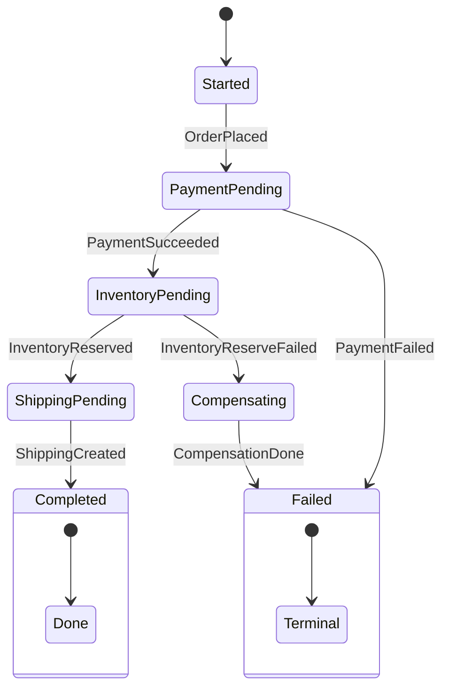

# 第11章：状態機械（State Machine）入門（状態と遷移を見える化）⚙️🧠


## この章のゴール🎯✨

* Sagaを「処理の手順」ではなく「**状態（State）の変化**」として整理できるようになる😊
* 「いま何してる？」「次に何していい？」を、**状態遷移表**で説明できるようになる📋✍️
* 二重実行・順不同・遅延…みたいな現実のややこしさに、設計で立ち向かう準備ができる🛡️🔥

---

# 1) 状態機械ってなに？（超ざっくり）🤏🙂

状態機械（有限状態機械）は、ざっくり言うと👇

* システムは「いくつかの状態」のどれか1つにいる
* ある入力（イベント）を受けると、別の状態に移る
* この「移り方（遷移）」をルールとして持つ

つまり **「状態」×「イベント」→「次の状態」** のルールブック📖✨


これがあると、Sagaの「途中で落ちた」「同じ通知が2回来た」「順番が入れ替わった」みたいな世界でも、落ち着いて扱えるようになるよ😇🔁 ([ウィキペディア][1])

---

# 2) Sagaを“状態”で考えると何が嬉しいの？😆🎁

Sagaはだいたい「長い処理」＋「途中失敗が普通」だから、コードだけで追うと迷子になりやすい🌀😵‍💫


状態機械にすると嬉しいこと👇

* ✅ **禁止ルートが明確**（やっちゃダメな遷移を止められる）🚫
* ✅ **途中経過が見える**（いま Pending？ Completed？ Compensating？）👀
* ✅ **再試行・重複・順不同**に対して「どう扱うか」を決められる🔁🧯
* ✅ 仕様変更が来ても「表を直す」→「実装に反映」で整理しやすい🧩✨

---

# 3) 用語をいったんこれで統一しよ〜📚😊

ここでの用語はこれ👇（この章の中だけでも揃えばOK！）

* **State（状態）**：いまどんな段階？（例：PaymentPending）
* **Event / Trigger（イベント/トリガ）**：何が起きた？（例：PaymentSucceeded）
* **Transition（遷移）**：状態が変わること（Pending → Completed）
* **Guard（ガード条件）**：この条件なら遷移OK（例：リトライ回数が残ってる）🧱
* **Action（アクション）**：状態に入った時／出る時にやること（ログ、通知、次コマンド発行など）🧾


---

# 4) 状態の作り方：まずは「大きい粒」でOK🙆‍♀️✨

初心者がやりがち失敗👇
「状態を細かくしすぎて、表がぐちゃぐちゃ」😵‍💫💥


まずは **“大きい粒”** でOKだよ〜😊
例：注文Sagaならこんな感じ👇

* **Started**（開始した）
* **PaymentPending**（決済待ち）
* **InventoryPending**（在庫待ち）
* **ShippingPending**（配送作成待ち）
* **Completed**（全部成功）🎉
* **Compensating**（補償中）🔁
* **Failed**（失敗で終了）🧯

ここでポイント💡

* 状態名は「動詞」より「**名詞 or 過去分詞/形容詞**」が安定しやすいよ（例：Paid / PaymentPending）🙂
* “いまの姿”が伝わる名前にすると、運用やログが読みやすい📄👀

---

# 5) 遷移の作り方：イベントは「起きた事実」寄りが強い📨✨

# Sagaは後で「CommandとEvent」をちゃんとやるけど（第13章）、この章では感覚だけ先取り💃

* 遷移のきっかけ（イベント/トリガ）は、だいたい「何かが成功/失敗した」

  * PaymentSucceeded ✅
  * PaymentFailed ❌
  * InventoryReserved ✅
  * InventoryReserveFailed ❌

ここで注意⚠️

* 「ボタン押した」みたいなUI起点より、分散処理では「**結果が返ってきた**」の方がトリガになりがち📩


* そして同じイベントが**2回来ることもある**（冪等性の世界🔁）

---

## 6) ガード条件（Guard）：現実を守る“門番”🧱🧠

ガード条件は、「その遷移を許すかどうか」の条件だよ😊


例👇

* PaymentPending のときだけ PaymentSucceeded を受け付ける✅
* リトライ回数が残ってるときだけ Retry を受け付ける🔁
* すでに Completed なら、遅れて来たイベントは無視する（もしくはログだけ）🧾

ガード条件があると、「順不同」「遅延」「重複」にめちゃ効くよ🛡️✨

---

## 7) 状態遷移表を作ろう（紙でもOK）📋✍️

状態機械の“本体”はこれ！
まずは表を作ると一気に見える化できる😆✨

### 例：ミニ注文Sagaの状態遷移表（超入門版）🛒💳📦

| 現在の状態            | イベント（トリガ）              | 次の状態             | メモ（ガード/やること）        |
| ---------------- | ---------------------- | ---------------- | ------------------- |
| Started          | OrderPlaced            | PaymentPending   | 決済の開始を依頼する📨        |
| PaymentPending   | PaymentSucceeded       | InventoryPending | 在庫確保を依頼する📦         |
| PaymentPending   | PaymentFailed          | Failed           | ここで終了🧯             |
| InventoryPending | InventoryReserved      | ShippingPending  | 配送作成を依頼🚚           |
| InventoryPending | InventoryReserveFailed | Compensating     | 決済の補償へ🔁            |
| ShippingPending  | ShippingCreated        | Completed        | 全部成功🎉              |
| Compensating     | CompensationDone       | Failed           | “失敗として完了”にする（補償済み）✅ |

### 注文Sagaの状態遷移図 ⚙️🗺️


ポイント💡

* **Completed / Failed は終端（ターミナル）**にしておくと運用が楽😊
* 「補償中（Compensating）」は **状態として置く**と事故が減る🔁🛡️

---

## 8) “補償”を状態に入れると、何が強い？🔁✨

Sagaの補償って、実際は「元に戻す」だけじゃなくて

* 返金💴
* 無効化🧾
* 代替措置（クーポン等）🎫

みたいに“帳尻合わせ”の連鎖になりがち😵‍💫

だから補償を「処理の1回きり」と思うより、
**補償中という状態を持って、終端までたどり着かせる**


これがめちゃ大事だよ〜😊🛡️

---

## 9) よくある事故パターン（初心者あるある）😱📚

### ① 状態が“作業メモ”になってる📝💥

例：

* DoPayment
* DoInventory
  みたいな「やること」状態だと、ログと一致しにくい😵
  → 「PaymentPending」「InventoryPending」みたいに **状況** で切ろう🙂✨

### ② 終わりがない（永遠に待つ）⏳😇→😇→😇

終端（Completed / Failed）をはっきり作る！
タイムアウトや手動介入は第17章でやるけど、ここで意識だけ持っておくと強い🧠✨

### ③ “補償したのに成功扱い”になってる🤯

補償が走ったら、ビジネス的には「成功」じゃないケースが多いよね
→ **Failed（補償済みで終了）** みたいに“失敗だけど整合は取れた”を表現しよう🧯✅

---

## 10) ミニ演習：自分のSagaを状態遷移表にする📝😆

題材はこれが作りやすいよ👇

* EC：注文→決済→在庫→配送🛒
* 旅行予約：予約→決済→チケット発券→通知✈️
* サブスク：登録→決済→権限付与→メール📩

### 手順（15〜30分）⏱️

1. まず「成功の一本道」を書く🛤️
2. 各ステップで「失敗したらどうする？」を書く💥
3. 補償が必要なら「Compensating」を入れる🔁
4. 最後に「終端（Completed/Failed）」へ必ず行ける形にする🏁

---

## 11) AI活用（状態と遷移のたたき台を一瞬で作る）🤖✨

そのままコピペで使えるプロンプト例だよ〜📋💕

### ① 状態一覧を出してもらう🧠

```text
あなたは分散システムの設計者です。
「注文→決済→在庫→配送」のSagaを状態機械として設計したいです。
状態（State）の候補を、初心者向けの粒度で10個以内で提案してください。
「成功系」「失敗系」「補償系」を区別して提示してください。
```

### ② 状態遷移表を作ってもらう📋

```text
次の状態一覧を使って、状態遷移表を作ってください：
[Started, PaymentPending, InventoryPending, ShippingPending, Compensating, Completed, Failed]
トリガ（イベント）名も提案し、各遷移に「ガード条件の例」を1つ添えてください。
表形式で出してください。
```

### ③ “事故が起きる穴”をレビューしてもらう🕳️✅

```text
この状態遷移表の弱点をレビューしてください。
特に「重複イベント」「順不同」「遅延」「二重補償」の観点で、
追加すべきガード条件や状態があれば提案してください。
```

---

## 12) 次章へのつながり（第12章でコード化する準備）🧑‍💻✨

この章で作った「状態一覧」と「遷移表」は、次章でC#に落とし込むときの設計図になるよ😊
C#は最新では C# 14 / .NET 10 が基準に進んでいて、Visual Studio 2026 と一緒に扱われる流れだよ〜🧁✨ ([Microsoft Learn][2])

そして「状態機械をコードで扱う」ための定番ライブラリ例として Stateless みたいな選択肢もある（もちろん自作でもOK！）📦⚙️ ([GitHub][3])

---

## まとめ🎀✅

* Sagaは「処理の列」じゃなくて「状態の変化」として整理すると強い⚙️🧠
* 状態遷移表ができると、禁止ルート・補償・終端が一気に見える📋✨
* ガード条件が“現実の汚さ（重複/順不同/遅延）”から守ってくれる🛡️🔁
* 次章は、ここで作った表をC#にして「不正遷移を防ぐコード」にしていくよ〜😊💻

[1]: https://en.wikipedia.org/wiki/Finite-state_machine?utm_source=chatgpt.com "Finite-state machine"
[2]: https://learn.microsoft.com/en-us/dotnet/csharp/whats-new/csharp-14?utm_source=chatgpt.com "What's new in C# 14"
[3]: https://github.com/dotnet-state-machine/stateless?utm_source=chatgpt.com "dotnet-state-machine/stateless: A simple library for creating ..."
