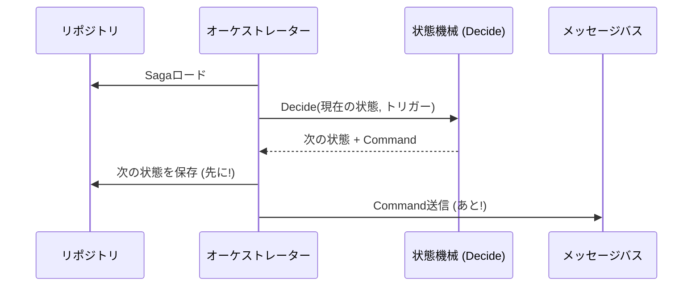

# 第12章：状態機械をC#に落とす（設計をコードにする）🧑‍💻✨

## この章のゴール🎯

* 状態（State）とトリガー（Trigger）を「コードで安全に」表現できるようになる😊
* 禁止遷移（ありえない順番）をちゃんと止められるようになる🙅‍♀️🛑
* 「状態遷移ロジック」と「副作用（外部API呼び出し等）」を分離して事故を減らす🧼✨
* Sagaの“次に何をするか”を迷わず書けるようになる🧭💡

---

## まず、2026年1月時点の“最新版”だけ押さえる🆕📌

* .NET 10 は 2025年11月11日にリリースされていて、LTS（長期サポート）扱いだよ📦✨ ([Microsoft Learn][1])
* C# 14 は「最新のC#」で、.NET 10 上でサポートされているよ🧠✨ ([Microsoft Learn][2])
* Visual Studio 2026 は .NET 10 / C# 14 をまとめて扱える想定になってるよ（.NET 10 と一緒に提供）🛠️🤖 ([Microsoft for Developers][3])

---

# 12-1. 状態機械をコード化するときの“3つの約束”🤝🛡️

## 約束①：遷移ルールは「1か所」に集める📍

* 状態が増えると、if が散らばった瞬間に破綻しやすい😵‍💫
* 「状態×トリガー→次の状態」を、必ず1か所で見れる形にする👀✨

## 約束②：「状態遷移」と「外部への操作」を混ぜない🍳🙅‍♀️

* 決済API呼ぶ、在庫API呼ぶ、配送作る…みたいな外部操作は失敗するのが普通💥
* 状態機械は “次の状態と、次に投げる指示（Command）” を返すだけにすると安全💡📨

## 約束③：禁止遷移は「起きても大丈夫」にする🔁😇

* メッセージ重複・順不同・リトライで、想定外の順番は現実に起きる😅
* だから「止め方（例外 or Result）」を設計して、運用で死なないようにする🧯✨

---

# 12-2. 例題：ミニECの注文Saga🛒📦💳

ステップは超ミニでOK！今回はこの3つだけにするよ😊

1. 注文作成 → 2) 決済 → 3) 在庫確保 → 完了🎉
   失敗したら補償（返金・注文キャンセルなど）へ🔁🧾

## 状態（State）例🧩

* New（開始前）
* PaymentPending（決済待ち）
* InventoryPending（在庫確保待ち）
* Completed（完了）
* Compensating（補償中）
* Compensated（補償完了）
* Failed（人間対応が必要…💦）

## トリガー（Trigger）例📨

* Start（Saga開始）
* PaymentSucceeded / PaymentFailed
* InventoryReserved / InventoryFailed
* CompensationDone

---

# 12-3. まずは enum で「状態」と「トリガー」を固定する🔒✨

「文字列」や「数字直書き」は事故のもと😱
enum にしてコンパイルで守るのが初心者にいちばん優しいよ😊

```csharp
public enum SagaState
{
    New,
    PaymentPending,
    InventoryPending,
    Completed,
    Compensating,
    Compensated,
    Failed
}

public enum SagaTrigger
{
    Start,
    PaymentSucceeded,
    PaymentFailed,
    InventoryReserved,
    InventoryFailed,
    CompensationDone
}
```

---

# 12-4. “遷移表”を switch で1か所に閉じ込める📋✨

ここが本章のメイン！🎯
「現在の状態」と「来たトリガー」から、次にどうするかを決めるよ🧠💡

ポイントはこの2つ👇

* 状態機械は「決めるだけ」（副作用はしない）
* “次の状態”と“次に出す指示（Command）”を返す

## Result と Decision を用意する🧰✨

```csharp
public readonly record struct Result<T>(bool IsSuccess, T? Value, string? Error)
{
    public static Result<T> Ok(T value) => new(true, value, null);
    public static Result<T> Fail(string error) => new(false, default, error);
}

public interface ISagaCommand;

public sealed record SagaDecision(SagaState NextState, ISagaCommand? CommandToSend);
```

## コマンド例（外部にお願いする内容）📨🎯

```csharp
public sealed record StartPaymentCommand(Guid OrderId, int Amount) : ISagaCommand;
public sealed record ReserveInventoryCommand(Guid OrderId) : ISagaCommand;
public sealed record RefundPaymentCommand(Guid OrderId) : ISagaCommand;
public sealed record CancelOrderCommand(Guid OrderId) : ISagaCommand;
```

## Sagaのデータ（必要最小限でOK）🧾

```csharp
public sealed record OrderSagaData(Guid OrderId, int Amount);
```

## 遷移ロジック本体（1か所に集約）🧠✨

```csharp
public static class OrderSagaStateMachine
{
    public static Result<SagaDecision> Decide(
        SagaState current,
        SagaTrigger trigger,
        OrderSagaData data)
    {
        // 例：ガード条件（Amountは正の値のはず！）
        if (data.Amount <= 0)
            return Result<SagaDecision>.Fail("金額が不正だよ💦（0以下）");

        return (current, trigger) switch
        {
            // 開始
            (SagaState.New, SagaTrigger.Start)
                => Result<SagaDecision>.Ok(
                    new SagaDecision(
                        SagaState.PaymentPending,
                        new StartPaymentCommand(data.OrderId, data.Amount))),

            // 決済結果
            (SagaState.PaymentPending, SagaTrigger.PaymentSucceeded)
                => Result<SagaDecision>.Ok(
                    new SagaDecision(
                        SagaState.InventoryPending,
                        new ReserveInventoryCommand(data.OrderId))),

            (SagaState.PaymentPending, SagaTrigger.PaymentFailed)
                => Result<SagaDecision>.Ok(
                    new SagaDecision(
                        SagaState.Compensating,
                        new CancelOrderCommand(data.OrderId))),

            // 在庫結果
            (SagaState.InventoryPending, SagaTrigger.InventoryReserved)
                => Result<SagaDecision>.Ok(
                    new SagaDecision(
                        SagaState.Completed,
                        null)),

            (SagaState.InventoryPending, SagaTrigger.InventoryFailed)
                => Result<SagaDecision>.Ok(
                    new SagaDecision(
                        SagaState.Compensating,
                        new RefundPaymentCommand(data.OrderId))),

            // 補償が終わった
            (SagaState.Compensating, SagaTrigger.CompensationDone)
                => Result<SagaDecision>.Ok(
                    new SagaDecision(
                        SagaState.Compensated,
                        null)),

            // ここが超大事！：完了済み・補償済みは「何が来ても壊れない」ようにする（冪等っぽくする）🔁
            (SagaState.Completed, _)
                => Result<SagaDecision>.Ok(new SagaDecision(SagaState.Completed, null)),

            (SagaState.Compensated, _)
                => Result<SagaDecision>.Ok(new SagaDecision(SagaState.Compensated, null)),

            // それ以外は禁止遷移
            _ => Result<SagaDecision>.Fail($"禁止遷移だよ🙅‍♀️ 現在={current} / 来た={trigger}")
        };
    }
}
```

✅ これで「状態遷移の仕様」がコード1か所に固定されたよ！🎉
✅ しかも「副作用（外部呼び出し）」が混ざってないから、テストがめっちゃ楽になるよ🧪✨

---

# 12-5. 禁止遷移は「例外」？それとも「Result」？🧯🤔

ここ、ミニ演習のテーマにもなる大事ポイントだよ📌✨

## パターンA：Resultで返す（おすすめ寄り）✅😊

* メッセージ重複・順不同・リトライが“起きる前提”なら強い💪
* 監視ログに残してスルーしやすい📒✨
* APIなら 409（Conflict）や 202（Accepted）系に寄せやすい

## パターンB：例外で落とす（“バグ検知”に強い）💥🐛

* 「コードのミス」を早めに炙り出せる
* でも運用中に例外が増えると監視が荒れる😵‍💫

## 迷った時の“ざっくり基準”🧭

* 「現実に起きうるズレ（重複・遅延）」→ Result で返して耐える🔁
* 「絶対にコードが間違ってる」→ 例外で即気づく💥

この教材の流れ（Saga初心者）では、まずは Result で固めて “壊れない” を優先するのが安心だよ🛡️😊

---

# 12-6. オーケストレーター側は「Decisionを実行する係」🧑‍✈️📨

### オーケストレーターの実行シーケンス 🧑‍✈️⚙️


状態機械が返した「NextState」と「Command」を使って、司令塔が動くよ🚦✨

ここで大事なのは順番👇

1. Sagaを読み込む📥
2. Decideする🧠
3. 状態を保存する💾（先に！）
4. Commandを送る📨（あと！）

（この“ズレ問題”は Outbox の章でガッツリ扱うよ📦😬）

```csharp
public sealed class SagaInstance
{
    public Guid SagaId { get; init; }
    public SagaState State { get; set; }
    public OrderSagaData Data { get; init; }

    public SagaInstance(Guid sagaId, SagaState state, OrderSagaData data)
    {
        SagaId = sagaId;
        State = state;
        Data = data;
    }
}

public interface ISagaRepository
{
    Task<SagaInstance> GetAsync(Guid sagaId, CancellationToken ct);
    Task SaveAsync(SagaInstance saga, CancellationToken ct);
}

public interface IMessageBus
{
    Task SendAsync(ISagaCommand command, CancellationToken ct);
}
```

```csharp
public sealed class OrderSagaOrchestrator
{
    private readonly ISagaRepository _repo;
    private readonly IMessageBus _bus;

    public OrderSagaOrchestrator(ISagaRepository repo, IMessageBus bus)
    {
        _repo = repo;
        _bus = bus;
    }

    public async Task HandleAsync(Guid sagaId, SagaTrigger trigger, CancellationToken ct)
    {
        var saga = await _repo.GetAsync(sagaId, ct);

        var decisionResult = OrderSagaStateMachine.Decide(saga.State, trigger, saga.Data);

        if (!decisionResult.IsSuccess)
        {
            // ここでログに残すと運用が助かる📒✨
            // 例：禁止遷移、データ不正など
            return;
        }

        var decision = decisionResult.Value!.Value;

        // 先に状態を保存💾（送信より先！）
        saga.State = decision.NextState;
        await _repo.SaveAsync(saga, ct);

        // 次にCommandを送る📨
        if (decision.CommandToSend is not null)
        {
            await _bus.SendAsync(decision.CommandToSend, ct);
        }
    }
}
```

---

# 12-7. “テストしやすい状態機械”は、ほぼ勝ち🏆🧪✨

状態機械が純粋関数っぽい形（入力→出力）になってると、テストが爆速になるよ😊

```csharp
using Xunit;

public sealed class OrderSagaStateMachineTests
{
    private static readonly OrderSagaData Data = new(Guid.NewGuid(), 1000);

    [Theory]
    [InlineData(SagaState.New, SagaTrigger.Start, SagaState.PaymentPending)]
    [InlineData(SagaState.PaymentPending, SagaTrigger.PaymentSucceeded, SagaState.InventoryPending)]
    [InlineData(SagaState.InventoryPending, SagaTrigger.InventoryReserved, SagaState.Completed)]
    public void Valid_transition_moves_to_next_state(SagaState current, SagaTrigger trigger, SagaState expected)
    {
        var result = OrderSagaStateMachine.Decide(current, trigger, Data);

        Assert.True(result.IsSuccess);
        Assert.Equal(expected, result.Value!.Value.NextState);
    }

    [Fact]
    public void Invalid_transition_returns_fail()
    {
        var result = OrderSagaStateMachine.Decide(SagaState.New, SagaTrigger.PaymentSucceeded, Data);

        Assert.False(result.IsSuccess);
    }
}
```

---

# 12-8. ミニ演習（手を動かすよ〜！）✍️🧪💕

## 演習A：禁止遷移の方針を決める🧯

* 「禁止遷移は Result にする」か「例外にする」か決める
* 実装を1か所だけ変えて、テストも合わせて直す✨

## 演習B：冪等っぽく“同じ通知2回”に耐える🔁

* 例：PaymentSucceeded が2回届いたらどうする？😵‍💫
* 「すでに次の状態ならOK扱い（何もしない）」にすると安定しやすい😊

## 演習C：ガード条件を1個追加する🛡️

* 例：金額が0以下なら Start を失敗にする
* 例：Compensating 中だけ CompensationDone を受け付ける

---

# 12-9. AI活用（Copilot / Codex で爆速にする）🤖✨🚀

## ① 状態と遷移表の“たたき台”を作らせる📋

コピペ用👇

* 「次の状態一覧とトリガー一覧を enum としてC#で出して」
* 「状態×トリガーの switch を作って、禁止遷移は Fail を返す形にして」
* 「Completed と Compensated は冪等で何が来ても OK にして」

## ② ガード条件の抜けをチェックしてもらう🔍

* 「ガード条件が必要そうなところを列挙して、when を使った案を出して」
* 「金額・在庫・決済IDみたいな必須条件の漏れを洗い出して」

## ③ テストを表形式で増やす🧪

* 「正常遷移の組み合わせを列挙して InlineData を作って」
* 「禁止遷移の代表例も5つ作って」

## ④ 省力化したい人向け：Stateless ライブラリ案も出せる🧩✨

「Stateless」はC#の状態機械ライブラリで、Fluentに書けるよ（GitHubで公開）📦 ([GitHub][4])
ただし、最初は自前switchのほうが“学び”が深いので、慣れてからでもOK😊👍

---

## まとめ🎀

* 状態機械は「遷移の仕様を1か所に固定」するのが最重要📍✨
* 「状態遷移」と「外部操作」を分離すると、Sagaが一気に壊れにくくなる🛡️
* 禁止遷移は“現実に起きる”ので、止め方（Result/例外）を設計して耐える🔁😊

[1]: https://learn.microsoft.com/ja-jp/lifecycle/products/microsoft-net-and-net-core?utm_source=chatgpt.com "Microsoft .NET および .NET Core - Microsoft Lifecycle"
[2]: https://learn.microsoft.com/en-us/dotnet/csharp/whats-new/csharp-14?utm_source=chatgpt.com "What's new in C# 14"
[3]: https://devblogs.microsoft.com/dotnet/dotnet-conf-2025-recap/?utm_source=chatgpt.com "Celebrating .NET 10, Visual Studio 2026, AI, Community, & ..."
[4]: https://github.com/dotnet-state-machine/stateless?utm_source=chatgpt.com "dotnet-state-machine/stateless: A simple library for creating ..."
