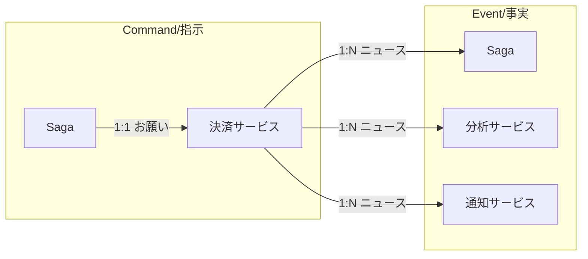

# 第13章：メッセージの基礎（CommandとEventの違い）📨🎯


## この章のゴール🏁✨

* Command（依頼）と Event（事実）をちゃんと分けて話せるようになる😊
* 「これはお願い？それとも起きたこと？」を瞬時に見分けられるようになる👀⚡
* Sagaで出てくるメッセージ名（OrderPaid / ReserveInventory など）を迷わず命名できるようになる🧠📝

---

## まず覚える一言🧩💡

* **Command =「これやって！」（お願い・指示）**
* **Event =「これ起きたよ！」（過去の事実・ニュース）**

これを混ぜると、Sagaはすぐ事故るよ〜😵‍💫💥

### Command vs Event イメージ 📨🎯📣


---

# 13-1. CommandとEvent、何が違うの？🤔📮

## Command（コマンド）＝「誰か1人にお願いするメッセージ」🎯

* 目的：**行動してもらう**（何かを実行してもらう）
* 宛先：基本 **1つの担当（ハンドラ）** を想定
* 例：

  * `ReserveInventory`（在庫を確保して！）
  * `ChargePayment`（決済して！）
  * `CancelOrder`（注文をキャンセルして！）

Commandは「お願い」なので、**断られることもある**（在庫ない、カードNGなど）😢

---

## Event（イベント）＝「起きた事実をみんなに知らせるメッセージ」📣🗞️

* 目的：**事実の共有**（もう起きたこと）
* 宛先：基本 **複数の購読者（サブスクライバ）** がいてOK
* 例：

  * `InventoryReserved`（在庫確保できた！）
  * `PaymentCharged`（決済完了した！）
  * `OrderCanceled`（注文キャンセルされた！）

Eventは「ニュース」だから、**受け手が止めることはできない**（止めたいなら、その前にCommandで止める）🧯

---

# 13-2. 一発で見分けるチェックリスト✅🧠

## これはCommand？🎯

* 「〜して！」って言える？（命令形っぽい？）
* 失敗・拒否される可能性がある？
* “宛先がだいたい決まってる”感じ？（誰がやるか明確）

→ YES多めなら **Command** 😊

## これはEvent？📣

* 「〜した！」って言える？（過去形っぽい？）
* もう起きたことを報告してる？
* “聞きたい人が勝手に聞く”感じ？（購読者が増えてもOK）

→ YES多めなら **Event** 😊

---

# 13-3. Sagaの流れで見ると超わかる🍱🔁

例：ECで「注文→決済→在庫」🛒💳📦

## Command→Event の王道パターン✨

1. `PlaceOrder`（注文して！）🎯
2. `OrderPlaced`（注文できた！）📣
3. `ChargePayment`（決済して！）🎯
4. `PaymentCharged`（決済できた！）📣
5. `ReserveInventory`（在庫確保して！）🎯
6. `InventoryReserved`（在庫確保できた！）📣

この並びだと、Sagaの「状態機械（第11〜12章）」にも落とし込みやすいよ〜⚙️✨

---

# 13-4. 命名ルール（ここが一番効く！）📝💥

## Commandの命名：命令形（やって！）🧑‍✈️

* `ReserveInventory`
* `ChargePayment`
* `CancelOrder`

## Eventの命名：過去形（起きた！）📣

* `InventoryReserved`
* `PaymentCharged`
* `OrderCanceled`

「Eventは過去形が自然」みたいな命名ルールは、メッセージング系の実務ドキュメントでも定番だよ📚✨ ([docs.particular.net][1])

---

# 13-5. 混ぜるとどう壊れるの？（ありがち事故）😱🕳️

## 事故①：「お願い」をEventっぽく出す📣❌

たとえば…

* `InventoryReservationRequested`（在庫確保お願いしたいっぽい名前）

これをEventとして配信すると、

* **“誰がやるの？”問題**が出る（購読者が複数いると二重実行の地獄）🔥
* 「担当は1人」なのに「みんな聞ける」形になる😵‍💫

---

## 事故②：「事実」をCommandっぽく出す🎯❌

たとえば…

* `PaymentWasChargedPleaseHandle` みたいなノリ（やばい命名例🤣）

これをCommand扱いにすると、

* 「事実なのに、受け手が失敗したらどうするの？」となる
* 結果、「事実」が不安定になる（え、起きたの？起きてないの？）🤯

---

## 事故③：「同じ言葉」がCommand/Eventで混在する🌀

例：

* `CancelOrder`（Command）
* `CancelOrder`（Event）←同名にしちゃう

ログや監視で死ぬ😇🧾
→ **CommandとEventは“見ただけで違う”名前にする**のが安全！

---

# 13-6. C#での型設計（超ミニマムでOK）🧑‍💻✨

ここでは「混ぜない」ために、**型で分けちゃう**のがコツだよ🧷

```csharp
// 目印インターフェース（中身は空でOK）
public interface ICommand { }
public interface IEvent { }

// メタ情報（追跡の基本セット）
public sealed record MessageMeta(
    Guid MessageId,
    string CorrelationId,
    string? CausationId,
    DateTimeOffset CreatedAtUtc
);

// Command例（お願い）
public sealed record ReserveInventory(
    string OrderId,
    string Sku,
    int Quantity,
    MessageMeta Meta
) : ICommand;

// Event例（起きた事実）
public sealed record InventoryReserved(
    string OrderId,
    string Sku,
    int Quantity,
    MessageMeta Meta
) : IEvent;
```

## なんで record が便利なの？📌

* **メッセージは基本「作ったら変えない（不変）」**のが安全
* recordは「データのかたまり」として扱いやすい✨
  C#のrecordはこういう用途に向いてるよ📘 ([Microsoft Learn][2])

---

# 13-7. “封筒（Envelope）”の考え方（ちょい実戦）✉️🔗

実務では、Eventに「共通の外側フォーマット」を付けることがあるよ📦
その代表が **CloudEvents**（イベント共通スキーマ）✨
「id / source / type / time / subject / data」みたいな枠を揃えるやつ！ ([GitHub][3])

* “イベントを運ぶ箱”を標準化すると、サービス間の相互運用がラクになる🙌
* Azureでも CloudEvents が推奨フォーマットとして扱われてるよ📨 ([Microsoft Learn][4])

※ CommandまでCloudEventsに寄せるかはチーム次第だけど、まずは「Eventの外側標準」くらいの理解でOK😊

---

# 13-8. ミニ演習🎲😊（分類クイズ）

## 問題：Command？Event？どっち？🧠💥

1. `OrderPaid`
2. `PayOrder`
3. `ReserveInventory`
4. `InventoryReserved`
5. `ShipOrder`
6. `OrderShipped`
7. `RefundPayment`
8. `PaymentRefunded`
9. `CreateShipment`
10. `ShipmentCreated`

---

## 解答✅✨

1. Event（支払い終わった）📣
2. Command（払って！）🎯
3. Command 🎯
4. Event 📣
5. Command 🎯
6. Event 📣
7. Command 🎯
8. Event 📣
9. Command 🎯
10. Event 📣

コツは「命令形か？過去形か？」だよ〜📝💡 ([docs.particular.net][1])

---

# 13-9. ミニ演習🛠️（命名リライト）

## お題：この名前、直してみよ〜😆✍️

1. `InventoryReservationRequested`（Eventっぽく流してる）
2. `PaymentCompletedCommand`（事実なのにCommandっぽい）
3. `OrderCancel`（Command/Eventどっちか曖昧）

## 例の答え（1つの案だよ）✨

1. Commandにするなら：`ReserveInventory` 🎯 / Eventにするなら：`InventoryReserved` 📣
2. Eventなら：`PaymentCharged` または `PaymentCompleted` 📣
3. Commandなら：`CancelOrder` 🎯 / Eventなら：`OrderCanceled` 📣

「曖昧な単語（Request / Completed / Process）」を使うと、混ざりやすいから注意だよ⚠️😵‍💫

---

# 13-10. AI活用（Copilot/Codexに投げると強い）🤖✨

## ① 分類レビューを頼む（混ざり検知）🔍

```text
以下のメッセージ名一覧を、Command / Eventに分類して。
さらに「紛らわしい名前」「混ざって事故りそうな点」を指摘して、
改善案（命名）を各1〜2個ずつ提案して。

- （ここに一覧）
```

## ② 命名規則を“チームルール”として文章化📝

```text
CommandとEventの命名ルールを、初心者にも分かる短い文章でまとめて。
例も5個ずつ付けて。過去形・命令形のルールが伝わるように。
```

## ③ C# record のひな形を作ってもらう🧑‍💻

```text
次のドメイン（注文・決済・在庫）に対して、
Command と Event の record 定義案をC#で作って。
MessageMeta（MessageId / CorrelationId / CausationId / CreatedAtUtc）も含めて。
```

---

# まとめ🎀✨

* **Command＝お願い（1担当に向ける）🎯**
* **Event＝事実（みんなに通知できる）📣**
* 命名は **Command：命令形 / Event：過去形** が最強の事故防止🛡️✨ ([docs.particular.net][1])
* C#では **型（ICommand/IEvent）＋record** で混ぜない仕組みを作ると安定するよ😊📌 ([Microsoft Learn][2])

[1]: https://docs.particular.net/nservicebus/messaging/messages-events-commands?utm_source=chatgpt.com "Messages, events, and commands • NServiceBus"
[2]: https://learn.microsoft.com/en-us/dotnet/csharp/language-reference/builtin-types/record?utm_source=chatgpt.com "Records - C# reference"
[3]: https://github.com/cloudevents/spec/blob/main/cloudevents/spec.md?utm_source=chatgpt.com "spec/cloudevents/spec.md at main"
[4]: https://learn.microsoft.com/ja-jp/azure/event-grid/event-schema?utm_source=chatgpt.com "Azure Event Grid イベント スキーマ"
