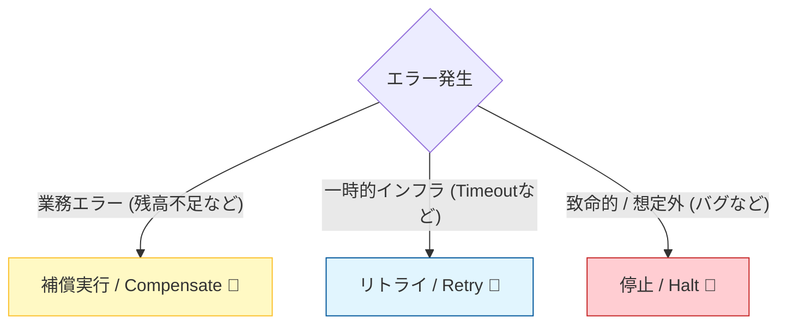

# 第15章：エラー設計の基本（業務エラー vs インフラエラー）🚧📌


## この章のゴール 🎯✨

* 「失敗」を **2種類に分けて考える**クセがつく（業務エラー / インフラエラー）🙂
* Sagaで「**リトライする？補償する？止める？**」をエラー種別から判断できる🧠🔁
* C#で「**例外を仕様として扱う**」ための、実装パターンが手に入る🧑‍💻🧰

---

## まずは超わかりやすい例で🌰✨

ECで「注文→決済→在庫→配送」をやってるとするよ🛒📦🚚

* ❌ カード残高不足 → **業務エラー**（仕様どおりに起きる失敗）💳😵
* ❌ 決済サービスがタイムアウト → **インフラエラー**（環境が不安定で起きる失敗）🌩️⏳
* ❌ DBが落ちてる / ネットワーク断 → **インフラエラー**📡💥
* ❌ NullReferenceException → だいたい **バグ**（インフラというより「想定外」）🐛😱

この「種類の違い」を分けないと、Sagaがすぐ事故るよ🚑💦
たとえば「残高不足」なのにリトライしまくると、永遠に失敗するだけ…🥲🔁

### エラーの仕分けと基本アクション 🚧🎯


---

# 1. 2種類のエラーを“キャラ分け”する🧑‍🤝‍🧑✨

## A) 業務エラー（Business / Domain Error）🧾✅

**特徴**：

* 想定内（仕様として起きる）📘
* 入力や状態が原因（残高不足、在庫切れ、期限切れなど）🧾
* 基本 **リトライしても成功しない**（条件が変わらない限り）🙅‍♀️🔁

**例**：

* `OutOfStock`（在庫なし）📦😵
* `PaymentDeclined`（決済否認）💳🙅‍♀️
* `CouponExpired`（期限切れ）🎫⌛

---

## B) インフラエラー（Infrastructure / Transient Error）🌩️🧯

**特徴**：

* 想定内だけど「環境要因」🛠️
* ネットワーク、外部API、DB、メッセージング等が原因📡
* **リトライで直る可能性がある**（一時的障害）🔁✨

**例**：

* `Timeout` / `503 Service Unavailable` ⏳🚧
* 一時的なDNS失敗、接続リセット📡💥
* DBの一時的なロック競合🔒😵‍💫

---

## C) 想定外（Bug / Unknown）🐛🧨

**特徴**：

* 仕様にない（またはコードのバグ）😱
* リトライしても再現することが多い
* **止めて調査が必要**になりがち🛑🔎

---

# 2. Sagaだと「この違い」が超重要になる理由🧩🛡️

Sagaは「前に進むステップ」と「戻す（補償）ステップ」がセットだったよね🔁🧾

ここでエラー種別を分けると、判断がスッキリするの👇✨

* **業務エラー**：

  * 「これ以上進めない」が確定 ✅
  * すでに進めた分だけ **補償して終了**（or キャンセル確定）🧾🏁
* **インフラエラー（回復見込みあり）**：

  * まず **リトライ**（次章で詳しく！）🔁⏳
  * それでもダメなら「保留」or「補償」or「運用介入」へ👩‍💼🧯
* **想定外（バグ等）**：

  * だいたい **Halt（止める）** が安全🛑
  * 状態・入力・相関IDを残して調査しやすくする🔎🧾

---

# 3. ありがちな事故パターン図鑑 💥📚

## 事故①：業務エラーを例外で投げて 500 にしちゃう😇➡️🔥

* APIクライアントから見ると「サーバ障害」に見える
* リトライが走る
* 二重実行や二重補償の温床👿

✅ 対策：**業務エラーは “結果” として返す**（例外じゃなくて）🧾✨

---

## 事故②：インフラエラーなのに補償を即発動😱

* 実は一時的なタイムアウトだっただけなのに、返金や在庫戻しが走る
* ユーザー体験がぐちゃぐちゃ🍝💦

✅ 対策：インフラエラーはまず **リトライ方針** を持つ（次章へ）🔁🧯

---

## 事故③：境界がぐちゃぐちゃ（ドメインがHTTPを知ってる）🧠💥

* ドメイン層で `HttpStatusCode` とか作り始める
* テストしづらいし、再利用もできない🥲

✅ 対策：**境界で変換**する（ドメイン→アプリ→API）🚪✨

---

# 4. “境界で変換”ってこういうこと🚪🔁

## レイヤーごとの責任（ざっくり）🧩

* **ドメイン**：業務的に正しい？ダメ？理由は？🧾
* **アプリケーション（Saga/UseCase）**：進む？補償？リトライ？止める？🧭
* **インフラ**：外部API呼び出し、DB、MQ、タイムアウトなどの事情🛠️
* **API（Controller/Minimal API）**：HTTPでどう返す？（ProblemDetailsなど）🌐

ASP.NET Coreでは、APIのエラー応答を標準化するために `ProblemDetails` が用意されていて、RFC 7807 形式に沿ったレスポンスを作れるよ📦✨。([Microsoft Learn][1])

---

# 5. C#でのおすすめ実装パターン🧑‍💻🧰✨

## 方針（超大事）📌

* ✅ **業務エラー**：例外にしない（Resultで返す）
* ✅ **インフラエラー**：例外でもOK（ただしアプリ層で握りつぶさない）
* ✅ **想定外**：例外として上げて、止めてログ＆調査

---

## 5.1 Result型（業務エラーを“仕様として返す”）🧾✨

```csharp
public enum ErrorKind
{
    Business,       // 仕様どおり起こる失敗
    TransientInfra, // 一時的障害（リトライ候補）
    FatalInfra      // 想定外・致命的（止める候補）
}

public sealed record AppError(
    ErrorKind Kind,
    string Code,        // 機械可読な固定コード（例: "payment.declined"）
    string Message,     // 人間向け短文（表示用）
    object? Details = null // 追加情報（ログ用/内部用）
);

public sealed record Result<T>(bool IsSuccess, T? Value, AppError? Error)
{
    public static Result<T> Ok(T value) => new(true, value, null);
    public static Result<T> Fail(AppError error) => new(false, default, error);
}
```

ポイント👇🙂

* `Code` は **ずっと変えない**前提で設計（クライアントが分岐に使う）🔑
* `Message` は表示用（ユーザー向け/運用向けで別にするのもアリ）🗣️
* `Details` は **APIにそのまま出さない**（内部情報漏えい防止）🔒

---

## 5.2 Sagaオーケストレーター側の判断（超ざっくり）🧩🧑‍✈️

```csharp
public async Task<Result<Unit>> ExecutePaymentStepAsync(
    Guid sagaId,
    PaymentRequest req,
    CancellationToken ct)
{
    try
    {
        // 例: 決済サービス呼び出し（外部）
        var paid = await _paymentClient.PayAsync(req, ct);

        if (!paid.Success)
        {
            // 業務エラーとして返す（残高不足、カード無効など）
            return Result<Unit>.Fail(new AppError(
                ErrorKind.Business,
                code: "payment.declined",
                message: "お支払いに失敗しました（カードの状態をご確認ください）"
            ));
        }

        return Result<Unit>.Ok(Unit.Value);
    }
    catch (TimeoutException ex)
    {
        // 一時的障害：リトライ候補
        return Result<Unit>.Fail(new AppError(
            ErrorKind.TransientInfra,
            code: "payment.timeout",
            message: "決済の通信が混み合っています（再試行します）",
            details: ex.Message
        ));
    }
    catch (Exception ex)
    {
        // 想定外：止める候補
        return Result<Unit>.Fail(new AppError(
            ErrorKind.FatalInfra,
            code: "payment.unknown",
            message: "予期しないエラーが発生しました",
            details: ex.ToString()
        ));
    }
}

public readonly record struct Unit
{
    public static readonly Unit Value = new();
}
```

ここで大事なのは「例外が起きた＝全部500」って発想を捨てること🗑️✨
**例外を“分類して結果に変換”**してるのがポイントだよ🙂

---

# 6. APIではどう返す？（ProblemDetailsで統一）📦🌐✨

ASP.NET Core では APIのエラー処理ガイドが用意されていて、例外ハンドリングや `ProblemDetails` の扱いも整理されてるよ🧾✨。([Microsoft Learn][2])

## よくあるマッピング例（覚えやすいやつ）🧠✨

* 業務エラー（入力不正/業務ルールNG）→ **400**
* 競合（在庫取り合い等）→ **409**
* 認可NG → **401/403**
* 一時障害 → **503**（必要なら `Retry-After`）
* 想定外 → **500**（詳細は隠す）

---

## Minimal APIでの例（Result → ProblemDetails）🧑‍💻📦

```csharp
using Microsoft.AspNetCore.Mvc;

app.MapPost("/orders/{orderId:guid}/pay", async (
    Guid orderId,
    PaymentRequest req,
    SagaService saga,
    HttpContext http,
    CancellationToken ct) =>
{
    var result = await saga.PayAsync(orderId, req, ct);

    if (result.IsSuccess) return Results.Ok();

    var err = result.Error!;
    return err.Kind switch
    {
        ErrorKind.Business => Results.Problem(
            title: "業務エラー",
            detail: err.Message,
            statusCode: StatusCodes.Status400BadRequest,
            extensions: new Dictionary<string, object?>
            {
                ["code"] = err.Code
            }),

        ErrorKind.TransientInfra => Results.Problem(
            title: "一時的な障害",
            detail: err.Message,
            statusCode: StatusCodes.Status503ServiceUnavailable,
            extensions: new Dictionary<string, object?>
            {
                ["code"] = err.Code
            }),

        _ => Results.Problem(
            title: "予期しないエラー",
            detail: "しばらくしてからお試しください",
            statusCode: StatusCodes.Status500InternalServerError)
    };
});
```

`ProblemDetails` は APIエラー応答の標準フォーマットとして ASP.NET Core がサポートしていて、RFC 7807 に沿った形で返せるよ📦✨。([Microsoft Learn][1])

---

# 7. “リトライ候補”の見分け方（次章の伏線）⏳🔁

インフラエラーでも **全部リトライ** は危険⚠️
たとえば「認証失敗」や「429（レート制限）」は、回数より “待ち” が必要なことが多いよね🥲

.NET では `HttpClient` 向けの回復性（resilience）パターンとして、`Microsoft.Extensions.Http.Resilience` が案内されてるよ📦🧯。([Microsoft Learn][3])

---

# 8. ミニ演習：エラーを3分類して、返し方の方針を決める📝✨

## お題（分類してね）🎲

1. 決済：残高不足
2. 在庫：在庫切れ
3. 外部配送API：タイムアウト
4. DB：接続失敗
5. たまに出るNullReferenceException

## 1行回答フォーマット（これでOK）✅

* **分類**：Business / TransientInfra / FatalInfra
* **Sagaの動き**：Retry / Compensate / Halt（or 保留）
* **APIの返し方**：400 / 503 / 500（など）

---

# 9. AI活用（Copilot / Codex で爆速にする）🤖⚡

## 9.1 エラー一覧の棚卸し（漏れチェック）🗂️✅

**プロンプト例**：

* 「注文→決済→在庫→配送のSagaで起きうる業務エラーを網羅的に列挙して。各エラーに “code” を付けて、ユーザー向けメッセージ案も作って」🤖📝

## 9.2 “分類”のレビュー（ズレを直す）🔍✨

**プロンプト例**：

* 「このエラー分類（Business/Transient/Fatal）に矛盾がないかレビューして。リトライすべきでないものを指摘して」🤖✅

## 9.3 ProblemDetailsの統一テンプレを作る📦

**プロンプト例**：

* 「ASP.NET Coreで ProblemDetails を統一するための拡張メソッド（Result→IResult変換）を提案して」🤖🧩

---

# 10. チェックリスト（できてたら強い）✅🛡️

* [ ] 業務エラーを例外で投げてない（Resultで返してる）🧾
* [ ] インフラエラーを “全部補償” してない（まず方針がある）🔁
* [ ] ドメイン層がHTTPを知らない（境界で変換してる）🚪
* [ ] APIエラー形式が統一されてる（ProblemDetails）📦
* [ ] `code` が固定で、クライアント分岐に使える🔑

---

# 11. 理解度クイズ（サクッと）🎓✨

1. 「残高不足」はどの分類？リトライする？💳
2. 「タイムアウト」はどの分類？最初の一手は？⏳
3. ドメイン層に `HttpStatusCode` を置くと何が困る？🚪
4. APIのエラー応答を統一する仕組みとして何が便利？📦

---

## 最新環境メモ（2026の前提として安心ポイント）🧷✨

* .NET 10 は 2025年11月にリリースされたLTSで、3年サポート枠だよ📌。([Microsoft for Developers][4])
* C# は 2025年11月リリースの C# 14 が「最新世代」として整理されてるよ🆕✨。([Microsoft Learn][5])
* Visual Studio 2026 は一般提供開始が公式に案内されてるよ🧑‍💻✨。([Microsoft for Developers][6])

[1]: https://learn.microsoft.com/en-us/aspnet/core/web-api/?view=aspnetcore-10.0&utm_source=chatgpt.com "Create web APIs with ASP.NET Core"
[2]: https://learn.microsoft.com/en-us/aspnet/core/fundamentals/error-handling-api?view=aspnetcore-10.0&utm_source=chatgpt.com "Handle errors in ASP.NET Core APIs"
[3]: https://learn.microsoft.com/en-us/dotnet/core/resilience/http-resilience?utm_source=chatgpt.com "Build resilient HTTP apps: Key development patterns - .NET"
[4]: https://devblogs.microsoft.com/dotnet/announcing-dotnet-10/?utm_source=chatgpt.com "Announcing .NET 10"
[5]: https://learn.microsoft.com/en-us/dotnet/csharp/whats-new/csharp-version-history "The history of C# | Microsoft Learn"
[6]: https://devblogs.microsoft.com/visualstudio/visual-studio-november-update-visual-studio-2026-cloud-agent-preview-and-more/?utm_source=chatgpt.com "Visual Studio 2026 November 2025 Update"
