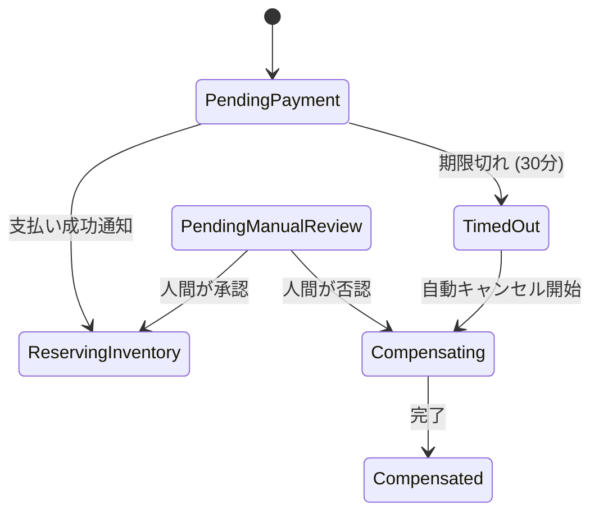

# 第17章：タイムアウトと人間の介入（運用に渡す設計）👩‍💼⏰

## 今日のゴール🎯✨

* Sagaが**止まりっぱなし（永遠待ち）**にならないように、**タイムアウト**を設計できるようになる🧠
* 自動で直らないときに、**人が安全に介入できる形（運用）**を作れるようになる🛡️
* 「30分決済が来なかったらキャンセル」みたいな**業務ルール**を、状態とコードに落とせるようになる💻✅

---

# 1) そもそもSagaって“長くなる”前提だよね😵‍💫🧩

Sagaは「複数ステップのローカルトランザクションの連なり」で、途中で失敗したら補償（帳尻合わせ）する仕組みだよ〜、って話だったね📚🔁（定義の雰囲気はこれが近いよ）([microservices.io][1])
で、ここが重要👇

* ネットワーク・外部API・決済などが絡むと、**待ち時間や失敗は日常茶飯事**🌀
* だからSagaは「長く走る」ことが多い＝**タイムアウトがないと、止まったまま放置**が起きる😱
  「Sagaは長くてもいいけど、無期限はダメ。タイムアウト入れるの大事」みたいな考え方は一般的に語られてるよ⏳🧯([Apache Camel][2])

---

# 2) タイムアウトは2種類あるよ⏱️🧠

## A. 技術タイムアウト（秒〜分）⚡

例：HTTPが返ってこない、DB接続が詰まった、外部APIが固まった…😇

# * これは主に **リトライ戦略（第16章）** とセットで扱うことが多いよ🔁

**.NETの例（HTTP）**
`HttpClient.Timeout` は既定で **100秒**だよ⏲️（意外と長い！）([Microsoft Learn][3])
ただし「DNS解決だけで最大15秒かかることがある」みたいな注意もあるから、短くしすぎにも注意⚠️([Microsoft Learn][3])

## B. 業務タイムアウト（分〜日）📦🧾

例：

* 「決済が30分以内に確定しなければ注文キャンセル」🛒💳
* 「在庫確保が10分できなければロールバック」📦
* 「不正検知で保留→24時間以内に人が判断」👀⏰

👉 第17章の主役はこっち！✨

---

## 3) “永遠待ち”をなくす基本設計🧱✅

タイムアウト設計のコアはこの3点だよ👇

### ① 状態に「待ち」を入れる🧊

例：

* `PendingPayment`（決済待ち）
* `PendingManualReview`（人の判断待ち）
* `TimedOut`（期限切れ）

### ② 期限（Deadline）をデータとして持つ📅

Sagaインスタンスにこういうのを持つイメージ👇

* `DeadlineUtc`（期限、UTCがラク✨）
* `LastUpdatedUtc`
* `State`
* `LastError`
* `RetryCount`

### ③ 期限を監視して「期限切れイベント」を発火する🔔

やり方は主に2つ💡

* **(a) スケジューラ/遅延メッセージ**（「30分後にTimeoutコマンドを投げる」）📨⏳
* **(b) 定期スキャン**（1分ごとにDBを見て期限切れを処理）🔎🗄️

最初は(b)がわかりやすいよ😊（後でOutboxやメッセージ基盤と統合しやすい）

---

## 4) 「人間の介入」が必要になる瞬間あるある👩‍💼💥

自動で直らないのはだいたいこのへん👇

* 補償が失敗して、どっちつかず😵‍💫（例：返金APIが落ちてる）
* 外部システムが「結果不明」🤷‍♀️（決済が成功したか失敗したかわからない）
* 不正/例外ケースで判断が必要👀（高額注文、住所不備、在庫が微妙…）
* “仕様上” 人の承認が必要✅（与信や審査）

「失敗したら全部自動で戻す」は夢見がちなので😂、運用に渡す道を用意するのが現実的だよ🛟
（昔から“手動介入で復旧して再実行”みたいな話は語られてる）([Speaker Deck][4])

---

## 5) 運用に渡すときの“安全なボタン設計”🛡️🧨

人が触れる＝事故りやすいので、**押せるボタンを慎重に**するのが超大事💦

### 運用ボタンのおすすめ構成🔘✨

* ✅ **Retry（再実行）**：失敗した「直前ステップ」をもう一回やる
* ✅ **Compensate（補償開始）**：補償フローへ進める
* ✅ **Extend Deadline（期限延長）**：判断待ちを延長
* ✅ **Mark as Resolved（解決扱い）**：手作業で帳尻を合わせたので閉じる（監査ログ必須）

### やっちゃダメ寄り😇🚫

* DBを直接UPDATEして状態だけ変える（あとで地獄）🔥
* “強制完了”を無条件で許す（不整合の温床）🌀

### 最低限の安全装置🧯✅

* **RBAC（権限）**：閲覧だけ / 操作OK / 承認者 みたいに分ける👮
* **監査ログ（誰がいつ何を）**：あとで説明できる📜
* **二重実行対策**：運用ボタンも冪等に🔁（第9〜10章の応用✨）

---

## 6) 具体例：注文Saga（決済30分待ち→期限切れでキャンセル）🛒💳⏰

### タイムアウトを考慮した状態遷移 ⏰⚙️


---

* `Started` → `PendingPayment` →（支払いOK）→ `ReserveInventory` → `Ship` → `Completed` 🎉
* `PendingPayment` →（30分経過）→ `TimedOut` → `Compensating`（注文取消/在庫戻し）→ `Compensated` 🧾

---

## 7) C#ミニ実装（最小構成で体感する）🧑‍💻✨

ここでは「DBじゃなくても理解できる」ように、まずは **メモリ実装＋BackgroundService** で作るよ😊
（本番はDBに置き換えるだけ、って形にするのがコツ🧱）

### 7-1. モデルと状態🌱

```csharp
public enum SagaState
{
    PendingPayment,
    ReservingInventory,
    Shipping,
    Completed,

    TimedOut,
    Compensating,
    Compensated,

    PendingManualReview,
    Failed
}

public sealed record OrderSaga(
    Guid SagaId,
    string OrderId,
    SagaState State,
    DateTimeOffset CreatedUtc,
    DateTimeOffset UpdatedUtc,
    DateTimeOffset? DeadlineUtc,
    string? LastError,
    int RetryCount,
    long Version
);
```

### 7-2. “期限切れスキャン”ワーカー⏳🔎

```csharp
using Microsoft.Extensions.Hosting;

public sealed class SagaTimeoutWorker : BackgroundService
{
    private readonly ISagaStore _store;
    private readonly TimeSpan _interval = TimeSpan.FromSeconds(30);

    public SagaTimeoutWorker(ISagaStore store) => _store = store;

    protected override async Task ExecuteAsync(CancellationToken stoppingToken)
    {
        while (!stoppingToken.IsCancellationRequested)
        {
            var now = DateTimeOffset.UtcNow;
            var expired = _store.FindExpired(now);

            foreach (var saga in expired)
            {
                // 期限切れ処理は “状態遷移” として扱うのがポイント✨
                _store.TryTransitionToTimedOut(saga.SagaId, now);
            }

            await Task.Delay(_interval, stoppingToken);
        }
    }
}
```

### 7-3. ストア（超簡易）🧺

```csharp
public interface ISagaStore
{
    OrderSaga CreatePendingPayment(string orderId, DateTimeOffset now, TimeSpan paymentWindow);
    OrderSaga? Get(Guid sagaId);

    IReadOnlyList<OrderSaga> FindExpired(DateTimeOffset now);

    bool ConfirmPayment(Guid sagaId, DateTimeOffset now);

    bool TryTransitionToTimedOut(Guid sagaId, DateTimeOffset now);

    // 運用ボタン例
    bool ExtendDeadline(Guid sagaId, DateTimeOffset now, TimeSpan extend);
    bool StartCompensation(Guid sagaId, DateTimeOffset now, string reason);
}

public sealed class InMemorySagaStore : ISagaStore
{
    private readonly object _lock = new();
    private readonly Dictionary<Guid, OrderSaga> _db = new();

    public OrderSaga CreatePendingPayment(string orderId, DateTimeOffset now, TimeSpan paymentWindow)
    {
        var saga = new OrderSaga(
            SagaId: Guid.NewGuid(),
            OrderId: orderId,
            State: SagaState.PendingPayment,
            CreatedUtc: now,
            UpdatedUtc: now,
            DeadlineUtc: now.Add(paymentWindow),
            LastError: null,
            RetryCount: 0,
            Version: 1
        );

        lock (_lock) _db[saga.SagaId] = saga;
        return saga;
    }

    public OrderSaga? Get(Guid sagaId)
    {
        lock (_lock) return _db.TryGetValue(sagaId, out var s) ? s : null;
    }

    public IReadOnlyList<OrderSaga> FindExpired(DateTimeOffset now)
    {
        lock (_lock)
        {
            return _db.Values
                .Where(s => s.State == SagaState.PendingPayment
                         && s.DeadlineUtc is not null
                         && s.DeadlineUtc <= now)
                .ToList();
        }
    }

    public bool ConfirmPayment(Guid sagaId, DateTimeOffset now)
    {
        lock (_lock)
        {
            if (!_db.TryGetValue(sagaId, out var s)) return false;
            if (s.State != SagaState.PendingPayment) return false;

            // 本当は次のステップ（在庫確保など）へ進める
            _db[sagaId] = s with
            {
                State = SagaState.ReservingInventory,
                UpdatedUtc = now,
                DeadlineUtc = null,
                Version = s.Version + 1
            };
            return true;
        }
    }

    public bool TryTransitionToTimedOut(Guid sagaId, DateTimeOffset now)
    {
        lock (_lock)
        {
            if (!_db.TryGetValue(sagaId, out var s)) return false;
            if (s.State != SagaState.PendingPayment) return false;

            _db[sagaId] = s with
            {
                State = SagaState.TimedOut,
                UpdatedUtc = now,
                LastError = "Payment deadline expired",
                Version = s.Version + 1
            };
            return true;
        }
    }

    public bool ExtendDeadline(Guid sagaId, DateTimeOffset now, TimeSpan extend)
    {
        lock (_lock)
        {
            if (!_db.TryGetValue(sagaId, out var s)) return false;
            if (s.State is not (SagaState.PendingPayment or SagaState.PendingManualReview)) return false;
            if (s.DeadlineUtc is null) return false;

            _db[sagaId] = s with
            {
                DeadlineUtc = s.DeadlineUtc.Value.Add(extend),
                UpdatedUtc = now,
                Version = s.Version + 1
            };
            return true;
        }
    }

    public bool StartCompensation(Guid sagaId, DateTimeOffset now, string reason)
    {
        lock (_lock)
        {
            if (!_db.TryGetValue(sagaId, out var s)) return false;
            if (s.State is SagaState.Completed or SagaState.Compensated) return false;

            _db[sagaId] = s with
            {
                State = SagaState.Compensating,
                UpdatedUtc = now,
                LastError = reason,
                Version = s.Version + 1
            };
            return true;
        }
    }
}
```

### 7-4. Minimal API（運用ボタン付き）🔘🧑‍💼

```csharp
using Microsoft.AspNetCore.Builder;
using Microsoft.Extensions.DependencyInjection;
using Microsoft.Extensions.Hosting;

var builder = WebApplication.CreateBuilder(args);

builder.Services.AddSingleton<ISagaStore, InMemorySagaStore>();
builder.Services.AddHostedService<SagaTimeoutWorker>();

var app = builder.Build();

// 注文開始：決済待ち（30分）
app.MapPost("/orders/{orderId}/start", (string orderId, ISagaStore store) =>
{
    var saga = store.CreatePendingPayment(orderId, DateTimeOffset.UtcNow, TimeSpan.FromMinutes(30));
    return Results.Ok(new { saga.SagaId, saga.State, saga.DeadlineUtc });
});

// 決済確定（外部から通知が来た想定）
app.MapPost("/payments/{sagaId:guid}/confirmed", (Guid sagaId, ISagaStore store) =>
{
    var ok = store.ConfirmPayment(sagaId, DateTimeOffset.UtcNow);
    return ok ? Results.Ok() : Results.Conflict("State mismatch or not found");
});

// 状態確認（運用画面が呼ぶ想定）
app.MapGet("/admin/sagas/{sagaId:guid}", (Guid sagaId, ISagaStore store) =>
{
    var saga = store.Get(sagaId);
    return saga is null ? Results.NotFound() : Results.Ok(saga);
});

// 期限延長（運用ボタン）
app.MapPost("/admin/sagas/{sagaId:guid}/extend", (Guid sagaId, int minutes, ISagaStore store) =>
{
    var ok = store.ExtendDeadline(sagaId, DateTimeOffset.UtcNow, TimeSpan.FromMinutes(minutes));
    return ok ? Results.Ok() : Results.Conflict("Not extendable");
});

// 補償開始（運用ボタン）
app.MapPost("/admin/sagas/{sagaId:guid}/compensate", (Guid sagaId, string reason, ISagaStore store) =>
{
    var ok = store.StartCompensation(sagaId, DateTimeOffset.UtcNow, reason);
    return ok ? Results.Ok() : Results.Conflict("Not compensatable");
});

app.Run();
```

> ポイント💡：本番運用では、ここに **監査ログ** と **冪等キー**（運用ボタン連打対策😂）を足していく感じになるよ🛡️✨

---

## 8) HTTPタイムアウト（技術）も注意しよ〜⚠️📡

Sagaの各ステップで外部HTTPを叩くなら、最低限これだけは押さえたい👇

* 全体の既定値として `HttpClient.Timeout` を把握（既定100秒）([Microsoft Learn][3])
* さらに「この1回だけ短くしたい」は `CancellationTokenSource` で**リクエスト単位の締切**を作る🧨
* リトライやサーキットブレーカーは “回復性（Resilience）” の仕組みでまとめるとラク💖
  .NETでは `Microsoft.Extensions.Http.Resilience` などが案内されてるよ📦([Microsoft Learn][5])

---

## 9) ミニ演習：タイムアウト＆人手介入ルールを決めよう📝💗

次の表を、自分の想定アプリで埋めてみてね😊
（正解はないけど「期限」と「次の行動」が決まってるのが正義✨）

| 待ってること  |   期限 | 期限切れになったら         | 人が介入できる？   |
| ------- | ---: | ----------------- | ---------- |
| 決済確定    |  30分 | 注文キャンセル→補償へ🔁     | 期限延長/手動確認✅ |
| 在庫確保    |  10分 | 注文キャンセル→補償へ📦     | 再試行/代替在庫✅  |
| 配送ラベル発行 |  15分 | 手動タスクへ👩‍💼       | Retry/別手段✅ |
| 不正検知の審査 | 24時間 | 自動キャンセル or 強制保留🧊 | 承認/否認✅     |

---

## 10) AI活用（Copilot/Codex）で爆速にする呪文🪄🤖✨

### ① 期限と状態の洗い出し🗂️

* 「注文フロー（注文→決済→在庫→配送）で、待ち状態と期限、期限切れ時の動作を表にして」

### ② “運用ボタン”の仕様書化📜

* 「運用画面に必要な操作（Retry/Compensate/Extend/Resolve）と、その安全装置（権限/監査ログ/二重確認）を箇条書きで」

### ③ 状態遷移チェック生成⚙️

* 「SagaStateの遷移をswitchで実装して。不正遷移はConflictで返す感じで」

---

## 11) よくある落とし穴ベスト5😇🕳️

1. **期限がない** → 永遠待ち地獄😱
2. **期限はあるけど監視がない** → 誰も気づかない👻
3. **運用ボタンが強すぎ** → 誤操作で破壊💥
4. **監査ログがない** → 後で説明できない📉
5. **タイムゾーンが混ざる** → 「いつ切れた？」が混乱🌍🌀（UTCで統一がラク✨）

---

## 12) まとめ🎀✅

* Sagaは長く走るから、**業務タイムアウト（締切）**が超重要⏰
* 設計の基本は **状態（待ち）＋期限（データ）＋期限監視（仕組み）** の3点セット🧩
* 自動で直らない時は **人が安全に介入できる運用ボタン**を用意する👩‍💼🔘
* “安全装置（権限・監査ログ・冪等）” を入れると、現場で壊れにくくなるよ🛡️✨

（なお、C# 14 は .NET 10 と一緒に試せるよ、みたいな最新前提はここに載ってるよ）([Microsoft Learn][6])

[1]: https://microservices.io/patterns/data/saga.html?utm_source=chatgpt.com "Pattern: Saga"
[2]: https://camel.apache.org/components/4.14.x/eips/saga-eip.html?utm_source=chatgpt.com "Saga - Apache Camel"
[3]: https://learn.microsoft.com/en-us/dotnet/api/system.net.http.httpclient.timeout?view=net-10.0&utm_source=chatgpt.com "HttpClient.Timeout Property (System.Net.Http)"
[4]: https://speakerdeck.com/ufried/beyond-the-saga-pattern?utm_source=chatgpt.com "Beyond the saga pattern"
[5]: https://learn.microsoft.com/ja-jp/dotnet/core/resilience/?utm_source=chatgpt.com "回復性のあるアプリ開発の概要 - .NET"
[6]: https://learn.microsoft.com/en-us/dotnet/csharp/whats-new/csharp-14?utm_source=chatgpt.com "What's new in C# 14"
