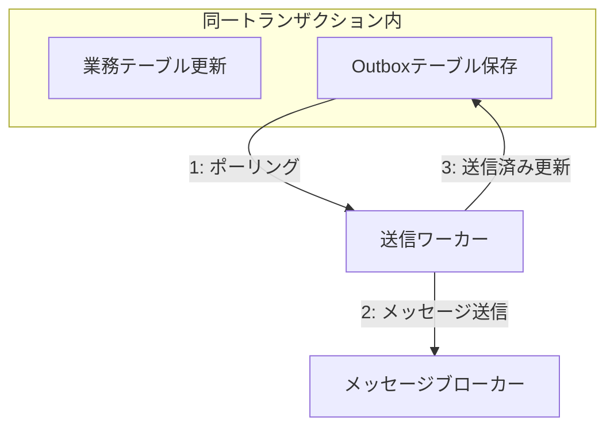

# 第18章：Outboxの考え方（DB更新と送信のズレ問題）📦😬

### Outboxの仕組み 📦🔁

---
## 18.1 まず“ズレ事故”を想像しよう😱⚡

## 18.1 まず“ズレ事故”を想像しよう😱⚡

Sagaって「注文→決済→在庫→配送…」みたいに、段階的に進むよね🧩✨
このとき**DB更新**と**イベント送信**が別々に起きると、“ズレ”が起きがちです💥

たとえば👇

* ✅ DBの注文は「作成済み」になった
  でも… ❌ `OrderCreated` イベント送信がネットワーク障害で失敗😵‍💫
  → 在庫サービスが知らないから、在庫確保が始まらない…📦💔

逆もある👇

* ✅ イベントは送れた
  でも… ❌ DB更新がロールバックされた
  → “存在しない注文”のイベントだけが飛ぶ👻📨

こういう「**DBとメッセージの二重書き込み（dual write）**」は分散システムの定番落とし穴だよ〜😬
この問題を避ける代表的な方法が **Transactional Outbox** です📦🛡️ ([AWS ドキュメント][1])

---

## 18.2 Outboxパターンって何？📦🔁

一言でいうと👇

**「業務DB更新と同じトランザクションで、送るべきメッセージを“Outboxテーブル”に保存しておく」**
→ そのあと別プロセス（送信ワーカー）がOutboxを見て、メッセージブローカーへ送る📨🚚

この“二段構え”で、DB更新と送信のズレを防ぎます✨ ([microservices.io][2])

---

## 18.3 図でイメージ（超重要）🖼️✨

### ❌ Outboxなし（ズレやすい）

1. DB更新 💾
2. イベント送信 📨（ここが失敗すると地獄😵）

### ✅ Outboxあり（ズレに強い）

1. DB更新 💾
2. Outboxに「送信予定メッセージ」をINSERT 📦（**同一トランザクション**✅）
3. 送信ワーカーがOutboxを読み取り👀
4. ブローカーへ送信 📨
5. Outboxを送信済みに更新 ✅

Transactional Outboxの基本形は「**トランザクション内でメッセージをDBに保存し、別プロセスが後で送る**」です📌 ([microservices.io][2])

---

## 18.4 SagaでOutboxが“めちゃ効く”ポイント💡🧩

Sagaは「状態（Sagaの進捗）を更新」しながら「次の指示（Command）や通知（Event）を送る」よね？🎯

Outboxを使うと👇

* ✅ **Saga状態更新**（例：`PaymentCompleted` に遷移）
* ✅ **次に送るメッセージ**（例：`ReserveInventory` コマンド）
  この2つを**同じDBトランザクションで確定**できる✨

だから「状態は進んだのに次が送れてない😭」が減るよ〜📉😆

---

## 18.5 Outboxで“保証できること / できないこと”🧠✅❗

### ✅ かなり強くなること

* 「DB更新だけ成功」「送信だけ成功」みたいな**ズレ事故を減らせる**📦🛡️ ([AWS ドキュメント][1])

### ❗ それでも注意が必要なこと

* Outboxは基本「**少なくとも1回（at-least-once）**」で送る設計になりやすいよ📨🔁
  → つまり**重複受信**は起き得る😇
  → だから受信側は「冪等性（第9〜10章）」が超大事🔑✨

※フレームワークによっては「受信の重複排除（inbox）＋送信のoutbox」で“処理としては1回”に近づける設計もあるよ（例：NServiceBusのOutboxは、DBトランザクションを使って重複処理を防ぎつつ、送信の整合を取る思想）📌 ([docs.particular.net][3])

---

## 18.6 Outboxテーブルに何を書くの？🧾✍️

# 「最低限これがあると助かる」セットを作ろう😊✨（第19章で実装する前の設計準備だよ🔧）

| 項目              | 例               | なんで必要？😆          |
| --------------- | --------------- | ----------------- |
| `OutboxId`      | GUID            | 1行を一意にする🔑        |
| `OccurredAt`    | 2026-01-29T...  | 送信順・調査に便利🕵️      |
| `MessageType`   | `OrderCreated`  | 何のメッセージ？📨        |
| `Payload`       | JSON文字列         | 中身（イベント/コマンド）📦   |
| `Headers`       | CorrelationId等  | 追跡・分散トレースに効く🔎    |
| `Status`        | New/Sent/Failed | 送った？失敗？✅❌         |
| `RetryCount`    | 0,1,2…          | 無限リトライ防止🧯        |
| `NextAttemptAt` | 時刻              | 次いつ送る？⏰           |
| `LockedUntil`   | 時刻              | 多重ワーカーで二重送信を減らす🔒 |
| `SentAt`        | 時刻              | 送信済みの証跡🧾         |

“ロック系（LockedUntil）”は、ワーカーが複数動いたときの事故を減らすための定番だよ🔒✨

---

## 18.7 送信ワーカーってどう動くの？🤖⏳

Outboxを送る係は、だいたいこういう「バックグラウンド処理」になります🛠️

* 例：一定間隔でOutboxをポーリング👀
* `Status=New` か `NextAttemptAt<=now` の行を拾う📦
* 送信して成功したら `Status=Sent` に更新✅
* 失敗したら `RetryCount++` & `NextAttemptAt` を未来にずらす⏳（指数バックオフ感覚は第16章と相性◎）

ASP.NET Core / .NET では、こういうバックグラウンド処理は Hosted Service（`IHostedService` / `BackgroundService`）で実装するのが定番だよ🧑‍🍳✨ ([Microsoft Learn][4])

---

## 18.8 “Outbox導入の判断”ミニ基準🧭✨

次のどれかに当てはまったら、Outboxはかなり有力📦🛡️

* 外部サービス/別DB/メッセージブローカーに通知してる📨
* 「通知が抜けると困る」業務（課金、在庫、発送…）💳📦🚚
* リトライが前提（ネットワーク不安定が普通）🔁😇
* 監査・追跡が必要（あとで“なぜ？”を追う）🕵️‍♀️🧾

Transactional Outboxは、こういう「DB＋メッセージ送信」の二重書き込み問題の典型解法として紹介されてるよ📌 ([AWS ドキュメント][1])

---

## 18.9 ミニ演習：Outbox項目を埋めてみよう🧠📝

EC例でやってみよ〜😊✨

**状況**：注文作成後に `OrderCreated` を送る（在庫サービスが反応する）📦

1. Outboxに入れる `MessageType` を決めよう🎯
2. `Payload` に最低限入れたい項目を3つ書こう🧾

   * 例：`OrderId`, `UserId`, `TotalAmount` …
3. `Headers` に入れたい追跡情報を2つ書こう🔎

   * 例：`CorrelationId`, `CausationId`

---

## 18.10 AI活用（Outbox設計でめちゃ便利）🤖✨

そのままコピペで使える指示例だよ〜💖

* 「Outboxテーブル設計案を、冪等性・多重ワーカー・運用調査を意識して提案して。カラム名はC#向けで」🧾🤖
* 「`OrderCreated` のPayload JSON例を3パターン（最小/標準/監査強め）で出して」📦🤖
* 「OutboxのStatus遷移（New→Sent/Failed…）を状態遷移表にして」📋🤖
* 「Outboxの運用で起こりがちな事故と対策チェックリストを作って」✅🤖

---

## 18.11 よくある落とし穴（先に踏み抜きポイントを潰す）🕳️😵‍💫

* **Outboxの掃除を忘れて肥大化**📈
  → 保持期間・削除ポリシーを決める🧹
* **送信順が重要なのに“順不同”になる**🔀
  → `OccurredAt` や `Sequence` を設計に入れる🧩
* **ワーカー複数で二重送信**😇😇
  → ロック（`LockedUntil`）や楽観制御を考える🔒
* **「Outbox入れたから冪等いらない」って勘違い**🙅‍♀️
  → Outboxは“ズレ”を減らすけど、重複ゼロ保証ではない前提で作る🔁🛡️

---

## 18.12 まとめ（第18章のゴール達成チェック）✅📦

* Outboxが解く問題（DB更新と送信のズレ）を説明できる😊
* 「同一トランザクションでOutboxに保存→別ワーカーが送信」の流れを言える📦➡️📨
* Outboxテーブルに入れる基本項目を列挙できる🧾
* 「冪等性が引き続き大事」までセットで理解できる🔁🔑

次の第19章では、**Outboxテーブル＋送信ワーカー＋重複対策**を“最低限動く形”で組み立てるよ🔧💾✨

[1]: https://docs.aws.amazon.com/prescriptive-guidance/latest/cloud-design-patterns/transactional-outbox.html?utm_source=chatgpt.com "Transactional outbox pattern - AWS Prescriptive Guidance"
[2]: https://microservices.io/patterns/data/transactional-outbox.html?utm_source=chatgpt.com "Pattern: Transactional outbox"
[3]: https://docs.particular.net/nservicebus/outbox/?utm_source=chatgpt.com "Outbox • NServiceBus - Particular Developer Portal"
[4]: https://learn.microsoft.com/en-us/aspnet/core/fundamentals/host/hosted-services?view=aspnetcore-10.0&utm_source=chatgpt.com "Background tasks with hosted services in ASP.NET Core"
