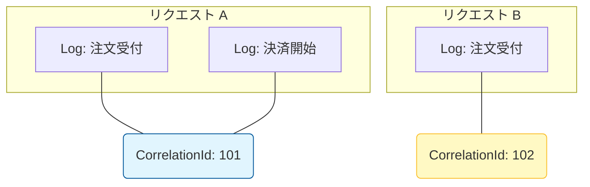

# 第20章：観測の最低ライン（ログ＋CorrelationId）🧾🔗

### CorrelationId でログを束ねるイメージ 🔗🧵


---
## この章のゴール 🎯✨

* Sagaが途中でコケても「どこで・なぜ・いま何が起きてるか」を**ログだけで追跡**できるようになる🕵️‍♀️🔍
* そのために、**CorrelationId（相関ID）**を中心に「最低限のログ設計」を作れるようになる🔗🧩
* ついでに、後の章（メトリクス＆トレース）につながる「TraceId」の位置づけも軽く理解する🧵📈

---

# 20-1. Sagaは“失敗が普通”だから、ログが命 🧯😵‍💫

Sagaは「複数ステップがまたがる」から、次のどれかがよく起きるよね👇

* ネットワークが不安定でリトライが入る🔁
* 外部APIが一瞬落ちる💥
* 片方だけ成功して“部分成功”になる🧩
* 失敗後に補償が走るけど、その補償も失敗することがある😇

このときに必要なのが **「追跡できるログ」** なんだ〜！🧾✨
ポイントは超シンプルで、最低ラインはこの2本柱👇

---

# 20-2. 最低ラインの2本柱（これだけは入れる！）🧱✨

## ✅ ① ログ（重要イベントが残る）

* 「Saga開始」「各ステップ成功/失敗」「補償開始/完了」「最終結果」など
* “後から見て復元できる”粒度で残す🧠📝

## ✅ ② CorrelationId（追跡の“ひも”）

* 1つのSaga（または1リクエスト）を **1本の糸**でつなぐID🧵
* **ログもメッセージも全部これで束ねる**🔗📦

> おまけで覚えると強い：TraceId
> .NETはW3C TraceContext（trace-id / span-id）を標準サポートしてて、HTTP越しに自動で流れる仕組みがあるよ（.NET 5+で既定がW3C）。([Microsoft Learn][1])

---

# 20-3. CorrelationIdの設計ルール（迷わない版）🔗🧠

## まずはコレだけでOK 🙆‍♀️

* **CorrelationId = “SagaインスタンスID”**（GUIDが無難）

  * 例：`c1d2...`（32桁）みたいなやつ

## できれば一緒に持ちたいID（強い順）🏋️‍♀️✨

* **SagaId**：SagaそのもののID（CorrelationIdと同一でもOK）
* **MessageId**：そのメッセージの一意ID（重複排除にも使う）
* **CausationId**：直前の原因メッセージID（因果チェーン追跡）
* **StepName**：いまのステップ名（`Pay`, `ReserveInventory` みたいな）
* **State**：状態機械の状態（`Running`, `Compensating` など）

> まとめると、「束ねるID（CorrelationId）」＋「追いかけるためのメタ情報」って感じ！🧷✨

---

# 20-4. “必ず残すログ”チェックリスト ✅🧾

ログに「何を書けばいいの？」問題、ここで固定しちゃおう💪😊

## ✅ 最低限のログ項目（まずはこれ）

* [ ] **Timestamp**（いつ）
* [ ] **LogLevel**（重要度：Info/Warn/Error…）([Microsoft Learn][2])
* [ ] **Service/Component**（どのサービス・どのクラス）
* [ ] **CorrelationId**（追跡の糸）
* [ ] **SagaId**（同一でもOK）
* [ ] **StepName**（どの工程）
* [ ] **Event名**（SagaStarted / StepFailed…）
* [ ] **理由**（失敗時は特に：例外型、エラーコード、外部応答など）

## ✅ “Sagaで重要イベント”おすすめテンプレ（これだけは残す）🧾✨

* SagaStarted（開始）
* StepStarted（各ステップ開始）
* StepSucceeded（各ステップ成功）
* StepFailed（各ステップ失敗）
* CompensationStarted（補償開始）
* CompensationSucceeded / CompensationFailed（補償の結果）
* SagaCompleted / SagaAborted（最終結果）

---

# 20-5. .NETのログ基礎（初心者がハマりがちな所だけ）🧠🧾

## ログは「カテゴリ」「レベル」「スコープ」📌

* `ILogger<T>` は **カテゴリ（だいたいクラス名）**を持ってログを出すよ([Microsoft Learn][2])
* ログレベルは Trace〜Critical まで段階があるよ（設定で出し分ける）([Microsoft Learn][2])
* **Log Scope** を使うと、CorrelationIdみたいな共通項目を“まとめて付与”できる！([Microsoft Learn][2])

## スコープ（BeginScope）がSagaと相性抜群 🔗✨

「毎回 `CorrelationId=...` を書く」より、スコープで包んだ方がミスが減るよ😊

---

# 20-6. 実装：ログをJSONにして、CorrelationIdをスコープで付ける 💻🧾✨

> ログを**JSON**にすると、あとで検索・集計がめっちゃ楽！
> .NETはコンソールログのJSONフォーマット（`AddJsonConsole`）を公式に用意してるよ([Microsoft Learn][3])

## ① Program.cs（JSONログ＋スコープ有効化）🧾

```csharp
using System.Text.Json;
using Microsoft.Extensions.Logging;

var builder = WebApplication.CreateBuilder(args);

// ログをJSONで出す（IncludeScopes=true が超大事！）
builder.Logging.ClearProviders();
builder.Logging.AddJsonConsole(options =>
{
    options.IncludeScopes = true; // スコープ出力ON
    options.TimestampFormat = "yyyy-MM-ddTHH:mm:ss.fffZ ";
    options.UseUtcTimestamp = true;
    options.JsonWriterOptions = new JsonWriterOptions { Indented = false };
});

builder.Services.AddSingleton<OrderSagaOrchestrator>();

var app = builder.Build();

app.UseMiddleware<CorrelationIdMiddleware>();

app.MapPost("/orders/{orderId:guid}/checkout", async (Guid orderId, HttpContext ctx, OrderSagaOrchestrator saga) =>
{
    var correlationId = (string?)ctx.Items[CorrelationIdMiddleware.ItemKey] ?? ctx.TraceIdentifier;
    await saga.RunAsync(orderId, correlationId, ctx.RequestAborted);
    return Results.Ok(new { orderId, correlationId });
});

app.Run();
```

* `AddJsonConsole` や `IncludeScopes` は公式のコンソールログフォーマッタ機能だよ([Microsoft Learn][3])
* 「JSONログに、すでにJSON文字列を渡すと二重シリアライズで壊れることがある」って注意も公式にあるよ（ログ本文に“JSON文字列”を突っ込まない）([Microsoft Learn][3])

---

## ② CorrelationIdMiddleware（HTTPリクエストにCorrelationIdを付ける）🔗

```csharp
using System.Diagnostics;

public sealed class CorrelationIdMiddleware
{
    public const string HeaderName = "X-Correlation-Id";
    public const string ItemKey = "CorrelationId";

    private readonly RequestDelegate _next;
    private readonly ILogger<CorrelationIdMiddleware> _logger;

    public CorrelationIdMiddleware(RequestDelegate next, ILogger<CorrelationIdMiddleware> logger)
    {
        _next = next;
        _logger = logger;
    }

    public async Task Invoke(HttpContext context)
    {
        var correlationId =
            context.Request.Headers.TryGetValue(HeaderName, out var v) && !string.IsNullOrWhiteSpace(v)
                ? v.ToString()
                : Guid.NewGuid().ToString("N");

        context.Items[ItemKey] = correlationId;
        context.Response.Headers[HeaderName] = correlationId;

        // おまけ：TraceId（分散トレースの糸）も取れたら入れると強い🧵
        var traceId = Activity.Current?.TraceId.ToString();

        using (_logger.BeginScope(new Dictionary<string, object?>
        {
            ["CorrelationId"] = correlationId,
            ["TraceId"] = traceId,
            ["Path"] = context.Request.Path.Value
        }))
        {
            await _next(context);
        }
    }
}
```

> `.NET` は W3C TraceContext の trace-id / span-id を標準で扱えて、HTTP越しのID伝播も “箱の中” が理解してくれる（HTTPなら特別なコードなしで自動で流れる）っていうのが強みだよ([Microsoft Learn][1])
> だから「最低ラインはCorrelationId」でも、TraceIdをログに載せておくと将来の拡張がラク💡😊

---

## ③ Sagaオーケストレーター（重要イベントだけを綺麗に出す）🧑‍✈️🧾

```csharp
using Microsoft.Extensions.Logging;

public static class SagaEventIds
{
    public static readonly EventId SagaStarted        = new(2000, nameof(SagaStarted));
    public static readonly EventId StepSucceeded      = new(2001, nameof(StepSucceeded));
    public static readonly EventId StepFailed         = new(2002, nameof(StepFailed));
    public static readonly EventId CompensationDone   = new(2003, nameof(CompensationDone));
    public static readonly EventId SagaCompleted      = new(2004, nameof(SagaCompleted));
}

public sealed class OrderSagaOrchestrator
{
    private readonly ILogger<OrderSagaOrchestrator> _logger;

    public OrderSagaOrchestrator(ILogger<OrderSagaOrchestrator> logger)
        => _logger = logger;

    public async Task RunAsync(Guid orderId, string correlationId, CancellationToken ct)
    {
        var sagaId = Guid.NewGuid().ToString("N");

        using var scope = _logger.BeginScope(new Dictionary<string, object?>
        {
            ["CorrelationId"] = correlationId,
            ["SagaId"] = sagaId,
            ["OrderId"] = orderId
        });

        _logger.LogInformation(SagaEventIds.SagaStarted, "Saga started");

        try
        {
            await StepAsync("Pay", ct);
            _logger.LogInformation(SagaEventIds.StepSucceeded, "Step succeeded: {Step}", "Pay");

            await StepAsync("ReserveInventory", ct);
            _logger.LogInformation(SagaEventIds.StepSucceeded, "Step succeeded: {Step}", "ReserveInventory");

            await StepAsync("CreateShipment", ct);
            _logger.LogInformation(SagaEventIds.SagaCompleted, "Saga completed");
        }
        catch (Exception ex)
        {
            _logger.LogError(SagaEventIds.StepFailed, ex, "Saga failed. Start compensation.");

            await CompensateAsync(ct);
            _logger.LogWarning(SagaEventIds.CompensationDone, "Compensation done");

            throw;
        }
    }

    private static async Task StepAsync(string step, CancellationToken ct)
    {
        await Task.Delay(200, ct);

        // デモ：わざと失敗させる
        if (step == "ReserveInventory")
            throw new TimeoutException("Inventory service timeout (demo)");
    }

    private static Task CompensateAsync(CancellationToken ct)
        => Task.Delay(200, ct);
}
```

* **EventId** を付けると、ログ基盤側でフィルタしやすくなるよ（公式ドキュメントにも例がある）([Microsoft Learn][2])
* **LogScope** を使うと、スコープ内のログに共通情報を載せられるよ([Microsoft Learn][2])

---

# 20-7. “ログで追跡”のやり方（運用の最短手順）🕵️‍♀️🔍

## 手順（これができれば最低ラインOK）✅

1. 失敗報告を受ける（例：「注文が失敗した」）📩
2. そのときの **CorrelationId** を入手する

   * APIのレスポンスに入れる（例：`X-Correlation-Id`）
   * 画面やエラーメッセージにも表示してOK（漏らしていい情報だけね）🫣
3. ログ検索：CorrelationIdで絞り込む🔎

   * PowerShellなら `Select-String` が楽✨
   * 例：`Select-String -Path .\logs\app.log -Pattern "CorrelationId\":\"xxxx"`
4. 同じCorrelationIdのログを時系列で読む🧾
5. 「どのステップで」「何が起きて」「補償はどうなったか」を復元する🧠✨

---

# 20-8. よくある事故と対策（Sagaログ編）💥😇

## ❌ 事故1：CorrelationIdが途中で変わる

* 原因：ステップごとに新しくGUID作っちゃう😭
* 対策：**入口で1回作って、以後ずっと引き回す**🔗

## ❌ 事故2：ログが多すぎて読めない

* 原因：全部 `Information` で垂れ流し🌊
* 対策：

  * “重要イベント”は Info/Warn/Error に寄せる
  * 細かいデバッグは Debug/Trace に落とす
  * ログレベルは設定で制御できるよ([Microsoft Learn][2])

## ❌ 事故3：ログに個人情報・機密を出しちゃう

* 対策：カード番号、住所、トークン、パスワードは絶対NG🙅‍♀️

  * 必要ならマスク（例：`****1234`）🔒

---

# 20-9. ミニ演習（この章のゴールに直結）📝✅

## 演習A：チェックリストを自分の案件に合わせて作る📋

次の欄を埋めてみよ〜😊

* 「重要イベントログ」：何を残す？（開始/成功/失敗/補償/完了…）
* 「必須項目」：CorrelationId / SagaId / StepName / ErrorCode…
* 「表示したい粒度」：1ステップ1行？ 失敗だけ詳細？ など

## 演習B：わざと失敗させて、ログで追跡する💥🔍

* `ReserveInventory` をわざと失敗させる（上のデモのままでOK）
* CorrelationIdで絞って、

  * どの順番でログが出た？
  * 補償ログは出た？
  * “原因”が読み取れる？
    を確認✅😊

---

# 20-10. AI活用（Copilot / Codex に投げると強い指示）🤖✨

## ✅ ログ設計レビューを頼む（超おすすめ）🧠

* 「Sagaの重要イベント一覧を作って。ログに残すべきイベント名を提案して」
* 「このログ項目で運用追跡できる？不足してるキーある？」
* 「CorrelationId / SagaId / MessageId / CausationId の使い分けを、初心者向けに説明して」

## ✅ 文言を整える（ログは“読みやすさ”が正義）📣

* 「ログメッセージを短く統一して。英語なら過去形で統一して」
* 「StepNameの命名を揃えて（Pay / ReserveInventory / CreateShipment…）」

## ✅ ありがちなミス検出🧯

* 「CorrelationIdが途中で変わる可能性がある箇所を指摘して」
* 「例外ログに機密情報が含まれる可能性を洗い出して」

---

# まとめ 🧾🔗✨

* Sagaの観測は、まず **ログ＋CorrelationId** が最低ライン🧱
* **LogScope（BeginScope）でCorrelationIdを自動付与**すると、追跡が一気にラクになる🔗😆
* JSONログにしておくと検索・集計が超強い（`AddJsonConsole` など公式サポートあり）([Microsoft Learn][3])
* .NETはW3C TraceContextのTraceIdも扱えるので、ログにTraceIdを添えると将来の拡張がスムーズ([Microsoft Learn][1])

[1]: https://learn.microsoft.com/en-us/dotnet/core/diagnostics/distributed-tracing-concepts "Distributed tracing concepts - .NET | Microsoft Learn"
[2]: https://learn.microsoft.com/en-us/aspnet/core/fundamentals/logging/?preserve-view=true&view=aspnetcore-10.0 "Logging in .NET and ASP.NET Core | Microsoft Learn"
[3]: https://learn.microsoft.com/en-us/dotnet/core/extensions/console-log-formatter "Console log formatting - .NET | Microsoft Learn"
