# 第21章：観測の発展（メトリクス＆トレースの感覚）📈🧵

## この章のゴール🎯✨

* 「遅い…」「失敗が増えた…」を **数字と流れ** で説明できるようになる😊
* **メトリクス（数字のダッシュボード）** と **トレース（処理の足あと）** を、Sagaにどう効かせるか分かるようになる🧠🔍
* C#で「最低限の観測」を入れて、**ボトルネックを見つける練習** ができるようになる💪✨

---

# 1. まず“観測”って何を見るの？👀🔎

## 観測の3点セット（超ざっくり）🍱✨

* **ログ（Logs）**：文章（いつ・何が・なぜ）🧾
* **メトリクス（Metrics）**：数字（回数・率・時間）📈
* **トレース（Traces）**：処理の道筋（A→B→Cの流れ）🧵

この章は特に👇を強化するよ！

* メトリクス：**“健康診断”**（失敗率・遅延・詰まり）📊
* トレース：**“犯人探し”**（どこが遅い？どこで落ちた？）🕵️‍♀️

---

# 2. メトリクス入門：数字で見る世界📈✨

## メトリクスの種類（よく使う3つ）🧩

* **Counter（カウンター）**：増えるだけ（例：Saga開始回数、補償回数）🔢
* **Gauge（ゲージ）**：上下する（例：キューの滞留数、処理中Saga数）🎚️
* **Histogram（ヒストグラム）**：時間分布（例：Saga完了までの秒数）⏱️

## 「指標」って何を置けばいいの？🤔➡️✅

Sagaで“効きやすい”指標はだいたいこのへん👇

### ✅ まず置きたい（最優先）🏁

* **成功率**：`成功 / 全体` 🎯
* **失敗率**：`失敗 / 全体` 💥
* **補償発生率**：`補償Saga / 全体` 🔁
* **レイテンシ**：Saga完了までの時間（p95/p99が大事）⏳
* **停滞（詰まり）**：一定時間以上進んでないSaga数🧊

### ✅ あると強い（次点）💪

* ステップ別の所要時間（決済だけ遅い、在庫だけ遅い…を発見）🧠
* リトライ回数（外部APIが不安定？）🔁
* Outbox滞留（送信が詰まってない？）📦

---

# 3. メトリクスの落とし穴：ラベル地獄😵‍💫🕳️

メトリクスには「ラベル（タグ）」を付けられるけど、**付けすぎると死ぬ**😇

* 悪い例：`SagaId=（UUID）` をラベルにする❌（種類が無限に増える…）
* 良い例：`SagaType=OrderCheckout`, `Step=Payment`, `Result=Success/Fail` ✅（種類が有限）

---

# 4. トレース入門：処理の“道筋”をつなぐ🧵✨

## トレースの基本用語（超ミニ）📚

* **Trace**：一連の処理（1つの注文の旅）🧳
* **Span**：処理の区間（決済、在庫確保…）📌
* **親子関係**：Aの中でB、Bの中でC…みたいに積まれる🏗️

## どうやって“つながる”の？🔗

HTTPやメッセージで別プロセスに渡るとき、
**Trace Context（traceparent / tracestate）** を運ぶことで “同じ旅” としてつながるよ📨✨
W3Cの仕様として定義されてるよ（`traceparent` と `tracestate`）📜([W3C][1])

---

# 5. .NETでのトレース＆メトリクス：何を使うの？🧑‍💻✨

## .NET側の基本パーツ🧩

* トレース：`Activity` / `ActivitySource`（.NETランタイムの仕組みを使う）🧵([Microsoft Learn][2])
* メトリクス：`Meter`（`System.Diagnostics.Metrics`）📈
* 収集・送信：**OpenTelemetry（OTel）**（トレース/メトリクス/ログをまとめて扱える）🌍([OpenTelemetry][3])

## 2026年の前提（最新）🆕

* 最新のLTSは **.NET 10**（2025/11/11リリース、2028/11までサポート）📅([Microsoft][4])
* C#は **C# 14** が .NET 10 でサポートされるよ🧡([Microsoft Learn][5])

---

# 6. ハンズオン：最小のOpenTelemetryを入れて“見える化”する🧪👀✨

ここでは「まず動く」を大事にして、
**トレース＋メトリクス** を“1画面で確認”できるところまでやるよ😊

---

## 6.1 観測を表示する場所：Aspire Dashboard（超便利）📊🧵🧾

Aspire Dashboardは **OTLPで飛んできたログ/メトリクス/トレースを可視化** できるダッシュボード✨
しかも **Aspireを使ってなくても**、OTLP送れるアプリなら見れるよ👍([Microsoft Learn][6])

スタンドアロンのコンテナとしても動かせて、
UI（18888）とOTLP受信（4317）を使うのが基本だよ🧠([Aspire][7])

---

## 6.2 C#（ASP.NET Core）で “トレース＆メトリクス” をONにする🔛✨

### ① NuGet（目安）

* `OpenTelemetry.Extensions.Hosting`（追加の起点）([nuget.org][8])
* `OpenTelemetry.Instrumentation.AspNetCore`（HTTP受信の自動Span）
* `OpenTelemetry.Instrumentation.Http`（HTTP送信の自動Span）
* `OpenTelemetry.Exporter.OpenTelemetryProtocol`（OTLPで送る）

（何を入れるかは “どこを自動計測したいか” で増減するよ😊）

### ② Program.cs（最小例）

```csharp
using OpenTelemetry.Metrics;
using OpenTelemetry.Resources;
using OpenTelemetry.Trace;

var builder = WebApplication.CreateBuilder(args);

builder.Services.AddOpenTelemetry()
    .ConfigureResource(r => r.AddService(serviceName: "SagaSample"))
    .WithTracing(t => t
        .AddAspNetCoreInstrumentation()
        .AddHttpClientInstrumentation()
        .AddOtlpExporter())
    .WithMetrics(m => m
        .AddAspNetCoreInstrumentation()
        .AddHttpClientInstrumentation()
        .AddOtlpExporter());

var app = builder.Build();

app.MapGet("/hello", () => "hello");
app.Run();
```

`AddOpenTelemetry()` で tracing/metrics のパイプラインをまとめて作れるよ🧩([GitHub][9])

---

# 7. Sagaに効く“観測”の入れ方（実戦の感覚）🧠🛡️

ここがこの章の本番🎯✨
「Sagaのどこを観測すれば、改善に直結するの？」って話だよ😊

---

## 7.1 メトリクス：Saga向けトップ指標セット🏆📈

### 🎖️おすすめトップ5（迷ったらこれ）

1. `saga_started_total`（開始数）🚀
2. `saga_completed_total`（完了数）🎉
3. `saga_failed_total`（失敗数）💥
4. `saga_compensated_total`（補償した数）🔁
5. `saga_duration_ms`（完了までの時間：Histogram）⏱️

👉 これだけで

* 失敗率が上がった？
* 補償が増えた？
* p95が伸びた？（遅い人が増えた？）
  が見えるようになるよ😊✨

---

## 7.2 トレース：Spanの切り方（Sagaっぽく）🧵📌

### 分散トレースのタイムライン（ガントチャート）🧵📌

```mermaid
gantt
    title Saga トレースのイメージ
    dateFormat X
    axisFormat %s
    
    section Orchestrator
    Saga.Run          :active, a1, 0, 10
    section Payment
    Step.Payment      :active, a2, 1, 3
    section Inventory
    Step.Inventory    :active, a3, 4, 7
    section Shipping
    Step.Shipping     :active, a4, 8, 10
```


**Spanは「原因を絞り込める粒度」で切る**のがコツ👍
Sagaなら例えば👇

* `Saga.Run`（1Sagaの親Span）

  * `Saga.Step.Payment`
  * `Saga.Step.Inventory`
  * `Saga.Step.Shipping`
  * `Saga.Compensation.PaymentRefund`（補償もSpanに！）

Spanにはタグ（属性）を付けておくと探しやすいよ🔍✨

* `saga.type`（例：OrderCheckout）
* `saga.step`（例：Payment）
* `result`（Success/Fail）
* `attempt`（リトライ回数）

---

# 8. C#でSaga用の “手動Span” と “カスタム指標” を作る🧑‍💻✨

## 8.1 手動Span（ActivitySource）でステップを囲う🧵

```csharp
using System.Diagnostics;

public static class SagaTelemetry
{
    public static readonly ActivitySource ActivitySource = new("SagaSample.Saga");
}

public class SagaOrchestrator
{
    public async Task RunAsync(string sagaType, string sagaId)
    {
        using var sagaActivity = SagaTelemetry.ActivitySource.StartActivity("Saga.Run", ActivityKind.Internal);
        sagaActivity?.SetTag("saga.type", sagaType);
        sagaActivity?.SetTag("saga.id", sagaId); // 追跡しやすいけど、PIIや取り扱いには注意ね⚠️

        await StepAsync("Payment");
        await StepAsync("Inventory");
    }

    private async Task StepAsync(string stepName)
    {
        using var stepActivity = SagaTelemetry.ActivitySource.StartActivity($"Saga.Step.{stepName}", ActivityKind.Internal);
        stepActivity?.SetTag("saga.step", stepName);

        try
        {
            await Task.Delay(50); // ここに本処理
            stepActivity?.SetTag("result", "Success");
        }
        catch (Exception ex)
        {
            stepActivity?.SetTag("result", "Fail");
            stepActivity?.RecordException(ex);
            stepActivity?.SetStatus(ActivityStatusCode.Error);
            throw;
        }
    }
}
```

`.NET` は `Activity` / `ActivitySource` をベースに分散トレースを作るよ🧵([Microsoft Learn][2])

---

## 8.2 カスタムメトリクス（Meter）で数字を積む📈

```csharp
using System.Diagnostics.Metrics;

public static class SagaMetrics
{
    public static readonly Meter Meter = new("SagaSample.Saga", "1.0.0");

    public static readonly Counter<long> SagaStarted =
        Meter.CreateCounter<long>("saga_started_total");

    public static readonly Counter<long> SagaCompensated =
        Meter.CreateCounter<long>("saga_compensated_total");

    public static readonly Histogram<double> SagaDurationMs =
        Meter.CreateHistogram<double>("saga_duration_ms");
}
```

```csharp
using var _ = SagaTelemetry.ActivitySource.StartActivity("Saga.Run");

SagaMetrics.SagaStarted.Add(1,
    new KeyValuePair<string, object?>("saga_type", "OrderCheckout"));

var sw = System.Diagnostics.Stopwatch.StartNew();
try
{
    // Saga処理...
}
catch
{
    SagaMetrics.SagaCompensated.Add(1,
        new KeyValuePair<string, object?>("saga_type", "OrderCheckout"));
    throw;
}
finally
{
    sw.Stop();
    SagaMetrics.SagaDurationMs.Record(sw.Elapsed.TotalMilliseconds,
        new KeyValuePair<string, object?>("saga_type", "OrderCheckout"));
}
```

---

# 9. 非同期（メッセージ）で“トレースをつなぐ”感覚🔗📨✨

HTTPは自動でつながりやすいけど、**メッセージングは自前で運ぶ場面が多い**よ🧠
そこで大事なのが **Context Propagation**（コンテキスト伝搬）✨([OpenTelemetry][10])

* 送る側：今のトレース情報をメッセージヘッダへ入れる
* 受ける側：ヘッダから取り出して “親Span” を復元して続きとしてSpanを作る

W3C Trace Context（`traceparent` / `tracestate`）を使うと、ベンダーが違ってもつながるのが強みだよ🌍([W3C][1])

---

# 10. ミニ演習：見たい指標トップ5を決める🏆📝✨

## お題🎮

「注文→決済→在庫→配送」のSagaを運用してます。最近“たまに遅い”です😵‍💫

### ① まず見るトップ5を決めよう（候補から選ぶでもOK）✅

* 成功率 / 失敗率
* 補償率
* Saga完了時間（p95/p99）
* 決済ステップ時間（p95）
* リトライ回数
* タイムアウト回数
* キュー滞留数
* Outbox滞留時間

### ② 指標 → 原因仮説 → 打ち手 を1セット作ろう🧠🔧

例：

* 指標：決済ステップのp95が悪化⏱️
* 仮説：決済APIが遅い or リトライ増えてる🔁
* 打ち手：タイムアウト/リトライ調整、決済APIの依存監視、フォールバック検討🛡️

---

# 11. AI活用：指標づくり＆原因仮説づくりを爆速にする🤖⚡✨

## 11.1 指標の命名＆ラベル設計を整える📝

Copilot / Codex にこう聞くと便利だよ😊

* 「Sagaのメトリクス名を “Prometheus/OpenTelemetryっぽい命名” で提案して。Counter/Histogramも分けて」
* 「ラベルに入れて良いもの／ダメなものをレビューして（高カーディナリティ注意）」

## 11.2 トレースのSpan設計をレビューしてもらう🧵

* 「このSagaのSpanツリー案、原因追跡しやすい？粒度が粗すぎ/細かすぎを指摘して」
* 「補償をSpanとしてどう表現すると分かりやすい？」

## 11.3 “指標→原因仮説→打ち手” を量産する📈➡️🧠➡️🔧

* 「この指標が悪化したときの原因候補を5つ、確認手順も添えて」
* 「p95が悪いときに見るべきトレースの特徴（どのSpanが伸びる？）を例で」

---

# 12. まとめ：この章で手に入る武器🛡️✨

* **メトリクス**：異常を早く見つける（率・回数・時間）📈
* **トレース**：どこで遅い/落ちたかを特定する（Spanの道筋）🧵
* **Saga観測のコツ**：

  * “成功/失敗/補償/時間/詰まり” をまず押さえる✅
  * メトリクスは **ラベル増やしすぎ注意**😵‍💫
  * トレースは **Saga.Run → Step → 補償** の形が分かりやすい🔁

---

## 参考（この章の根っこ📚）

* .NET 10（LTS）とサポート情報([Microsoft][4])
* C# 14 と .NET 10 の対応([Microsoft Learn][5])
* W3C Trace Context（traceparent/tracestate）([W3C][1])
* OpenTelemetry .NET（AddOpenTelemetry / exporters）([GitHub][9])
* Aspire Dashboard（OTLPでログ/メトリクス/トレース可視化）([Microsoft Learn][6])

[1]: https://www.w3.org/TR/trace-context/?utm_source=chatgpt.com "Trace Context"
[2]: https://learn.microsoft.com/ja-jp/azure/azure-monitor/app/application-insights-faq?utm_source=chatgpt.com "Application Insights に関する FAQ - よく寄せられる質問"
[3]: https://opentelemetry.io/docs/languages/dotnet/traces/getting-started-aspnetcore/?utm_source=chatgpt.com "Getting started with traces - ASP.NET Core"
[4]: https://dotnet.microsoft.com/ja-jp/platform/support/policy/dotnet-core?utm_source=chatgpt.com ".NET および .NET Core の公式サポート ポリシー"
[5]: https://learn.microsoft.com/en-us/dotnet/csharp/language-reference/language-versioning?utm_source=chatgpt.com "Language versioning - C# reference"
[6]: https://learn.microsoft.com/en-us/dotnet/core/diagnostics/observability-otlp-example?utm_source=chatgpt.com "Use OpenTelemetry with OTLP and the standalone Aspire ..."
[7]: https://aspire.dev/dashboard/standalone/?utm_source=chatgpt.com "Standalone Aspire dashboard"
[8]: https://www.nuget.org/packages/opentelemetry.extensions.hosting/?utm_source=chatgpt.com "OpenTelemetry.Extensions.Hosting 1.14.0"
[9]: https://github.com/open-telemetry/opentelemetry-dotnet/blob/main/docs/README.md?utm_source=chatgpt.com "opentelemetry-dotnet/docs/README.md at main"
[10]: https://opentelemetry.io/docs/concepts/context-propagation/?utm_source=chatgpt.com "Context propagation"
