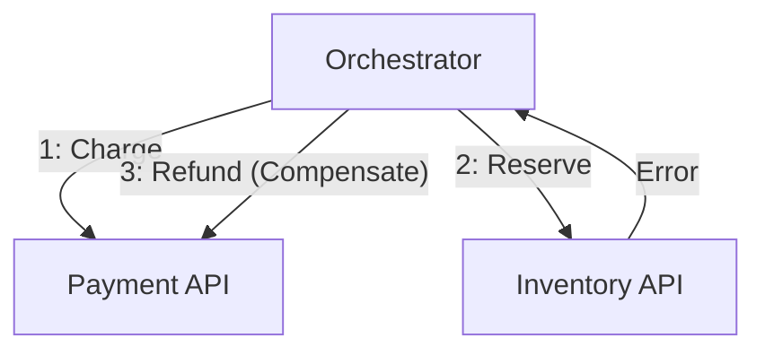

# 第22章：ハンズオン① ミニSagaを作る（OrchestrationでGO）🧑‍✈️🎮

## この章で作るもの（完成イメージ）🎯

「注文を確定する」ために、オーケストレーター（司令塔）が順番に呼び出していくミニSagaを作ります🧩

* ✅ 注文作成（オーケストレーター内部で保存）
* ✅ 決済（Payment API）
* ✅ 在庫引当（Inventory API）
* ✅ どこかで失敗したら、**逆順で補償**（返金・在庫戻し）🔁

Minimal APIは「依存を最小にしたHTTP API」を作るための設計で、こういうミニマイクロサービス実験にすごく相性いいです🚀 ([Microsoft Learn][1])

---

# 1) まずは全体像（紙に描くと超ラク）📝💡

### オーケストレーションと補償のループ 🧑‍✈️🔁


---
## 成功フロー😊

1. Orchestrator：注文を「作成」（状態：Pending）
2. Orchestrator → Payment：チャージ（成功したら状態：PaymentDone）
3. Orchestrator → Inventory：引当（成功したら状態：InventoryDone）
4. Orchestrator：注文を「確定」（状態：Completed）🎉

## 失敗フロー😵（例：在庫引当が失敗）

1. 注文作成 ✅
2. 決済 ✅
3. 在庫引当 ❌
4. **補償**：返金 ✅（＋在庫引当してたら戻す）🔁

---

# 2) プロジェクト構成（3つのミニAPI）🏗️✨

* `Orchestrator.Api`（司令塔🧑‍✈️）
* `Payment.Api`（決済💳）
* `Inventory.Api`（在庫📦）

「dotnet new webapi」は、いまは**何も指定しないとMinimal APIのプロジェクト**が作られる挙動になっていて、必要なら `--use-minimal-apis` でも指定できます🧠 ([Microsoft Learn][2])

---

# 3) 作成手順（CLIで一気に作る）⚡🛠️

PowerShellでOKです✨（以下そのまま貼って動くやつ）

```bash
mkdir MiniSagaHandsOn
cd MiniSagaHandsOn

dotnet new sln -n MiniSagaHandsOn

dotnet new webapi -n Payment.Api --no-https
dotnet new webapi -n Inventory.Api --no-https
dotnet new webapi -n Orchestrator.Api --no-https

dotnet sln add Payment.Api/Payment.Api.csproj
dotnet sln add Inventory.Api/Inventory.Api.csproj
dotnet sln add Orchestrator.Api/Orchestrator.Api.csproj
```

※ `webapi` テンプレートには `--no-https` や `--no-openapi` などのオプションが用意されています🧩 ([Microsoft Learn][2])
※ 2026の最新版として、.NET 10（LTS）と C# 14 が基準になっています✨ ([Microsoft][3])

---

# 4) Payment.Api（決済サービス）💳✨

`Payment.Api/Program.cs` をまるごと置き換え👇

```csharp
using System.Collections.Concurrent;

var builder = WebApplication.CreateBuilder(args);
builder.Services.AddOpenApi();

var app = builder.Build();
app.MapOpenApi();

var payments = new ConcurrentDictionary<Guid, PaymentRecord>();

app.MapPost("/payments/charge", (ChargeRequest req) =>
{
    // 失敗スイッチ（ハンズオン用）😈
    if (req.Fail)
        return Results.Problem("決済に失敗しました（わざと）💥", statusCode: 500);

    // 超ミニ冪等（SagaIdで二重課金を防ぐ）🛡️
    if (payments.TryGetValue(req.SagaId, out var existing))
    {
        if (existing.Status == PaymentStatus.Charged)
            return Results.Ok(new ChargeResponse(existing.SagaId, existing.ReceiptId!, existing.Amount, "already charged (idempotent) 🔁"));

        if (existing.Status == PaymentStatus.Refunded)
            return Results.Problem("このSagaはすでに返金済みです🙅‍♀️", statusCode: 409);
    }

    var receiptId = $"rcpt_{Guid.NewGuid():N}";
    var record = new PaymentRecord(req.SagaId, req.OrderId, req.Amount, PaymentStatus.Charged, receiptId, DateTimeOffset.UtcNow);
    payments[req.SagaId] = record;

    return Results.Ok(new ChargeResponse(req.SagaId, receiptId, req.Amount, "charged ✅"));
});

app.MapPost("/payments/refund", (RefundRequest req) =>
{
    if (!payments.TryGetValue(req.SagaId, out var existing))
        return Results.Ok(new RefundResponse(req.SagaId, "nothing to refund (idempotent) 🔁"));

    if (existing.Status == PaymentStatus.Refunded)
        return Results.Ok(new RefundResponse(req.SagaId, "already refunded (idempotent) 🔁"));

    payments[req.SagaId] = existing with { Status = PaymentStatus.Refunded, UpdatedAt = DateTimeOffset.UtcNow };
    return Results.Ok(new RefundResponse(req.SagaId, $"refunded ✅ reason={req.Reason}"));
});

app.MapGet("/payments/{sagaId:guid}", (Guid sagaId) =>
{
    return payments.TryGetValue(sagaId, out var record)
        ? Results.Ok(record)
        : Results.NotFound();
});

app.Run();

enum PaymentStatus { Charged, Refunded }

record ChargeRequest(Guid SagaId, string OrderId, decimal Amount, bool Fail = false);
record ChargeResponse(Guid SagaId, string ReceiptId, decimal Amount, string Note);

record RefundRequest(Guid SagaId, string Reason);
record RefundResponse(Guid SagaId, string Note);

record PaymentRecord(Guid SagaId, string OrderId, decimal Amount, PaymentStatus Status, string? ReceiptId, DateTimeOffset UpdatedAt);
```

---

# 5) Inventory.Api（在庫サービス）📦✨

`Inventory.Api/Program.cs` をまるごと置き換え👇

```csharp
using System.Collections.Concurrent;

var builder = WebApplication.CreateBuilder(args);
builder.Services.AddOpenApi();

var app = builder.Build();
app.MapOpenApi();

var reservations = new ConcurrentDictionary<Guid, ReservationRecord>();

app.MapPost("/inventory/reserve", (ReserveRequest req) =>
{
    // 失敗スイッチ（ハンズオン用）😈
    if (req.Fail)
        return Results.Problem("在庫引当に失敗しました（わざと）💥", statusCode: 500);

    // 超ミニ冪等（SagaIdで二重引当を防ぐ）🛡️
    if (reservations.TryGetValue(req.SagaId, out var existing))
    {
        if (existing.Status == ReservationStatus.Reserved)
            return Results.Ok(new ReserveResponse(req.SagaId, existing.ReservationId!, "already reserved (idempotent) 🔁"));

        if (existing.Status == ReservationStatus.Released)
            return Results.Problem("このSagaの引当はすでに解放済みです🙅‍♀️", statusCode: 409);
    }

    var reservationId = $"rsv_{Guid.NewGuid():N}";
    var record = new ReservationRecord(req.SagaId, req.ProductId, req.Qty, ReservationStatus.Reserved, reservationId, DateTimeOffset.UtcNow);
    reservations[req.SagaId] = record;

    return Results.Ok(new ReserveResponse(req.SagaId, reservationId, "reserved ✅"));
});

app.MapPost("/inventory/release", (ReleaseRequest req) =>
{
    if (!reservations.TryGetValue(req.SagaId, out var existing))
        return Results.Ok(new ReleaseResponse(req.SagaId, "nothing to release (idempotent) 🔁"));

    if (existing.Status == ReservationStatus.Released)
        return Results.Ok(new ReleaseResponse(req.SagaId, "already released (idempotent) 🔁"));

    reservations[req.SagaId] = existing with { Status = ReservationStatus.Released, UpdatedAt = DateTimeOffset.UtcNow };
    return Results.Ok(new ReleaseResponse(req.SagaId, "released ✅"));
});

app.MapGet("/inventory/{sagaId:guid}", (Guid sagaId) =>
{
    return reservations.TryGetValue(sagaId, out var record)
        ? Results.Ok(record)
        : Results.NotFound();
});

app.Run();

enum ReservationStatus { Reserved, Released }

record ReserveRequest(Guid SagaId, string ProductId, int Qty, bool Fail = false);
record ReserveResponse(Guid SagaId, string ReservationId, string Note);

record ReleaseRequest(Guid SagaId);
record ReleaseResponse(Guid SagaId, string Note);

record ReservationRecord(Guid SagaId, string ProductId, int Qty, ReservationStatus Status, string? ReservationId, DateTimeOffset UpdatedAt);
```

---

# 6) Orchestrator.Api（司令塔＝Saga Orchestrator）🧑‍✈️🔥

`Orchestrator.Api/Program.cs` をまるごと置き換え👇

```csharp
using System.Collections.Concurrent;
using System.Net.Http.Json;

var builder = WebApplication.CreateBuilder(args);
builder.Services.AddOpenApi();

builder.Services.AddHttpClient("payment", c => c.BaseAddress = new Uri("http://localhost:7002"));
builder.Services.AddHttpClient("inventory", c => c.BaseAddress = new Uri("http://localhost:7003"));

var app = builder.Build();
app.MapOpenApi();

var sagas = new ConcurrentDictionary<Guid, SagaInstance>();
var orders = new ConcurrentDictionary<string, OrderRecord>();

app.MapPost("/orders/place", async (PlaceOrderRequest req, IHttpClientFactory httpClientFactory, ILoggerFactory loggerFactory) =>
{
    var logger = loggerFactory.CreateLogger("Orchestrator");
    var sagaId = Guid.NewGuid();
    var orderId = $"ord_{Guid.NewGuid():N}";

    using var _ = logger.BeginScope(new Dictionary<string, object> { ["SagaId"] = sagaId, ["OrderId"] = orderId });

    var saga = new SagaInstance(sagaId, orderId);
    sagas[sagaId] = saga;
    orders[orderId] = new OrderRecord(orderId, OrderStatus.Pending, req.ProductId, req.Qty, req.Amount);

    logger.LogInformation("Saga started 🟡");

    var executed = new List<SagaStep>();

    try
    {
        // 1) Charge（決済）💳
        var paymentClient = httpClientFactory.CreateClient("payment");
        var chargeRes = await paymentClient.PostAsJsonAsync("/payments/charge",
            new ChargeRequest(sagaId, orderId, req.Amount, req.FailPayment));
        chargeRes.EnsureSuccessStatusCode();
        executed.Add(SagaStep.PaymentCharged);

        // 2) Reserve（在庫）📦
        var inventoryClient = httpClientFactory.CreateClient("inventory");
        var reserveRes = await inventoryClient.PostAsJsonAsync("/inventory/reserve",
            new ReserveRequest(sagaId, req.ProductId, req.Qty, req.FailInventory));
        reserveRes.EnsureSuccessStatusCode();
        executed.Add(SagaStep.InventoryReserved);

        // 3) 完了🎉
        sagas[sagaId] = saga with { Status = SagaStatus.Completed, UpdatedAt = DateTimeOffset.UtcNow };
        orders[orderId] = orders[orderId] with { Status = OrderStatus.Completed };

        logger.LogInformation("Saga completed 🟢");
        return Results.Ok(new PlaceOrderResponse(orderId, sagaId, "COMPLETED ✅"));
    }
    catch (Exception ex)
    {
        logger.LogWarning(ex, "Saga failed 🔴 start compensation...");

        sagas[sagaId] = saga with { Status = SagaStatus.Compensating, UpdatedAt = DateTimeOffset.UtcNow };

        // 補償は「逆順」🔁
        await CompensateAsync(sagaId, req.ProductId, executed, httpClientFactory, logger);

        sagas[sagaId] = sagas[sagaId] with { Status = SagaStatus.Compensated, UpdatedAt = DateTimeOffset.UtcNow };
        orders[orderId] = orders[orderId] with { Status = OrderStatus.Cancelled };

        return Results.Ok(new PlaceOrderResponse(orderId, sagaId, "COMPENSATED 🔁✅"));
    }
});

app.MapGet("/sagas/{sagaId:guid}", (Guid sagaId) =>
{
    return sagas.TryGetValue(sagaId, out var saga)
        ? Results.Ok(saga)
        : Results.NotFound();
});

app.MapGet("/orders/{orderId}", (string orderId) =>
{
    return orders.TryGetValue(orderId, out var order)
        ? Results.Ok(order)
        : Results.NotFound();
});

app.Run();

static async Task CompensateAsync(
    Guid sagaId,
    string productId,
    List<SagaStep> executed,
    IHttpClientFactory httpClientFactory,
    ILogger logger)
{
    // Inventory release（もし引当まで行ってたら）📦↩️
    if (executed.Contains(SagaStep.InventoryReserved))
    {
        try
        {
            var inventoryClient = httpClientFactory.CreateClient("inventory");
            var releaseRes = await inventoryClient.PostAsJsonAsync("/inventory/release", new ReleaseRequest(sagaId));
            releaseRes.EnsureSuccessStatusCode();
            logger.LogInformation("Compensated: inventory released ✅");
        }
        catch (Exception ex)
        {
            logger.LogError(ex, "Compensation failed: inventory release ❌");
        }
    }

    // Payment refund（もし課金まで行ってたら）💳↩️
    if (executed.Contains(SagaStep.PaymentCharged))
    {
        try
        {
            var paymentClient = httpClientFactory.CreateClient("payment");
            var refundRes = await paymentClient.PostAsJsonAsync("/payments/refund", new RefundRequest(sagaId, "saga compensation"));
            refundRes.EnsureSuccessStatusCode();
            logger.LogInformation("Compensated: payment refunded ✅");
        }
        catch (Exception ex)
        {
            logger.LogError(ex, "Compensation failed: refund ❌");
        }
    }
}

record PlaceOrderRequest(string ProductId, int Qty, decimal Amount, bool FailPayment = false, bool FailInventory = false);
record PlaceOrderResponse(string OrderId, Guid SagaId, string Result);

record ChargeRequest(Guid SagaId, string OrderId, decimal Amount, bool Fail = false);
record ReserveRequest(Guid SagaId, string ProductId, int Qty, bool Fail = false);

record RefundRequest(Guid SagaId, string Reason);
record ReleaseRequest(Guid SagaId);

enum SagaStatus { Started, Completed, Compensating, Compensated }
enum OrderStatus { Pending, Completed, Cancelled }
enum SagaStep { PaymentCharged, InventoryReserved }

record SagaInstance(Guid SagaId, string OrderId)
{
    public SagaStatus Status { get; init; } = SagaStatus.Started;
    public DateTimeOffset UpdatedAt { get; init; } = DateTimeOffset.UtcNow;
}

record OrderRecord(string OrderId, OrderStatus Status, string ProductId, int Qty, decimal Amount);
```

---

# 7) 3つ同時に起動する（ポート固定）🚦✨

今回はわかりやすく **7001/7002/7003** にします🎯
（Orchestrator=7001 / Payment=7002 / Inventory=7003）

## CLIで起動（ターミナル3つ）🪟🪟🪟

それぞれ別ターミナルで👇

**Payment**

```bash
dotnet run --project Payment.Api --urls http://localhost:7002
```

**Inventory**

```bash
dotnet run --project Inventory.Api --urls http://localhost:7003
```

**Orchestrator**

```bash
dotnet run --project Orchestrator.Api --urls http://localhost:7001
```

起動できたら、各APIのOpenAPIが開けます📄✨

* `http://localhost:7001/openapi/v1.json`
* `http://localhost:7002/openapi/v1.json`
* `http://localhost:7003/openapi/v1.json`

---

# 8) 動作確認（成功 → 失敗 → 補償）🔁✅💥

PowerShellなら `curl.exe` を使うと安全です（`curl` が別物なことがあるので）🙆‍♀️

## 8-1) 成功パターン🎉

```bash
curl.exe -X POST http://localhost:7001/orders/place ^
  -H "Content-Type: application/json" ^
  -d "{\"productId\":\"apple\",\"qty\":2,\"amount\":1200,\"failPayment\":false,\"failInventory\":false}"
```

返り値の `SagaId` を控えて👇

```bash
curl.exe http://localhost:7001/sagas/{SagaId}
```

`COMPLETED ✅` になってたらOK🟢✨

---

## 8-2) 在庫で失敗 → 補償が走る（返金）💥🔁

```bash
curl.exe -X POST http://localhost:7001/orders/place ^
  -H "Content-Type: application/json" ^
  -d "{\"productId\":\"apple\",\"qty\":2,\"amount\":1200,\"failPayment\":false,\"failInventory\":true}"
```

Orchestratorは「決済までは成功」→「在庫で失敗」→「返金補償」になります💳↩️✨
Sagaを見ると `COMPENSATED 🔁✅` になってるはず！

---

## 8-3) 決済で失敗 → 補償ほぼ無し（在庫に触ってない）💥

```bash
curl.exe -X POST http://localhost:7001/orders/place ^
  -H "Content-Type: application/json" ^
  -d "{\"productId\":\"apple\",\"qty\":2,\"amount\":1200,\"failPayment\":true,\"failInventory\":false}"
```

決済が最初に落ちるので、補償はほぼ走りません（走る対象が無い）🙆‍♀️

---

# 9) この章のミニ演習（3つ）🧪✨

## 演習A：ステップを1つ増やす（配送📮）

* `Shipping.Api` を作って「配送手配」を追加📦➡️🚚
* 失敗時の補償は「配送キャンセル」

👉 コツ：**補償は“逆操作”じゃなくてもOK**（キャンセル・無効化・返金など）🧾✨

---

## 演習B：Sagaの実行ログを増やす🧾🔍

* Orchestratorで「どのステップまで成功したか」を `SagaInstance` に保存して、`GET /sagas/{id}` で見えるようにする✨

---

## 演習C：補償の失敗を“見える化”する😵‍💫➡️👀

* いまは補償が失敗してもログだけで終わってます
* `CompensationFailures` の配列をSagaに持たせて、APIで返すようにしてみよう📌

---

# 10) AI（Copilot / Codex）に頼むと爆速になるプロンプト集🤖💨✨

## DTOを一気に整える🧩

「C#のMinimal API用に、Order/Payment/Inventoryのリクエスト/レスポンスDTOを `record` で整理して。命名は英語、わかりやすさ優先。ついでにJSON例も出して」

## 補償順序のレビュー🔁

「このSagaの補償は逆順で正しい？漏れてる補償や、二重補償の危険がある箇所を指摘して」

## 例外の握りつぶし改善🧯

「補償の try/catch を改善したい。失敗の種類（通信/500/タイムアウト）ごとにログを分けて、最低限の情報（SagaId/Step/Reason）を残す形にして」

---

# 11) よくあるつまずき（ここだけ見れば復帰できる）🧯💡

* 😵 **ポートが合ってない**
  Orchestrator の BaseAddress（7002/7003）を再確認！
* 😵 **サービス起動順**
  Payment/Inventory を起動してから Orchestrator を起動するとスムーズ🙆‍♀️
* 😵 **HTTP 500が返る**
  今回は「Failスイッチ」でわざと 500 を返してます（正常な教材挙動）😈

---

# 12) 章まとめ（この章で身についたこと）🎀✨

* Saga（Orchestration）は「司令塔が順番に呼ぶ」🧑‍✈️
* 失敗したら「逆順に補償」🔁
* ローカルでも、**成功→失敗→補償**を再現できる🎮
* Minimal APIでミニサービスを作ると、Sagaの感覚が一気に掴める🚀 ([Microsoft Learn][1])

[1]: https://learn.microsoft.com/en-us/aspnet/core/tutorials/min-web-api?view=aspnetcore-10.0 "Tutorial: Create a Minimal API with ASP.NET Core | Microsoft Learn"
[2]: https://learn.microsoft.com/ja-jp/dotnet/core/tools/dotnet-new-sdk-templates "'dotnet new' の .NET の既定のテンプレート - .NET CLI | Microsoft Learn"
[3]: https://dotnet.microsoft.com/ja-jp/platform/support/policy/dotnet-core?utm_source=chatgpt.com ".NET および .NET Core の公式サポート ポリシー"
