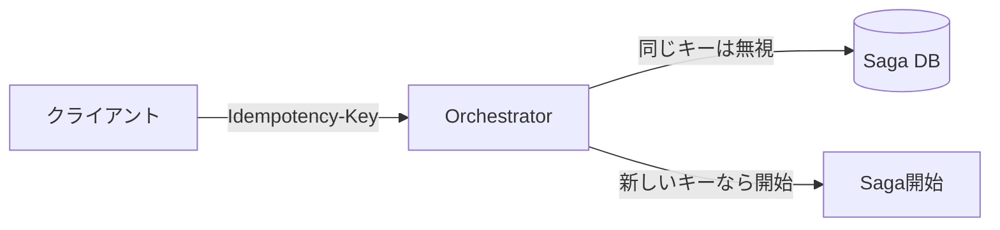

# 第23章：ハンズオン② 実戦化（重複・リトライ・Outbox・テストで仕上げ）🛡️🧪

## 23.0 この章で「実戦レベル」にするポイント🎯✨

# この章のゴールは、**第22章のミニSaga**を「現実に起きるズレ」に耐える形にアップグレードすることです😊

最低ラインとして、これを入れます👇

* **同じ要求が2回来ても大丈夫（冪等）** 🔁🧷
* **通信が一瞬コケても自動でリトライ** 🔄⏳
* **DB更新と“送信”のズレをOutboxで吸収** 📦🧾
* **二重補償・二重遷移を防ぐ（状態機械＋排他）** 🚦🧠
* **統合テストで“壊れない”を確認** 🧪✅

---

## 23.1 2026年時点の“最新スタック”ざっくり確認🆕💻

この章のサンプルは **.NET 10（LTS）** を前提に作ると、教材としても将来安心です😊
.NET 10 は **2025-11-11 にリリース**され、**2026-01-13 時点の最新パッチが 10.0.2**になっています。([Microsoft][1])

言語は **C# 14** が最新で、.NET 10 上でサポートされています。([Microsoft Learn][2])
DBアクセスは **EF Core 10（LTS / .NET 10必須）** が基準になります。([Microsoft Learn][3])

開発環境は Visual Studio 系でOKで、Visual Studio 2022 の現行版も **2026-01-13 時点で 17.14.24** まで更新されています。([Microsoft Learn][4])

---

## 23.2 今日作る“3サービス構成”の完成イメージ🧩🧑‍✈️

第22章のミニSaga（Orchestration）を、こんな感じに育てます👇

* **Orchestrator（司令塔）**：Saga状態を持つ・遷移する・Outboxを書く🧑‍✈️
* **Payment**：決済（擬似）を実行・Inboxで重複排除・Outboxで結果イベント送信💳
* **Inventory**：在庫確保（擬似）を実行・Inboxで重複排除・Outboxで結果イベント送信📦

イベント/コマンドは **HTTPで疑似メッセージング**してOKです（学習しやすい！）😊
※将来 RabbitMQ / Azure Service Bus に置き換えても、設計はそのまま使えます🚀

---

## 23.3 重複リクエスト対策：Idempotency-Key を“入口”に立てる🔑🔁

### 冪等キーのガードレール 🔑🛡️


---
### 23.3.1 ルール（ここ大事）📌✨

**「同じ要求が2回来る」**は普通に起きます😇（ブラウザ再送、タイムアウト、リトライなど）

入口（Orchestrator）でこれをやります👇

* `POST /orders` は **Idempotency-Key 必須**（ヘッダ）🔑
* 同じキーが来たら **“前と同じ結果”を返す**（二重にSagaを作らない）✅

### 23.3.2 DBテーブル：IdempotencyRecords🧾

「キー → 作ったSagaId」を保存します。

```csharp
public sealed class IdempotencyRecord
{
    public long Id { get; set; }
    public required string Key { get; set; }          // Idempotency-Key
    public required Guid SagaId { get; set; }         // 既に作ったSaga
    public DateTime CreatedAtUtc { get; set; } = DateTime.UtcNow;
}
```

EF Core 設定（ユニーク制約）👇

```csharp
modelBuilder.Entity<IdempotencyRecord>()
    .HasIndex(x => x.Key)
    .IsUnique();
```

### 23.3.3 `POST /orders` の実装（超重要）🧠🔥

ポイントは **「IdempotencyRecord作成」と「Saga作成」を同一トランザクション**にすることです✅

```csharp
app.MapPost("/orders", async (HttpRequest req, SagaDbContext db) =>
{
    if (!req.Headers.TryGetValue("Idempotency-Key", out var keyValues))
        return Results.BadRequest(new { message = "Idempotency-Key header is required." });

    var key = keyValues.ToString().Trim();
    if (string.IsNullOrWhiteSpace(key))
        return Results.BadRequest(new { message = "Idempotency-Key is empty." });

    // すでに処理済みなら「同じ結果」を返す
    var existing = await db.IdempotencyRecords.SingleOrDefaultAsync(x => x.Key == key);
    if (existing is not null)
        return Results.Ok(new { sagaId = existing.SagaId, duplicated = true });

    // 新規：Sagaを作る（例）
    using var tx = await db.Database.BeginTransactionAsync();

    var saga = new SagaInstance
    {
        SagaId = Guid.NewGuid(),
        State = SagaState.PendingPayment,
        Version = 1
    };
    db.SagaInstances.Add(saga);

    db.IdempotencyRecords.Add(new IdempotencyRecord
    {
        Key = key,
        SagaId = saga.SagaId
    });

    // 最初のステップ（Paymentへ Command を送る）を Outbox に積む📦
    db.OutboxMessages.Add(OutboxMessage.CreateCommand(
        destination: "payment",
        payload: new PayCommand { CommandId = Guid.NewGuid(), SagaId = saga.SagaId, Amount = 1200 }
    ));

    await db.SaveChangesAsync();
    await tx.CommitAsync();

    return Results.Ok(new { sagaId = saga.SagaId, duplicated = false });
});
```

---

## 23.4 リトライ戦略：HttpClient に“標準の回復力”を載せる🛟🔄

通信はコケます😇
なので **Orchestrator → Payment/Inventory** の呼び出しには、標準のリトライ・タイムアウトを入れます。

.NET 側は `Microsoft.Extensions.Http.Resilience` で **回復性ハンドラー**を組めます（`AddResilienceHandler` 等）。([Microsoft Learn][5])

### 23.4.1 まずは標準構成（おすすめ）🌟

```csharp
builder.Services.AddHttpClient("payment", c =>
{
    c.BaseAddress = new Uri("http://localhost:5001");
})
.AddStandardResilienceHandler(options =>
{
    options.Retry.MaxRetryAttempts = 3;
    options.TotalRequestTimeout.Timeout = TimeSpan.FromSeconds(10);
});
```

### 23.4.2 ちょいカスタム（指数バックオフ等）🧠✨

複数ハンドラーを重ねるより、`AddResilienceHandler` でまとめるのが推奨です。([Microsoft Learn][5])

```csharp
builder.Services.AddHttpClient("payment", c =>
{
    c.BaseAddress = new Uri("http://localhost:5001");
})
.AddResilienceHandler("payment-pipeline", pipeline =>
{
    pipeline.AddTimeout(TimeSpan.FromSeconds(10));
    pipeline.AddRetry(new Polly.Retry.RetryStrategyOptions
    {
        MaxRetryAttempts = 3,
        Delay = TimeSpan.FromMilliseconds(200),
        BackoffType = Polly.DelayBackoffType.Exponential,
        UseJitter = true
    });
});
```

---

## 23.5 Outbox：DB更新と送信のズレを“ゼロに近づける”📦🧾

### 23.5.1 OutboxMessage（最小構成）🧩

```csharp
public sealed class OutboxMessage
{
    public Guid MessageId { get; set; }
    public DateTime OccurredAtUtc { get; set; }
    public required string Kind { get; set; }          // "command" / "event"
    public required string Destination { get; set; }   // "payment" / "inventory" / "orchestrator"
    public required string Type { get; set; }          // "PayCommand" など
    public required string PayloadJson { get; set; }

    public int AttemptCount { get; set; }
    public DateTime? NextAttemptAtUtc { get; set; }
    public DateTime? ProcessedAtUtc { get; set; }
    public string? LastError { get; set; }

    public static OutboxMessage CreateCommand<T>(string destination, T payload)
        => new()
        {
            MessageId = Guid.NewGuid(),
            OccurredAtUtc = DateTime.UtcNow,
            Kind = "command",
            Destination = destination,
            Type = typeof(T).Name,
            PayloadJson = System.Text.Json.JsonSerializer.Serialize(payload),
            NextAttemptAtUtc = DateTime.UtcNow
        };
}
```

### 23.5.2 OutboxDispatcher（送信ワーカー）🔧🚚

* 未送信（`ProcessedAtUtc == null`）を拾う
* 送れたら `ProcessedAtUtc` を入れる
* 失敗なら `AttemptCount++` して **次回時刻を少し先に**（バックオフ）⏳

```csharp
public sealed class OutboxDispatcher : BackgroundService
{
    private readonly IServiceScopeFactory _scopeFactory;
    private readonly IHttpClientFactory _httpClientFactory;

    public OutboxDispatcher(IServiceScopeFactory scopeFactory, IHttpClientFactory httpClientFactory)
    {
        _scopeFactory = scopeFactory;
        _httpClientFactory = httpClientFactory;
    }

    protected override async Task ExecuteAsync(CancellationToken stoppingToken)
    {
        while (!stoppingToken.IsCancellationRequested)
        {
            await DispatchOnce(stoppingToken);
            await Task.Delay(500, stoppingToken);
        }
    }

    private async Task DispatchOnce(CancellationToken ct)
    {
        using var scope = _scopeFactory.CreateScope();
        var db = scope.ServiceProvider.GetRequiredService<SagaDbContext>();

        var now = DateTime.UtcNow;

        var batch = await db.OutboxMessages
            .Where(x => x.ProcessedAtUtc == null && (x.NextAttemptAtUtc == null || x.NextAttemptAtUtc <= now))
            .OrderBy(x => x.OccurredAtUtc)
            .Take(20)
            .ToListAsync(ct);

        if (batch.Count == 0) return;

        foreach (var msg in batch)
        {
            try
            {
                await SendMessage(msg, ct);
                msg.ProcessedAtUtc = DateTime.UtcNow;
                msg.LastError = null;
            }
            catch (Exception ex)
            {
                msg.AttemptCount++;
                var backoffSec = Math.Min(30, (int)Math.Pow(2, msg.AttemptCount)); // 2,4,8,16,30…
                msg.NextAttemptAtUtc = DateTime.UtcNow.AddSeconds(backoffSec);
                msg.LastError = ex.Message;
            }
        }

        await db.SaveChangesAsync(ct);
    }

    private async Task SendMessage(OutboxMessage msg, CancellationToken ct)
    {
        // 例：HTTPで送る（destination別に送り先を決める）
        var clientName = msg.Destination switch
        {
            "payment" => "payment",
            "inventory" => "inventory",
            "orchestrator" => "orchestrator",
            _ => throw new InvalidOperationException("Unknown destination")
        };

        var client = _httpClientFactory.CreateClient(clientName);

        var content = new StringContent(msg.PayloadJson, System.Text.Encoding.UTF8, "application/json");

        var path = msg.Kind switch
        {
            "command" => "/commands",
            "event" => "/events",
            _ => "/"
        };

        var resp = await client.PostAsync($"{path}/{msg.Type}", content, ct);
        resp.EnsureSuccessStatusCode();
    }
}
```

---

## 23.6 二重実行防止：受信側に Inbox（ProcessedMessages）を置く📥🧷

Payment/Inventory 側は、同じコマンドが2回来ても **1回しか実行しない**必要があります💥
そこで Inbox（処理済み一覧）を入れます👇

```csharp
public sealed class ProcessedMessage
{
    public long Id { get; set; }
    public required Guid MessageId { get; set; }     // CommandId / EventId
    public DateTime ProcessedAtUtc { get; set; } = DateTime.UtcNow;
}
```

ユニーク制約👇

```csharp
modelBuilder.Entity<ProcessedMessage>()
    .HasIndex(x => x.MessageId)
    .IsUnique();
```

Payment のコマンド受信例👇（重複なら即OKで返す）🔁✅

```csharp
app.MapPost("/commands/PayCommand", async (PayCommand cmd, PaymentDbContext db) =>
{
    var already = await db.ProcessedMessages.SingleOrDefaultAsync(x => x.MessageId == cmd.CommandId);
    if (already is not null)
        return Results.Ok(new { duplicated = true });

    using var tx = await db.Database.BeginTransactionAsync();

    // Inboxに先に登録（ここで重複は弾ける）
    db.ProcessedMessages.Add(new ProcessedMessage { MessageId = cmd.CommandId });

    // 決済（擬似）
    db.Payments.Add(new Payment { SagaId = cmd.SagaId, Amount = cmd.Amount, Status = "Paid" });

    // 結果イベントをOutboxへ📦
    db.OutboxMessages.Add(OutboxMessage.CreateCommand(
        destination: "orchestrator",
        payload: new PaymentSucceeded { EventId = Guid.NewGuid(), SagaId = cmd.SagaId }
    ));

    await db.SaveChangesAsync();
    await tx.CommitAsync();

    return Results.Ok(new { duplicated = false });
});
```

---

## 23.7 二重補償・二重遷移を止める：状態＋バージョンでガードする🚦🧠

Orchestrator は、イベントが **遅延・重複・順不同**で来ても壊れない必要があります😵‍💫
そのために👇

* SagaInstance に **State** と **Version** を持たせる
* 遷移は **「今のStateで受け取ってOK？」** を必ず確認
* 更新は **楽観排他（Version）**で二重遷移を弾く

例：PaymentSucceeded を受けたとき👇

```csharp
app.MapPost("/events/PaymentSucceeded", async (PaymentSucceeded ev, SagaDbContext db) =>
{
    var saga = await db.SagaInstances.SingleAsync(x => x.SagaId == ev.SagaId);

    // 順不同対策：今が PendingPayment じゃないなら “無視 or すでに処理済み”
    if (saga.State != SagaState.PendingPayment)
        return Results.Ok(new { ignored = true, reason = "state_mismatch" });

    // 遷移：Payment完了 → Inventoryへ
    saga.State = SagaState.PendingInventory;
    saga.Version++;

    // 次のコマンドをOutboxへ📦
    db.OutboxMessages.Add(OutboxMessage.CreateCommand(
        destination: "inventory",
        payload: new ReserveInventoryCommand { CommandId = Guid.NewGuid(), SagaId = ev.SagaId, ItemId = "A001", Qty = 1 }
    ));

    try
    {
        await db.SaveChangesAsync();
    }
    catch (DbUpdateConcurrencyException)
    {
        // ほぼ同時に別イベントで更新された等：安全側に倒してOK返す
        return Results.Ok(new { ignored = true, reason = "concurrency" });
    }

    return Results.Ok(new { ignored = false });
});
```

---

## 23.8 ミニ演習：わざと壊して“耐える”を確認しよう💥➡️✅

### 演習A：同じ要求2回（入口の冪等）🔁

* 同じ `Idempotency-Key` で `POST /orders` を2回叩く
* 期待：Sagaは **1つだけ**、2回目は `duplicated=true` ✅

### 演習B：送信失敗→Outbox再送📦🔄

* Payment 側を一時停止（またはエラーを返すスイッチを付ける）
* Orchestrator の Outbox に未送信が溜まる
* Payment 復帰後、ワーカーが再送して進む ✅

### 演習C：イベント重複・順不同🕳️😵‍💫

* 同じ `PaymentSucceeded` を2回送る
* 期待：2回目は state mismatch で無視 ✅
* `InventoryReserved` を先に送っても、Orchestratorは無視（または保留） ✅

---

## 23.9 統合テスト：最低限の“壊れない保証”を付ける🧪✅

### 23.9.1 テスト観点トップ5🏆

* **入口冪等**：同じ Idempotency-Key でSagaが増えない
* **受信冪等**：同じ CommandId で決済/確保が2回走らない
* **Outbox再送**：一度失敗しても最終的に送れる
* **順不同**：想定外の順でイベントが来ても破綻しない
* **二重補償防止**：補償が2回走らない

### 23.9.2 例：入口冪等のテスト（雰囲気）🔁

※ここはプロジェクト構成により調整が必要だけど、流れはこんな感じです👇

```csharp
[Fact]
public async Task PostOrders_WithSameIdempotencyKey_ShouldReturnSameSaga()
{
    var client = _orchestratorFactory.CreateClient();

    var key = Guid.NewGuid().ToString();

    var req1 = new HttpRequestMessage(HttpMethod.Post, "/orders");
    req1.Headers.Add("Idempotency-Key", key);

    var res1 = await client.SendAsync(req1);
    res1.EnsureSuccessStatusCode();
    var body1 = await res1.Content.ReadAsStringAsync();

    var req2 = new HttpRequestMessage(HttpMethod.Post, "/orders");
    req2.Headers.Add("Idempotency-Key", key);

    var res2 = await client.SendAsync(req2);
    res2.EnsureSuccessStatusCode();
    var body2 = await res2.Content.ReadAsStringAsync();

    // ざっくり：sagaId が同じことを確認（JSONをパースして比較してね）
    Assert.Contains("\"duplicated\":false", body1);
    Assert.Contains("\"duplicated\":true", body2);
}
```

---

## 23.10 Copilot / Codex に頼むと速い“プロンプト集”🤖✨

### Idempotency（入口）🔑

* 「Minimal API の `POST /orders` に Idempotency-Key を追加。DBに `IdempotencyRecords(Key unique, SagaId)` を保存し、同じキーなら同じ SagaId を返すコードを生成して」

### Inbox（受信側）📥

* 「Payment サービスで `CommandId` の重複を弾く Inbox テーブル（unique）と、トランザクション込みの処理例を出して」

### Outbox（送信）📦

* 「EF Core 10 で Outbox テーブル＋BackgroundService のポーリング送信を実装。失敗時は指数バックオフで `NextAttemptAtUtc` を更新して」

### リトライ（HTTP）🛟

* 「HttpClient に Microsoft.Extensions.Http.Resilience の AddResilienceHandler を使って Retry + Timeout を設定する例を出して」([Microsoft Learn][5])

---

## 23.11 仕上げチェックリスト✅🧡

* [ ] `POST /orders` が Idempotency-Key で冪等になってる🔁
* [ ] Payment/Inventory が Inbox で二重実行しない📥
* [ ] Outbox が “失敗→再送” できる📦
* [ ] イベント重複・順不同で壊れない🚦
* [ ] 統合テストが最低1本は通る🧪

---

### 23.12 おつかれさまミニまとめ🎀✨

この章までできると、Sagaは「動く」だけじゃなくて **“運用で耐える”** に近づきます😊🛡️
次にメッセージブローカーへ移行しても、**Idempotency / Inbox / Outbox / 状態遷移ガード**はそのまま主役です💪📦

[1]: https://dotnet.microsoft.com/en-us/platform/support/policy/dotnet-core?utm_source=chatgpt.com "NET and .NET Core official support policy"
[2]: https://learn.microsoft.com/en-us/dotnet/csharp/whats-new/csharp-14?utm_source=chatgpt.com "What's new in C# 14"
[3]: https://learn.microsoft.com/en-us/ef/core/what-is-new/ef-core-10.0/whatsnew?utm_source=chatgpt.com "What's New in EF Core 10"
[4]: https://learn.microsoft.com/en-us/visualstudio/releases/2022/release-history?utm_source=chatgpt.com "Visual Studio 2022 Release History"
[5]: https://learn.microsoft.com/ja-jp/dotnet/core/resilience/http-resilience?utm_source=chatgpt.com "回復性がある HTTP アプリを構築する: 主要な開発パターン"
