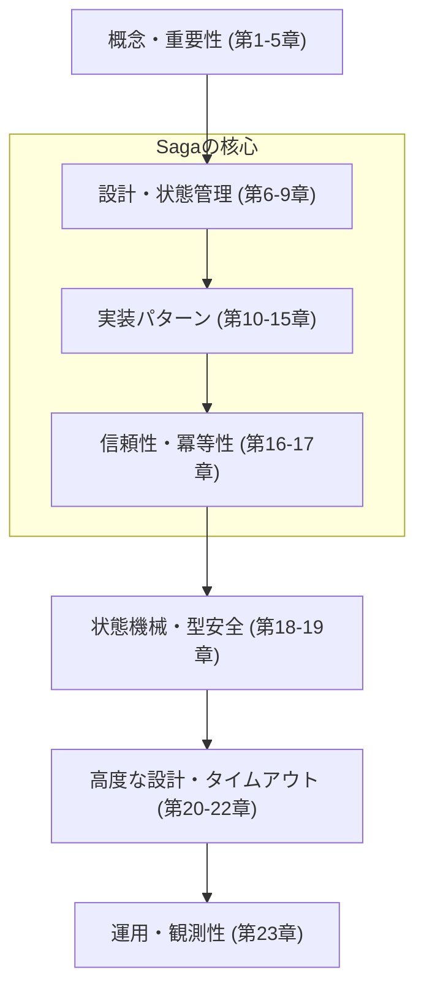

## Saga（補償トランザクション）教育コンテンツ：全23章アウトライン😊📚✨

前提：TypeScript初級〜中級／Sagaは初めて／設計は超入門者／Windows＋VS Code／AI（GitHub Copilot / OpenAI Codex等）導入済み💻🤖💕

---

### Saga 学習ロードマップ 🗺️

---

### 第1章：Sagaってなに？まずは超ざっくり理解しよ🤔🌱

* Saga＝「分割された処理を、失敗しても破綻しないように進める仕組み」
* “補償（Compensation）”って何？（戻し方を用意する）🧯
* 今日のゴール：Sagaが必要な理由を1文で言える🎯

### 第2章：ストーリーで理解！注文フローの世界へ🛒💳📦

* 例：注文→決済→在庫確保→発送
* 途中で失敗したら何が起きる？😱
* 「戻す」候補：取消、返金、在庫戻し、発送停止🔁

### 第3章：「全部まとめてトランザクション」はなぜ難しい？🧩💥

* DBの1トランザクションで済む世界 vs 外部サービスが絡む世界🌍
* ネットワーク・タイムアウト・再送で事故る⚡
* “分散”が入ると一気に難しくなる理由

### 第4章：2PC（分散トランザクション）とSagaの違い⚖️🔧

* 2PCの狙い（強い一貫性）と弱点（重い・止まりやすい）🐢
* Sagaの狙い（現実的・戻し方で守る）🚀
* どっちを選ぶ？の肌感覚だけ掴む😊

### 第5章：Sagaの基本形（順方向＋補償のペア）🧱🔄

* Step（順方向処理）✅
* Compensation（補償処理）🧯
* 「成功の流れ」と「失敗時の戻し」を必ずセットで考える🧠✨

---

### 第6章：設計入門① まず“境界”を分けよう🚧🗺️

* 注文・決済・在庫・発送を“別物”として考える📦
* SoC（関心の分離）を最小で使う✂️
* 章末：境界を箱で描くミニ演習📝

### 第7章：設計入門② “責務”ってなに？（薄い層の意識）🧁📚

* Controller/Service/Repositoryみたいな分け方の気持ち
* 「どこに書くべき？」迷子を減らすコツ🧭
* 章末：注文処理の責務を3つに分ける演習📝

### 第8章：Sagaの“状態”を持つってどういうこと？📍🧾

* Sagaは途中経過がある（進捗が必要）⏳
* 「どこまで成功した？」を記録しないと補償できない😵
* Sagaインスタンス（1注文＝1旅）🚶‍♀️

### 第9章：データ設計の最小セット（Sagaログ）📒🧷

* 何を保存する？（id / status / executedSteps / timestamps など）
* “再実行”や“調査”に必要な最低限💡
* 章末：保存項目チェックリスト✅

---

### 第10章：Saga実装スタイル2種類（全体像）🕺🎻

* Choreography（イベント連鎖）🕺
* Orchestration（司令塔が管理）🎻
* 学習ではまずOrchestration中心が分かりやすい😊

### 第11章：Choreography入門（イベントで連鎖する）📣🔗

* “誰かが次を起動する”の世界観📨
* メリット（疎結合）✨／デメリット（全体把握が難しい）😵‍💫
* 事故りやすい点：イベント名・責務の崩壊🌪️

### 第12章：Orchestration入門（司令塔の役割）🎻🧠

* オーケストレーターが判断すること（次のStep/補償/再実行）
* 状態管理が中心になる📍
* 章末：司令塔ToDoを書き出す📝

---

### 第13章：最小Sagaの設計（Step/Compensationの型）🧩🧠

* Step関数とCompensation関数をペアで定義
* 「順序」「前提」「戻し方」の書き方
* AI活用：Copilotに雛形を作らせてレビューする🤖✅

### 第14章：最小SagaをTypeScriptで動かす（ローカル疑似）🧪💻

* VS Codeで実行できるミニ環境（Windows前提）🪟
* まずは外部サービス無しで流れを体験
* 章末：成功パスを通してログを見る👀

### 第15章：ミニSagaを“失敗させて”補償を発動する😈🧯

* 途中で例外・エラーを起こすポイントを仕込む
* 補償が逆順で走るイメージ🔁
* 章末：失敗ケースを3パターン作る🧪

---

### 第16章：冪等性① 何が壊れる？（重複実行の恐怖）👻🔁

* リトライで同じStepが2回走る問題😱
* “二重決済”“二重出荷”の地獄絵図
* 冪等性がSagaの命綱な理由🔑✨

### 第17章：冪等性② 冪等キーと実行済み管理（具体策）🔑🧰

* 冪等キーの作り方（注文ID＋操作名など）
* Step実行済みチェック・重複排除
* 章末：冪等の保存設計（どこに記録する？）📝

---

### 第18章：状態機械① 状態遷移表で迷子を防ぐ🚦🗺️

* 状態（Status）と遷移（Transition）
* 禁止遷移を決めると事故が減る🔒
* 章末：注文Sagaの遷移表を作る📝

### 第19章：状態機械② TypeScriptの型で事故を減らす🛡️🧑‍💻

* 状態を型で表して“ありえない状態”を消す✨
* ガード条件（この状態ならOK）
* AI活用：型の草案を出させて人が整える🤖🧠

---

### 第20章：補償設計① “完全に戻せない”現実と折り合い😵🧯

* 逆操作できない（発送後、外部都合）📦💨
* 代替補償：返金、クーポン、人手対応🧑‍💼🎫
* 補償＝“完璧な巻き戻し”じゃなくていい🙆‍♀️

### 第21章：タイムアウト設計（止めどきが大事）⏰🛑

* いつ諦める？どこで失敗にする？
* 外部I/Oは遅い前提🐢
* 章末：タイムアウトを決める基準メモ📝

### 第22章：リトライ設計（回数・間隔・バックオフ）🔁📉

* リトライの基本ルール
* バックオフ（間隔を伸ばす）で守る
* 注意：リトライ＝冪等性とセットじゃないと危険⚠️

---

### 第23章：Outbox/Inbox・エラー設計・観測性をまとめて“運用できるSaga”へ📮🚨🔎✨

* Outbox（取りこぼし防止）📤／Inbox（重複受信防止）📥
* エラー分類（業務/技術、リトライ可否）🧩
* 観測性（相関ID、ログ、追跡できる情報）🔗📈
* 卒業ミニ制作：成功・失敗・リトライ・補償・調査まで通す🎓🛠️

