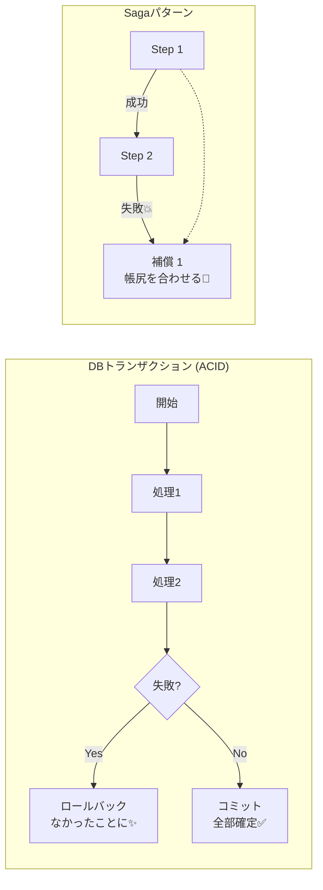
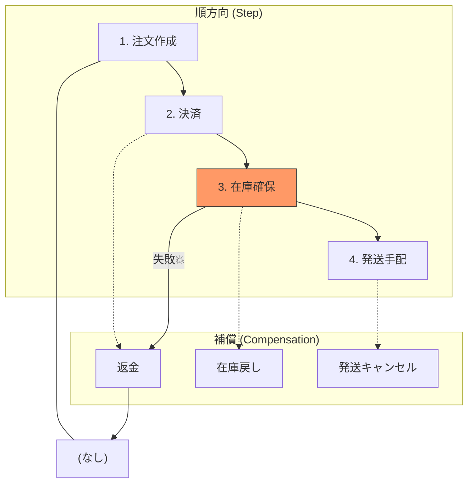
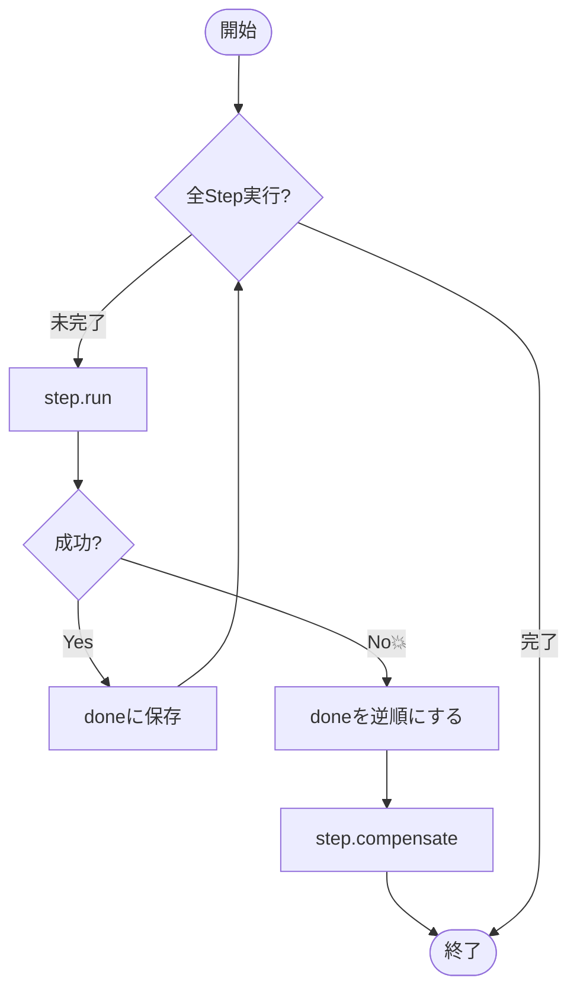

# 第01章：Sagaってなに？まずは超ざっくり理解しよ🤔🌱

## 今日のゴール🎯✨

この章が終わったら、これが言えたらOKです👇

* **Sagaは「分割された処理」を安全に進めるための仕組み**で、失敗したら**補償（戻し処理）**で整合性を取りにいく🧯🔁
* 「なんで必要なの？」を**1文**で説明できる💬😊
* “補償”が「DBのロールバック」とは違う、って雰囲気がわかる🧠🌼

---

## Sagaを一言でいうと？🧩

**Saga = 複数サービスにまたがる処理を「小さな取引（ローカルトランザクション）」の列に分けて、失敗したら「補償トランザクション」で帳尻を合わせる設計パターン**だよ🧵✨
分散環境で、いきなり全部を一気に巻き戻すのは難しいから、**「進め方」と「戻し方」をセットで設計する**感じ！🧠🧯

Microsoftの説明でも、Sagaは「ローカルトランザクションの並び」で、失敗時に「補償トランザクション」で取り消す、と整理されてるよ📘✨ ([Microsoft Learn][1])
同じく microservices.io でも「ローカルトランザクションの列＋失敗時に補償で取り消す」って定義されてるよ🧾✅ ([microservices.io][2])

---

## なんでSagaが必要なの？（超重要）⚡

ふつうDBの世界では「トランザクション」でこうできるよね👇

* 途中で失敗したら **全部ロールバック**（なかったことにする）🙆‍♀️💥
* 成功したら **全部コミット**（確定）✅✨

でも、現実のシステムはこうなりがち😵‍💫🌍

* 決済サービス💳
* 在庫サービス📦
* 配送サービス🚚
* メール通知📧
  みたいに、**別のサービス**や**別のDB**にまたがることが多い！

このとき「全部まとめて1個のトランザクションで！」が難しい理由はざっくり👇

* サービスごとにDBが分かれてたり、そもそも外部サービスだったりする🧱
* ネットワークの遅延・タイムアウト・部分失敗が普通に起きる⏳⚡
* “一括ロールバック”みたいな強い仕組みを分散でやるのは重かったり難しかったりする🐢💥

だからSagaは、**分散で現実的に運用しやすい「進め方」**として使われることが多いよ🧠✨ ([Microsoft Learn][1])



---

## ストーリーで理解：注文フロー🛒💳📦🚚

たとえばネットショップの「注文」を想像してね😊

**やりたい流れ（順方向の処理）**👇

1. 注文を作る🛒✅
2. 決済する💳✅
3. 在庫を確保する📦✅
4. 発送を手配する🚚✅

ここで問題！
**3の在庫確保が失敗**したら…？😱💥

* 決済は成功してるのに、商品がない！
* お客さん「え、払ったのに？😭」

こういう「途中まで成功」状態が、分散では普通に起きるのね🌀

---

## “補償（Compensation）”ってなに？🧯🔁

Sagaのキモはここ！✨
**補償 = 「起きたこと」を、別の操作で“取り消したのと同じ状態”に近づけること**だよ😊

さっきの例なら👇

* 決済✅した → **返金💸（補償）**
* 在庫を確保✅した → **在庫を戻す📦（補償）**
* 発送手配✅した → **発送キャンセル🚚（補償）**

MicrosoftのSaga説明でも「失敗したら補償トランザクションで、先に終わった処理を取り消す」って書かれてるよ🧯✨ ([Microsoft Learn][1])


---

## ここが大事：補償は「完璧な巻き戻し」じゃない🙅‍♀️➡️🙆‍♀️

超初心者さんが一番ハマる誤解がこれ！😵‍💫

**DBロールバック**は「時間を巻き戻す魔法」っぽいけど、
**補償**は「現実の操作で帳尻を合わせる」感じ🧾✨

例👇

* いったん送った荷物📦🚚は “送らなかったこと” にはできない
  → できるのは「返品受付」や「返金」や「お詫びクーポン」かも🎫🙇‍♀️
  つまり、補償は「現実と折り合いをつける」設計なんだよ🌿🧠

---

## Sagaの超基本ルール3つ🧱✨

ここだけ覚えると、いきなり理解が進むよ😊

1. **処理は「小分け（ローカルトランザクション）」にする**🧩

* 1サービス内で完結する、小さな確定処理の単位に分ける
* “小さく確定”を積み上げる感じ✨ ([Microsoft Learn][1])

2. **順方向（Step）と、補償（Compensation）はペア**🧯🔁

* 「これをやったら、失敗時は何で取り消す？」をセットで考える

3. **失敗したら、基本は“逆順”に補償する**↩️✨

* 先にやったことほど後で戻す（スタックみたいなイメージ）📚



---

## ちょい見せ：超ミニSagaの形（雰囲気だけ）🧪✨

「こういう動きをするんだ〜」が伝わればOKだよ😊
（まだ完璧に理解できなくて大丈夫！👍）

```ts
type Step = {
  name: string;
  run: () => Promise<void>;          // 順方向 ✅
  compensate: () => Promise<void>;   // 補償 🧯
};

async function runSaga(steps: Step[]) {
  const done: Step[] = [];

  try {
    for (const step of steps) {
      await step.run();
      done.push(step);
    }
    return { ok: true as const };
  } catch (e) {
    // 失敗したら逆順に補償する 🔁
    for (const step of done.reverse()) {
      await step.compensate();
    }
    return { ok: false as const, error: e };
  }
}
```

ポイントはこれ👇

* **成功した分だけ**覚えておいて🧠
* 失敗したら**逆順で補償**する🧯🔁



---

## よくある質問コーナー🙋‍♀️💬

### Q1. Sagaって「イベント駆動」じゃないとダメ？📣

ダメじゃないよ🙆‍♀️
ただ、分散では「次の処理をメッセージ/イベントでつなぐ」ことが多いから、結果的にイベントと相性がいい✨
Microsoftや microservices.io でも「イベント/メッセージで次を進める」整理がよく出てくるよ📨🔗 ([Microsoft Learn][1])

### Q2. Sagaって「オーケストレーション」と「コレオグラフィ」って聞いた！なにそれ？🎻🕺

今は「へぇ〜」でOK！😆

* **コレオグラフィ🕺**：みんながイベントを見て自分で動く
* **オーケストレーション🎻**：司令塔が「次これやって！」って指示する
  この2つがあるよ、ってだけ頭の片隅に置こ😊 ([microservices.io][2])

---

## ミニ演習（5分）📝✨

手を動かすと、理解が一気に進むよ〜！😊💕

### 演習1：Sagaを1文で説明しよう💬

次の穴埋めを完成させてね👇

* Sagaは、（　　　　　）にまたがる処理を、（　　　　　）の列に分けて進め、失敗したら（　　　　　）で整合性を取る仕組み。

ヒント：この章で出てきた単語だよ🧩🧯

### 演習2：補償を考えてみよう🧯

注文フローで「ここまで成功した！」ってなったとき、失敗したら何で戻す？👇

* 決済✅ → 補償は？（　　　　）
* 在庫確保✅ → 補償は？（　　　　）
* 発送手配✅ → 補償は？（　　　　）

### 演習3：逆順補償の矢印を書こう↩️

順方向：A → B → C → D
失敗：Cで失敗した場合、補償の順番は？
（　　　　）→（　　　　）→（　　　　）

---

## AI活用コーナー🤖✨（理解が速くなるやつ！）

そのまま貼って使えるよ😊💕

```text
あなたは優しい先生です。
Saga（補償トランザクション）を、設計初心者に「注文→決済→在庫→発送」の例で説明して。
特に「補償はDBロールバックとは違う」点を、たとえ話でわかりやすく。
最後に理解チェック問題を3問出して。
```

```text
次の順方向処理に対して、現実的な補償案を3パターン出して。
順方向：発送を手配する
制約：発送後は取り消せない可能性がある
```

---

## 章末チェッククイズ✅🎓

1. Sagaは何の列？（一言で）🧵
2. 補償って「ロールバック」と同じ？🙅‍♀️ or 🙆‍♀️
3. 補償は基本どっち向きに走る？➡️ or ↩️
4. 分散で「全部まとめて1トランザクション」が難しい理由を1つ言ってみて⚡
5. 「現実的な補償」ってどういうニュアンス？🌿

---

## まとめ🌸

* Sagaは **ローカルトランザクションの列**で進める🧵 ([Microsoft Learn][1])
* 失敗したら **補償トランザクション**で帳尻を合わせる🧯 ([Microsoft Learn][1])
* 補償は **完璧な巻き戻しじゃなくてOK**、現実に合わせて設計する🌿✨

---

## 次の章では…📚✨

「注文フローの世界」に入って、途中失敗で何が起きるかをストーリーで体験していくよ🛒💳📦😱

[1]: https://learn.microsoft.com/en-us/azure/architecture/patterns/saga "Saga Design Pattern - Azure Architecture Center | Microsoft Learn"
[2]: https://microservices.io/patterns/data/saga.html "Pattern: Saga"
