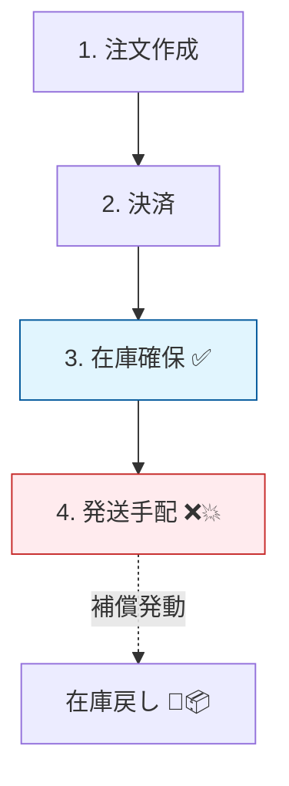
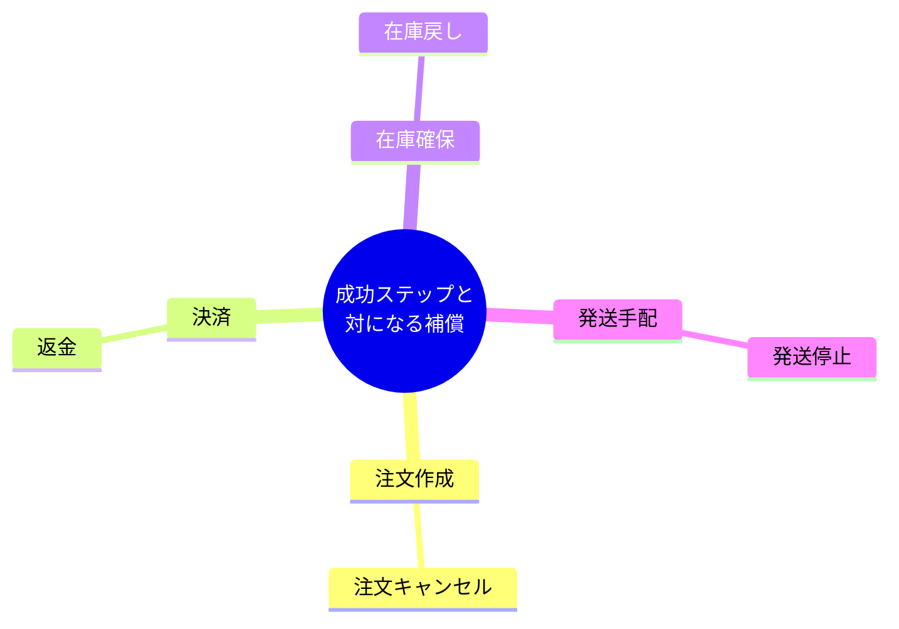
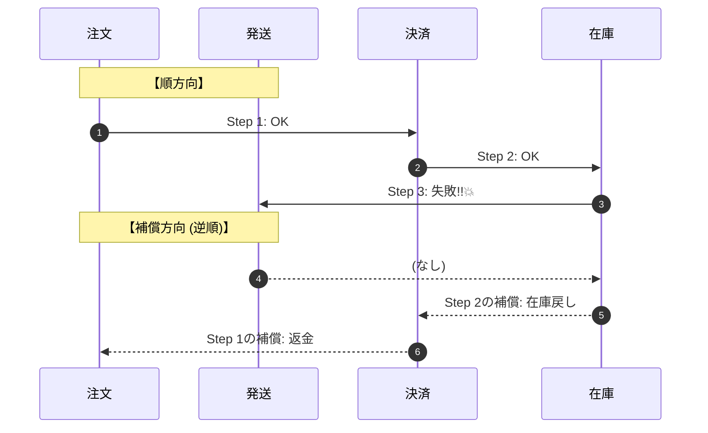

# 第02章：ストーリーで理解！注文フローの世界へ🛒💳📦

## この章でできるようになること🎯✨

* 「注文→決済→在庫確保→発送」という流れで、途中で失敗すると何が困るか説明できる😱
* 「戻す（補償する）」って何をすることか、具体例で言える🔁🧯
* 失敗ポイントごとに「どれを戻す？」を自分で選べるようになる🧠✅

---

# 1. まずは物語でイメージしよう📖🌸

あなたがネットショップを作っているとするね🛍️✨
お客さんが「かわいいマグカップ」を注文した☕💕

**ざっくり流れはこれ！**👇

1. 注文を受け付ける（注文作成）🧾
2. お金をもらう（決済）💳
3. 商品を確保する（在庫引き当て）📦
4. 送る準備をする（発送手配）🚚

ここで大事なのは、Sagaでは「全部まとめて1回で確定！」じゃなくて、**小さな成功を積み上げていく**感じになること🌱
そして途中で失敗したら、**すでに成功した分を“いい感じに戻す”**（補償する）必要が出てくるよ🧯✨
（Sagaは失敗時に補償トランザクションで巻き戻す考え方として紹介されるよ）([Microsoft Learn][1])

---

# 2. 失敗すると何が起きるの？😱💥（事故の絵）

## ケースA：決済OKなのに在庫がなかった😵‍💫📦❌

* 2. 決済 ✅（お金だけ取れた）
* 3. 在庫引き当て ❌（売り切れだった）

**このままだと…**

* お客さん「え、買えないのにお金取られたんだけど！？😡💦」
* お店「返金しなきゃ…😵‍💫」

👉 ここで必要なのが **返金（補償）** 💸🔁


---

## ケースB：在庫確保OKなのに発送手配で落ちた📦✅🚚❌

* 3. 在庫引き当て ✅（最後の1個を確保した！）
* 4. 発送手配 ❌（配送APIがタイムアウト・障害など）

**このままだと…**

* 在庫は確保されたままで他の人に売れない😱
* でも発送できないから売上にもならない😵

👉 ここで必要なのが **在庫戻し（補償）** 🧯📦🔁（在庫の確保を取り消す）



---

## ケースC：発送まで行ったけど、後で問題が発覚😨📦💨

* 4. 発送手配 ✅（もう出荷された…！）

ここまで行くと、**「完全に元に戻す」ができない**こともあるよ😵

* 出荷済み → 取り消し不可の場合あり
* そのときは「返金」「返品対応」「クーポン」「人手対応」みたいな“現実的な補償”が必要になる🙆‍♀️🎫🧑‍💼

---

# 3. 「戻す」って具体的に何をするの？🔁🧯

Sagaの基本イメージはこう👇

* **成功したステップ**がある
* その後にどこかで失敗した
* **成功した分を、逆向きの操作で取り消す（補償する）**

これがいわゆる **補償トランザクション**（Compensating Transaction）だよ🧯✨
（Sagaは失敗時に補償を実行して整合性を保つパターンとして説明される）([Microsoft Learn][2])



## 注文フローの「戻す候補」一覧📝✨

* 注文作成の補償：**注文キャンセル** 🧾❌
* 決済の補償：**返金** 💳➡️💸
* 在庫確保の補償：**在庫戻し（引き当て解除）** 📦🔓
* 発送手配の補償：**発送停止 / ラベル取り消し** 🚚🛑（できるなら）

---

# 4. 逆順で戻すイメージが超大事🔙🔙🔙

たとえば成功した順がこうだとするね👇
✅ 注文作成 → ✅ 決済 → ✅ 在庫確保 → ❌ 発送失敗

戻す（補償）の流れは、基本 **逆順** がわかりやすいよ🧯✨

```
成功：  注文作成 → 決済 → 在庫確保 → 発送(失敗)
補償：              在庫戻し → 返金 → 注文キャンセル
```

「最後にやった成功」を最初に戻す、って感じ🙂🔁



---

# 5. ミニ演習📝💕（3分でOK！）

## 演習1：どれを戻す？🎯

次の状況で「補償として何をする？」を選んでみてね👇

1. 決済が失敗した💳❌（注文作成は成功）
2. 在庫が取れなかった📦❌（注文作成と決済は成功）
3. 発送APIがタイムアウトした⏳❌（注文・決済・在庫は成功）

**模範解答例✅**

1. 注文キャンセル🧾❌（決済は成功してないので返金不要）
2. 返金💸＋注文キャンセル🧾❌（在庫確保できないなら売れない）
3. 在庫戻し📦🔓＋返金💸＋注文キャンセル🧾❌（発送できないなら一旦戻す判断）

※現実は「発送はリトライする」など別判断もあるけど、ここでは“戻す発想”を作るのが目的だよ🙆‍♀️✨

---

# 6. ちょいTypeScriptで雰囲気だけ👩‍💻✨（まだ実装しない）

この章では「こういう形でペアを考えるんだな〜」だけ感じればOK😊🌱

```ts
type StepResult = { ok: true } | { ok: false; reason: string };

type Step = {
  name: string;
  execute: () => Promise<StepResult>;
  compensate: () => Promise<void>; // 戻す処理（補償）
};

// 例：決済ステップ（雰囲気）
const paymentStep: Step = {
  name: "Payment",
  execute: async () => {
    // ここで決済APIを叩く想定
    return { ok: true };
  },
  compensate: async () => {
    // 返金APIを叩く想定
  },
};
```

ポイントはこれだけ💡

* **execute（進める）** と **compensate（戻す）** をセットで考える🧠✨
* 「失敗したら何を戻す？」が自然に見えるようになる👀

---

# 7. AI活用コーナー🤖💞（ラクして理解を深めよ！）

## 使い方①：失敗パターンを増やす🧪✨

AIにこう聞いてみてね👇

* 「注文→決済→在庫→発送で起こりうる失敗パターンを10個、初心者向けに」
* 「各失敗に対して必要な補償（返金/在庫戻し/キャンセル等）を表にして」

## 使い方②：自分の答えをレビューしてもらう✅

* 「この補償の選び方、矛盾ある？お客さん目線で変なところある？」
* 「“戻せないケース”での現実的対応案も足して」

※AIはサクッと案を出すのが得意だけど、**最終判断は人間がする**のが大事だよ🫶✨

---

# まとめ📌💖

* 注文フローは途中で失敗しやすい（外部サービス・ネットワーク・タイムアウト等）😱⚡
* Sagaでは、失敗したら **補償トランザクション**で“整合性を取り戻す”🧯🔁（Sagaの説明として一般的）([Microsoft Learn][1])
* 「成功したものを逆順で戻す」イメージを持つと一気に分かりやすくなる🔙✨

次の章では、「じゃあなんで最初から全部まとめて1回で処理できないの？」をハッキリさせていくよ🧩💥

[1]: https://learn.microsoft.com/en-us/azure/architecture/patterns/saga?utm_source=chatgpt.com "Saga Design Pattern - Azure Architecture Center"
[2]: https://learn.microsoft.com/en-us/azure/architecture/patterns/compensating-transaction?utm_source=chatgpt.com "Compensating Transaction pattern - Azure"
