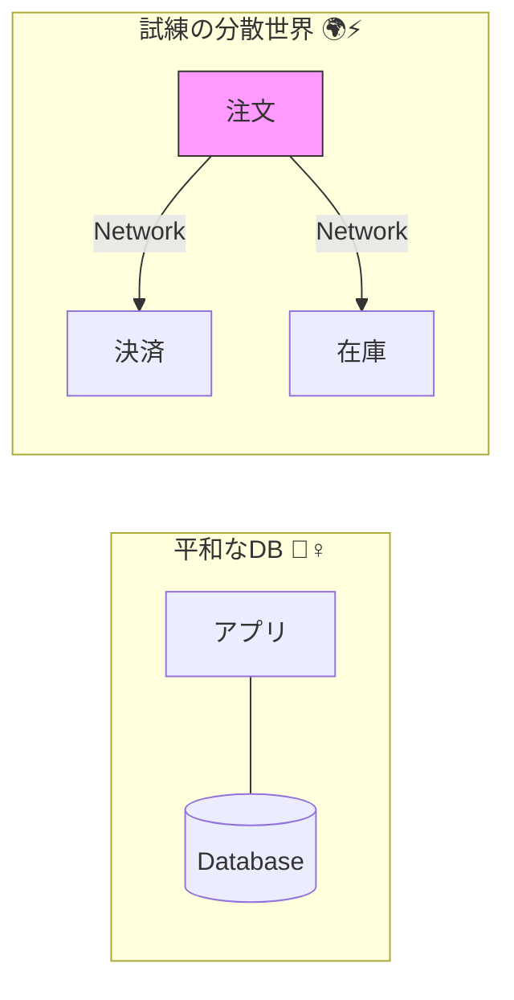
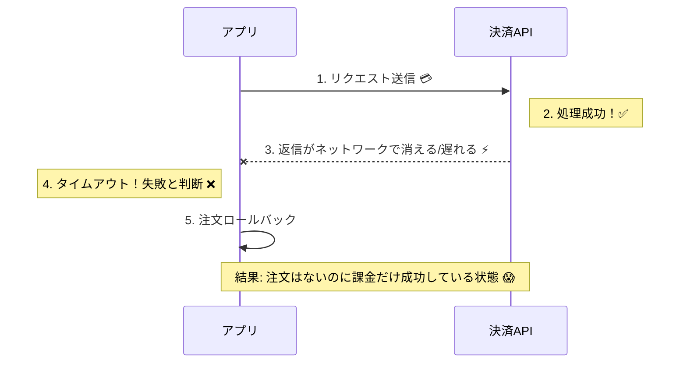
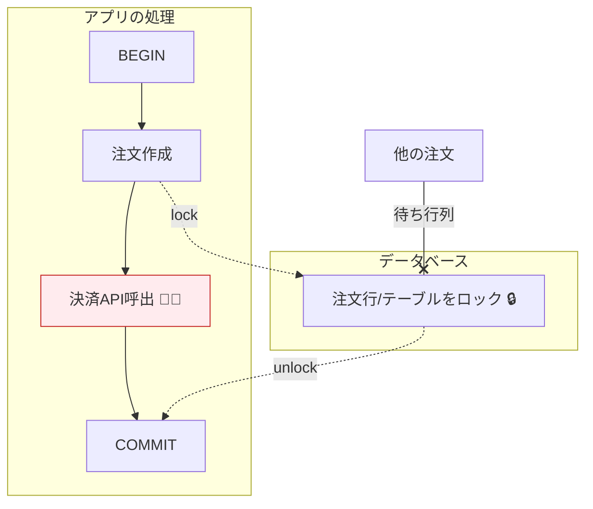

# 第03章：「全部まとめてトランザクション」はなぜ難しい？🧩💥

## 今日のゴール🎯

* 「DBのトランザクションで全部まとめてやれば安心✨」が、**外部サービスが1つ入った瞬間に崩れる理由**を説明できる😊
* 失敗パターンを見て、Sagaが必要になる“入口”を体感する🚪✨

---

# 3-1. まず「DB1つだけ」の世界は、かなり平和🏝️🧘‍♀️

DBのトランザクションって、ざっくり言うとこんな感じ👇

* ✅ まとめて実行する（途中で失敗したら全部なかったことにできる）
* ✅ “同じ箱（DB）”の中で、整合性を守れる
* ✅ ロックや制約（FK/Uniqueなど）も同じ世界で効く

だから例えば…

* 注文テーブルにINSERT
* 在庫テーブルをUPDATE
* 履歴テーブルにINSERT

みたいな「同じDB内の操作」なら、うまくまとまることが多いのね😊

---

# 3-2. 外部サービスが1つ入った瞬間、世界が変わる🌍⚡

たとえば注文フローで「決済API（外部サービス）」を呼ぶとするよね🛒💳
この瞬間から、**DBのトランザクションだけでは守れない事故**が増える💥

なぜかというと、分散では「ネットワークが信頼できる」「遅延がゼロ」みたいな前提が崩れるから😵‍💫
有名な“分散の落とし穴”として、ネットワークは壊れるし、遅延はあるし、環境は均一じゃない…みたいな前提崩壊がまとまって語られてるよ📌 ([ウィキペディア][1])



---

# 3-3. 事故パターン図鑑📚💥（ここがSagaの入口）

## パターンA：「相手は成功したのに、こっちは失敗に見える」😱📡

決済APIにリクエストを送った。
でも返事が遅くてタイムアウト…⏰

* あなた（注文サービス）：「失敗した！ロールバックしよ！😭」
* 決済サービス：「成功したよ！課金しちゃったよ！✅💳」

結果👇
**注文は無いのに課金だけ発生**（最悪）😇🔥

これ、ネットワーク遅延やタイムアウトが普通に起きる分散世界だと“あるある”なの🥲 ([ウィキペディア][1])



---

## パターンB：「こっちは成功したのに、相手は失敗してる」😵‍💫📨

逆もあるよ！

* あなた：「決済OKってことで注文を確定！✅」
* 実は決済側は失敗（あるいは処理できてない）❌

結果👇
**注文は確定してるのに、決済は取れてない**😇

---

## パターンC：「DBトランザクションを開いたまま外部I/O待ち」で詰む🧊🔒

やりがちな地雷👇

1. DBで `BEGIN`（トランザクション開始）
2. 注文レコードを仮作成
3. 決済APIを呼ぶ（ここで遅い・止まる・詰まる）🐢💤
4. その間ずーーっとDBのロックが残る🔒

結果👇

* ほかの注文処理がロック待ちで渋滞🚗🚗🚗
* タイムアウト連鎖で障害っぽくなる💥

つまり「安全そうに見えるからトランザクションで包む」は、**可用性を落とす方向に働きがち**なの😢



---

## パターンD：「リトライ／再送」で二重実行👻🔁

分散の世界は「1回送ったつもり」が信用できないから、だいたい**リトライ**する設計になるよね🔁

でも、リトライすると…

* 決済が2回走る（二重課金）💳💳😱
* 発送が2回走る（二重配送）📦📦😱

イベント駆動やメッセージングでも「重複配信は起きうる（少なくとも1回）」前提で作れ、っていうガイダンスが普通に出てるよ📌
だから**冪等性（同じ処理を複数回やっても結果が1回と同じ）**が必須になるの😊 ([Microsoft Learn][2])

---

# 3-4. 「分散トランザクション（2PC）で全部まとめればいいじゃん？」は、なぜ万能じゃない？⚖️🐢

「じゃあ2PC（Two-Phase Commit）で、分散でも“全部成功か全部失敗”を作ればよくない？」
…って発想は自然なんだけど、現実はつらい🥲

2PCは強い一貫性を狙える一方で、

* **ブロッキングしやすい（待ち状態が発生）**
* **コーディネータが死ぬと参加者が決められず止まりやすい**

みたいな弱点が“定番の欠点”として知られてるよ📌 ([ウィキペディア][3])

さらに、分散システムは「ノードもネットワークも信頼できない・遅延がある」前提で設計する必要がある、という話が繰り返し語られてる（＝楽観できない）😵‍💫 ([martinfowler.com][4])

だから、実務では「2PCで全体をガチガチに縛る」よりも、**Sagaみたいな“戻し方を用意して前に進む”**が選ばれることが多いんだよね🚀


---

# 3-5. この章の結論（超重要）🔑✨

## ✅ “全部まとめてトランザクション”が難しい理由まとめ

* 外部サービスは **同じDBのロックや制約の支配下にいない** 🧩
* ネットワークの遅延・切断・タイムアウトで、**成功/失敗の認識がズレる** 📡
* リトライや再送で、**重複実行が起きる** 🔁👻
* 長いトランザクションはロックを長引かせて、**全体の可用性を落としやすい** 🔒🧊

この「ズレ」と「部分成功」を、ちゃんと現実として受け止めて設計するのがSagaの出番だよ🧯✨

---

# 3-6. 体験ミニ：タイムアウトで「成功なのに失敗扱い」を再現😈⏰

下のコードは、決済が“たまに遅い”世界を再現するよ🐢
タイムアウトしたら「失敗！」って見えるのに、**遅れて成功してるかも**が起きる😱

```ts
// chapter3-timeout-demo.ts
const sleep = (ms: number) => new Promise((r) => setTimeout(r, ms));

type PaymentResult = { paymentId: string };

// たまに遅い（でも最終的には成功する）決済APIのつもり
async function fakePaymentApi(orderId: string): Promise<PaymentResult> {
  const latency = 200 + Math.floor(Math.random() * 2000); // 200〜2200ms
  await sleep(latency);
  return { paymentId: `pay_${orderId}_${Date.now()}` };
}

async function withTimeout<T>(p: Promise<T>, ms: number): Promise<T> {
  return await Promise.race([
    p,
    (async () => {
      await sleep(ms);
      throw new Error(`TIMEOUT after ${ms}ms`);
    })(),
  ]);
}

async function placeOrder(orderId: string) {
  console.log(`🛒 order start: ${orderId}`);

  // ここで「DBトランザクション開始！」みたいな気持ちになるけど…
  // 実際に外部I/Oを挟むと事故りやすい
  try {
    const payment = await withTimeout(fakePaymentApi(orderId), 700);
    console.log(`✅ payment success:`, payment);

    console.log(`✅ order confirmed: ${orderId}`);
  } catch (e) {
    console.log(`❌ order failed (seen by us): ${orderId}`, e);
    console.log(`🧯 (maybe) rollback order in DB...`);
  }
}

(async () => {
  for (let i = 1; i <= 5; i++) {
    await placeOrder(`order${i}`);
    console.log("----");
  }
})();
```

## 観察ポイント👀✨

* ❌ が出たケースでも、実は `fakePaymentApi` は裏で成功してるかも…って気持ちになるはず😇
* 現実の決済APIだと、**「課金されたか？」を照会する手段**や、**冪等キー**が用意されてることが多い（じゃないと運用できない）💡
* だから次章以降で「戻し方」「状態」「冪等性」が主役になるよ🔑

---

# 3-7. ミニ演習📝💞（ノートに手書きでOK）

題材：注文→決済→在庫確保→発送📦

## Q1 🤔

「どこがDB内」「どこが外部サービス」か分けてみよう✂️

* DB内：
* 外部：

## Q2 😈

次の失敗が起きたとき、何がズレる？を書いてみよう👇

* 決済成功したのにタイムアウト
* 在庫確保成功したのに返事が来ない
* 発送依頼が二重に送られた

## Q3 🧯

「戻し方（補償）」を1つずつ考えてみよう✨

* 決済の補償：
* 在庫の補償：
* 発送の補償：

---

# 3-8. AI活用テンプレ🤖💬（そのまま貼ってOK）

## ① 失敗パターン洗い出し

* 「注文→決済→在庫→発送のフローで、分散で起きる失敗パターンを網羅して。タイムアウト、重複実行、部分成功、遅延成功、再送も入れて。」

## ② “事故るコード”を作らせる（学習にめちゃ効く😈）

* 「TypeScriptで、外部API呼び出しが遅延・タイムアウト・重複成功するデモコードを作って。ログで状況がわかるように。」

## ③ レビュー係にする✅

* 「この実装の“二重実行リスク”と“整合性ズレ”のポイントを指摘して。改善案を3段階（軽い/普通/本気）で。」

---

# 3-9. この章のチェックリスト✅✨

* [ ] タイムアウト＝「失敗した」とは限らない、と言える😵‍💫⏰
* [ ] “部分成功”が起きる理由を、1つの例で説明できる🧩
* [ ] リトライが二重実行を生むことを理解した👻🔁
* [ ] 「だからSagaが必要なんだ」が腹落ちした🧯✨

[1]: https://en.wikipedia.org/wiki/Fallacies_of_distributed_computing?utm_source=chatgpt.com "Fallacies of distributed computing"
[2]: https://learn.microsoft.com/en-us/azure/architecture/serverless/event-hubs-functions/resilient-design?utm_source=chatgpt.com "Resilient design guidance for Event Hubs and Functions"
[3]: https://en.wikipedia.org/wiki/Two-phase_commit_protocol?utm_source=chatgpt.com "Two-phase commit protocol"
[4]: https://martinfowler.com/articles/patterns-of-distributed-systems/?utm_source=chatgpt.com "Catalog of Patterns of Distributed Systems"
