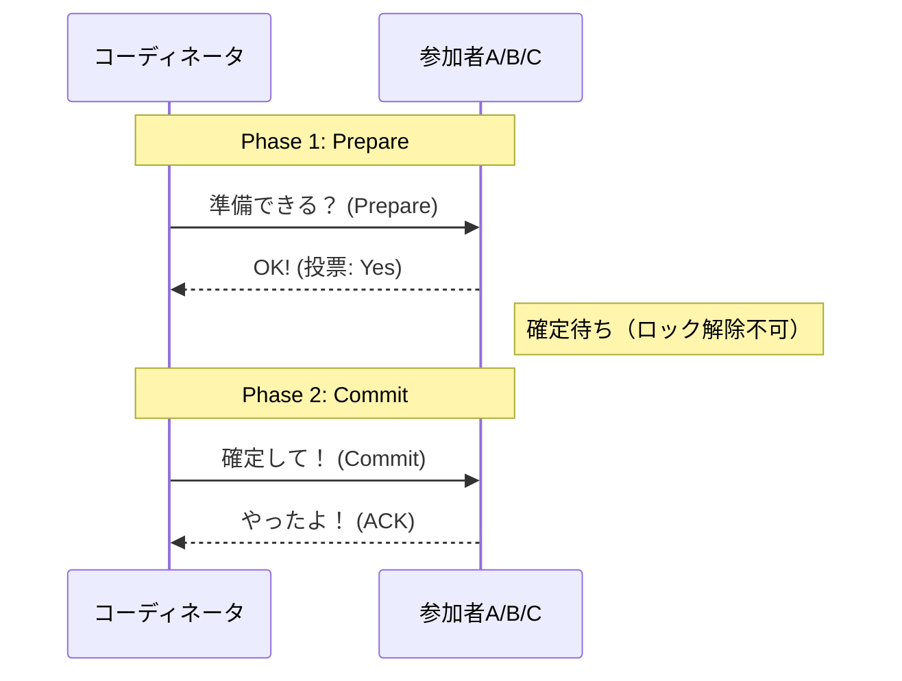
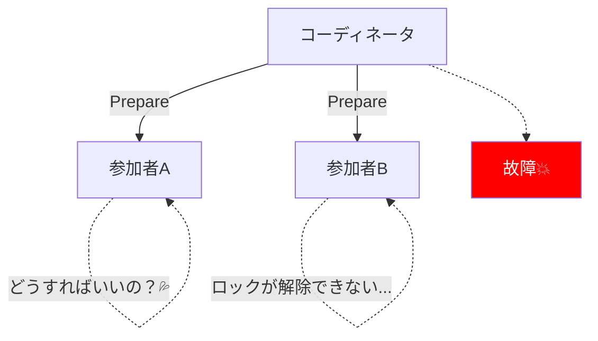
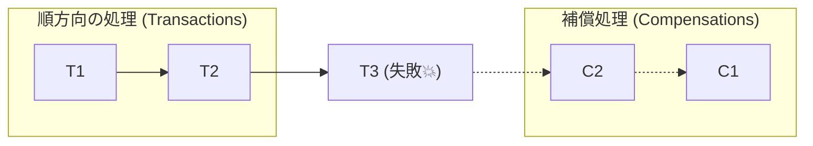

# 第04章：2PC（分散トランザクション）とSagaの違い⚖️🔧

## 今日のゴール🎯✨

* **2PCとSagaの「狙いの違い」**を1文で言えるようになる😊
* **2PCが苦手な場面**（なぜ“重い・止まりやすい”と言われるのか）をイメージできる🐢💥
* **Sagaが得意な場面**（“戻し方で守る”って何？）を、注文フローで説明できる🛒🔁

---

# 1) まず結論：2PCは「全員そろって一斉に確定」✅、Sagaは「進めてダメなら戻す」🔁🧯

* **2PC（Two-Phase Commit）**


  「関係者みんなに“本当に確定していい？”って確認して、全員OKなら一斉に確定する」方式だよ✅
  *例：複数DB/メッセージキューなど、複数の“参加者”にまたがる更新を**原子的（全部成功か全部失敗）**にしたいとき*（XA/2PCの枠組み）([docs.redhat.com][1])

* **Saga（補償トランザクション）**


  「まず順番に進める → 途中で失敗したら、**それまでにやった分を“打ち消す処理（補償）”**で戻す」方式だよ🔁🧯
  *“最終的に”うまく収束させる考え方*（Sagaの原典は“長い処理を小分け＋補償で扱う”）([コーネル大学コンピュータ科学部][2])

---

# 2) 2PCってどう動くの？（超やさしいイメージ）📣👥

2PCは名前の通り **2段階**！

## フェーズ①：準備できる？（Prepare）📝

* 司会（コーディネータ）が参加者に聞く：「コミットしていい？準備できた？」


* 参加者は「OK（Yes）」or「ムリ（No）」で返事する
* **Yesを返した参加者は“確定待ち状態”になって、勝手にやめられない**（ここがキツい）😵‍💫

## フェーズ②：じゃあ確定！（Commit / Abort）✅❌

* 全員Yesなら「コミットして！」✅
* 誰かがNoなら「中止して！」❌

MySQLのXA説明でも、**第1フェーズで各参加者が“安定ストレージに記録して準備”し、結果を使って第2フェーズに進む**という流れが整理されてるよ([dev.mysql.com][3])

### 図でみる（雰囲気）🧠✨

```text
[Coordinator]  ---Prepare?--->  [A]
       |        ---Prepare?--->  [B]
       |        ---Prepare?--->  [C]
       | <---Yes/No---          (全員の返事を待つ)
       |
       +--(全員Yes)--> Commit!  / (誰かNo)--> Abort!
```



---

# 3) 2PCの弱点：なぜ「重い・止まりやすい」？🐢⛓️‍💥

## 弱点①：ブロッキング（待ち状態で固まる）🧊

2PCは**原子性（全部成功か全部失敗）を守るために“ブロッキングになりやすい”**と言われるよ。失敗が起きると、参加者が**最終決定を待って“長時間ブロック”**することがあるの🫠


([docs.redhat.com][4])

## 弱点②：“準備済み”が長く居座るとツラい😇

たとえばPostgreSQLの2相トランザクションでは、`PREPARE TRANSACTION` 後は **`COMMIT PREPARED` / `ROLLBACK PREPARED` しかできない**状態になるよ。
本来短時間想定だけど、外部の可用性問題で**準備済み状態が長期間残る可能性**がちゃんと注意されてるのがリアル…😵‍💫([postgresql.jp][5])
さらに `pg_prepared_xacts` で準備済みトランザクションを確認できる、とドキュメントにあるよ🔎([PostgreSQL][6])

## 弱点③：運用がむずい（ヒューリスティック問題）🧯⚠️

障害時に「もう待てないから、各参加者が独自判断で確定/中止しちゃう」みたいな**緊急回避（ヒューリスティック）**が出てくると、**整合性リスク**が増えるの。


2PCまわりの“ヒューリスティック結果”は、トランザクション系ドキュメントでも注意点として語られるよ([docs.redhat.com][4])



---


---

# 4) Sagaってどう違うの？（“戻し方で守る”の正体）🧯🔁

Sagaは「長い処理」を **小さい処理（ローカルトランザクション）に分ける**よ✂️
そして、途中で失敗したら **逆向きに補償（Compensation）**を流すのが基本形✨

原典のSaga論文では、

* 前に進む列（T1, T2, …）
* 途中で止まったら、そこまでの分を補償で戻す列（… C2, C1）
  みたいに「どちらかの系列が実行される」ことを保証の形として説明してるよ📚([コーネル大学コンピュータ科学部][2])



## Sagaの2つの運び方🕺🎻

* **Choreography（連鎖）**：イベントで次々つながる📣🔗
* **Orchestration（司令塔）**：オーケストレーターが順番と補償を管理する🎻🧠


この2分類はSagaパターンの説明として定番だよ([microservices.io][7])

---

# 5) 2PC vs Saga：どっちを選ぶ？（肌感覚の目安）⚖️😊

## 2PCが合いやすい場面✅

* **“絶対に同時に確定”が必要**（中途半端が許されない）💎
* 参加する仕組みが **XA/2PCにちゃんと対応**していて、トランザクションマネージャで束ねられる🧩
* 処理が短く、ロックや待ち状態が長引きにくい⏱️
  （XAの枠組みや2PCのフェーズは各種DB/トランザクションガイドで整理されてる）([docs.redhat.com][1])

## Sagaが合いやすい場面🚀

* 外部サービスが多くて、**“全部を1つの強いトランザクション”にできない**🌍
* 多少の時間差はOKで、**最終的に正しくなればよい（補償で収束）**🔁
* 「取り消し/返金/在庫戻し」みたいな**業務的な戻し方**を設計できる🧯
  （Sagaは“長い処理を分割＋補償で扱う”として提案された）([コーネル大学コンピュータ科学部][2])

---

# 6) たとえ話で理解しよ🍰✨

## 2PC＝「みんなのハンコが揃うまで“提出ボタン”が押せない」📮🧊

* Aさん：OK
* Bさん：OK
* Cさん：司会が消えた（ネット断）
  → **AとBは“確定待ち”で固まる**😵‍💫（ブロッキング）([docs.redhat.com][4])

## Saga＝「提出しちゃうけど、ダメなら“取り消し手続き”をする」🧾🧯

* 途中まで進んでも、失敗したら「返金」や「予約キャンセル」で戻す
* その代わり、**途中経過が見える瞬間**はある（だから設計が大事）👀✨([コーネル大学コンピュータ科学部][2])

---

# 7) ミニ演習📝🛒（注文フローで2PCとSagaを比べる）

## お題：注文 → 決済 → 在庫確保 → 発送📦💳

1. **2PCだとどうしたい？**

* 「全部OKなら一斉に確定」したい気持ちは分かる🙆‍♀️
* でも、発送みたいな外部・物理が絡むと、**2PCで“同時確定”をやるのが現実的か？**を考える🤔


2. **Sagaならどう書く？**（補償をセットで考える）🧯

* 決済の補償：返金💸
* 在庫確保の補償：在庫戻し📦↩️
* 発送の補償：発送停止（できる？）/ 返品フロー（現実的？）🚚🧾

✅ チェックポイント

* 「補償は**完全な巻き戻し**じゃなくてもいい」
* ただし「どこまで成功したか」を後で追えるようにする（次章以降でやるよ）🔎✨

---

# 8) AI活用ミニ（雛形づくり）🤖💡

## 2PCの“メッセージの流れ”を整理してもらう📣

```text
「2PCのPrepare/Commitのやり取りを、CoordinatorとParticipantsの会話として
超やさしい日本語で箇条書きにして。障害（Coordinator落ち）も1パターン入れて。」
```

## Sagaの“補償ペア”を洗い出してもらう🧯

```text
「注文→決済→在庫→発送のSagaで、各ステップの補償（取り消し）案を列挙して。
“完全に戻せない例”も混ぜて、代替案（返金/クーポン/人手対応）も出して。」
```

---

# まとめ🎀✨（ここだけ覚えればOK！）

* **2PC**：強い一貫性を狙う「全員一斉に確定」✅ でも **待ち状態（ブロッキング）や運用の難しさ**が出やすい([docs.redhat.com][4])
* **Saga**：現実寄りの「進めて、失敗したら補償で戻す」🔁🧯（長い処理を分割して扱う発想）([コーネル大学コンピュータ科学部][2])
* 「外部サービス・物理世界・長い処理」が絡むほど、Sagaの考え方が効いてくるよ😊🚀

[1]: https://docs.redhat.com/en/documentation/red_hat_fuse/7.0/html/transaction_guide/introduction-to-transactions?utm_source=chatgpt.com "Chapter 1. Introduction to transactions"
[2]: https://www.cs.cornell.edu/andru/cs711/2002fa/reading/sagas.pdf?utm_source=chatgpt.com "Sagas"
[3]: https://dev.mysql.com/doc/refman/8.1/en/xa.html?utm_source=chatgpt.com "MySQL 8.4 Reference Manual :: 15.3.8 XA Transactions"
[4]: https://docs.redhat.com/en/documentation/jboss_enterprise_application_platform_common_criteria_certification/5/html/transactions_development_guide/ch17s08?utm_source=chatgpt.com "17.8. Non-Atomic Transactions and Heuristic Outcomes"
[5]: https://www.postgresql.jp/docs/16/two-phase.html?utm_source=chatgpt.com "74.4. 2相トランザクション"
[6]: https://www.postgresql.org/docs/current/view-pg-prepared-xacts.html?utm_source=chatgpt.com "Documentation: 18: 53.17. pg_prepared_xacts"
[7]: https://microservices.io/patterns/data/saga.html?utm_source=chatgpt.com "Pattern: Saga"
