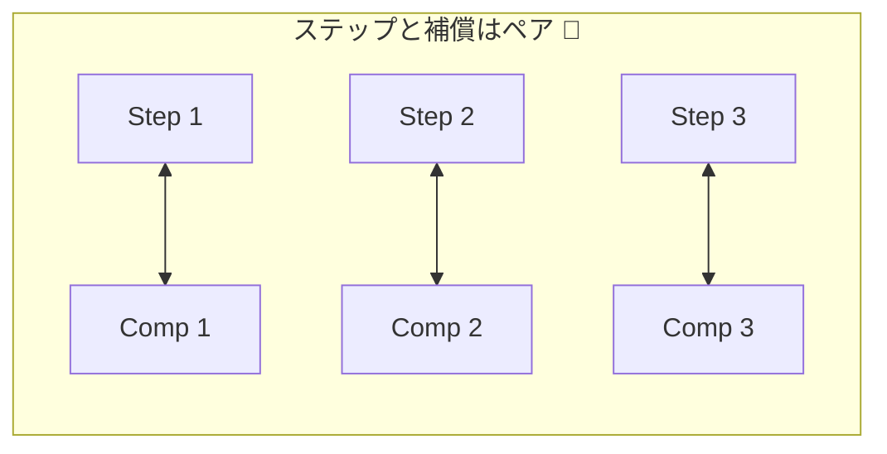
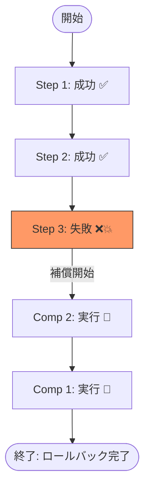
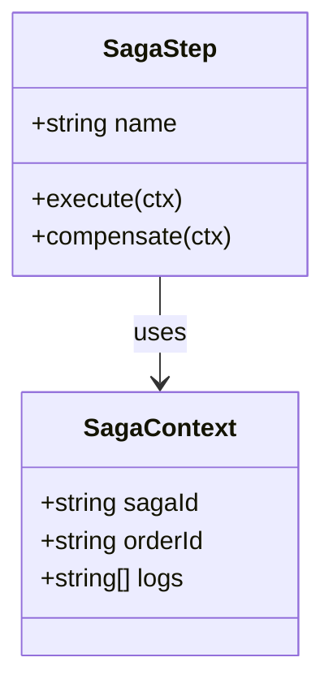

# 第05章：Sagaの基本形（順方向＋補償のペア）🧱🔄

---

## この章でできるようになること🎯✨

* Sagaを「**順方向（Step）**」と「**補償（Compensation）**」の**ペア**で考えられる🧠💡
* 失敗したときに「どこまで進んだ？」「何を戻す？」を**迷わず書き出せる**📝✅
* 代表例（注文フロー）を、Step/補償の対応表で整理できる🛒💳📦

---

# 5-1. Sagaの“基本形”はコレ！🧱✨

Sagaは、ざっくり言うとこういう発想です👇

* 大きい処理を、小さな処理（= **ローカルトランザクション**）に分ける✂️
* 途中で失敗したら、**完了済みの分だけ**「取り消し」を順番に実行する🔁
* つまり、**成功ルート（順方向）**と**失敗ルート（補償）**がセット💞


この考え方自体は、AzureやAWSの解説でも「ローカルトランザクションの連鎖＋失敗時は補償で戻す」って説明されています。([Microsoft Learn][1])

---

# 5-2. Step と Compensation を“ペア”で持つ理由🧠🔄

## ✅ Step（順方向処理）って？

「前に進める処理」です🚶‍♀️✨
例：

* 決済を確定する
* 在庫を確保する
* 発送を開始する

## 🧯 Compensation（補償処理）って？

「進めた処理の影響を“取り消す/打ち消す”処理」です🧯
例：

* 決済の取消・返金
* 在庫の確保解除
* 発送の取消（可能なら）

Azureの「Compensating Transaction」やSagaの説明でも、失敗回復は“補償トランザクション”で行うって整理されてます。([Microsoft Learn][2])



---


---

# 5-3. 図でつかむ！「成功の流れ」と「失敗時の戻し」🗺️✨

## ✅ 成功パス（順方向）

```
Step1 → Step2 → Step3 → 完了🎉
```

## ❌ 失敗パス（補償は逆向きが基本）


```
      Comp2 ← Comp1（逆順で戻す🔁）
```



「失敗したら、すでに終わった分の変更を補償で取り消す」っていう説明はAWSのSagaパターンでも同じです。([AWS ドキュメント][3])

---

# 5-4. 例：注文フローで“ペア表”を作ろう🛒💳📦

ここでは分かりやすく、こういう流れにします👇

1. 注文を作る（Order）🧾
2. 決済する（Payment）💳
3. 在庫を確保する（Inventory）📦
4. 発送手配する（Shipping）🚚

そして、**Step と Compensation を必ずセット**で考えます💞


## Step/Compensation 対応表（超基本）📝✨

| ステップ名            | Step（やること）✅ | Compensation（戻すこと）🧯 | “戻せる？”の注意点⚠️    |
| ---------------- | ----------- | -------------------- | --------------- |
| OrderCreate      | 注文レコード作成    | 注文キャンセル扱いにする         | 物理削除じゃなく状態変更が多い |
| PaymentCapture   | 決済確定        | 返金/取消                | 取消できない場合は返金で対応  |
| InventoryReserve | 在庫引当        | 引当解除                 | 解除はだいたい可能       |
| ShippingArrange  | 発送手配        | 発送キャンセル              | 発送後は無理なことが多い    |

この「戻しは必ずしも完全な巻き戻しじゃない」問題は、補償トランザクションのパターン解説でも重要ポイントとして扱われます。([Microsoft Learn][2])

---

# 5-5. ペア設計の“ミニルール”5つ✅✨（超大事！）

## ルール1：Stepは「小さく」「局所的」に✂️

1つのStepで、あちこちを同時に変えない🙅‍♀️


（分けたほうが、失敗時に戻しやすいよ！）

## ルール2：Stepが成功したら「成功した証拠」を残す🧾

あとで「どこまで成功した？」が分からないと、戻せない😵
（Sagaの状態管理は次章以降で深掘りするよ📍）

## ルール3：Compensationは「逆操作」じゃなくてもOK🙆‍♀️

現実には“完全な巻き戻し”が無理なことがある😵‍💫
そのときは「打ち消し」や「埋め合わせ」を設計する🎫✨


（例：発送後→返金＋クーポン＋人手対応）

## ルール4：Compensationは「何度呼ばれても壊れない」が理想🔁🛡️

分散システムは、同じ命令が2回届くことがあります😱
補償は**リトライ可能＆冪等**が重要、という整理がよく出てきます。([Baeldung on Kotlin][4])
（冪等性は後の章でガッツリやるよ🔑✨）

## ルール5：「戻す順番」は基本“逆順”🔁

最後に成功したものから戻すと、整合性が保ちやすい💡
（例：在庫確保→決済→注文 の順で戻す、みたいな感じ）

---

# 5-6. ちいさな演習📝💕「Step/Comp ペアシート」を作ろう！

あなたがECサイト担当だとして、次の3つのStepを考えてみてね👇✨

## お題：ギフト注文Saga🎁

* Step A：ギフト包装を依頼する🎀
* Step B：メッセージカードを印刷する💌
* Step C：配送日時を予約する⏰🚚


### ✅ やること（この表を埋めてみよう📝）

| Step | Step（何をする？）✅ | Compensation（どう戻す？）🧯 | 戻せない場合の代替案🎫 |
| ---- | ------------ | --------------------- | ------------ |
| A    |              |                       |              |
| B    |              |                       |              |
| C    |              |                       |              |

💡ヒント：

* 「印刷」は物理的に戻せないかも…？そのとき代替案は？🤔
* 「予約」は取消できる？できない？ルールを確認する前提で設計してOK👌

---

# 5-7. TypeScriptで“Step/Compの型”を作る🧩💻

ここでは「ペアで考える」をコードで表現します✨
（まだ実運用じゃなくて、考え方を固定するためのミニ型だよ🧠）


```ts
// Saga全体で共有したい最低限の情報
export type SagaContext = {
  sagaId: string;
  orderId: string;
  // デバッグしやすいようにログも持てると便利✨
  logs: string[];
};

// Step と Compensation を必ずペアで持つ
export type SagaStep = {
  name: string;

  // 順方向（前に進める）
  execute: (ctx: SagaContext) => Promise<void>;

  // 補償（戻す / 打ち消す）
  compensate: (ctx: SagaContext) => Promise<void>;
};
```



## “実行→失敗したら逆順に補償”の超ミニ実装🔁🧯

```ts
export async function runSaga(steps: SagaStep[], ctx: SagaContext) {
  const executed: SagaStep[] = [];

  try {
    for (const step of steps) {
      ctx.logs.push(`▶️ execute: ${step.name}`);
      await step.execute(ctx);
      executed.push(step);
    }

    ctx.logs.push("✅ Saga completed!");
  } catch (err) {
    ctx.logs.push(`💥 Saga failed: ${(err as Error).message}`);

    // 逆順で補償する🔁
    for (const step of executed.reverse()) {
      try {
        ctx.logs.push(`🧯 compensate: ${step.name}`);
        await step.compensate(ctx);
      } catch (compErr) {
        ctx.logs.push(
          `🚨 compensate failed: ${step.name} / ${(compErr as Error).message}`
        );
        // 本番は「補償の失敗」をどう扱うかが超重要（後の章で扱うよ📚）
      }
    }

    throw err;
  }
}
```

ここで大事なのは「**Step/Comp が必ずセット**」になっていること💞
この形があるだけで、設計の迷子がかなり減ります🧭✨

---

# 5-8. AI活用ミニコーナー🤖💡（ペア設計が速くなる！）

## ✅ 1) ペア表のたたき台を作らせる📝

* 「注文フロー（注文/決済/在庫/発送）のStepとCompensationを表にして。戻せないケースの代替案も添えて」
  みたいに頼むと、表の下書きが一瞬で出ます⚡

## ✅ 2) 「戻し漏れ」を指摘してもらう🔍

* 「このStep一覧に対して、補償が弱い/不足してるところを指摘して」
  で、抜けチェックができます✅✨

## ✅ 3) “失敗パターン”を増やす😈🧪

* 「Step2がタイムアウトした場合の扱い」
* 「Step3が成功したのにレスポンスが返ってこない場合」
  みたいな“ありがち事故”を作ってもらうと強いです💪🔥

---

# 章末チェック✅🎓（3分でOK）

## Q1️⃣ StepとCompensationが「ペア」な理由は？🤔

→ 途中失敗に備えて、**成功済みの変更を打ち消す手段**が必要だから🧯

## Q2️⃣ 補償は「完全な巻き戻し」じゃないとダメ？🙅‍♀️

→ ダメじゃない！現実に合わせて「返金」「クーポン」「人手対応」などもアリ🎫✨（補償トランザクションの考え方でも重要）([Microsoft Learn][2])

## Q3️⃣ 失敗時に補償を走らせる順番は？🔁

→ 基本は**逆順**（最後に成功したものから戻す）🧠✨

---

# まとめ📌✨

* Sagaの基本形は **Step（順方向）＋Compensation（補償）** のペア🧱💞
* 成功ルートだけじゃなく、**失敗時の戻しルート**を必ず同時に設計する🧯
* 補償は「現実的に戻せる形」でOK。完璧な巻き戻しにこだわりすぎない🙆‍♀️
* 補償はリトライや重複に耐える設計が大事（冪等性の伏線🔑）([Baeldung on Kotlin][4])

[1]: https://learn.microsoft.com/en-us/azure/architecture/patterns/saga?utm_source=chatgpt.com "Saga Design Pattern - Azure Architecture Center"
[2]: https://learn.microsoft.com/en-us/azure/architecture/patterns/compensating-transaction?utm_source=chatgpt.com "Compensating Transaction pattern - Azure"
[3]: https://docs.aws.amazon.com/prescriptive-guidance/latest/cloud-design-patterns/saga.html?utm_source=chatgpt.com "Saga patterns - AWS Prescriptive Guidance"
[4]: https://www.baeldung.com/cs/saga-pattern-microservices?utm_source=chatgpt.com "Saga Pattern in Microservices"
