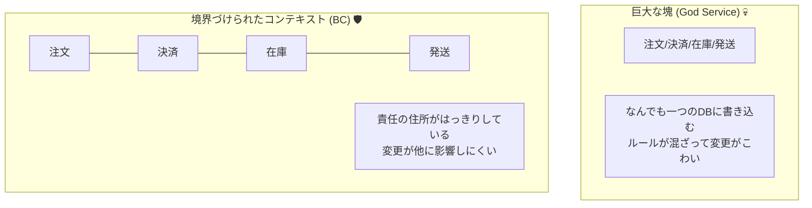
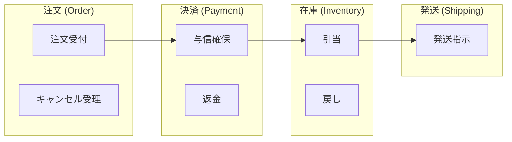
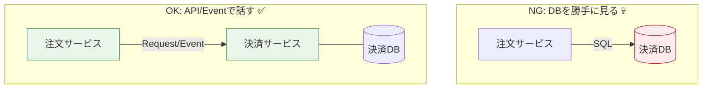

# 第06章：設計入門① まず“境界”を分けよう🚧🗺️

## この章のゴール🎯✨

* 「注文・決済・在庫・発送」を“別物”として分けて考えられるようになる📦💳📦🚚
* “境界（Boundary）”を切ると、Sagaがめちゃくちゃ作りやすくなる理由がわかる🧠🔧
* 最後に「箱（ボックス）」で境界図を描けるようになる✍️🗂️

---

# 1) そもそも“境界”ってなに？🤔🧱

境界はざっくり言うと、**「ここから先は別の責任（別のルール）」の線引き**だよ〜！🚧✨


同じアプリの中でも、マイクロサービスでも、境界は必要になるよ。

* 注文の世界のルール（例：注文はキャンセルできる？）
* 決済の世界のルール（例：与信はいつ切る？返金はどうする？）
* 在庫の世界のルール（例：取り置き期限は？）
* 発送の世界のルール（例：発送後は止められる？）

こういう**ルールが違うものを混ぜる**と、コードも頭の中もぐちゃぐちゃになりやすい…😵‍💫💥





---

# 2) 境界を分けると何が嬉しいの？😊🎁

## ✅ 嬉しいこと①：失敗しても「どこまで戻す？」が決めやすい🧯🔁

Sagaは「進める」だけじゃなく「戻す」が主役だよね。
境界が分かれてると、補償もこう整理しやすい✨

* 決済に失敗 → 注文はキャンセル、在庫取り置きがあれば解除
* 在庫が足りない → 決済は返金（or 与信取消）

## ✅ 嬉しいこと②：責任の押し付け合いが減る🙆‍♀️🤝

「それ、注文がやる？決済がやる？」が決まってないと、実装が漂流する🌊
境界を切る＝**責任の住所が決まる**🏠✨


## ✅ 嬉しいこと③：変更に強くなる🛡️🔧

たとえば「決済会社を変える」「在庫の仕組みを変える」みたいな変更でも、
境界があると影響範囲が狭くなるよ✂️✨（関心の分離＝SoCの考え方だね） ([ウィキペディア][1])

---

# 3) 例：注文フローを“4つの箱”に分けてみよ📦📦📦📦

まずは超定番の分け方でOK！難しくしない！🙆‍♀️🌱



ここで大事なのは、**箱ごとに「持っていいデータ」と「守るルール」が違う**こと👀✨


* Order：注文状態（作成/確定/キャンセル…）
* Payment：支払い状態（与信/確定/返金…）
* Inventory：在庫状態（確保/解除/不足…）
* Shipping：配送状態（準備中/発送済み…）

この分け方は、DDDの考え方でいう「境界づけられたコンテキスト（Bounded Context）」のイメージに近いよ🧭✨ ([martinfowler.com][2])

---

# 4) 境界の切り方：超やさしい5つのヒント🧩✨

「どこで線引くの？」って悩むところだから、**超実用**にいくね😊🧡

## ヒント①：ルールが違うなら分ける📜✂️

同じ“キャンセル”でも、

* 注文のキャンセル（注文を無効化）
* 決済のキャンセル（与信取消 or 返金）
  は別物だよね。ここ混ぜると事故りがち😱

## ヒント②：データの“持ち主”は1人にする👑📒

「決済情報を注文DBに保存しちゃう」と、後で痛い…💥
**PaymentのことはPaymentが持つ**、みたいに “所有者” を決めるとスッキリ✨


## ヒント③：失敗した時に“誰が補償するか”で分ける🧯🧠

補償はだいたい「その箱の責任」でやると綺麗になるよ。

* 在庫確保をした → 在庫解除できるのはInventory
* 決済確定した → 返金できるのはPayment

## ヒント④：用語がズレるなら分ける🗣️⚠️

「確保（reserve）」って、在庫の確保？配送枠の確保？決済の確保（与信）？
同じ単語が別の意味を持ち始めたら、境界がズレてるサイン🚨


（Bounded Contextは“言葉の意味の境界”でもあるよ） ([martinfowler.com][2])

## ヒント⑤：変更頻度が違うなら分ける🔁🧱

決済は仕様変更や外部都合が多いことが多い。
発送は外部物流や現場都合が入りやすい。
変更の波が違うときも、分けると守りやすいよ🛡️✨

---

# 5) 境界をまたぐ時の“最低限ルール”📨🔗

境界を分けたら、次は「どう連携する？」だよね😊

## ✅ ルールA：他の箱のDBを直接読まない🙅‍♀️🗄️

“近道”に見えて、依存が地雷原になる💣


連携は **API** か **イベント** でやるのが基本✉️✨



## ✅ ルールB：連携は「契約（Contract）」として固定する📄🔒

境界を跨ぐ情報は、**渡す項目を絞る**のがコツ。


「注文の全部を投げる」じゃなくて、必要最小限🎯

例：在庫確保に必要なのはこれくらい👇

```ts
type OrderId = string;

type ReserveStockCommand = {
  orderId: OrderId;
  items: Array<{ sku: string; qty: number }>;
};
```

## ✅ ルールC：境界の外では“同期しない前提”で考える⏳🌍

ネットワークは遅いし、落ちるし、タイムアウトもある⚡
だからSagaみたいな「途中で止まってもやり直せる設計」が必要になるんだよね😊🧯

---

# 6) ミニ演習：境界を箱で描こう📝📦✨

## 演習①：箱を描く（3分）⏱️✍️

下を真似して、紙でもメモでもOK！描いてみよ〜😊

```text
[Order] → [Payment] → [Inventory] → [Shipping]
```

## 演習②：各箱の“責務”を3つずつ書く（5分）🧠📝

例（書き方サンプル）👇

* Order：注文作成 / 注文確定 / 注文キャンセル
* Payment：与信 / 決済確定 / 返金
* Inventory：在庫引当 / 取り置き期限 / 解除
* Shipping：出荷作成 / 追跡番号 / 発送停止の可否

ポイント：**「やること」を書く**（“データ”だけ書くとブレやすい）🎯✨

## 演習③：失敗パターンで“戻す箱”を決める（5分）🧯🔁

次の失敗が起きたら、どの箱が何を戻す？を書いてみよう😊

1. 決済が失敗した💳❌
2. 在庫が足りなかった📦❌
3. 発送直前で住所不備が見つかった🏠❌

「戻す責任」が曖昧なら、境界が曖昧なサインだよ🚨✨

---

# 7) AI活用：境界決めの“壁打ち”のやり方🤖💬✨

境界は、最初から正解を当てるゲームじゃないよ〜！
AIに「候補」を出させて、人がレビューするのが超強い💪😊

## 使える指示例（コピペOK）📋✨

* 「注文・決済・在庫・発送の境界を、責務とデータ所有者で整理して」
* 「“この箱が持つべきDB項目”の候補を、最小で提案して」
* 「失敗ケースを3つ作って、どの補償が必要か表にして」

出てきた答えは、そのまま採用せずに
✅ “責任の住所”がちゃんと分かれてる？
✅ “他の箱の都合”を持ち込んでない？
って観点でチェックすると良いよ👀🔍

---

# 8) まとめ：この章のチェックリスト✅🎀

* [ ] Order/Payment/Inventory/Shipping を“別物”として箱で描ける
* [ ] 各箱の責務を3つ以上言える
* [ ] 「データの持ち主は1つ」を守れる
* [ ] 境界を跨ぐ連携はAPI/イベントで、契約を絞れる
* [ ] 失敗ケースから「どの箱が補償するか」を決められる

（補足）境界を「Bounded Context」から考えるやり方や、マイクロサービスの境界設計の考え方は、Microsoftの設計ガイドでも強く推されてるよ📚✨ ([Microsoft Learn][3])

[1]: https://en.wikipedia.org/wiki/Separation_of_concerns?utm_source=chatgpt.com "Separation of concerns"
[2]: https://www.martinfowler.com/bliki/BoundedContext.html?utm_source=chatgpt.com "Bounded Context"
[3]: https://learn.microsoft.com/en-us/azure/architecture/microservices/model/microservice-boundaries?utm_source=chatgpt.com "Identify microservice boundaries - Azure Architecture Center"
