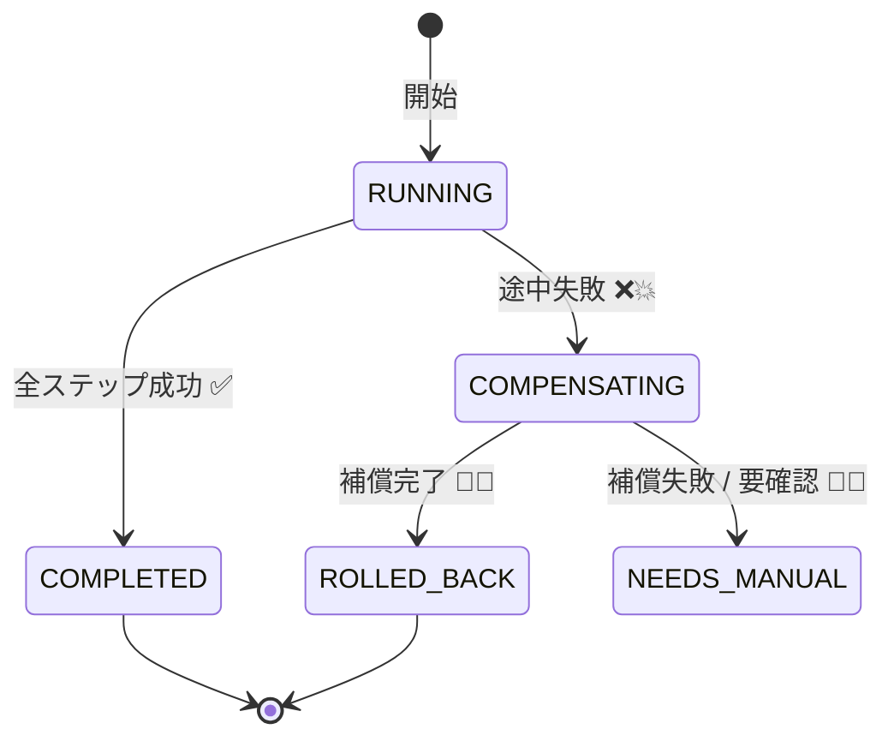
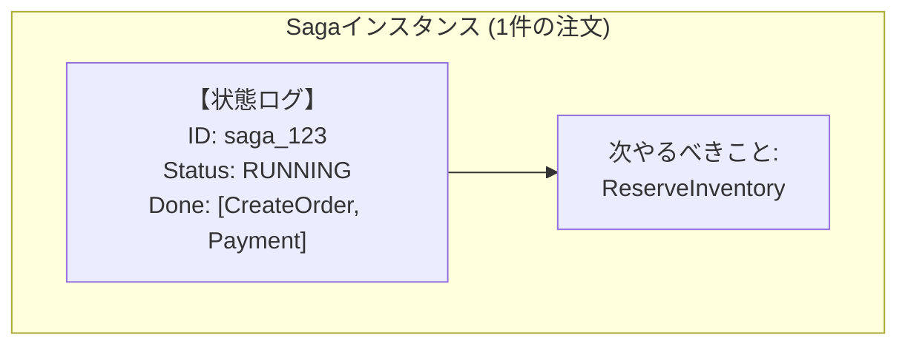
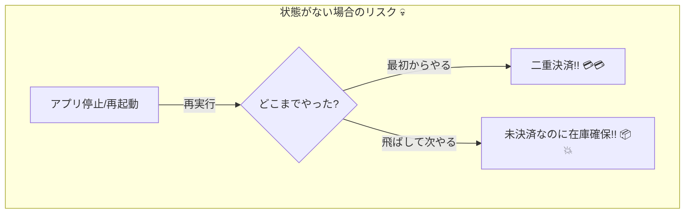

# 第08章：Sagaの“状態”を持つってどういうこと？📍🧾

## この章でできるようになること🎯✨

* 「Sagaの状態」って何かを、ことばで説明できる😊
* 「状態がないと事故る」理由がわかる😱💥
* “どこまで進んだか”を記録する最小イメージが持てる🧠📌

---

# 1. まず結論：Sagaは「途中経過がある旅」だから、進捗メモが必須🚶‍♀️🗺️📝

Sagaは、複数サービスにまたがる処理を **小さな取引（ローカルトランザクション）** の連続として進め、失敗したら **補償処理で巻き戻す** 考え方だよ〜🧯🔁
しかもこれは「長く続く取引（長時間トランザクション）」になりやすいのがポイント⏳🌍 ([microservices.io][1])

だから **「いまどこまで成功した？」** を覚えてないと、補償も再開もできないの😵💦




---

# 2. ストーリーで理解しよ🛒💳📦（1注文＝1つのSagaインスタンス）

たとえば注文フローがこれ👇

1. 注文を作る✅
2. 決済を確保する✅
3. 在庫を確保する✅
4. 発送を作る✅

途中で「在庫確保」が失敗したら…😱

* 決済は取り消し（返金）🧯
* 注文はキャンセル🧯

こういう「成功したところまでは残しつつ、失敗したら戻す」をやるために、**成功したステップを記録する状態** が必要になるよ📍✨ ([microservices.io][1])

---

# 3. 「状態」って結局なに？📍🤔 ざっくり3種類でOK🙆‍♀️✨

Sagaの状態って、難しく聞こえるけど、ざっくりこの3つがわかれば十分😊💡

## A) 進捗（どこまで成功した？）✅✅✅

* 今どのステップ？
* どのステップが成功済み？
* 補償が必要なのはどこから？

## B) 結果（いまどういう状態？）🚦

* 実行中（RUNNING）⏳
* 成功（COMPLETED）🎉
* 失敗して補償中（COMPENSATING）🧯
* 補償完了（ROLLED_BACK）🔁✅
* 人間対応待ち（NEEDS_MANUAL）🧑‍💼📩 ← 現実あるある！

## C) 事故対応のヒント（調査・再開に必要）🔎

* 最後のエラー理由🧨
* いつ開始・更新したか🕒
* リトライ回数🔁
* 関連ID（ログ追跡用）🔗

オーケストレーション型だと、オーケストレーターがこの状態を **保存して解釈して進行** するよ🎻🧠 ([Microsoft Learn][2])



---

# 4. 状態がないと、どんな事故が起きる？😱💥（超重要）

## 事故①：途中でアプリが落ちたら「どこまでやったか不明」👻

* 決済は成功してた
* でも在庫確保の直前で落ちた
* 復帰後に最初からやると…二重決済の危険😱💳💳

## 事故②：メッセージが再配送されたら「同じステップが2回」🔁

分散システムは “少なくとも1回届く” ことが多い（＝重複が起きうる）ので、
「実行済み」を状態で管理してないと地獄絵図になりやすいよ〜👻🔁

## 事故③：補償の途中で止まったら「どこまで戻したか不明」🧯😵

補償もステップの一種。
補償側の進捗も状態で持たないと、戻しが中途半端で詰む…🥶



---

# 5. 図でイメージ：状態があると“戻し”ができる🧯🔁

成功の流れ👇

* T1: 注文作成✅
* T2: 決済確保✅
* T3: 在庫確保✅
* T4: 発送作成✅

失敗したら（例：T3が失敗）👇

* C2: 決済取り消し🧯
* C1: 注文キャンセル🧯

この「Tで進めて、失敗したらCで戻す」説明は、Sagaの基本形としてよく整理されてるよ📚✨ ([microservices.io][1])

---

# 6. “Sagaインスタンス”って何？🧾✨（超たいせつ）

**Sagaインスタンス＝1つの取引の「個体」** だよ😊
注文で言うなら、

* 注文ID = 12345
* この注文のSagaインスタンス = 1つ

つまり **「1注文＝1つのSagaの旅」** 🚶‍♀️🧳
旅のしおり（＝状態）を持ってるから、途中で止まっても続きから再開できる💪✨

---

# 7. 状態はどこに置くの？📦🗄️（考え方だけでOK）

## オーケストレーション型🎻（初心者にわかりやすい）

* 司令塔（オーケストレーター）が状態を持つ
* 次に進む／補償するを判断する
* 状態の保存が中心になる 📍 ([Microsoft Learn][2])

## コレオグラフィ型🕺（イベント連鎖）

* 各サービスがイベントでつながる
* 状態は「どこかに集める」か「各サービスが部分的に持つ」
* 全体把握が難しくなりがち😵‍💫 ([microservices.io][1])

この教材ではまず「司令塔が状態を持つ」イメージが大事だよ😊🎻

---

# 8. TypeScriptで“状態”を超ミニ実装してみる🧪💻

ここでは「状態ってこういう形なんだ〜！」を掴むためのミニ例だよ📍✨
（この章ではDB保存までガッツリやらず、雰囲気を優先するよ😊）

```ts
// Sagaの状態（超ミニ版）
type SagaStatus =
  | "RUNNING"
  | "COMPLETED"
  | "COMPENSATING"
  | "ROLLED_BACK"
  | "FAILED";

type StepName = "CreateOrder" | "AuthorizePayment" | "ReserveInventory" | "CreateShipment";

type SagaState = {
  sagaId: string;          // 1注文=1旅 を識別するID🧾
  status: SagaStatus;      // いまどういう状態？🚦
  executedSteps: StepName[]; // 成功済みステップの記録✅✅✅
  lastError?: string;      // 調査用🔎
  updatedAt: string;       // 最終更新🕒
};

function nowIso() {
  return new Date().toISOString();
}

function markStepDone(state: SagaState, step: StepName): SagaState {
  return {
    ...state,
    executedSteps: [...state.executedSteps, step],
    updatedAt: nowIso(),
  };
}

function markFailed(state: SagaState, message: string): SagaState {
  return { ...state, status: "FAILED", lastError: message, updatedAt: nowIso() };
}

function startSaga(sagaId: string): SagaState {
  return { sagaId, status: "RUNNING", executedSteps: [], updatedAt: nowIso() };
}
```

## ここが超ポイント💡

* executedSteps が「旅のしおり」📍🧾
* これがあるから「どこまで成功してたか」がわかる✅
* 失敗したら「成功済みの逆順」に補償を走らせやすくなる🧯🔁

補償を逆順で積む考え方は、実装例でもよく紹介される定番だよ📚✨ ([temporal.io][3])

---

# 9. 状態更新のタイミング：ミスりやすいので型で覚えよ🧠📌

初心者がやりがちなミスはこれ👇😵

* ステップが成功したのに、記録し忘れる
* 記録したのに、実は外部呼び出しが失敗してた
* 補償が成功したのに、補償したことを記録しない

イメージとしては、

1. ステップ実行
2. 成功したら状態に「成功済み」を追加
3. 失敗したら状態に「失敗理由」を残す

この “状態を保存して解釈して進行する” のが、オーケストレーターの大事な役目だよ🎻🧠 ([Microsoft Learn][2])

---

# 10. ミニ演習📝✨（紙でもOK！）

## 演習1：注文Sagaの状態を書いてみよう📍🧾

次の場面で、状態（status / executedSteps / lastError）を埋めてみてね😊

**場面A**：決済まで成功、在庫確保でタイムアウト⏰

* status = （？）
* executedSteps = （？）
* lastError = （？）

**場面B**：補償中に返金が成功、注文キャンセルで失敗🧯

* status = （？）
* executedSteps = （？）
* lastError = （？）

## 演習2：「人間対応待ち」になる条件を3つ考えてみよ🧑‍💼📩

例：発送後で物理的に戻せない📦💨 みたいなやつ！

---

# 11. AI活用ミニTips🤖💕（そのままコピペで使える系）

## 目的：状態設計のたたき台を一瞬で作る⚡

* 「注文Sagaの状態を表すTypeScript型を提案して。status候補も。初心者向けに理由も添えて」
* 「executedSteps方式とcurrentStep方式の違いを、事故例付きで説明して」
* 「状態更新のタイミングで起きるバグを10個出して、対策も書いて」

## ただし注意⚠️

AIの案は便利だけど、**“何を保存すべきか”はドメイン次第** だよ😊
（返金なのか、取消なのか、クーポンなのか…は業務で変わる🎫）

---

# 12. まとめ📌✨

* Sagaは長く続く処理になりやすいから「途中経過（状態）」が必須⏳📍 ([microservices.io][1])
* 状態はざっくり「進捗」「結果」「調査ヒント」の3点セットでOK😊✅
* 司令塔（オーケストレーター）は状態を保存して解釈し、次の手を判断する🎻🧠 ([Microsoft Learn][2])
* 「1注文＝1Sagaインスタンス＝1つの旅」🚶‍♀️🧾

---

# 理解度チェック✅💖

1. 「Sagaの状態」がないと起きる事故を2つ言える？😱
2. 状態の3要素（進捗・結果・調査ヒント）を説明できる？📍
3. executedSteps があると、補償がやりやすい理由は？🧯🔁

[1]: https://microservices.io/patterns/data/saga.html?utm_source=chatgpt.com "Pattern: Saga"
[2]: https://learn.microsoft.com/en-us/azure/architecture/patterns/saga?utm_source=chatgpt.com "Saga Design Pattern - Azure Architecture Center"
[3]: https://temporal.io/blog/compensating-actions-part-of-a-complete-breakfast-with-sagas?utm_source=chatgpt.com "Saga Compensating Transactions"
