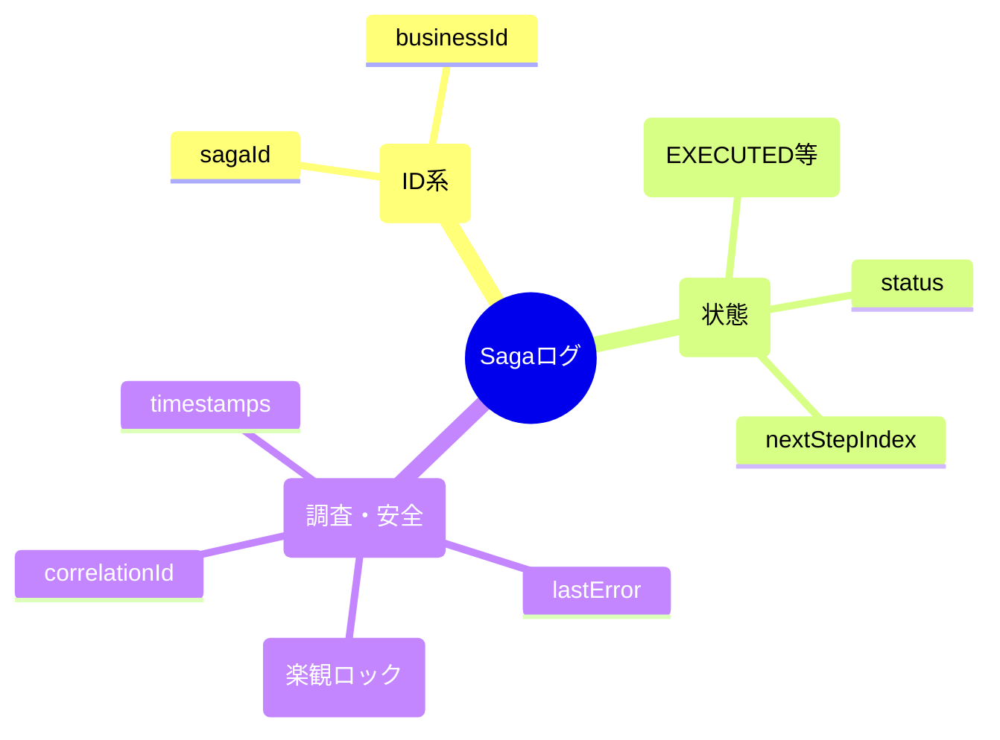
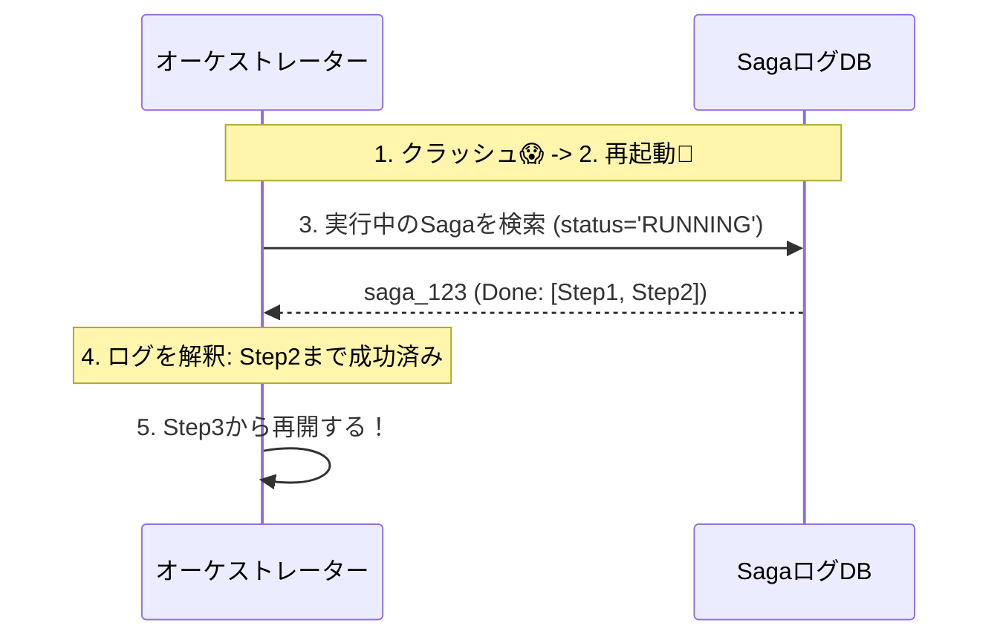
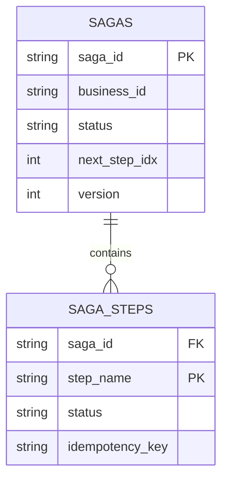

# 第09章：データ設計の最小セット（Sagaログ）📒🧷

## 9-0. まず「Sagaログ」って何をするもの？🧠✨

Sagaは「いくつかの処理（Step）を順番に進めて、途中で失敗したら補償（Compensation）で戻す」やり方だよね🔁🧯
このとき超重要なのが **“途中経過を忘れないこと”** です📍

* アプリが落ちても、**どこまで進んだか**を再開できる🧩
* リトライ（再実行）で、**二重決済**とかを防ぎやすくなる🔁⚠️
* 「なにが起きた？」を後から調査できる🔍📝

Sagaは「ローカルトランザクションの連鎖＋失敗時は補償トランザクション」という考え方なので、**進捗と補償の起点**を残すのが本質です。([microservices.io][1])

---

## 9-1. “最小セット”の考え方：3つに分けると迷わない📦✨

Sagaログに入れる情報は、大きく3カテゴリに分けるとスッキリします😊🧹

1. **識別とひも付け（ID系）** 🪪🔗
2. **進捗（状態・どこまでやったか）** 🚦🗺️
3. **運用（調査・再実行・安全）** 🔍🧰

「最小セット」って言っても、**未来の自分が泣かない最低限**は入れようね😭➡️😊




---

## 9-2. 最小で必須：Sagaログに入れる項目（これだけは外せない）✅📒

### A. 識別とひも付け（ID系）🪪🔗

* **sagaId**：SagaインスタンスのID（例：UUID）
* **businessId**：業務のID（例：orderId / reservationId）

  * 「1注文＝1Saga」なら orderId を businessId にしてOK👌

> ポイント💡
> **sagaId（技術的なID）** と **businessId（業務的なID）** を分けておくと、調査がラクになります🔍✨

### B. 進捗（状態・どこまで）🚦🗺️

* **status**：Saga全体の状態（後で一覧のおすすめを出すよ）
* **steps**：各Stepの実行結果（最低でも「どのStepが成功したか」）
* **currentStep**（または nextStep）：次に実行するStepの位置

> ここが最重要🧠
> **「成功したStepの履歴」がないと、補償の逆順実行ができない** 😵‍💫🧯

### C. 運用（調査・再実行・安全）🔍🧰

* **createdAt / updatedAt**：いつ始まり、いつ更新されたか⏰
* **lastError**：最後のエラー（コード/メッセージ/発生Step）💥
* **version**（推奨）：楽観ロック用（同時更新の事故を減らす）🛡️

---

## 9-3. status（状態）おすすめセット🚦✨

初心者がまず扱いやすいのはこのへん👇（増やしすぎないのがコツ！）

* `RUNNING`（進行中）🏃‍♀️
* `SUCCEEDED`（全部成功）🎉
* `COMPENSATING`（補償中）🧯
* `COMPENSATED`（補償完了＝戻しきった）🔁✅
* `FAILED`（失敗して止まった）💥🛑

「補償が全部できない現実」は後の章でやるけど、ログ設計としては **FAILED のときに “どこまで戻せたか” が追える** のが大事だよ📍

---

## 9-4. steps（Stepの記録）をどう持つ？2つの型があるよ🧩📌

Sagaログで一番悩むのが「stepsをどう保存するか」です😵‍💫
代表はこの2パターン👇

# パターン①：Sagaテーブルに steps をまとめて持つ（学習向き）📦✨

* Saga 1レコードに、stepsを配列（JSON）で持つ
* 実装がシンプルで理解しやすい😊

# パターン②：SagaStepテーブルを分ける（実務向き）🏗️✨

* `sagas` と `saga_steps` を分けて正規化
* Step単位のユニーク制約（重複排除）を作りやすい🛡️
* 集計・調査・再実行が強い💪

この章では **「最小セット」がテーマ**なので、まずは①でイメージを固めて、②も「こうなるよ」を見ておく感じにするね😊📚

---

## 9-5. TypeScriptで「最小Sagaログ」の型を作る🧑‍💻🧷

```ts
// Saga全体の状態（増やしすぎない✨）
export type SagaStatus =
  | "RUNNING"
  | "SUCCEEDED"
  | "COMPENSATING"
  | "COMPENSATED"
  | "FAILED";

// Stepごとの状態
export type StepStatus =
  | "PENDING"      // まだ
  | "EXECUTED"     // 順方向が成功
  | "COMPENSATED"  // 補償が成功
  | "FAILED";      // そのStepで失敗

export type SagaStepLog = {
  stepName: string;            // "AuthorizePayment" みたいに一意っぽく
  status: StepStatus;

  // 冪等性の準備（第16-17章で超重要になる！）
  // 最小セットとして「置き場所だけ」用意しておくと後が楽😊
  idempotencyKey?: string;

  startedAt?: string;          // ISO文字列
  finishedAt?: string;         // ISO文字列
  attempt?: number;            // リトライ回数

  // 調査用（最小でOK）
  lastErrorCode?: string;
  lastErrorMessage?: string;
};

export type SagaLog = {
  sagaId: string;              // UUIDなど
  businessId: string;          // orderIdなど

  status: SagaStatus;

  // どこまで進んだ？（PENDING/EXECUTED が肝）
  steps: SagaStepLog[];

  // 次に実行するStepの目安（indexでもnameでもOK）
  nextStepIndex: number;

  // 監査・調査の最低限
  createdAt: string;
  updatedAt: string;

  // 失敗の要点だけ残す（全文ログは別に出す想定）
  lastError?: {
    stepName?: string;
    code?: string;
    message?: string;
  };

  // 同時更新対策（楽観ロック）
  version: number;

  // 相関ID（後で「ログ追跡」が爆速になる✨）
  correlationId?: string;
  traceparent?: string; // W3C Trace Context をそのまま入れる案もあるよ
};
```

`traceparent` は W3Cの標準ヘッダー形式があるので、分散トレースと相性が良いです📌([W3C][2])
さらに OpenTelemetry は、ログに TraceId/SpanId を入れて「ログとトレースを相関」できる設計になっています🔗📈([OpenTelemetry][3])

---

## 9-6. 例：Sagaログ1件のイメージ（JSON）👀📒

```json
{
  "sagaId": "8b8f6b0b-0d86-4c20-a2aa-6a8f2f0a5c2b",
  "businessId": "order-2026-000123",
  "status": "RUNNING",
  "steps": [
    {
      "stepName": "ReserveStock",
      "status": "EXECUTED",
      "idempotencyKey": "order-2026-000123:ReserveStock",
      "startedAt": "2026-01-30T10:00:00.000Z",
      "finishedAt": "2026-01-30T10:00:01.200Z",
      "attempt": 1
    },
    {
      "stepName": "AuthorizePayment",
      "status": "FAILED",
      "idempotencyKey": "order-2026-000123:AuthorizePayment",
      "startedAt": "2026-01-30T10:00:01.300Z",
      "attempt": 1,
      "lastErrorCode": "PAYMENT_TIMEOUT",
      "lastErrorMessage": "timeout"
    },
    {
      "stepName": "CreateShipment",
      "status": "PENDING"
    }
  ],
  "nextStepIndex": 1,
  "createdAt": "2026-01-30T10:00:00.000Z",
  "updatedAt": "2026-01-30T10:00:03.000Z",
  "lastError": {
    "stepName": "AuthorizePayment",
    "code": "PAYMENT_TIMEOUT",
    "message": "timeout"
  },
  "version": 7,
  "correlationId": "corr-9d0b0a6c",
  "traceparent": "00-4bf92f3577b34da6a3ce929d0e0e4736-00f067aa0ba902b7-01"
}
```

この1件を見るだけで👇が分かるのが理想だよ✨

* どの注文のSaga？（businessId）🛒
* どこまで成功した？（ReserveStockは成功）✅
* どこで失敗した？（AuthorizePayment）💥
* 次にどうする？（補償に行く？リトライ？判断材料がある）🧠



---

## 9-7. DBに落とす最小設計（例：2テーブル構成）🗄️✨

「実務寄り」な形も、軽く見ておこうね👀
（Step単位の重複排除・検索がやりやすい！）

```sql
-- sagas: Saga全体
CREATE TABLE sagas (
  saga_id        TEXT PRIMARY KEY,
  business_id    TEXT NOT NULL,
  status         TEXT NOT NULL,
  next_step_idx  INTEGER NOT NULL,
  last_error_step TEXT,
  last_error_code TEXT,
  last_error_message TEXT,
  correlation_id TEXT,
  traceparent    TEXT,
  version        INTEGER NOT NULL,
  created_at     TEXT NOT NULL,
  updated_at     TEXT NOT NULL
);

CREATE INDEX idx_sagas_business_id ON sagas(business_id);
CREATE INDEX idx_sagas_status ON sagas(status);

-- saga_steps: Step単位（重複排除しやすい）
CREATE TABLE saga_steps (
  saga_id         TEXT NOT NULL,
  step_name       TEXT NOT NULL,
  status          TEXT NOT NULL,
  idempotency_key TEXT,
  attempt         INTEGER,
  started_at      TEXT,
  finished_at     TEXT,
  last_error_code TEXT,
  last_error_message TEXT,

  PRIMARY KEY (saga_id, step_name),
  FOREIGN KEY (saga_id) REFERENCES sagas(saga_id)
);

-- Stepの冪等キーをユニークにして「二重実行」を抑止する案（DBにより方言あり）
-- CREATE UNIQUE INDEX uq_step_idempotency_key ON saga_steps(idempotency_key);
```



---

## 9-8. よくある事故💣（これを避けるだけで強くなる💪）

* **stepsを保存してなくて、補償できない** 😭🧯
* statusだけ保存して、**どのStepが成功したか分からない** 😵
* エラーを残さず、**原因調査が地獄** 🔥🔍
* 更新競合で、**状態が巻き戻る/上書きされる** 🌀（→ versionでガード🛡️）
* 相関IDがなくて、**ログ追跡が迷子** 🧭💦

  * `traceparent` は標準仕様があるので、分散追跡の入口にしやすいよ📌([W3C][2])
  * OpenTelemetryはログとトレースの相関（TraceId/SpanId）を重視してるよ🔗([OpenTelemetry][3])

---

## 9-9. 章末：保存項目チェックリスト✅📋✨

**【必須】これがないとSagaが成立しにくい**

* [ ] sagaId 🪪
* [ ] businessId（orderId等）🛒
* [ ] status 🚦
* [ ] steps（少なくとも“成功済みStep”が分かる）📍
* [ ] nextStepIndex（または現在位置）🧭
* [ ] createdAt / updatedAt ⏰

**【強く推奨】運用で効く**

* [ ] lastError（step / code / message）💥
* [ ] version（楽観ロック）🛡️
* [ ] correlationId or traceparent 🔗

**【余裕が出たら】後で伸ばせる**

* [ ] attempt（リトライ回数）🔁
* [ ] startedAt/finishedAt（各Stepの所要時間）⏱️
* [ ] 期限（deadline / timeoutAt）⏰🛑

---

## 9-10. ミニ演習（3つ）📝✨

**演習1：orderSagaのstepsを書き出そう🛒📦**
注文SagaでありがちなStepを3〜5個書いて、各Stepに「補償」を1つずつペアで書いてみよう✍️🧯
例：在庫確保 → 在庫戻し、決済確保 → 返金 など

**演習2：status遷移をざっくり描こう🚦🗺️**
`RUNNING → SUCCEEDED`
`RUNNING → COMPENSATING → COMPENSATED`
`RUNNING → FAILED`
みたいに矢印でOK👌

**演習3：最小SagaログのJSONを1件作ろう📒👀**
「Step2で失敗→補償に入る」パターンのログを、自分の業務ドメインで1件作ってみよう😊

---

## 9-11. AI活用のコツ（短いプロンプト例）🤖💡

* 「Sagaログの型（TypeScript）を、statusとsteps中心で最小構成にして。lastErrorとversionも入れて」
* 「sagas と saga_steps の2テーブル案をSQLで。検索用indexも」
* 「このSagaログJSONを見て、補償の起点（成功済みStep）を説明して」

AIに“案”を出させて、**あなたが「必須/推奨/任意」に仕分けする**のが最強だよ✨🧠

[1]: https://microservices.io/patterns/data/saga.html?utm_source=chatgpt.com "Pattern: Saga"
[2]: https://www.w3.org/TR/trace-context/?utm_source=chatgpt.com "Trace Context"
[3]: https://opentelemetry.io/docs/specs/otel/logs/?utm_source=chatgpt.com "OpenTelemetry Logging"
