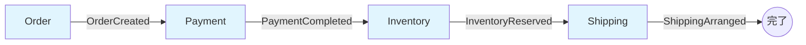
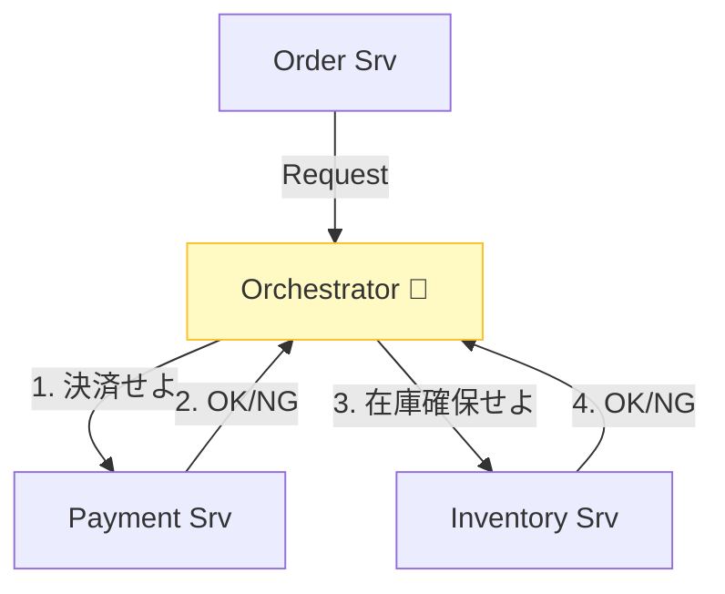

# 第10章：Saga実装スタイル2種類（全体像）🕺🎻

## 10.0 この章でできるようになること🎯💡

* **Choreography（イベント連鎖）🕺** と **Orchestration（司令塔）🎻** を、図と言葉でサクッと説明できる
* それぞれの **「得意なこと／事故りやすいこと」** を知って、雰囲気で選ばないようにする🧠✨
* 次章（11〜12章）で深掘りする前に、**全体地図🗺️** を頭に入れる

---

## 10.1 まず結論：Sagaは「どうやって連携させるか」が2通りある🌈

Sagaは「複数サービスの処理を、失敗しても壊れないように進める」やり方で、代表的な実装の進め方（協調の仕方）が **2種類**あるよ〜👇✨

* **Choreography（コレオグラフィ）🕺**
  参加者（各サービス）が **イベントを投げ合って** 次を進める
* **Orchestration（オーケストレーション）🎻**
  **司令塔（オーケストレーター）** が、次に誰が何をするかを決める


これは定義レベルでも広く同じ説明がされてるよ📚✨ ([microservices.io][1])

---

## 10.2 イメージでつかむ：同じ注文Sagaでも “進め方” が違う🛒💳📦

### 題材：注文→決済→在庫→発送（失敗したら補償）🧯🔁

ここでは「注文を確定したい！」っていう1つの目的を、複数サービスで達成する例にするね😊

---

## 10.3 Choreography（イベント連鎖）🕺📣🔗

### ✅ ざっくり定義

* 各サービスが **ローカルトランザクション（自分のDB更新）** をして
* **イベントを発行**して
* それを受け取った別サービスが次を進める、という“連鎖”スタイル✨ ([microservices.io][1])

### 🗺️ 流れ（成功パス）

1. Orderサービス：注文を「作成」→ `OrderCreated` を発行📣


2. Paymentサービス：`OrderCreated` を購読→ 決済 → `PaymentCompleted` 発行💳
3. Inventoryサービス：`PaymentCompleted` を購読→ 在庫確保 → `InventoryReserved` 発行📦
4. Shippingサービス：`InventoryReserved` を購読→ 発送準備 → `ShippingArranged` 発行🚚



### 😵 失敗したら？

* どこかが失敗イベント（例：`PaymentFailed`）を出して
* それをトリガに、関係者が補償（例：注文キャンセル）を走らせる🧯
  ※「誰がどの失敗を見て、どの補償をするか」をイベント設計で守る感じ！

### 👍 強み

* サービス同士が比較的 **疎結合** になりやすい✨
* 司令塔がいないので、中央の“指揮サービス”が落ちて全停止…みたいなのは避けやすい🌪️

### ⚠️ つらみ（初心者が事故りやすい）

* **全体像が見えにくい**（イベントが増えるほど迷子）😵‍💫
* 「いつの間にか A が B に依存、B が C に依存、C が A に…」みたいな **イベント地獄** になりやすい🔥
* テストやデバッグで「結局どこから追うの？」になりがち👀💦

---

## 10.4 Orchestration（司令塔）🎻🧠📍

### ✅ ざっくり定義

* 真ん中に **オーケストレーター（司令塔）** がいて
* 「次はPaymentやって」「OKなら次はInventory」みたいに **順番・分岐・失敗時の補償** を管理する方式だよ🎻✨
  オーケストレーターは「状態の保存」「各タスク結果の解釈」「補償での復旧」までやる、って説明されることが多いよ📍 ([Microsoft Learn][2])

### 🗺️ 流れ（成功パス）

1. Orchestrator：Saga開始（注文IDを受け取る）🎬


2. Orchestrator → Paymentへ「決済してね」コマンド✉️
3. Payment → Orchestratorへ「成功/失敗」を返信📩
4. 成功なら Orchestrator → Inventoryへ「在庫確保してね」📦
5. …というふうに司令塔が順番に進める🎻



### 😵 失敗したら？

* Orchestratorが「どこまで成功したか」を見て、**逆順に補償** を指示する🧯🔁
  （例：在庫確保まで終わってた → 在庫戻し → 決済取消/返金 → 注文キャンセル）

### 👍 強み

* **全体の見通しが良い**（フローが1か所に集まる）🗺️✨
* 監視・運用がやりやすい（状態がまとまる）🔎
* 複雑な分岐が入っても「司令塔に書けば追える」になりやすい🎻

### ⚠️ つらみ

* オーケストレーターが肥大化すると **“神サービス”** になりがち👑💥
* 司令塔が落ちると影響が大きい（冗長化や再開設計が大事）🧯
* 設計の責任が集中するので、最初の設計力が少し必要💦

---

## 10.5 2つを比較！パッと見表🧁📊


| 観点      | Choreography 🕺    | Orchestration 🎻  |
| ------- | ------------------ | ----------------- |
| 主役      | 各サービス（イベント連鎖）      | 司令塔（オーケストレーター）    |
| 分かりやすさ  | 小規模なら○、大規模で迷子😵‍💫 | 全体像が見えやすい🗺️      |
| 変更のしやすさ | イベント設計が上手いと強い✨     | 司令塔の修正で流れを変えやすい🔧 |
| 事故りポイント | イベント増殖、循環依存、命名崩壊🔥 | 神サービス化、責務過多👑💥   |
| 向き      | 単純な連鎖・疎結合重視        | 複雑な分岐・監視重視        |

（「2種類が典型」って整理は、主要な設計ドキュメントでも同じだよ📚） ([Microsoft Learn][2])

---

## 10.6 “どっち選ぶ？” 迷ったときの目安🧭💕

判断のコツは、めっちゃシンプルにすると👇

### 🎻 Orchestration を選びやすいケース

* 分岐が多い（例：本人確認、与信、クーポン、再計算…）🌀
* 失敗時の戻しが難しくて、**順番を厳密に管理したい**🧯
* 運用で「今どこ？」を追いたい（監視・調査が重要）🔎

### 🕺 Choreography を選びやすいケース

* 連鎖が短くて分かりやすい（2〜3段くらい）🔗
* 各サービスが「自分のイベントだけ見ればいい」設計が作れる✨
* 中央にロジックを集めたくない（チーム分離・自律性）🏝️

※クラウドのワークフロー系でも、Saga（補償）をワークフローで扱う話がよく出るよ（＝オーケストレーション寄りの考え方と相性がいい）📮✨ ([Google Cloud Documentation][3])

---

## 10.7 TypeScriptでの “形” を見る（ミニ雛形）🧩🧑‍💻✨

> ここは「雰囲気をつかむ用」だから、細部は次章でしっかりやるよ😊
> ポイントは **責務の置き場所** だけ見ること👀💕

### 🕺 Choreography：イベント購読で進む（超ミニ）


```ts
// 例：Paymentサービス側（イベントを受けたら自分の仕事をする）
type OrderCreated = { orderId: string; amount: number };

async function onOrderCreated(evt: OrderCreated) {
  // 1) 自分のDBを更新（ローカルトランザクション）
  // 2) 外部決済などを実行
  // 3) 結果イベントを発行
  // publish({ type: "PaymentCompleted", orderId: evt.orderId })
  // 失敗なら publish({ type: "PaymentFailed", orderId: evt.orderId, reason: "..." })
}
```

### 🎻 Orchestration：司令塔が順番に指示（超ミニ）


```ts
type SagaState =
  | { status: "STARTED"; orderId: string }
  | { status: "PAID"; orderId: string; paymentId: string }
  | { status: "RESERVED"; orderId: string; paymentId: string; reservationId: string }
  | { status: "COMPLETED"; orderId: string }
  | { status: "COMPENSATING"; orderId: string };

async function runOrderSaga(orderId: string) {
  // 0) 状態を保存（どこまで進んだか）
  // save({ status: "STARTED", orderId })

  try {
    const paymentId = await pay(orderId);         // Paymentへ指示
    // save({ status: "PAID", orderId, paymentId })

    const reservationId = await reserve(orderId); // Inventoryへ指示
    // save({ status: "RESERVED", orderId, paymentId, reservationId })

    await arrangeShipping(orderId);               // Shippingへ指示
    // save({ status: "COMPLETED", orderId })
  } catch (e) {
    // save({ status: "COMPENSATING", orderId })
    // 進捗に応じて逆順に補償（在庫戻し→返金→注文キャンセル…）
    await compensateIfNeeded(orderId);
    throw e;
  }
}
```

---

## 10.8 ありがち事故まとめ（この章で先に予防注射💉⚠️）

### 🕺 Choreographyで起きがち


* 「イベント名が適当」→ 後で全員が混乱🌀
* 「誰がどの失敗を見て補償するか」曖昧 → 補償漏れ🧯💦
* イベントが増えて **全体が読めない** 😵‍💫

（イベント連鎖型の説明や注意点は、Saga解説で定番として触れられるよ） ([microservices.io][4])

### 🎻 Orchestrationで起きがち


* 司令塔に全部詰め込み → 神サービス化👑💥
* 状態保存が雑 → 再開できずに泣く😭
* 司令塔の責務が「業務ロジック全部」になって、境界が崩壊🚧

（オーケストレーターが「状態を保存し、結果を解釈し、補償で復旧する」っていう責務を持つのが一般的な整理だよ） ([Microsoft Learn][2])

---

## 10.9 ミニ演習（3分）📝✨

次のシナリオで「どっちが先に来そう？」を選んでみよ〜😊💕

1. **通知（メール・Push）**：失敗しても致命傷じゃない📩
   → 🕺 / 🎻 どっち？
2. **決済＋在庫＋発送**：失敗するとお金・在庫が壊れる💳📦
   → 🕺 / 🎻 どっち？
3. **分岐が多い**：本人確認の結果で処理が変わる🪪
   → 🕺 / 🎻 どっち？

（答えの“考え方”は次章でバチッと固めるよ🔥）

---

## 10.10 まとめ🌟

* Sagaの進め方は大きく **イベント連鎖（Choreography）🕺** と **司令塔（Orchestration）🎻** の2つ
* **分岐・運用・調査が重いほど🎻が分かりやすい**、シンプル連鎖で疎結合を活かすなら🕺も強い
* どちらでも「状態（進捗）」「失敗時の補償」「メッセージの整合性」が超大事🧠🧯✨

# 次は、まず **Choreography入門（第11章）📣🔗** でイベント連鎖の世界観を体験していくよ〜😊📚✨

[1]: https://microservices.io/patterns/data/saga.html?utm_source=chatgpt.com "Pattern: Saga"
[2]: https://learn.microsoft.com/en-us/azure/architecture/patterns/saga?utm_source=chatgpt.com "Saga Design Pattern - Azure Architecture Center"
[3]: https://docs.cloud.google.com/workflows/docs/best-practice?utm_source=chatgpt.com "Best practices for Workflows"
[4]: https://microservices.io/post/sagas/2019/08/15/developing-sagas-part-3.html?utm_source=chatgpt.com "Implementing a choreography-based saga"
