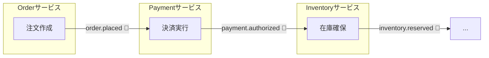
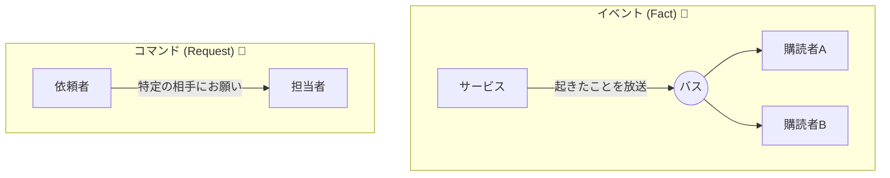
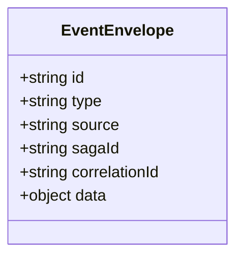
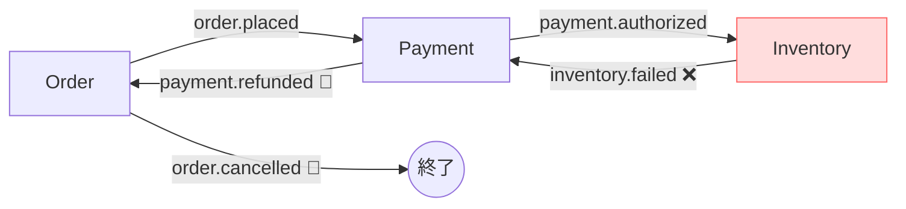

# 第11章：Choreography入門（イベントで連鎖する）📣🔗

## この章のゴール🎯✨

* Choreography（コレオグラフィ）の「世界観」を言葉で説明できるようになる😊
* 「イベント＝事実」「コマンド＝お願い」を混同しないで設計できるようになる🧠💡
* 事故りやすいポイント（命名地獄・責務崩壊・デバッグ不能）を、最初から避けられるようになる🛡️🚧

---

# 11.1 Choreographyってどんな感じ？🕺🔗


Choreographyは、ざっくり言うと…

> **みんなが“笛（イベント）”を聞いて、自分の役だけ踊る**🕺🎶
> そして踊り終わったら、また次の笛（イベント）を鳴らす📣➡️📣

つまり、**中央の司令塔（オーケストレーター）がいない**のが特徴だよ💡



各サービスが **「イベントを受け取る → 自分の処理（ローカルトランザクション）をする → 次のイベントを出す」** を繰り返して、Sagaが前に進む感じ🙌

Choreographyは「疎結合になりやすい」一方で「全体の流れが見えにくい」っていうトレードオフがある、とよく説明されるよ📌 ([temporal.io][1])

---

# 11.2 例：注文Sagaを“イベント連鎖”でやってみる🛒💳📦


登場サービス（例）👇

* Order（注文）
* Payment（決済）
* Inventory（在庫）
* Shipping（発送）

流れ（成功パターン）🌈

1. Order が注文を作って **`OrderPlaced`** を出す📣
2. Payment がそれを聞いて決済して **`PaymentAuthorized`** を出す💳✨
3. Inventory がそれを聞いて在庫を確保して **`InventoryReserved`** を出す📦✅
4. Shipping がそれを聞いて発送準備して **`ShippingRequested`** を出す🚚📣

このときのポイントは超重要で👇
**「次に誰を呼ぶか」を決めて呼ぶんじゃなくて、イベント（事実）を出すだけ**ってこと😊
“誰が反応するか”は、購読してる側が決めるの🧡

---

# 11.3 「イベント」と「コマンド」を分けるだけで事故が減る🧯✨


初心者が一番ハマりやすいのがここ😵‍💫

## ✅ イベント（Event）＝起きた事実📣

* `PaymentAuthorized`（決済が承認された）
* `InventoryReservationFailed`（在庫確保に失敗した）

イベントは **「過去形」** が多いよ🕰️
イベントは「みんなに共有していいニュース」📰✨

## ✅ コマンド（Command）＝お願い・指示📩

* `AuthorizePayment`（決済してね）
* `ReserveInventory`（在庫確保してね）

Choreographyの学習では、基本は **イベント中心**で考えるのが分かりやすいよ😊
（コマンドを多用すると、イベントバスが“RPCっぽく”なって破綻しやすい⚠️）



---

# 11.4 イベントは「封筒（メタ情報）」が命📮🔎

イベントって「本文」だけじゃなくて、**追跡のための情報**が超大事✨
最近の現場だと、イベントのメタデータを標準化しようとして **CloudEvents** を採用することが多いよ📦🌩️
CloudEventsはCNCFの仕様として整備されていて、イベントの共通属性（id/type/source など）を揃えやすいんだ🧠 ([CNCF][2])

## まずは学習用の「最小イベント封筒」💌


* `eventId`：イベント自体のID（重複検知にも使う）🆔
* `type`：イベント名（例：`payment.authorized.v1`）🏷️
* `occurredAt`：発生時刻🕰️
* `sagaId`：このSagaのID（たとえば注文ID）🔗
* `correlationId`：分散トレース/ログで紐づけるID🧵
* `data`：本文（業務データ）📦

TypeScript例（雰囲気）👇

```ts
// 学習用：CloudEventsっぽい「イベント封筒」(最小)
export type EventEnvelope<TType extends string, TData> = {
  specversion: "1.0";
  id: string;               // eventId
  type: TType;              // e.g. "payment.authorized.v1"
  source: string;           // e.g. "payment-service"
  time: string;             // ISO8601
  subject?: string;         // e.g. orderId
  correlationId: string;    // 追跡用
  sagaId: string;           // Saga(例: 注文)のID
};
```



---

# 11.5 “設計のコツ”３つだけ覚えよ🧠✨

## コツ①：イベント名は「安定する名詞」に寄せる🏷️🧊


悪い例😱

* `DoPayment`（命令っぽい）
* `PaymentDoneMaybe`（曖昧）

良い例😊

* `payment.authorized.v1`
* `payment.authorization_failed.v1`

ポイント👇

* **何が起きたか**が分かる
* **粒度が安定**する（細かすぎて増殖しない）

---

## コツ②：イベントの本文は「必要最小限」📦✂️


イベントに「何でも全部」入れたくなるけど…入れすぎると将来つらい😵‍💫

* **入れて良い**：次のサービスが必要なキー（`orderId`、`amount`、`reservationId` など）✅
* **入れない方が良い**：巨大な注文詳細まるごと、個人情報、画面表示用データ❌

理由👇

* 変更に弱くなる（1箇所の変更が全サービスに波及）🌪️
* 取り扱いリスク（PIIなど）も増える⚠️

---

## コツ③：「イベント仕様」をドキュメント化して共有する📘🤝

イベント駆動は、HTTP APIよりも「暗黙」が増えやすいのが弱点😵
そこで **AsyncAPI** みたいな仕様で、イベントを“機械可読”にまとめるのが今どきの流れだよ🧩✨
AsyncAPIはプロトコル非依存で、イベント駆動APIを記述できるよ📚 ([asyncapi.com][3])

（学習段階では「イベント一覧＋JSON例」でもOK！でも、将来はAsyncAPIに繋がる🫶）

---

# 11.6 Choreographyが事故りやすいポイント図鑑😈📚

## 事故①：イベント名が増殖して“辞書”が崩壊📚💥

* `OrderCreated` と `OrderPlaced` と `OrderSubmitted` が乱立…😵‍💫
  → **同じ意味なら1つに寄せる**、どうしても分けるなら「状態の違い」を明確にする🧠✨

---

## 事故②：責務が崩壊して“なんでもサービス”が誕生🧟‍♀️

例：Orderサービスが在庫の都合まで判断し始める…
→ **自分の境界のことだけ決める**（他サービスの都合はイベントで知る）🚧

---

## 事故③：全体の流れが見えなくてデバッグ不能🔎🌀

Choreographyは「司令塔がいない」から、ログが散らばると追えない😭
→ 最低限これだけ入れる👇

* `sagaId`（注文IDなど）🔗
* `correlationId`（全ログ共通）🧵
* `eventId`（重複/再処理の検知）🆔

---

## 事故④：同じイベントが2回届いて二重処理👻🔁

現実のメッセージングは「だいたい最低1回（at-least-once）」になりやすいよ⚠️
だから **重複しても壊れない**工夫が必要（冪等性は後の章でガッツリやるよ🔑）

参考として、JetStreamみたいに「メッセージIDヘッダで重複排除」を支援する仕組みもあるよ（例：`Nats-Msg-Id`）🧷 ([docs.nats.io][4])

---

# 11.7 “補償”はChoreographyだとどうなるの？🧯🔁


Choreographyでも補償はできるよ😊
やり方はシンプルで👇

* 下流で失敗したら **失敗イベント** を出す📣😱
  例：`inventory.reservation_failed.v1`
* それを聞いた上流が **自分の補償** をする🧯
  例：Paymentが「返金/取消」をして `payment.refunded.v1` を出す💸🔁

ポイント👇

* **補償は“逆順で起きやすい”**（最後にやったことから戻る）🔁
* でも「誰がどこまで戻すか」は、イベント設計が雑だとすぐ崩壊する😵‍💫
  → だからイベント名と責務が超大事なんだ🧠✨



---

# 11.8 ミニ実装イメージ（学習用）🧪💻

「イベントバス」を雑に抽象化して、雰囲気を掴もう😊
（本番のKafka/NATS/RabbitMQは次の段階でOK👌）

```ts
type Handler<T> = (event: T) => Promise<void>;

class InMemoryBus {
  private handlers: Record<string, Handler<any>[]> = {};

  subscribe<T>(type: string, handler: Handler<T>) {
    (this.handlers[type] ??= []).push(handler);
  }

  async publish<T>(type: string, event: T) {
    const hs = this.handlers[type] ?? [];
    for (const h of hs) await h(event);
  }
}

// 例：イベント型
type OrderPlaced = EventEnvelope<"order.placed.v1", { orderId: string; amount: number }>;
type PaymentAuthorized = EventEnvelope<"payment.authorized.v1", { orderId: string; paymentId: string }>;
```

ここでの学びポイント✨

* **中央の司令塔はいない**
* 各サービスは **subscribe** して、処理したら **publish** するだけ📣🔁

---

# 章末ミニ演習📝💕（手を動かす系！）

## 演習A：イベント設計（命名と責務）🏷️🧠

次の注文フローで、イベントを **7個** 作ってみよう😊

* 注文作成
* 決済
* 在庫確保
* 発送開始
* どこかで失敗した場合の失敗イベント
* 補償のイベント（返金/在庫戻し など）

チェック✅

* イベント名は「起きた事実」になってる？（命令になってない？）
* 本文は最小限？（キー中心になってる？）
* `sagaId` と `correlationId` を入れた？🧵

---

## 演習B：失敗時の“戻り方”を描く🧯🔁

「在庫確保に失敗」したとき👇

* どのサービスが、どのイベントを出す？
* どのサービスが、何を補償する？
* 補償が終わった合図（イベント）は何？📣

---

# まとめ🌟

* Choreographyは **イベントの連鎖でSagaを進める**スタイル🕺🔗
* うまくいく鍵は、**イベント設計（命名・責務・封筒）**📮✨
* 事故りポイントは「増殖」「責務崩壊」「追えない」「二重処理」😵‍💫👻
* `sagaId / correlationId / eventId` を最初から入れておくと未来の自分が助かるよ🥹🫶

[1]: https://temporal.io/blog/to-choreograph-or-orchestrate-your-saga-that-is-the-question?utm_source=chatgpt.com "Saga Orchestration vs Choreography"
[2]: https://www.cncf.io/announcements/2024/01/25/cloud-native-computing-foundation-announces-the-graduation-of-cloudevents/?utm_source=chatgpt.com "Cloud Native Computing Foundation Announces the ..."
[3]: https://www.asyncapi.com/docs/reference/specification/v3.0.0?utm_source=chatgpt.com "3.0.0 | AsyncAPI Initiative for event-driven APIs"
[4]: https://docs.nats.io/using-nats/developer/develop_jetstream/model_deep_dive?utm_source=chatgpt.com "JetStream Model Deep Dive - NATS Docs"
