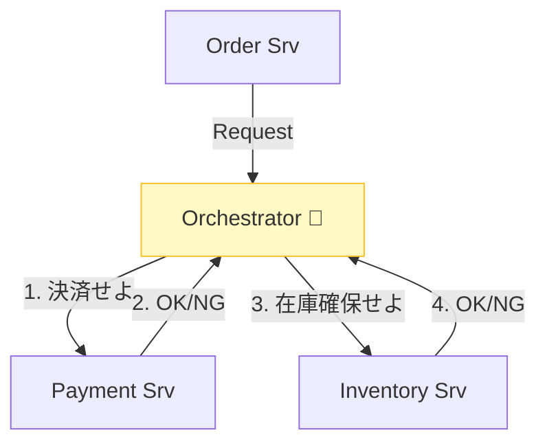
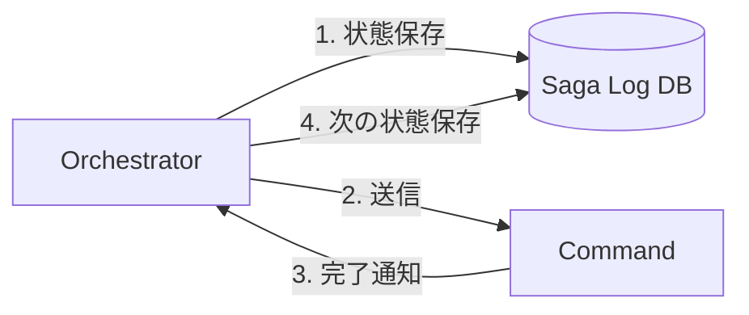
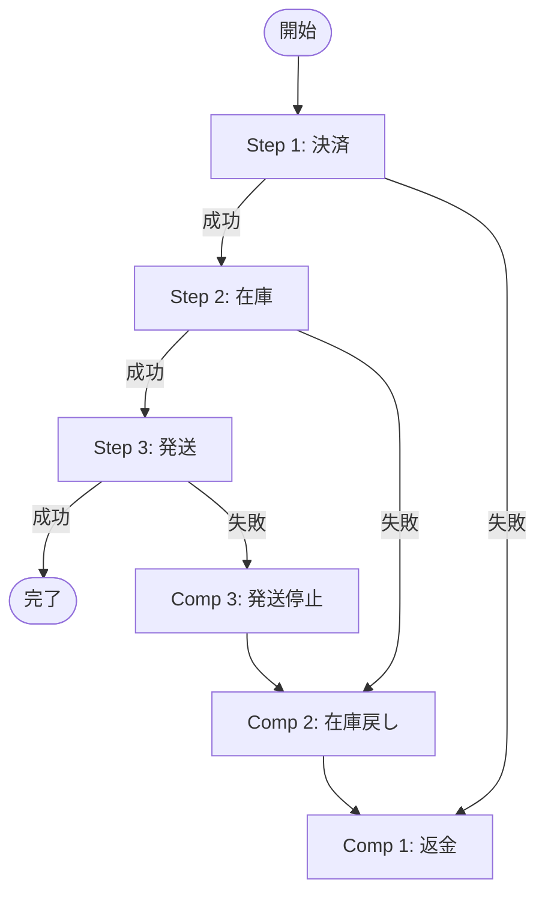
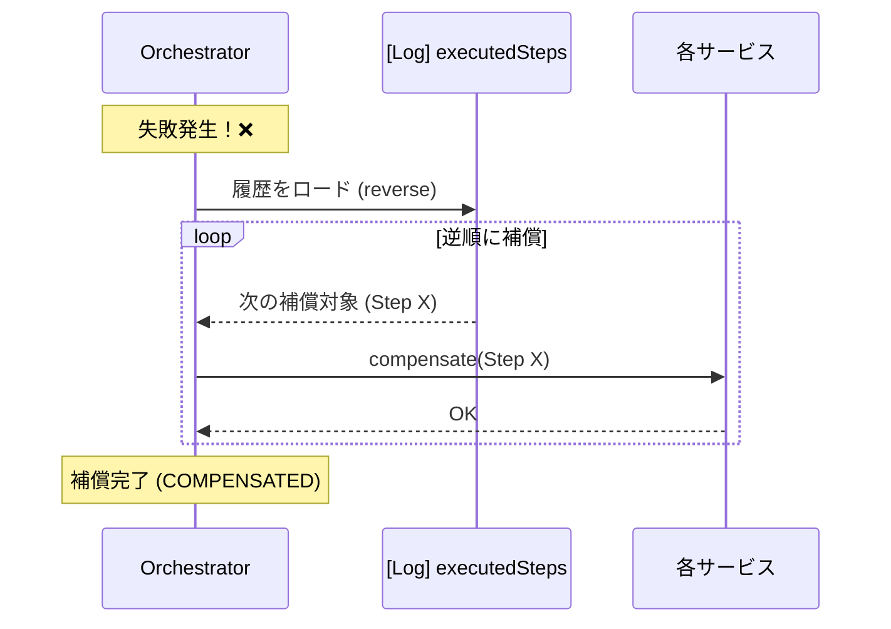

# 第12章：Orchestration入門（司令塔の役割）🎻🧠

## この章でできるようになること🎯✨

* 「オーケストレーション（司令塔方式）」が何かを説明できる😊
* 司令塔（Orchestrator）が**判断すること／しないこと**を整理できる🧹
* “最小Saga”の**司令塔ToDoリスト**を自分で書ける📝💖

---

# 1) Orchestrationってなに？🎻✨（ひとことで）

オーケストレーションは、**中央の司令塔（オーケストレーター）が、各サービスに「次はこれやってね」って指示して、進捗を記録して、失敗したら補償も指示する方式**だよ📣🧾
MicrosoftのAzure Architecture Centerでも、オーケストレーターが**状態を保存し、各タスクの状態を解釈し、補償トランザクションで回復**すると説明されてるよ📚✅ ([Microsoft Learn][1])

---

# 2) たとえ話でイメージする🎬🛒💳📦

「注文の旅」を想像してみよ〜🚶‍♀️✨
例：

1. 注文を作る🛒
2. 決済する💳
3. 在庫を確保する📦
4. 発送手配する🚚

## ✅ 司令塔方式だとこうなる

* 司令塔が「次は決済ね！」って指示する🎻📣
* 各サービスは、言われたことを実行して「できたよ／失敗したよ」を返す📨
* 司令塔は「今どこまで成功したか」を**記録**する🧾
* 途中で失敗したら、司令塔が「じゃあ戻そう！」って**補償を逆順で指示**する🧯🔁




---

# 3) 司令塔が判断すること（超重要）🧠✅

司令塔の仕事は「実行」じゃなくて「指揮」だよ🎻✨
代表的にはこんな感じ👇

## 3.1 次に進むか？止めるか？を決める🚦

* Step Aが成功 → Step Bへ✅
* Step Bが失敗 → 補償へ🧯
* タイムアウトした → 失敗扱い？リトライ？⏰

## 3.2 “進捗”を記録する📍🧾

* どこまで終わった？
* どのStepが成功した？
* いま状態は何？（実行中／補償中／完了…）

AzureのSagaパターン説明でも、オーケストレーターが状態を保存して判断するとされてるよ🗂️ ([Microsoft Learn][1])



## 3.3 失敗時に「補償」を発動する🧯🔁

* 成功したStepだけを逆順で戻す（できる範囲で）
* 補償が失敗したら？ → 追加のエラー扱い（人手対応や再試行）へ🚨

---

# 4) 司令塔が “やらないこと” も決めよう🙅‍♀️🧱

ここ、設計が急に上手くなるポイントだよ✨

## ❌ 司令塔に入れない方がいいもの

* 決済の細かいロジック全部💳（それは決済サービスの責務）
* 在庫計算の詳細📦（在庫サービスの責務）
* 発送会社ごとの分岐地獄🚚（発送サービスの責務）

## ✅ 司令塔が持つのは「薄い判断」

* 成功/失敗の判定
* 次のStepの選択
* 状態の記録
* 補償の開始と順番



---

# 5) Orchestrationの“強み”と“弱み”🌟🧯

## 🌟 強み（学びやすい＆運用しやすい）

* 流れが一箇所で見える👀✨
* ログ・監視がまとめやすい🔎
* 失敗時の補償も、司令塔中心で整理できる🧠

## 🧯 弱み（やりすぎ注意）

* 司令塔が肥大化しがち🍔💦
* 司令塔が止まると全体が止まりやすい🛑
  → だから「やらないこと」を決めるのが大事だったね🙆‍♀️✨

---

# 6) “最小構成”の全体図（コマンドと結果）🗺️📨

司令塔方式は、ざっくりこういう会話になるよ👇

* 司令塔 → 決済サービス：「決済して」📣
* 決済サービス → 司令塔：「成功したよ／失敗したよ」📨
* 司令塔 → 在庫サービス：「在庫確保して」📣
* …
* 失敗したら：司令塔 → 「補償して」🧯

この “指示→結果→次を決める” の繰り返しが、オーケストレーションの心臓部だよ💓🎻

---

# 7) TypeScriptで見る「司令塔の骨格」🦴🧑‍💻

ここでは**最小の形**を見て、頭の中に型を作るよ😊✨
（本格実装は次章以降で育てていくイメージ🌱）

```ts
type SagaStatus =
  | "PENDING"
  | "RUNNING"
  | "COMPLETED"
  | "FAILED"
  | "COMPENSATING"
  | "COMPENSATED";

type StepResult = { ok: true } | { ok: false; reason: string };

type Step = {
  name: string;
  run: () => Promise<StepResult>;
  compensate?: () => Promise<void>;
};

type SagaLog = {
  sagaId: string;
  status: SagaStatus;
  executed: string[]; // 実行済みStep名（順方向）
  startedAt: number;
  updatedAt: number;
  lastError?: string;
};

async function runSaga(sagaId: string, steps: Step[]): Promise<SagaLog> {
  const log: SagaLog = {
    sagaId,
    status: "RUNNING",
    executed: [],
    startedAt: Date.now(),
    updatedAt: Date.now(),
  };

  try {
    for (const step of steps) {
      const result = await step.run();

      if (!result.ok) {
        throw new Error(`[${step.name}] failed: ${result.reason}`);
      }

      log.executed.push(step.name);
      log.updatedAt = Date.now();
    }

    log.status = "COMPLETED";
    log.updatedAt = Date.now();
    return log;
  } catch (e) {
    log.status = "FAILED";
    log.lastError = e instanceof Error ? e.message : String(e);
    log.updatedAt = Date.now();

    // 補償フェーズ（逆順）
    log.status = "COMPENSATING";
    log.updatedAt = Date.now();

    const executedSteps = steps.filter(s => log.executed.includes(s.name)).reverse();
    for (const step of executedSteps) {
      if (step.compensate) {
        await step.compensate();
      }
    }

    log.status = "COMPENSATED";
    log.updatedAt = Date.now();
    return log;
  }
}
```




## ここで押さえるポイント✅✨

* 司令塔は「順方向Step」を順番に実行しつつ、**実行済みを記録**してる📒
* 失敗したら、実行済みだけを**逆順に補償**してる🧯🔁
* この章では「骨格」だけ！

  * 本当はここに、タイムアウト⏰／リトライ🔁／冪等性🔑／永続化🗂️／観測性🔎 が乗ってくるよ（後の章でちゃんとやる💪）

---

# 8) 「自作オーケストレーター」以外の選択肢もあるよ🧰✨（最新の代表例）

実務だと、司令塔を“自作”だけでなく、**ワークフロー基盤**に任せることも多いよ😊

* **Temporal**：Saga（補償）を含む長期ワークフローを扱う代表例。Sagaをワークフロー内のパターンとして紹介してるよ📚 ([docs.temporal.io][2])

  * Temporalは「ワークフローをリプレイできる（durable execution）」ために、ワークフロー側のコードに“決定性”が必要…みたいな考え方も出てくるよ🔁🧠 ([learn.temporal.io][3])

* **AWS Step Functions**：サーバーレスでSaga（補償）を組み立てる設計例が公式にあるよ☁️📮 ([AWS ドキュメント][4])

* **Azure（設計パターンとしてのSaga）**：オーケストレーション／コレオグラフィの両方を整理してるよ🧾 ([Microsoft Learn][1])

> ここでは「そういう道具もあるんだ〜」くらいでOK🙆‍♀️
> まずは “司令塔の考え方” を体に入れるのが勝ち✨🎻

---

# 9) 章末演習：司令塔ToDoを書き出そう📝🎻💖

次の「注文フローSaga」を想定して、**司令塔のToDo**を書いてみてね😊
（答えは1つじゃないよ✨）

## お題🛒

* Step1：注文作成
* Step2：決済
* Step3：在庫確保
* Step4：発送手配

## 9.1 ToDoテンプレ（これを埋めるだけでOK）✅

1. 司令塔が持つSaga IDは？🆔
2. 状態（Status）は何種類にする？📍
3. 進捗として最低限何を保存する？🧾
4. Stepごとの「成功の判定」は何？✅
5. Stepごとの「失敗時の補償」は何？🧯
6. タイムアウトはどこにかける？⏰（決済？在庫？）
7. リトライして良い失敗／ダメな失敗はどれ？🔁⚠️
8. ログに残すべき“調査用の情報”は何？🔎

## 9.2 追加ミニ問題（サクッと）💡

* 「司令塔がやらないこと」を3つ書こう🙅‍♀️🧱
* 司令塔方式が分かりやすい理由を、1文で書こう✍️✨

---

# コラム：TypeScriptの“いま”をちょいだけ👀⚡

大規模コードベースで設計を回すとき、コンパイル速度もけっこう大事だよね😊
TypeScriptは **5.9がリリース**されていて、さらに **TypeScript 7（Project Corsa）としてGo移植による大幅高速化**の話が進んでるよ🚀 ([Microsoft for Developers][5])
（型で状態機械を作るような設計とも相性が良くなる流れ〜✨🧠）

[1]: https://learn.microsoft.com/en-us/azure/architecture/patterns/saga?utm_source=chatgpt.com "Saga Design Pattern - Azure Architecture Center"
[2]: https://docs.temporal.io/evaluate/use-cases-design-patterns?utm_source=chatgpt.com "Temporal Use Cases and Design Patterns"
[3]: https://learn.temporal.io/tutorials/go/background-check/durable-execution/?utm_source=chatgpt.com "Develop code that durably executes"
[4]: https://docs.aws.amazon.com/prescriptive-guidance/latest/patterns/implement-the-serverless-saga-pattern-by-using-aws-step-functions.html?utm_source=chatgpt.com "Implement the serverless saga pattern by using AWS Step ..."
[5]: https://devblogs.microsoft.com/typescript/announcing-typescript-5-9/?utm_source=chatgpt.com "Announcing TypeScript 5.9"
