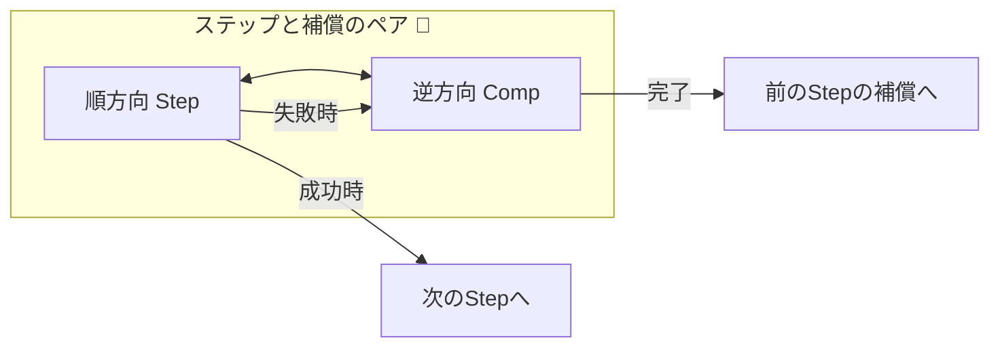
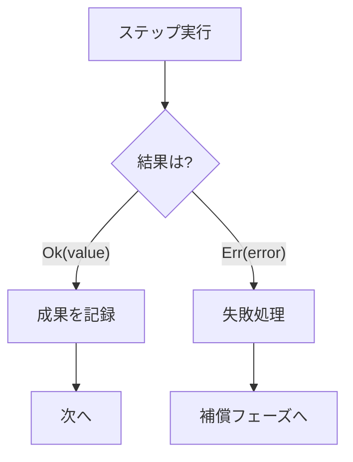
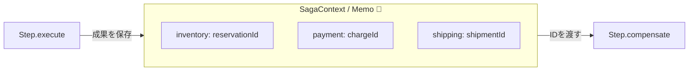
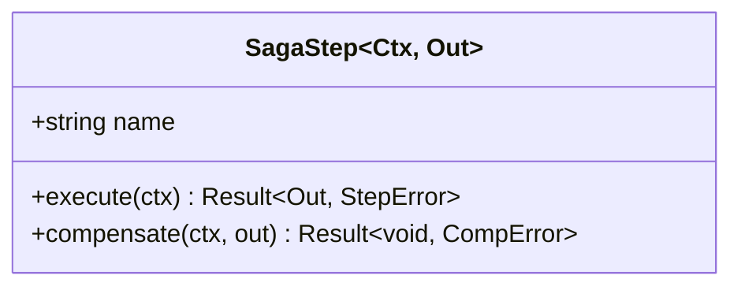

# 第13章：最小Sagaの設計（Step/Compensationの型）🧩🧠

## 13.1 この章でできるようになること 🎯✨

* Sagaの最小単位「Step（順方向）＋Compensation（補償）」を**ペアで設計**できるようになる ✅🧯
* 「順序」「前提」「戻し方」を、**コードの形（型）としてブレずに表現**できるようになる 🧩🧠
* 次章で動かすための“設計テンプレ”を完成させる 🏗️💻

---

## 13.2 まずは超重要：Sagaの最小単位は“ペア”だよ 🔁💞

Sagaは、だいたいこの考え方でできています👇

* **Step**：やること（例：決済する）✅
* **Compensation**：失敗したときの戻し（例：返金する）🧯
* 失敗したら、**完了済みのStepを逆順に補償**していく 🔙🔙🔙

「Stepだけ書いて満足」しがちなんだけど、Sagaではそれが事故の入口です…😇💥
**最初からペアで考える**のが超だいじ！🫶✨




---

## 13.3 設計の3ルール（これ守ると一気に事故が減る）🚧🛡️

### ルール①：1 Step = できれば“1つの副作用”だけ 🧩

* 決済＋在庫確保＋発送予約…を1 Stepにまとめると、戻すのが地獄😱
* **小さく切る**と補償も書きやすい✨

### ルール②：補償は「完全巻き戻し」じゃなくてもOK 🙆‍♀️🧯

# * 現実は“完全に戻せない”が普通（それは第20章でやるよ）
* この章ではまず **「戻すための関数がある」** を最小ゴールにする👍

## ルール③：補償に必要な情報は“Stepの成果として残す” 📝🔑

* 例：決済の補償（返金）には `chargeId` が必要
* だから Step の実行結果として `chargeId` を保存する必要がある！📌

---

## 13.4 「型」で揃える：最小Sagaテンプレを作ろう 🧩🧰✨

ここからは「Step/Compensationを同じ形で揃える」ための型を作ります💡
（TypeScriptの最新安定版は 5.9.x 系が “latest” として配布されています。([npmjs.com][1])）

---

### 13.4.1 まずは Result 型（成功/失敗を統一）✅❌

例外を投げっぱなしにすると、Sagaの制御がぐちゃぐちゃになりがち😵‍💫
なので、まずは「戻り値で成功/失敗を表す型」を用意します✨

```ts
export type Ok<T> = { ok: true; value: T };
export type Err<E> = { ok: false; error: E };
export type Result<T, E> = Ok<T> | Err<E>;

export const ok = <T>(value: T): Ok<T> => ({ ok: true, value });
export const err = <E>(error: E): Err<E> => ({ ok: false, error });
```



---

### 13.4.2 エラー型：最低限これだけ持つ 🧨🧩

「失敗」には種類があるよね👇

* **業務エラー**（在庫なし、カード拒否）💳🙅‍♀️
* **技術エラー**（タイムアウト、ネットワーク）🌐⏰

この章では、分類できるだけでOK！✨

```ts
export type ErrorKind = "Business" | "Technical";

export type StepError = {
  kind: ErrorKind;
  message: string;
  retryable: boolean; // 第22章で効いてくるやつ🔥
  cause?: unknown;
};

export type CompensationError = {
  message: string;
  cause?: unknown;
};
```

---

### 13.4.3 SagaContext：補償に必要なメモを入れる箱 📦📝

補償は「あとから戻す」ので、**あとから必要になる情報**を残す箱が必要です📌
ここでは超シンプルに、注文Sagaっぽいメモを作ります🛒✨

```ts
export type OrderSagaMemo = {
  inventory?: { reservationId: string };
  payment?: { chargeId: string };
  shipping?: { shipmentId: string };
};

export type OrderSagaContext = {
  sagaId: string;
  orderId: string;
  memo: OrderSagaMemo;
};

```




---

### 13.4.4 Step/Compensation を“ペアの型”にする 💞🧩

「全Stepが同じ形」だと、オーケストレーターが扱いやすい🎻✨

```ts
export type StepName = "ReserveInventory" | "ChargePayment" | "ArrangeShipping";

export type SagaStep<Ctx, Out> = {
  name: StepName;

  // 順方向：やること ✅
  execute: (ctx: Ctx) => Promise<Result<Out, StepError>>;

  // 補償：戻すこと 🧯
  compensate: (ctx: Ctx, out: Out) => Promise<Result<void, CompensationError>>;
};

```



ポイントはここ👇

* `execute` の結果 `out` を **compensate に渡す**（戻すときに必要だから）🔁
* `ctx.memo` にも保存しておくと、後工程でも参照できて便利📌

---

## 13.5 具体例：注文SagaのStepを3つ設計してみる 🛒💳📦✨

ここでは「設計としてどう書くか」を見せます👀
（実際に動かすのは次章！🧪）

---

### 13.5.1 在庫確保 Step（ReserveInventory）📦✅

```ts
type ReserveInventoryOut = { reservationId: string };

export const reserveInventoryStep: SagaStep<OrderSagaContext, ReserveInventoryOut> = {
  name: "ReserveInventory",

  async execute(ctx) {
    // 例：在庫サービスに予約を依頼する（ここではダミー）
    const reservationId = `rsv_${ctx.orderId}`;

    // 補償に必要なので保存📝
    ctx.memo.inventory = { reservationId };

    return ok({ reservationId });
  },

  async compensate(ctx, out) {
    // 例：予約を解除する（ここではダミー）
    // out.reservationId があるから戻せる🧯✨
    return ok(undefined);
  },
};
```

---

### 13.5.2 決済 Step（ChargePayment）💳✅

```ts
type ChargePaymentOut = { chargeId: string };

export const chargePaymentStep: SagaStep<OrderSagaContext, ChargePaymentOut> = {
  name: "ChargePayment",

  async execute(ctx) {
    // 例：決済サービスで課金（ここではダミー）
    const chargeId = `chg_${ctx.orderId}`;

    ctx.memo.payment = { chargeId };
    return ok({ chargeId });
  },

  async compensate(ctx, out) {
    // 例：返金（ここではダミー）
    // out.chargeId があるから返金できる🧯
    return ok(undefined);
  },
};
```

---

### 13.5.3 発送手配 Step（ArrangeShipping）🚚✅

```ts
type ArrangeShippingOut = { shipmentId: string };

export const arrangeShippingStep: SagaStep<OrderSagaContext, ArrangeShippingOut> = {
  name: "ArrangeShipping",

  async execute(ctx) {
    const shipmentId = `shp_${ctx.orderId}`;

    ctx.memo.shipping = { shipmentId };
    return ok({ shipmentId });
  },

  async compensate(ctx, out) {
    // 例：発送キャンセル（ここではダミー）
    return ok(undefined);
  },
};
```

---

## 13.6 「順序」「逆順補償」を“データ”として持つ 📚🔁

Stepを配列で並べるだけで、順序が確定して気持ちいい✨

```ts
export const orderSagaSteps = [
  reserveInventoryStep,
  chargePaymentStep,
  arrangeShippingStep,
] as const;
```

ここまで来たら、オーケストレーターは👇みたいな動きになる（実装は次章）🎻✨

* 上から `execute` ✅
* 失敗したら、成功済みの `compensate` を**逆順に実行** 🧯🔙

---

## 13.7 “ありがち事故”チェック（設計の時点で潰す）💥🕵️‍♀️

### 事故①：補償に必要なIDを保存してない 😱

* 決済したのに `chargeId` を残してない
  → 返金できない…💸

✅対策：**補償に必要なものは StepのOut か memo に必ず残す**📝

### 事故②：Stepがデカすぎて戻せない 🧨

* 1 Stepで「決済＋在庫＋発送」をやる
  → 失敗地点が曖昧で補償が破綻😵‍💫

✅対策：**小さく分ける（副作用はできれば1つ）**🧩

### 事故③：補償の引数に “何を渡すべきか” が曖昧 🌀

✅対策：`execute` の `out` を **compensate に渡す設計**にしておく🔁✨

---

## 13.8 AIで雛形を作って、人間がレビューする 🤖✅🧠

AIにお願いするのは「雛形づくり」までが安全ゾーン✨
おすすめの流れ👇

1. AIに `SagaStep<Ctx, Out>` の型とテンプレを書かせる 🧩🤖
2. 自分でレビュー（下のチェックリスト）🕵️‍♀️✅
3. 例外や境界条件は“人間が決める” 🧠✨

**AIに投げるプロンプト例**（そのまま貼ってOK）💬✨

* 「TypeScriptで SagaStep 型（execute/compensate）と Result 型を作って」
* 「注文Sagaの ReserveInventory / ChargePayment / ArrangeShipping のStep定義を、補償まで含めて雛形で」
* 「補償に必要なIDを memo に保存する形にして」

**レビュー用チェックリスト** ✅📝

* StepとCompensationが必ずペアになってる？💞
* 補償に必要なIDが `out` か `memo` に残ってる？🔑
* 1 Stepがデカすぎない？🧩
* エラーに `kind` と `retryable` が入ってる？🧨
* “戻せない”ケースが将来出そうなら、どこが危なそう？⚠️（第20章に繋がる！）

---

## 13.9 まとめ 🎀✨

* Sagaの最小単位は **Step＋Compensation のペア** 💞🧯
* 「戻すための情報（IDなど）」を **Stepの成果として残す設計**が超重要📝🔑
* 型で揃えると、次章でオーケストレーターがスッキリ書ける🎻✨
* TypeScriptは 5.9.x が最新安定版として提供されていて、次の大きな流れとして 6.0（橋渡し）→ 7.0（ネイティブ移行）が進んでるよ🧠🚀 ([npmjs.com][1])

[1]: https://www.npmjs.com/package/typescript?utm_source=chatgpt.com "TypeScript"
