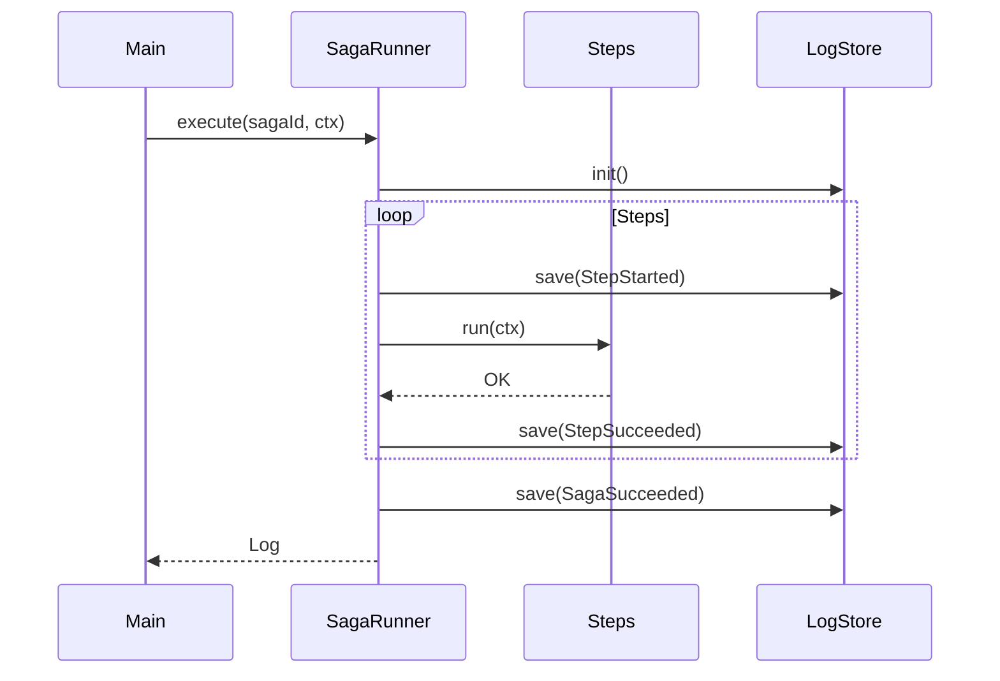

# 第14章：最小SagaをTypeScriptで動かす（ローカル疑似）🧪💻

## 今日のゴール🎯✨

* ✅ **最小のSaga（Step/Compensationのペア）** をコードで書ける
* ✅ **ローカルで実行して**、処理の流れを体験できる
* ✅ **Sagaログ（実行履歴）** を見て「どこまで進んだか」を説明できる👀📒

---

## 14.1 まずは“動く箱”を作る📦✨（プロジェクト作成）

TypeScriptは現在 **5.9系が安定版として広く使われている**流れなので、この章はそれ前提でいくよ🧸✨（6.0/7.0の話題はあるけど、まずは安定運用しやすい形で！） ([GitHub][1])

### ① フォルダ作成＆初期化📁

```bash
mkdir saga-mini
cd saga-mini
npm init -y
```

### ② 依存関係を入れる🧩

**tsx** を使うと、TypeScriptをサクッと実行できて楽ちんだよ🍰💨 ([npmjs.com][2])

```bash
npm i -D typescript tsx @types/node
```

---

## 14.2 `package.json` に実行コマンドを追加🏃‍♀️💨

`package.json` の `"scripts"` をこんな感じにするよ👇

```json
{
  "scripts": {
    "dev": "tsx src/main.ts",
    "dev:watch": "tsx watch src/main.ts"
  }
}
```

* `npm run dev`：1回実行🧪
* `npm run dev:watch`：保存するたび自動で再実行🔁✨（便利！）

---

## 14.3 フォルダ構成を作る🗂️🌼

```text
saga-mini/
  src/
    saga/
      types.ts
      inMemoryLogStore.ts
      runner.ts
    orderSaga/
      steps.ts
    util/
      sleep.ts
    main.ts
```

「Sagaの仕組み」と「注文の中身（ステップ）」を分けるのがポイントだよ✂️✨
→ **“ごちゃ混ぜ”を防ぐだけで、設計が一気にラクになる**🧠🌱

---

## 14.4 Sagaの型（Step/Compensation）とログを作る📒🧩

まずは「Sagaって何を持てばいいの？」を **型で固定** しちゃうよ🛡️✨

### `src/saga/types.ts`

```ts
export type SagaStatus =
  | "Running"
  | "Succeeded"
  | "Failed"
  | "Compensating"
  | "Compensated";

export type SagaEvent =
  | { type: "SagaStarted"; at: string }
  | { type: "StepStarted"; at: string; step: string }
  | { type: "StepSucceeded"; at: string; step: string }
  | { type: "SagaSucceeded"; at: string }
  | { type: "SagaFailed"; at: string; error: string }
  | { type: "CompensationStarted"; at: string; step: string }
  | { type: "CompensationSucceeded"; at: string; step: string }
  | { type: "SagaCompensated"; at: string };

export type SagaLog = {
  sagaId: string;
  status: SagaStatus;
  startedAt: string;
  finishedAt?: string;
  executedSteps: string[]; // 成功したStepの順番✅
  events: SagaEvent[];     // 何が起きたかの時系列📌
};

export type Step<C> = {
  name: string;
  run: (ctx: C) => Promise<void>;        // 順方向✅
  compensate: (ctx: C) => Promise<void>; // 補償🧯
};

export interface SagaLogStore {
  init(sagaId: string): SagaLog;
  save(log: SagaLog): Promise<void>;
  load(sagaId: string): Promise<SagaLog | undefined>;
}
```

ここで大事なのは👇

* `executedSteps`：**どこまで成功したか**（補償の逆順実行に必要🔁）
* `events`：**調査用の時系列ログ**（運用で命綱！）🧵✨


---

## 14.5 ログ保存（まずはメモリでOK）🧠📒

最初はシンプルに「メモリに保存」でいくよ🌷

### `src/saga/inMemoryLogStore.ts`

```ts
import type { SagaLog, SagaLogStore } from "./types";

export class InMemorySagaLogStore implements SagaLogStore {
  private map = new Map<string, SagaLog>();

  init(sagaId: string): SagaLog {
    const now = new Date().toISOString();
    const log: SagaLog = {
      sagaId,
      status: "Running",
      startedAt: now,
      executedSteps: [],
      events: [{ type: "SagaStarted", at: now }],
    };
    this.map.set(sagaId, log);
    return log;
  }

  async save(log: SagaLog): Promise<void> {
    this.map.set(log.sagaId, log);
  }

  async load(sagaId: string): Promise<SagaLog | undefined> {
    return this.map.get(sagaId);
  }
}
```

---

## 14.6 SagaRunner（順番に実行する司令塔）🎻🧠

この章は「成功パスを動かす」けど、**失敗したときに補償へ行ける道**も作っておくよ🧯✨（本格的に遊ぶのは次章😈）

### `src/saga/runner.ts`

```ts
import type { SagaEvent, SagaLog, SagaLogStore, Step } from "./types";

const now = () => new Date().toISOString();

export class SagaRunner<C> {
  constructor(
    private readonly steps: Step<C>[],
    private readonly store: SagaLogStore
  ) {}

  async execute(sagaId: string, ctx: C): Promise<SagaLog> {
    let log = this.store.init(sagaId);

    try {
      for (const step of this.steps) {
        log = this.push(log, { type: "StepStarted", at: now(), step: step.name });
        await this.store.save(log);

        await step.run(ctx);

        log.executedSteps.push(step.name);
        log = this.push(log, { type: "StepSucceeded", at: now(), step: step.name });
        await this.store.save(log);
      }

      log.status = "Succeeded";
      log.finishedAt = now();
      log = this.push(log, { type: "SagaSucceeded", at: log.finishedAt });
      await this.store.save(log);

      return log;
    } catch (err) {
      const error = err instanceof Error ? `${err.name}: ${err.message}` : String(err);

      log.status = "Failed";
      log = this.push(log, { type: "SagaFailed", at: now(), error });
      await this.store.save(log);

      // 失敗したら、成功済みのStepを逆順で補償する🧯🔁
      log = await this.compensate(ctx, log);
      return log;
    }
  }

  private async compensate(ctx: C, log: SagaLog): Promise<SagaLog> {
    log.status = "Compensating";
    await this.store.save(log);

    const executed = [...log.executedSteps].reverse();
    for (const stepName of executed) {
      const step = this.steps.find((s) => s.name === stepName);
      if (!step) continue;

      log = this.push(log, { type: "CompensationStarted", at: now(), step: step.name });
      await this.store.save(log);

      await step.compensate(ctx);

      log = this.push(log, { type: "CompensationSucceeded", at: now(), step: step.name });
      await this.store.save(log);
    }

    log.status = "Compensated";
    log.finishedAt = now();
    log = this.push(log, { type: "SagaCompensated", at: log.finishedAt });
    await this.store.save(log);

    return log;
  }

  private push(log: SagaLog, event: SagaEvent): SagaLog {
    log.events.push(event);
    return log;
  }
}
```

---

## 14.7 “外部サービスっぽさ”をローカルで再現する⏳🧪

ちょっと待つだけで「通信してる感」が出るよ📡✨

### `src/util/sleep.ts`

```ts
export const sleep = (ms: number) =>
  new Promise<void>((resolve) => setTimeout(resolve, ms));
```

---

## 14.8 注文Saga（ステップ3つ）を作る🛒💳📦

今回は「外部サービス無し」なので、**IDを作ってctxに入れるだけ**にするよ🧁✨

### `src/orderSaga/steps.ts`

```ts
import { randomUUID } from "node:crypto";
import type { Step } from "../saga/types";
import { sleep } from "../util/sleep";

export type OrderSagaContext = {
  orderId: string;
  amountYen: number;
  items: { sku: string; qty: number }[];

  inventoryReservationId?: string;
  paymentId?: string;
  shipmentId?: string;
};

const reserveInventory: Step<OrderSagaContext> = {
  name: "ReserveInventory",
  async run(ctx) {
    console.log("📦 在庫を確保するよ…");
    await sleep(300);
    ctx.inventoryReservationId = `inv_${randomUUID().slice(0, 8)}`;
    console.log(`✅ 在庫確保OK: ${ctx.inventoryReservationId}`);
  },
  async compensate(ctx) {
    console.log("🧯 在庫確保を取り消すよ…");
    await sleep(200);
    console.log(`↩️ 在庫戻した！（予約ID: ${ctx.inventoryReservationId ?? "なし"}）`);
  },
};

const chargePayment: Step<OrderSagaContext> = {
  name: "ChargePayment",
  async run(ctx) {
    console.log("💳 決済するよ…");
    await sleep(300);
    ctx.paymentId = `pay_${randomUUID().slice(0, 8)}`;
    console.log(`✅ 決済OK: ${ctx.paymentId}（¥${ctx.amountYen}）`);
  },
  async compensate(ctx) {
    console.log("🧯 返金するよ…");
    await sleep(200);
    console.log(`↩️ 返金した！（決済ID: ${ctx.paymentId ?? "なし"}）`);
  },
};

const createShipment: Step<OrderSagaContext> = {
  name: "CreateShipment",
  async run(ctx) {
    console.log("🚚 配送を手配するよ…");
    await sleep(300);
    ctx.shipmentId = `ship_${randomUUID().slice(0, 8)}`;
    console.log(`✅ 配送手配OK: ${ctx.shipmentId}`);
  },
  async compensate(ctx) {
    console.log("🧯 配送手配をキャンセルするよ…");
    await sleep(200);
    console.log(`↩️ キャンセルした！（配送ID: ${ctx.shipmentId ?? "なし"}）`);
  },
};

export const orderSagaSteps: Step<OrderSagaContext>[] = [
  reserveInventory,
  chargePayment,
  createShipment,
];
```

---

## 14.9 実行してみよう！🚀✨（成功パス）

### `src/main.ts`

```ts
import { randomUUID } from "node:crypto";
import { InMemorySagaLogStore } from "./saga/inMemoryLogStore";
import { SagaRunner } from "./saga/runner";
import { orderSagaSteps, type OrderSagaContext } from "./orderSaga/steps";

async function main() {
  const sagaId = `order-saga_${randomUUID().slice(0, 8)}`;

  const ctx: OrderSagaContext = {
    orderId: `ORDER_${randomUUID().slice(0, 8)}`,
    amountYen: 4980,
    items: [{ sku: "BOOK-001", qty: 1 }],
  };

  const store = new InMemorySagaLogStore();
  const runner = new SagaRunner<OrderSagaContext>(orderSagaSteps, store);

  console.log(`\n🚀 Sagaスタート！ sagaId=${sagaId} / orderId=${ctx.orderId}\n`);

  const log = await runner.execute(sagaId, ctx);

  console.log("\n📒 最終ログ（SagaLog）👇\n");
  console.dir(log, { depth: null });

  console.log("\n🧾 最終コンテキスト（ctx）👇\n");
  console.dir(ctx, { depth: null });

  console.log("\n🎉 おつかれさま！成功パス完走〜！\n");
}

main().catch((e) => {
  console.error("💥 想定外エラー", e);
  process.exitCode = 1;
});
```

### 実行コマンド🧪

```bash
npm run dev
```



---

## 14.10 ログの“見どころ”👀📌

出力された `SagaLog` で、まずここだけ見ればOKだよ✨

* `status`：最後どうなった？（この章は `Succeeded` を目指す🎉）
* `executedSteps`：**成功した順番**が入ってる✅
* `events`：時系列で「開始→Step開始→Step成功→完了」が並ぶ📈

この「ログがちゃんと残る」があるだけで、Sagaは一気に“運用できるもの”に近づくよ🧵✨
（後の章で **リトライ/タイムアウト/冪等性** をやるときに超重要🔑）

---

## 14.11 ちょい最新トピック（おまけ）📰✨

最近のNode.jsでは **TypeScriptをネイティブ実行する“Type Stripping”** の話も進んでるよ（例：Node.js v25.2.0で安定版になった、という報道）🧁 ([publickey1.jp][3])
ただし Node.js は **LTS（長期サポート）を使うのが安全** な場面が多いので、この章は **tsxで安定して動かす**方針にしてるよ💡 ([nodejs.org][4])

---

## 章末ミニ演習📝💖（成功パスを通してログを見る👀）

### 演習1：ログ観察クイズ🔎

1. `executedSteps` はどんな順番になってた？📌
2. `events` の中で「StepStarted」「StepSucceeded」は何回ずつあった？🔁
3. `ctx` の中で、**実行後に増えたプロパティ**はどれ？✨

### 演習2：ステップ追加してみよ➕🍪

* `SendEmail`（メール送信っぽい処理📧）を追加して、最後に実行してみてね

  * `run`：`ctx`に `emailId` を入れる
  * `compensate`：`emailId` を使って「取り消し」っぽいログを出す

---

### AI活用（ちょいコツ）🤖✨

* 「Stepをもう1個追加したい」→ **“既存のStepと同じ形で、ctxに値を追加するStepを書いて”** と頼む
* 「ログの型が分からない」→ **“SagaLogに入れるべき最小項目を箇条書きして、その後に型定義して”** と頼む
* 出てきたコードは **“型が安全か？”** と **“ログが残るか？”** だけ人間がチェック✅👀

[1]: https://github.com/microsoft/typescript/releases?utm_source=chatgpt.com "Releases · microsoft/TypeScript"
[2]: https://www.npmjs.com/package/tsx?utm_source=chatgpt.com "tsx"
[3]: https://www.publickey1.jp/blog/25/nodejstypescripttype_strippingnodejs_v2520.html?utm_source=chatgpt.com "Node.jsでネイティブにTypeScriptを実行できる「Type ..."
[4]: https://nodejs.org/en/about/previous-releases?utm_source=chatgpt.com "Node.js Releases"
