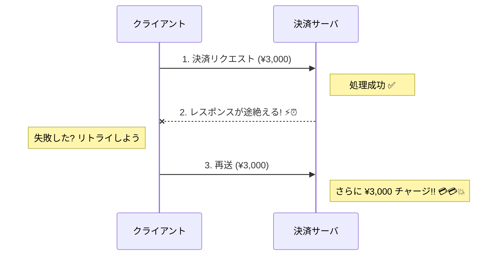
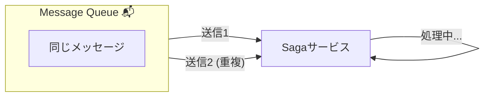
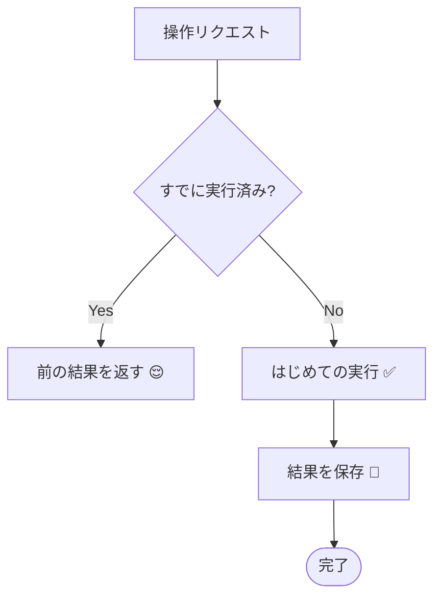
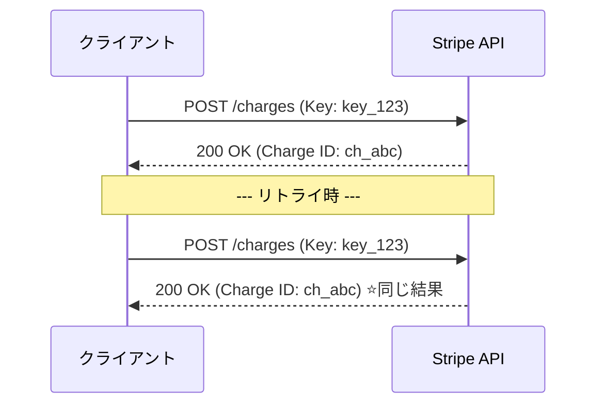

# 第16章：冪等性① 何が壊れる？（重複実行の恐怖）👻🔁

## 今日のゴール🎯✨

* 「リトライで同じ処理が2回走る」と何が起きるか、説明できるようになる😱💥
* Sagaで“冪等性（べきとうせい）”が命綱な理由が腹落ちする🔑✨
* 「壊れやすい操作」を見抜けるようになる👀🧠

---

# 1. まずは地獄のストーリーから🛒💳📦😇➡️😈

あなたが作った注文Sagaがこんな流れだったとするね👇

1. **決済**（カードをチャージ）💳
2. **在庫確保**（商品を取り置き）📦
3. **発送指示**（配送ラベル作成）🚚

ここで、決済のAPI呼び出しが **タイムアウト** したとする…⏰💦
でも「タイムアウト＝失敗」とは限らないのが分散世界の怖いところ😵‍💫🌪️

* サーバ側では **決済が成功してた** ✅
* でもクライアント側は **返事が届かなくて失敗だと思った** ❌
* だから **リトライ** しちゃう🔁
* 結果… **二重決済** 💳💳😱



これ、めちゃくちゃ現実に起きるやつです…。
「通信が切れて返事が読めなかったら、クライアントは同じリクエストを再送することがある」ってHTTPの仕様の世界でも前提になってるよ📮⚡ ([RFCエディタ][1])

---

# 2. なんで“同じ処理が2回”起きるの？🤔🔁

## 2.1 通信あるある：成功したのに返事が消える📡🫥

* サーバは処理完了✅
* でも返事がネットワークで迷子📨🌀
* クライアントは「失敗？」と思って再送🔁

HTTPでも「冪等な操作は、返事が読めなかったときに自動リトライされうる」って考え方があるよ📘 ([RFCエディタ][1])

## 2.2 “少なくとも1回”配送の世界：重複は仕様📬📬

メッセージキューやイベント配送は、信頼性のために **at-least-once（少なくとも1回）** を採用しがち。
つまり「必ず届く」代わりに **同じメッセージが複数回届くことがある** のが前提😳

たとえばAWS SQSの標準キューは「少なくとも1回配信」で、**重複が起きうる** ので **冪等な処理にしよう** とドキュメントでも言ってるよ📌 ([AWS ドキュメント][2])
RabbitMQも、ack（受領確認）を使うと「少なくとも1回」になる＝重複再配信が起こりうる世界観だよ🐰📨 ([rabbitmq.com][3])



## 2.3 ワークフロー実行の再開：オーケストレーターは忘れることがある🧠💥

オーケストレーターが落ちた／再起動した／タイムアウトした
→ 「どこまでやったっけ？」が曖昧になると、同じStepが再実行されがち🔁😵‍💫

Step Functionsみたいな世界でも、**冪等性は自動で面倒見てくれるわけじゃない**（重複実行が起こりうる）という注意があるよ⚠️ ([AWS ドキュメント][4])

## 2.4 ユーザー操作：二度押し・戻る・再送📱👆👆

* ボタン連打😇
* 戻る→再送😇
* 画面更新😇
* 通信不安定で自動再試行😇

アプリが丁寧に作られてても、現場では普通に起こるよ…🥹💦

---

# 3. “重複実行”で壊れるもの一覧💥🧨

| 何が2回起きる？  | 何が壊れる？          | 例😱                     |
| --------- | --------------- | ----------------------- |
| お金が動く     | 取り返しがつかない＆信用が死ぬ | 二重決済💳💳 / 二重返金💸💸     |
| 物が動く      | 在庫がズレる、配送がズレる   | 二重出荷📦📦 / ラベル2枚🚚🚚    |
| “1回だけ”の発行 | IDやチケットが増殖      | クーポン2枚🎫🎫 / 会員登録2件👤👤 |
| 状態遷移      | 状態が矛盾する         | 「支払い済み」なのに「未払い」扱い😵     |
| 補償（戻し）    | 余計に壊す           | 返金を2回やってマイナスになる💸😱     |

そして最悪なのはこれ👇
**「失敗したから補償しよう」と思って補償したのに、実は成功してて補償が余計な破壊になる**🧯💥

---

# 4. 冪等性ってなに？🧠🔑✨（やさしく）

**冪等（Idempotent）**＝
同じ操作を **何回やっても**、結果が **1回と同じ** になること💡✨

イメージはこれ👇

* 1回目：ちゃんとやる✅
* 2回目以降：「それ、もうやったよ！」って **同じ結果を返す** 😌🔁




---

# 5. HTTPの冪等性と、ビジネスの冪等性は別モノだよ🧩🧠

## 5.1 HTTP的には「PUTは冪等、POSTは基本そうじゃない」📮

HTTPでは、あるリクエストメソッドが「繰り返しても同じ意図になるか？」で冪等性を定義してるよ📘 ([RFCエディタ][1])
ざっくり感覚👇

* GET/PUT/DELETE：冪等になりやすい（作りやすい）
* POST：基本は冪等じゃない（そのままだと危険）⚠️

## 5.2 だから「POSTでも冪等にしたい」→ Idempotency-Key 🪪✨

POSTみたいな“本来冪等じゃない操作”を、リトライしても安全にするために
**Idempotency-Key** ヘッダーを標準化しよう、という動きもあるよ（IETFのドラフト）🧠📜 ([IETF Datatracker][5])

---

# 6. リトライの黄金ルール⚔️🔁（超だいじ）

**冪等じゃない操作を、何も考えずにリトライしない。**
決済みたいな非冪等操作のリトライは「障害対応」じゃなくて「事故」になりやすい…って、分散システムの文脈でも強く言われるよ⚠️ ([temporal.io][6])

---

# 7. “決済API”が冪等性を用意してくれてる例：Stripe💳🔑

Stripeは **idempotency key** を使った再試行の仕組みを用意していて、
同じキーでの再送は「最初の結果（ステータスコードやレスポンスボディ）」を返す、という挙動を説明してるよ📘 ([Stripe ドキュメント][7])

ポイントはここ👇

* クライアントが **ユニークなキー** を作って送る🔑
* サーバは **そのキーの最初の結果を保存** して、再送は同じ結果を返す🔁

（Stripe以外でも“決済系はだいたい冪等キーがある”ことが多いよ。探すクセを付けると強い💪✨）



---

# 8. ミニ実験：わざと二重実行を起こしてみる😈🧪🔁

## 8.1 “危ないStep”の例（決済が毎回走る）💳💥

```ts
// 危ない例：同じ注文IDでも毎回チャージする（=二重決済しうる）
async function chargeCard(orderId: string, amount: number) {
  console.log(`[PAY] charge start orderId=${orderId} amount=${amount}`);

  // 外部決済APIを呼んだつもり（ここでは擬似）
  await new Promise((r) => setTimeout(r, 200));

  console.log(`[PAY] charge SUCCESS orderId=${orderId}`);
}

// タイムアウトした想定で、同じ処理をリトライしてしまう
async function runWithRetry() {
  const orderId = "ORDER-123";
  const amount = 3000;

  try {
    // 1回目：成功したのに「返事が来ない」想定で例外にする
    await chargeCard(orderId, amount);
    throw new Error("timeout (client-side)"); // 😈
  } catch {
    // 2回目：再試行
    await chargeCard(orderId, amount);
  }
}

runWithRetry().catch(console.error);
```

これを動かすとログ上は👇みたいになるはず：

* charge SUCCESS が2回出る
  つまり **同じ注文で2回チャージ** 😱💳💳

> 「え、でも現実のAPIは失敗返すでしょ？」
> 返事が来ない（タイムアウト）って状況は **“成功したか分からない”** ので、これが起きるんだよね🥹⏰

---

# 9. じゃあどう防ぐの？（この章では“全体像”だけ）🛡️✨

冪等性の作り方は色々あるけど、超ざっくり分類するとこう👇

## A) “同じ依頼”にIDを付ける（冪等キー）🔑🪪

* 例：`orderId + ":charge"` をキーにする
* 同じキーは **同じ結果** を返す
  Idempotency-Keyの考え方がまさにこれ🧠📜 ([IETF Datatracker][5])

## B) “やったこと”を記録して、2回目はスキップする📒✅

* Sagaログに「Step実行済み」を残す
* 2回目は「もう済み」扱いにする
  （これ、次章でガッツリやるよ📚✨）

## C) DBの制約で物理的に増殖させない🧱🔒

* UNIQUE制約
* upsert（insertできなければupdate）
* 条件付きupdate（状態がAのときだけBにする）

## D) 外部サービス側の冪等機能を使う🏦🔑

決済プロバイダが冪等キー対応してるなら、まずそれに乗るのが強い💪
Stripeのように「同じキーは同じ結果を返す」仕組みがある例もあるよ📘 ([Stripe ドキュメント][7])

---

# 10. ミニ演習📝✨（手を動かすと理解が爆速🚀）

## 演習①：このStep、2回走ったら何が起きる？😱🔁

次の操作を「重複したらヤバい順」に並べてみてね👇（理由も一言💬）

* 決済を実行する💳
* 在庫を1個減らす📦
* 注文ステータスを `Paid` に更新する🧾
* 配送ラベルを発行する🚚
* メールを送る📧

目安💡：
「お金」「物」「1回しか出しちゃダメなもの」は特に危険⚠️💥

## 演習②：“返事が来ない成功”の可能性を考えよう📡🫥

次のどっちが怖い？（そしてどう備える？）😵‍💫

* A：APIが `500` を返した
* B：**タイムアウトで返事が分からない**

ヒント：Bがいちばん厄介…！😈

## 演習③：冪等キーを考えてみよう🔑✨

注文Sagaの「決済Step」用の冪等キー、どんな文字列にする？
例：`{注文ID}:{操作名}` みたいな感じでOK🙆‍♀️

---

# 11. “冪等性が必要な場所”チェックリスト✅🧠

Sagaの各Stepについて、これを毎回チェックするよ👇

* [ ] このStep、**外部I/O**（決済・配送・在庫サービス）ある？🌍
* [ ] タイムアウトしたら「成功か失敗か」判定できる？⏰
* [ ] 2回走ったら **お金・物・発行物** が増殖する？💳📦🎫
* [ ] “やった証拠”を **どこに残す**？（ログ/DB/外部）📒
* [ ] 2回目は「同じ結果」を返せる？😌🔁

---

# まとめ🌸✨

* Sagaは「失敗したら戻す」だけじゃ足りなくて、**“重複実行”に耐える設計**が必須だよ🔁🛡️
* 通信・キュー・再起動の世界では、重複はわりと“仕様”📬📬
* だから冪等性は、Sagaの命綱🔑✨
* 次章では、冪等キー＆実行済み管理を **具体的な設計と実装** で固めていくよ🧰💻💕

[1]: https://www.rfc-editor.org/rfc/rfc9110.html?utm_source=chatgpt.com "RFC 9110: HTTP Semantics"
[2]: https://docs.aws.amazon.com/AWSSimpleQueueService/latest/SQSDeveloperGuide/sqs-queue-types.html?utm_source=chatgpt.com "Amazon SQS queue types - Amazon Simple Queue Service"
[3]: https://www.rabbitmq.com/docs/reliability?utm_source=chatgpt.com "Reliability Guide"
[4]: https://docs.aws.amazon.com/step-functions/latest/dg/choosing-workflow-type.html?utm_source=chatgpt.com "Choosing workflow type in Step Functions"
[5]: https://datatracker.ietf.org/doc/draft-ietf-httpapi-idempotency-key-header/?utm_source=chatgpt.com "The Idempotency-Key HTTP Header Field - Datatracker - IETF"
[6]: https://temporal.io/blog/error-handling-in-distributed-systems?utm_source=chatgpt.com "Error handling in distributed systems: A guide to resilience ..."
[7]: https://docs.stripe.com/api/idempotent_requests?utm_source=chatgpt.com "Idempotent requests | Stripe API Reference"
