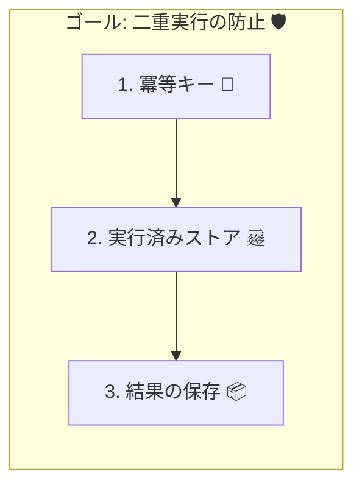
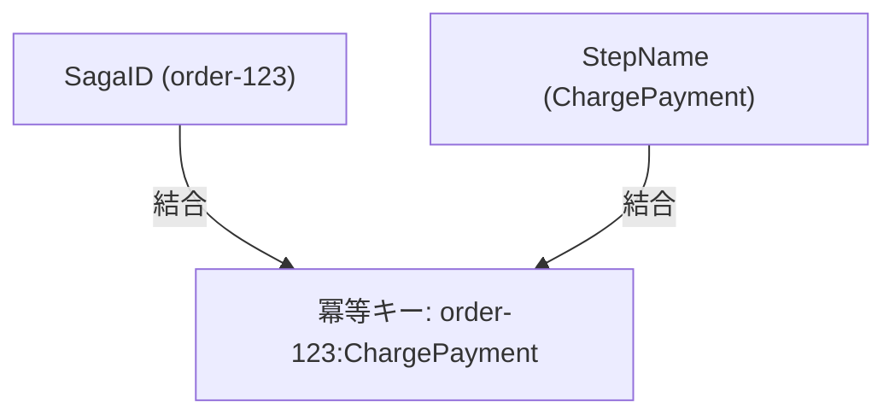
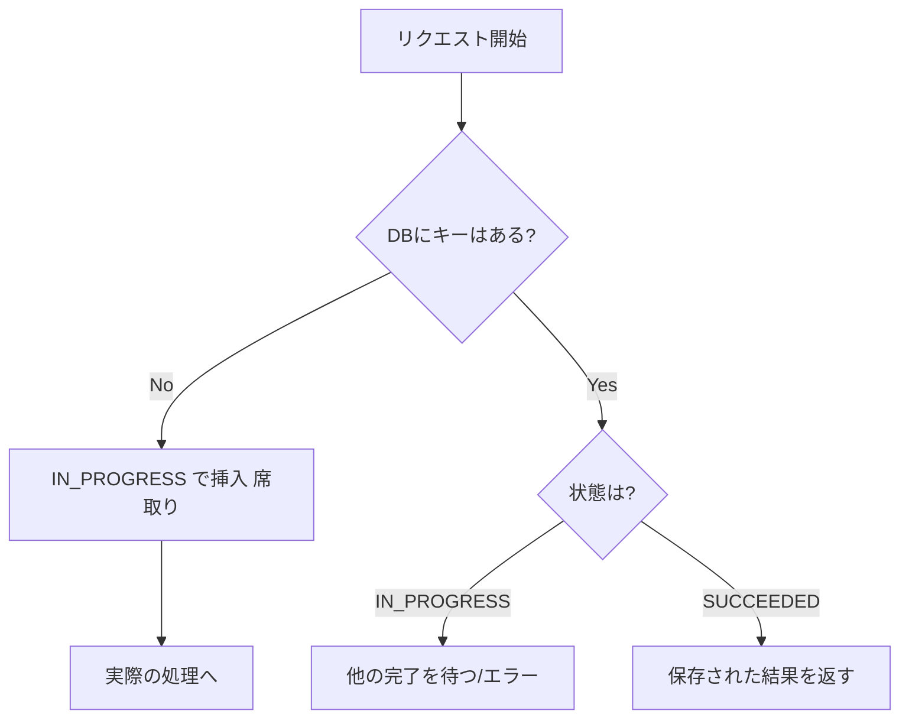
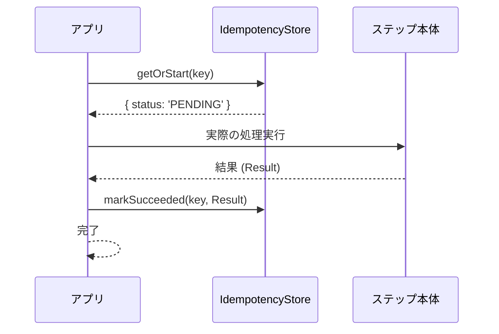

# 第17章：冪等性② 冪等キーと実行済み管理（具体策）🔑🧰

---

## 1) 今日のゴール🎯✨

この章を終えたら、次のことができるようになります😊

* 「冪等キー（Idempotency Key）」を自分で設計できる🔑
* 「同じStepが2回走っても、二重決済・二重出荷しない」仕組みを作れる🛡️
* SagaのStepごとに「実行済み」を記録して、再実行に強くできる📒✨

---

## 2) まず結論：冪等にする“3点セット”💡🔧

Sagaで冪等性を作るときの基本セットはこれです👇

1. **冪等キー（同じ操作なら同じキー）** 🔑
2. **実行済みストア（DBの一意制約で重複を防ぐ）** 🗄️
3. **結果の保存（同じキーなら同じ結果を返す）** 📦





この考え方は、決済APIなどでも超重要で、たとえばStripeは **Idempotency-Key** を使い、同じキーの再送は「最初の結果（成功でも失敗でも）」を返す仕組みを説明しています。([Stripe ドキュメント][1])
AWSの設計ガイドでも「トークンを見て、既に処理済みなら保存したレスポンスを返す」という形が推奨されています。([AWS ドキュメント][2])

---

## 3) 冪等キーってなに？🔑🤔

冪等キーは「これ、同じ操作だよね？」を見分けるための **操作ID** です✨
**重要ポイントは1つだけ**👇

* ✅ **“再送”や“リトライ”でも同じキーになる**
* ❌ リトライのたびに新しいキーを作る（これやると意味ない😱）

---

## 4) 冪等キーの作り方：おすすめはこの2系統🔑🧩

### A. サーバー内（Saga Step）で使うキー：**決定的（deterministic）に作る**🧠✨

SagaのStepは「注文ID」「SagaID」があるので、だいたいこれでOKです👇

* `idempotencyKey = "{sagaId}:{stepName}"`

例：

* `order-123:ReserveInventory`
* `order-123:ChargePayment`

こうすると、同じSagaの同じStepは、何回リトライしても同じキーになります🔁✨



### B. 外部API（決済など）に投げるキー：**UUID推奨**🪪✨

外部APIの世界だと「Idempotency-Keyヘッダー」で冪等化するやり方が広く使われます。
たとえばStripeは **Idempotency-KeyヘッダーにUUIDを推奨**しています。([Stripe ドキュメント][3])

さらに最近は、HTTPの **Idempotency-Key** ヘッダー自体が標準化に向けたドラフトとして議論されています（POST/PATCHなど“本来は冪等じゃない”操作を安全にする狙い）。([IETF Datatracker][4])

💡コツ：
外部APIに送るキーは、**Sagaのキーをそのまま使う**のもアリです（`order-123:ChargePayment` みたいに）。
ただし外部が「形式はUUIDだけね」みたいに要求することもあるので、その場合は UUID に寄せましょ😊

---

## 5) 「実行済み管理」って具体的に何するの？📒👀

冪等性って、気持ちの問題じゃなくて **“保存”がすべて**です🗄️✨
やることは超シンプル👇

* Stepを実行する前に「このキーで実行済み？」を調べる
* 実行済みなら **スキップ** or **保存済み結果を返す**
* 未実行なら処理して、**結果と一緒に“実行済み”として保存**

AWSの考え方もまさにこれで、「トークンが新規なら処理→レスポンス保存、既存なら保存レスポンス返す」です。([AWS ドキュメント][2])

---

## 6) 最小データ設計（これだけで強くなる）🧱✨

# テーブル案①：Idempotency Store（操作単位の重複排除）🔐

* **idempotency_key** を UNIQUE にするのが命💓

保存したい項目の例👇

* `key`（UNIQUE）🔑
* `status`（IN_PROGRESS / SUCCEEDED / FAILED）🚦
* `result_json`（成功結果 or 失敗情報）📦
* `created_at`, `updated_at` ⏰

「UNIQUE制約で二重登録を防ぎ、UPSERT（競合時更新）を使う」みたいなやり方は、PostgreSQLでも定番です。([PostgreSQL][5])

---

## 7) TypeScriptで“動く形”を作ろう🧪💻✨

ここでは「DBがキーの重複を止める」方式で、**実装の芯**を作ります😊
（DBはローカルで扱いやすいSQLite例で書くけど、PostgreSQLでも考え方は同じだよ🫶）

---

# 7-1. まずは型を用意🧠🧩

```ts
type IdempotencyStatus = "IN_PROGRESS" | "SUCCEEDED" | "FAILED";

type IdempotencyRecord = {
  key: string;
  status: IdempotencyStatus;
  resultJson: string | null; // JSON文字列（成功結果/失敗情報を入れる）
  createdAt: string;
  updatedAt: string;
};
```

---

# 7-2. ルール：Stepは「開始→確定」を必ず保存する🚦✅

冪等性で事故るのはだいたいこのパターン👇

* 外部APIに成功した
* でもその直後にサーバー落ちた
* 「成功した記録」が残ってない
* 次のリトライで **もう一回外部API叩いちゃう** 😱💥

だから、**“IN_PROGRESS” を先に保存して席取り**するのが強いです💪✨
（そして最後に SUCCEEDED/FAILED へ更新）



---

# 7-3. 実装の核：getOrStart（席取り）🔑🪑

```ts
// 疑似DB。実際はSQLite/PGなどで実装してね
interface IdempotencyStore {
  // まだ無いなら IN_PROGRESS で作って返す（席取り）
  // 既にあるなら既存レコードを返す
  getOrStart(key: string): Promise<IdempotencyRecord>;

  // 成功として結果を保存
  markSucceeded(key: string, result: unknown): Promise<void>;

  // 失敗として結果（エラー情報）を保存
  markFailed(key: string, error: unknown): Promise<void>;
}

function nowIso() {
  return new Date().toISOString();
}

function safeJson(value: unknown): string {
  return JSON.stringify(value, (_k, v) => (typeof v === "bigint" ? v.toString() : v));
}
```

ポイントは `getOrStart` が **UNIQUE制約** などで「同じキーの二重開始」を止めることです🛡️
（DBの力を借りるのが一番堅い！）

---

# 7-4. Step実行ラッパー：同じキーなら二重実行しない🔁🧯

```ts
type StepResult<T> =
  | { ok: true; value: T }
  | { ok: false; error: { message: string; name?: string } };

function toErrorInfo(e: unknown) {
  if (e instanceof Error) return { name: e.name, message: e.message };
  return { message: String(e) };
}

/**
 * SagaのStepを「冪等」にして実行する共通関数
 */
async function runStepIdempotent<T>(
  store: IdempotencyStore,
  key: string,
  step: () => Promise<T>,
): Promise<T> {
  const rec = await store.getOrStart(key);

  // すでに成功してたら、保存結果を返す（＝再実行しない）
  if (rec.status === "SUCCEEDED") {
    if (!rec.resultJson) throw new Error("Idempotency record is SUCCEEDED but result is missing.");
    return JSON.parse(rec.resultJson) as T;
  }

  // すでに失敗してたら、同じ失敗として扱う（方針はチームで決めてOK）
  if (rec.status === "FAILED") {
    if (!rec.resultJson) throw new Error("Idempotency record is FAILED but result is missing.");
    const err = JSON.parse(rec.resultJson) as { message: string; name?: string };
    const e = new Error(err.message);
    e.name = err.name ?? "IdempotencyFailed";
    throw e;
  }

  // IN_PROGRESS の場合：
  // - 同じプロセスの再入なら「待つ」でもいいし
  // - ここではシンプルに「処理を続行」し、最後に確定させる（DB側で同時実行を潰すのが前提）
  try {
    const value = await step();
    await store.markSucceeded(key, value);
    return value;
  } catch (e) {
    await store.markFailed(key, toErrorInfo(e));
    throw e;
  }
}

```



✅ これで「同じキーなら結果が固定」になります✨
Stripeも「同じキーなら最初のレスポンスを返す」方向の考え方を示しています。([Stripe ドキュメント][1])

---

## 8) Sagaに当てはめる：キーはこう作ると強い🔑🧩

SagaのStep向けなら、まずはこのテンプレが安定です😊

* `key = "${sagaId}:${stepName}"`

例：決済Step

* `order-123:ChargePayment`

ここで `ChargePayment` を `stepName` にする理由👇

* Step名が変わると別キー扱いになる（設計変更が安全に反映される）✨
* 「どの操作が重複したか」調査しやすい🔎

---

## 9) よくある落とし穴TOP5😱🕳️（ここ超大事！）

1. **リトライのたびにUUIDを作り直す**
   → 同じ操作なのに別操作扱いになって二重実行💥

2. **キーはあるけど、結果を保存しない**
   → 再送時に「どう返せばいいか」困って結局再実行😵‍💫

3. **UNIQUE制約なし（アプリだけで頑張る）**
   → 並列や複数プロセスで負けやすい⚔️
   → DBの一意制約・UPSERTが王道です([PostgreSQL][5])

4. **IN_PROGRESS を持たない**
   → “席取り”がなくて、同時に2回走りやすい😱

5. **保存の前に外部APIを叩く**
   → 落ちたときに「成功したのに記録がない」問題が出る💣

---

## 10) ミニ演習📝✨（手を動かすところ）

### 演習A：キー設計してみよう🔑

次のStepの冪等キーを作ってみてね👇

* ReserveInventory
* ChargePayment
* ArrangeShipping

条件：

* 同じ注文IDなら同じキー
* Step名が変われば別キー

### 演習B：「二重実行しない」をテスト🔁✅

* `runStepIdempotent` を2回呼ぶ
* Step関数の中で `console.log("PAYMENT!")` を出す
* **ログが1回しか出ない**ことを確認🎉

### 演習C：失敗の固定😈🧯

* Stepの中でわざと例外を投げる
* 同じキーで再実行したときに、同じ失敗として扱われるか確認👀

---

## 11) Copilot / Codexに投げると捗るプロンプト例🤖💬✨

* 「TypeScriptでIdempotencyStoreのSQLite実装を書いて。キーはUNIQUE。getOrStartは insert して失敗したら select で既存を返して」
* 「runStepIdempotent のテストコードを作って。同じキーで2回呼んでも step 本体は1回しか動かないことを検証して」

👉 出てきたコードは、**“UNIQUE制約で守れてる？”** を最優先でチェックしようね🛡️🔍

---

## 12) 章末チェックリスト✅💕

* [ ] 冪等キーが「再送でも同じ」になってる🔑
* [ ] 実行済み判定がDBの一意制約で守られてる🗄️
* [ ] 成功/失敗の結果が保存され、同じキーなら同じ結果になる📦
* [ ] 同時実行（並列）を想定しても破綻しにくい🚦
* [ ] 「外部API成功→記録前に落ちた」を想像できてる😱（次章以降でさらに対策が強化されるよ！）

---

[1]: https://docs.stripe.com/api/idempotent_requests?utm_source=chatgpt.com "Idempotent requests | Stripe API Reference"
[2]: https://docs.aws.amazon.com/wellarchitected/latest/framework/rel_prevent_interaction_failure_idempotent.html?utm_source=chatgpt.com "REL04-BP04 Make mutating operations idempotent"
[3]: https://docs.stripe.com/api-v2-overview?lang=dotnet&utm_source=chatgpt.com "API v2 overview"
[4]: https://datatracker.ietf.org/doc/draft-ietf-httpapi-idempotency-key-header/?utm_source=chatgpt.com "The Idempotency-Key HTTP Header Field"
[5]: https://www.postgresql.org/docs/current/sql-insert.html?utm_source=chatgpt.com "Documentation: 18: INSERT"
