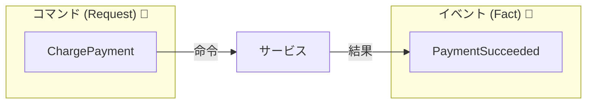
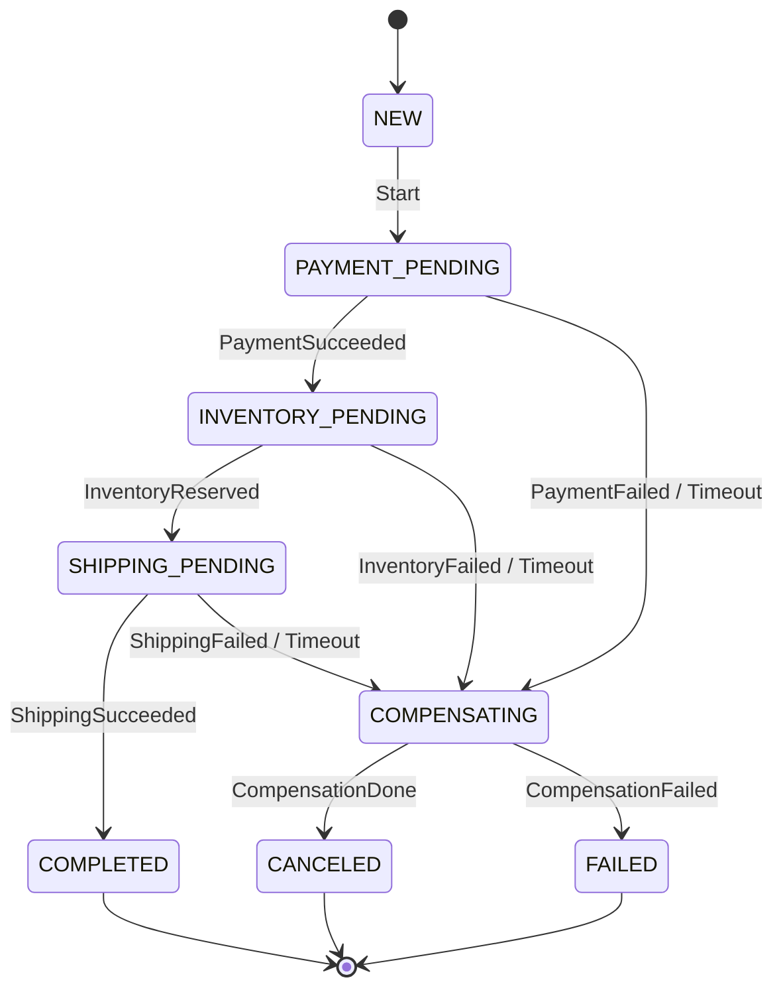
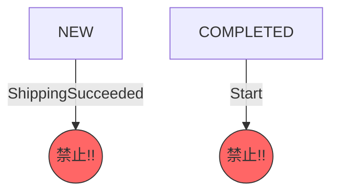
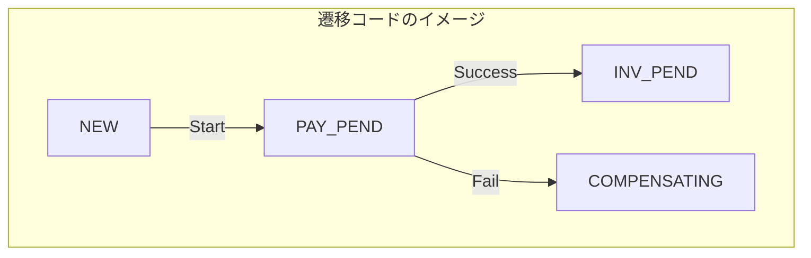

# 第18章：状態機械① 状態遷移表で迷子を防ぐ🚦🗺️

## この章でできるようになること🎯✨

* Sagaの「状態（Status）」を **ちゃんと名前で定義**できる😊
* 「状態 × イベント → 次の状態」を **状態遷移表**として作れる📋
* **禁止遷移（やっちゃダメ）**を決めて、事故を減らせる🔒⚠️
* 遷移表をそのまま **TypeScriptの“遷移チェック”**に落とし込める🧑‍💻🛡️

※ 状態遷移表は、有限状態機械（FSM）の代表的な表現の1つだよ〜📚（「今の状態」と「入力（イベント）」で「次の状態」を決める表） ([ウィキペディア][1])

---

## 1) まず超ざっくり：状態機械ってなに？🤔💡

状態機械（FSM）は、ざっくり言うとこう👇

* システムは **いまどれか1つの状態**にいる（例：決済待ち、在庫確保済み…）
* 何かが起きる（イベント）と、**次の状態へ移動**する
* 「この状態でこのイベントはOK／NG」を決めることで、**迷子・抜け漏れ・二重実行**が減る✨

Sagaは途中経過が長いから、状態をちゃんと定義しないとすぐ破綻するよ〜😵‍💫🧯

---

## 2) 今日の題材：注文Saga（決済→在庫→発送）🛒💳📦

流れはシンプルに👇（直列のSaga）

1. 決済する💳
2. 在庫を確保する📦
3. 発送を依頼する🚚
4. 全部できたら完了🎉
5. 途中で失敗したら、補償（戻し）を走らせてキャンセルへ🧯🔁

---

## 3) 状態（Status）を決めるコツ🧠🧁

### コツA：状態は「画面の表示」じゃなく「進捗の節目」⛳

Sagaの状態は、だいたい **“戻れる／戻れない”の境目**が節目になるよ✨

例：

* 決済が成功したか？（成功したら返金の責務が生まれる）
* 在庫を確保したか？（確保したら在庫戻しが必要）
* 発送を投げたか？（投げたら止めにくい…）

### コツB：最初は少なめにして、足りなくなったら増やす🌱

最初から状態を作り込みすぎると、表が巨大化してつらい😇
まずは「事故が起きそうな境目」だけ押さえよう👍

---

## 4) イベント（Transitionのトリガー）を決めるコツ📣✨

イベントは「外から来る事実」っぽくすると分かりやすい😊

* PaymentSucceeded / PaymentFailed
* InventoryReserved / InventoryFailed
* ShippingSucceeded / ShippingFailed
* Timeout（時間切れ）
* CompensationDone（補償が全部終わった）

ポイント👇

* **イベント名は“過去形の事実”**に寄せる（Succeeded/Failed/Reserved みたいに）📝
* 「コマンド（やって！）」と「イベント（起きた！）」をごっちゃにしない🙅‍♀️

  * イベント：PaymentSucceeded（起きた）



---

## 5) 状態遷移表の作り方（手順）🧩🛠️

おすすめ手順はこれ👇（めっちゃ実務的✨）

1. **状態のリスト**を作る（最初は5〜9個くらい）📝
2. **終端（ゴール）状態**を決める（例：COMPLETED / CANCELED / FAILED）🏁
3. 1状態ずつ「起きうるイベント」を列挙する📣
4. 「そのイベントが来たら次はどこ？」を決める➡️
5. 最後に **禁止遷移**をチェックする🔒⚠️

   * “ありえないのに書けちゃう”が一番危険😱

---

## 6) 例：注文Sagaの状態設計（ミニ版）🗺️🚦

今回はこういう状態にしてみるよ👇（最小でいく！）

* NEW（開始前）
* PAYMENT_PENDING（決済中）
* INVENTORY_PENDING（在庫確保中）
* SHIPPING_PENDING（発送依頼中）
* COMPLETED（完了）🎉
* COMPENSATING（補償実行中）🧯
* CANCELED（補償完了してキャンセル）🛑
* FAILED（人手対応レベルの失敗）💥

「FAILED と CANCELED の違い」イメージ👇

* CANCELED：補償が走り切って、着地できた🙆‍♀️
* FAILED：補償も含めてうまく着地できず、要調査😵

---

## 7) 状態遷移表（見本）📋✨

「状態 × イベント → 次の状態」だよ〜🚦

| 現在の状態             | イベント               | 次の状態              | メモ          |
| ----------------- | ------------------ | ----------------- | ----------- |
| NEW               | Start              | PAYMENT_PENDING   | Saga開始🌱    |
| PAYMENT_PENDING   | PaymentSucceeded   | INVENTORY_PENDING | 次のStepへ✅    |
| PAYMENT_PENDING   | PaymentFailed      | COMPENSATING      | 補償へ🧯       |
| PAYMENT_PENDING   | Timeout            | COMPENSATING      | 決済が帰ってこない…⏰ |
| INVENTORY_PENDING | InventoryReserved  | SHIPPING_PENDING  | 次のStepへ✅    |
| INVENTORY_PENDING | InventoryFailed    | COMPENSATING      | 補償へ🧯       |
| INVENTORY_PENDING | Timeout            | COMPENSATING      | 在庫サービスが沈黙⏰  |
| SHIPPING_PENDING  | ShippingSucceeded  | COMPLETED         | ゴール🎉       |
| SHIPPING_PENDING  | ShippingFailed     | COMPENSATING      | 補償へ🧯       |
| SHIPPING_PENDING  | Timeout            | COMPENSATING      | 発送依頼が不明…⏰   |
| COMPENSATING      | CompensationDone   | CANCELED          | 着地🛑        |
| COMPENSATING      | CompensationFailed | FAILED            | 補償失敗💥      |




ここで大事なのが👇

* COMPLETED / CANCELED / FAILED は **終端状態**（基本、そこから先に進ませない）🏁
* “禁止遷移”を明確にすることで、「二重決済」みたいな地獄を減らせる👻🔁



---

## 8) 禁止遷移の決め方（ここが本題！）🔒🚨

禁止遷移は、だいたいこの4カテゴリで洗い出せるよ👇

### ① 時系列が壊れる系🕰️💥

* NEW なのに ShippingSucceeded が来る
* PAYMENT_PENDING なのに InventoryReserved が先に来る

👉 「順番が違う」は、実装バグ or メッセージ取り違えのサイン🚩

### ② 終端から動いちゃう系🏁➡️😱

* COMPLETED に PaymentSucceeded が来る
* CANCELED に InventoryReserved が来る

👉 終端は基本 **一切受けない**（受けたら調査ログ）🕵️‍♀️

### ③ 補償中なのに順方向イベントが来る系🧯➡️🚚

* COMPENSATING に ShippingSucceeded が来る

👉 どっちを正とする？が地獄なので、原則は **禁止**（または隔離して調査）😇

### ④ 同じイベントが2回系（冪等性とセット）🔁⚠️

* PaymentSucceeded が2回来る
* InventoryReserved が2回来る

👉 これは第16〜17章の冪等性の出番！
ただ、状態機械でも「その状態では受けない」を決めると強い🛡️

---

## 9) TypeScriptで「遷移チェック」を作る（超ミニ実装）🧑‍💻🧪

ポイントは「表をコード化して、**表にない遷移は落とす**」だよ〜✅

```ts
type SagaStatus =
  | "NEW"
  | "PAYMENT_PENDING"
  | "INVENTORY_PENDING"
  | "SHIPPING_PENDING"
  | "COMPLETED"
  | "COMPENSATING"
  | "CANCELED"
  | "FAILED";

type SagaEventType =
  | "Start"
  | "PaymentSucceeded"
  | "PaymentFailed"
  | "InventoryReserved"
  | "InventoryFailed"
  | "ShippingSucceeded"
  | "ShippingFailed"
  | "Timeout"
  | "CompensationDone"
  | "CompensationFailed";

const transitions: Record<SagaStatus, Partial<Record<SagaEventType, SagaStatus>>> = {
  NEW: {
    Start: "PAYMENT_PENDING",
  },

  PAYMENT_PENDING: {
    PaymentSucceeded: "INVENTORY_PENDING",
    PaymentFailed: "COMPENSATING",
    Timeout: "COMPENSATING",
  },

  INVENTORY_PENDING: {
    InventoryReserved: "SHIPPING_PENDING",
    InventoryFailed: "COMPENSATING",
    Timeout: "COMPENSATING",
  },

  SHIPPING_PENDING: {
    ShippingSucceeded: "COMPLETED",
    ShippingFailed: "COMPENSATING",
    Timeout: "COMPENSATING",
  },

  COMPENSATING: {
    CompensationDone: "CANCELED",
    CompensationFailed: "FAILED",
  },

  COMPLETED: {},
  CANCELED: {},
  FAILED: {},
};

export function transition(current: SagaStatus, event: SagaEventType): SagaStatus {
  const next = transitions[current]?.[event];
  if (!next) {
    throw new Error(`🚫 Invalid transition: ${current} --(${event})--> ???`);
  }
  return next;
}

```




試しに動かす（ダメ遷移をわざと起こす）👇

```ts
import { transition } from "./transition";

let s: any = "NEW";

s = transition(s, "Start");
console.log("✅", s);

try {
  // 本来ありえない：決済前に発送成功
  s = transition(s, "ShippingSucceeded");
  console.log("✅", s);
} catch (e) {
  console.log(String(e));
}
```

これで、**禁止遷移が“即エラー”**になる🎉
バグが早期に見つかるし、ログにも残せるよ〜🪵🔎

---

## 10) AI（Copilot/Codex）に手伝ってもらうコツ🤖💞

状態遷移表って、最初のたたき台を作るのが面倒…🥺
そこでAIに「叩き台」を出してもらって、人間が整えるのが強いよ✨

おすすめの頼み方👇

* 「注文Sagaの状態一覧を8個くらいで提案して」
* 「状態×イベント→次状態の表をMarkdownで作って」
* 「禁止遷移の例を20個出して、理由も添えて」

注意ポイント⚠️

* AIは **ドメインの“現実の制約”**を勝手に美化することがある（発送は戻せない等）
* “補償できる/できない”は **必ず人間が決める**🧑‍🏫🧯

---

## 11) 章末演習（手を動かそう📝✨）

### 演習1：遷移表を完成させる📋✅

次のイベントを追加して、表と transitions を更新してね👇

* Retry（リトライ開始）🔁
* ManualInterventionRequested（人手対応へ）🧑‍💼

ヒント💡

* Retry はどの状態で許す？（PAYMENT_PENDING だけ？ COMPENSATING でも？）
* ManualInterventionRequested は FAILED に行くのとどう違う？

### 演習2：終端状態のルールを言語化する🏁🗣️

* COMPLETED / CANCELED / FAILED に来たイベントはどう扱う？

  * 全部エラー？
  * ログだけ？
  * “受けたけど状態は変えない”？

「運用で困らない」ルールにしてね🔎🪵

### 演習3：事故パターンを3つ作って防ぐ😈🛡️

例：

1. 決済成功が2回届く👻
2. Timeout の後に PaymentSucceeded が届く⏰➡️✅
3. 補償中に InventoryReserved が届く🧯➡️📦

それぞれ「どう防ぐ？」を書いてみよう✍️✨

---

## まとめ🎀✨

* Sagaは途中経過が長いから、**状態を“言葉”で固定**すると迷子にならない🚦
* **状態遷移表**を作ると、仕様・実装・テストが揃って強くなる📋🧠
* **禁止遷移**を決めると、二重実行や時系列バグが激減する🔒⚠️
* 表をそのままTypeScriptに落として、**表にない遷移は落とす**のが最強🛡️

（参考：TypeScriptの安定版は5.9系が中心で、今後6.0/7.0に向けた計画も進んでいるよ ([GitHub][2])。Node.jsは24系がActive LTSとして案内されている ([nodejs.org][3])。）

[1]: https://en.wikipedia.org/wiki/State-transition_table?utm_source=chatgpt.com "State-transition table"
[2]: https://github.com/microsoft/typescript/releases?utm_source=chatgpt.com "Releases · microsoft/TypeScript"
[3]: https://nodejs.org/en/about/previous-releases?utm_source=chatgpt.com "Node.js Releases"
