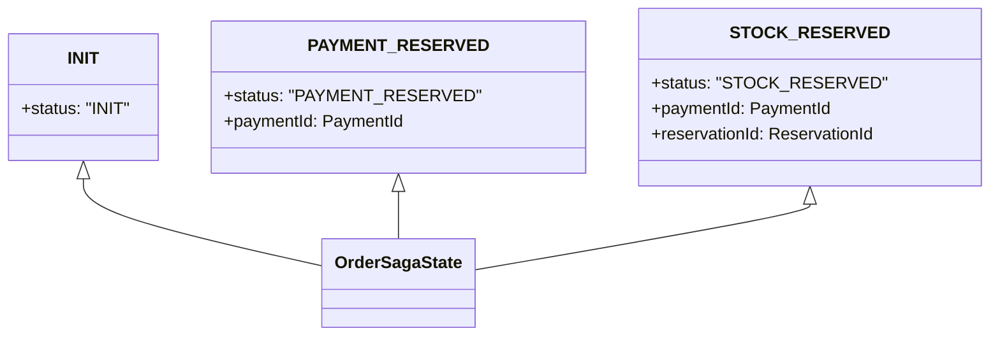
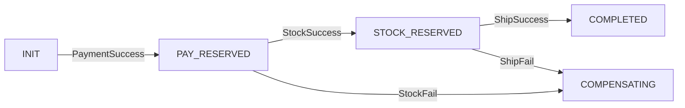
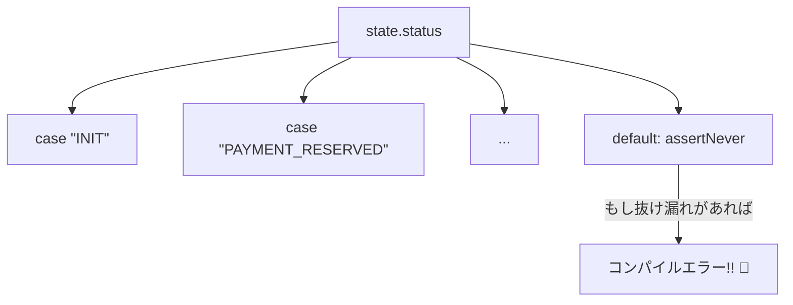
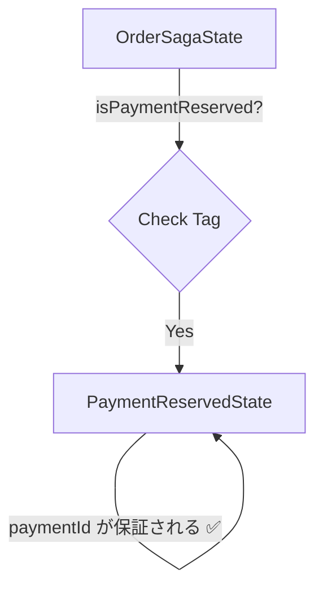

# 第19章：状態機械② TypeScriptの型で事故を減らす🛡️🧑‍💻

## この章のゴール🎯💖

* 「ありえない状態」を **型で作れない** ようにする🧱✨
* 「今の状態で起きていいイベント」以外を **コンパイルで弾く** 🔨🚫
* `switch` の分岐漏れを **ゼロに近づける**（網羅性チェック）✅🌈

> 2026年1月時点の安定版TypeScriptは 5.9.3（5.9系）として扱うよ🧑‍💻✨ ([GitHub][1])
> （6.0/7.0は“橋渡し”やネイティブ移行の話が出ていて、動きが大きい時期！） ([Microsoft for Developers][2])

---

# 1) まず「型で守りたい事故」を言語化しよ😱🧠

Sagaの状態機械で多い事故はだいたいこれ👇

* 状態がただの `string` で、**タイポしても通る**（`"PAID"` vs `"PAYD"`）⌨️💥
* “必要な情報”が揃ってないのに次へ進む

  * 例：`paymentId` が無いのに「決済成功状態」扱いしちゃう😵
* “その状態では起きちゃダメなイベント”が来ても処理しちゃう

  * 例：在庫確保前に `ShipRequested` が来る🚚💨（早すぎ〜！）

ここから先は「事故の入り口を型でふさぐ」感じでいくよ🚪🔒✨

---

# 2) 状態(Status)は “文字列の自由入力” をやめる✋🧩

## ✅ 最小の第一歩：`as const` で状態を固定する

```ts
export const SagaStatus = {
  Init: "INIT",
  PaymentReserved: "PAYMENT_RESERVED",
  StockReserved: "STOCK_RESERVED",
  ShippingRequested: "SHIPPING_REQUESTED",
  Completed: "COMPLETED",
  Compensating: "COMPENSATING",
  Compensated: "COMPENSATED",
  Failed: "FAILED",
} as const;

export type SagaStatus = typeof SagaStatus[keyof typeof SagaStatus];
```

これで `SagaStatus` は `"INIT" | "PAYMENT_RESERVED" | ...` の union になるよ🎉
文字列を手打ちしなくて済むので、タイポ事故が激減する✍️➡️🧯

---

# 3) 「状態ごとに必須のデータが違う」を型で表す📦✨

ここが本章のキモ🧠💖
**状態＝進捗**だから、進捗によって “持っているべき情報” が変わるのが自然なんだよね🌱

## ✅ Discriminated Union（タグ付きUnion）で表現する

```ts
type Brand<K, T extends string> = K & { readonly __brand: T };
type OrderId = Brand<string, "OrderId">;
type PaymentId = Brand<string, "PaymentId">;
type ReservationId = Brand<string, "ReservationId">;

type Base = {
  sagaId: string;         // 相関ID（ログ追跡に便利）
  orderId: OrderId;
  updatedAt: number;      // いつ更新されたか
};

export type OrderSagaState =
  | (Base & { status: "INIT" })
  | (Base & { status: "PAYMENT_RESERVED"; paymentId: PaymentId })
  | (Base & { status: "STOCK_RESERVED"; paymentId: PaymentId; reservationId: ReservationId })
  | (Base & { status: "SHIPPING_REQUESTED"; paymentId: PaymentId; reservationId: ReservationId; shipmentId: string })
  | (Base & { status: "COMPLETED"; paymentId: PaymentId; reservationId: ReservationId; shipmentId: string })
  | (Base & { status: "COMPENSATING"; reason: string })
  | (Base & { status: "COMPENSATED"; reason: string })
  | (Base & { status: "FAILED"; reason: string });
```

## これの何がうれしいの？🥰✨

例えば `"PAYMENT_RESERVED"` のとき、`paymentId` が **必須** になる💳✅
つまり、`paymentId` なしでその状態を作れない＝事故の入口が閉じる🚪🔒

さらに `OrderId` と `PaymentId` をブランド型で分けたから、IDの取り違えも減るよ（`orderId` を `paymentId` に入れちゃうミス）🧪🛑





---

# 4) 「この状態ではこのイベントしか起きない」を型で守る🚦🗺️

次は **状態遷移表** を “型が読める形” にしていくよ📚✨

## ✅ 遷移表を `as const` ＋ `satisfies` で固定する

`satisfies` は「形が合ってるか検査しつつ、推論はなるべく壊さない」ための便利オペレーターだよ🧠✨ ([TypeScript][3])

```ts
type Event =
  | { type: "PaymentSucceeded"; paymentId: PaymentId }
  | { type: "PaymentFailed"; reason: string }
  | { type: "StockReserved"; reservationId: ReservationId }
  | { type: "StockFailed"; reason: string }
  | { type: "ShippingRequested"; shipmentId: string }
  | { type: "ShippingFailed"; reason: string }
  | { type: "StartCompensation"; reason: string }
  | { type: "CompensationDone"; reason: string };

type Status = OrderSagaState["status"];

type TransitionTable = {
  [S in Status]: readonly Event["type"][];
};

export const transitions = {
  INIT: ["PaymentSucceeded", "PaymentFailed"],
  PAYMENT_RESERVED: ["StockReserved", "StockFailed", "StartCompensation"],
  STOCK_RESERVED: ["ShippingRequested", "ShippingFailed", "StartCompensation"],
  SHIPPING_REQUESTED: ["CompensationDone", "StartCompensation"],

  COMPLETED: [],
  COMPENSATING: ["CompensationDone"],
  COMPENSATED: [],
  FAILED: [],
} as const satisfies TransitionTable;

```




## ✅ 「状態Sで許されるイベントtype」を型で取り出す

```ts
type AllowedEventType<S extends Status> = (typeof transitions)[S][number];
type EventOf<T extends Event["type"]> = Extract<Event, { type: T }>;
```

## ✅ “禁止イベント” はコンパイルで弾く（ここが最高）😆🛡️

```ts
function acceptEvent<S extends Status>(
  state: Extract<OrderSagaState, { status: S }>,
  event: EventOf<AllowedEventType<S>>,
) {
  // ここで処理（or ルーティング）
}
```

たとえば `INIT` に `StockReserved` を渡そうとすると、**型エラー**になるよ🚫✨
「実行してから気づく」じゃなくて「書いた瞬間に気づく」ってめちゃ強い🔥

---

# 5) `switch` の分岐漏れを “絶対に気づける” 形にする✅🧯

Sagaは運用しはじめると、状態やイベントが増えることが多いよね📈
そのとき怖いのが「分岐を追加し忘れる」事故😱

## ✅ `never` を使った網羅性チェック

```ts
function assertNever(x: never): never {
  throw new Error("Unexpected object: " + JSON.stringify(x));
}

export function reduce(state: OrderSagaState, event: Event): OrderSagaState {
  switch (state.status) {
    case "INIT": {
      switch (event.type) {
        case "PaymentSucceeded":
          return { ...state, status: "PAYMENT_RESERVED", paymentId: event.paymentId, updatedAt: Date.now() };
        case "PaymentFailed":
          return { ...state, status: "FAILED", reason: event.reason, updatedAt: Date.now() };
        default:
          // INITで許されないイベントが来た時（理想はここに来ない）
          return { ...state, status: "FAILED", reason: "Invalid event for INIT", updatedAt: Date.now() };
      }
    }

    case "PAYMENT_RESERVED": {
      switch (event.type) {
        case "StockReserved":
          return {
            ...state,
            status: "STOCK_RESERVED",
            reservationId: event.reservationId,
            updatedAt: Date.now(),
          };
        case "StockFailed":
        case "StartCompensation":
          return { ...state, status: "COMPENSATING", reason: "stock step failed", updatedAt: Date.now() };
        default:
          return { ...state, status: "FAILED", reason: "Invalid event for PAYMENT_RESERVED", updatedAt: Date.now() };
      }
    }

    // ...他の状態も同様に追加...

    default:
      // ✅ state.status の case を追加し忘れると、ここが型エラーになりやすい形にできる
      return assertNever(state);
  }
}
```

ポイント🌟

* `default: return assertNever(state)` みたいにしておくと、状態を増やした時に「未対応」が見つかりやすい✅
* さらにイベント側も同じ仕組みにすると漏れに強い💪✨



---

# 6) ガード関数で「今この状態？」を安全に判定する🔍🧠

実装してるとよくあるのがこれ👇
「補償を走らせたいけど、`paymentId` ある状態だけだよね？」みたいなやつ💡

## ✅ `Extract` と型述語でガードを作る

```ts
type PaymentReservedState = Extract<OrderSagaState, { status: "PAYMENT_RESERVED" }>;

function isPaymentReserved(state: OrderSagaState): state is PaymentReservedState {
  return state.status === "PAYMENT_RESERVED";
}

// 使い方
function doSomething(state: OrderSagaState) {
  if (isPaymentReserved(state)) {
    // ここでは paymentId が確実にある✨
    const id = state.paymentId;
    return id;
  }
}
```

「ifの中で急に型が賢くなる」感じが気持ちいいよ😆✨



---

# 7) AIに手伝ってもらうときのコツ🤖📝✨

型は長くなりがちだから、AIに下書きを作ってもらうのはめっちゃアリ👌💖
でも事故りやすいポイントがあるよ⚠️

* **“ただのstring” に戻してない？**（`status: string` とか）😵
* `as const` が抜けてて union が広がってない？🌀
* 遷移表が `string[]` になってて「許可イベント」が取れない？💥
* `satisfies` を使うと、形チェックしつつ推論を保ちやすいよ🧠✨ ([TypeScript][3])

---

# 章末演習📝🌸（手を動かすと理解が爆伸び！）

## 演習1：状態を1つ増やしてみよ➕🚦

* `CANCELLED` を追加してみよう
* どの状態から `CANCELLED` に行けるか、遷移表に入れてみてね🗺️✨
* `reduce` の `switch` が “漏れ” を教えてくれるはず✅

## 演習2：禁止イベントをわざと送ってみよ😈

* `INIT` 状態に `StockReserved` を渡してみてね
* **型エラー**になったら勝ち🎉（事故を事前に潰せてる！）

## 演習3：必須データを増やして事故を減らす📦🛡️

* `"COMPENSATING"` に `failedStep: "payment" | "stock" | "shipping"` を追加してみよう
* 補償処理で「どの補償を走らせるか」が安全に決められるようになるよ🧯✨

---

# まとめ🎀✨

* 状態機械は、実は「文字列」より「型」で守るほうが安全🛡️
* **Discriminated Union** で「状態ごとに必要な情報」を固定すると、Sagaの事故が激減する📉✨
* 遷移表を `as const` ＋ `satisfies` にすると、「その状態で起きていいイベント」が型で取れて強い🚦💪 ([TypeScript][3])
* TypeScriptの安定版は5.9系が基準で、周辺の動き（6.0/7.0）も大きい時期だから、型で守る設計はますます価値が上がるよ📈🔥 ([GitHub][1])

[1]: https://github.com/microsoft/typescript/releases "Releases · microsoft/TypeScript · GitHub"
[2]: https://devblogs.microsoft.com/typescript/progress-on-typescript-7-december-2025/?utm_source=chatgpt.com "Progress on TypeScript 7 - December 2025"
[3]: https://www.typescriptlang.org/docs/handbook/release-notes/typescript-4-9.html?utm_source=chatgpt.com "Documentation - TypeScript 4.9"
