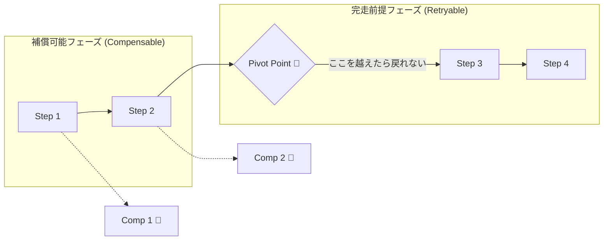
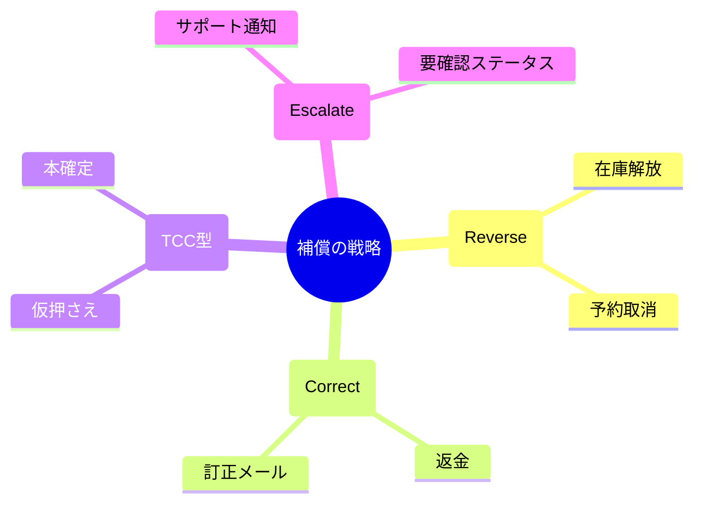
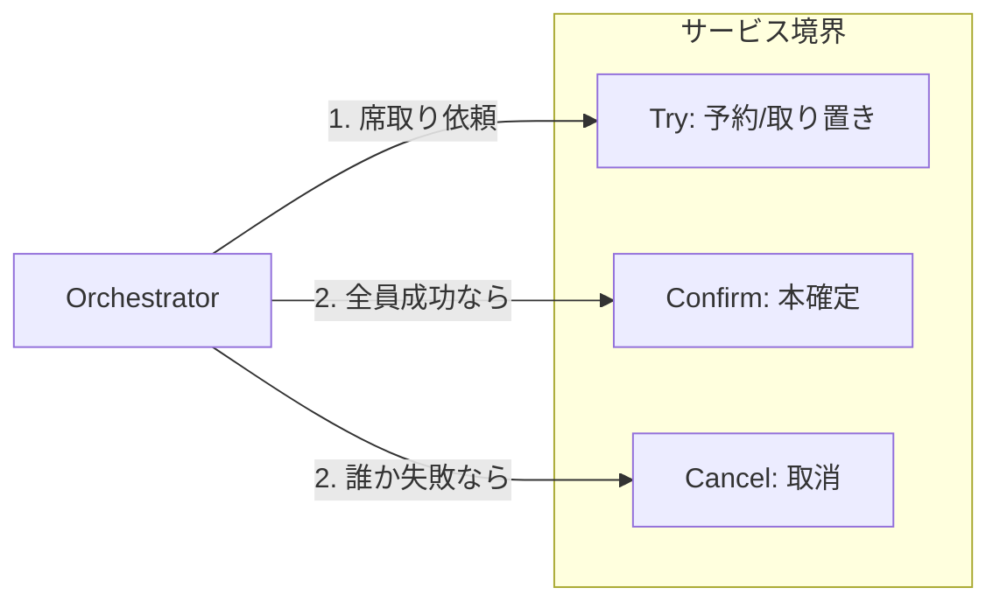
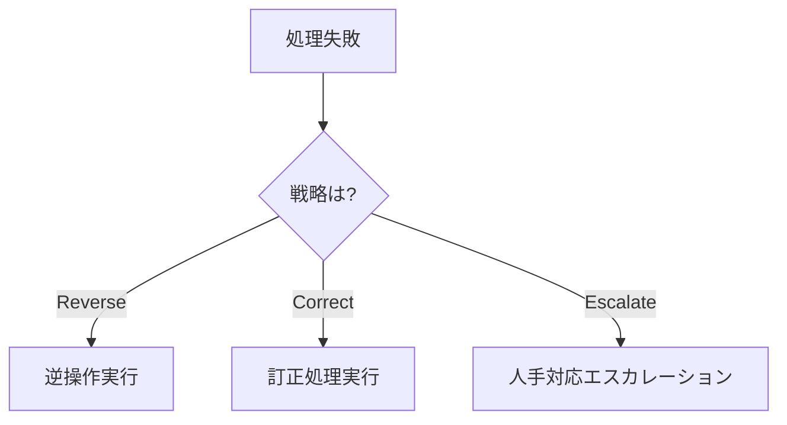

# 第20章：補償設計① “完全に戻せない”現実と折り合い😵🧯

## この章のゴール🎯✨

* 「補償（Compensation）」って、**“完全巻き戻し”じゃなくてもOK**だと腹落ちする🙆‍♀️💡
* 各ステップを見て「戻せる？戻せない？代わりに何する？」を**言語化できる**🗣️📝
* “戻せない現実”を前提に、**事故りにくいSagaの組み方**がわかる🧱🔧

---

# 1. まず大事な前提：Sagaは「ローカル取引＋補償」で整合性を守る🧩🔁

Sagaは、複数サービスにまたがる処理を「各サービスのローカルトランザクションの連なり」として進め、途中で失敗したら**済んだ分を補償で相殺**して整合性を保つ考え方だよ📣✨ ([microservices.io][1])

ただしここで超重要なのがこれ👇

* 補償は「DBをスナップショットに巻き戻す」みたいな**完全ロールバック**ではない🙅‍♀️
* ほかの処理も同時に走ってるので、単純に巻き戻すと**別の正しい変更まで消える**ことがある😱
* だから補償は、基本 **“意味的（セマンティック）に帳尻を合わせる操作”**になるよ🧠✨ ([temporal.io][2])

---

# 2. 「戻せない」が発生する典型パターン集😵‍💫📦💸

「戻せない」って、だいたい次のどれかだよ👇

## A. 現実世界に出ちゃった系（不可逆）🚚📦

* 発送した
* 印刷して封入した
* 物理的に梱包した
  → “未発送に戻す”は無理。できるのは **返品・返金・人手対応**になりがち🧑‍💼💦

## B. 外部サービスが「取り消しAPIを持ってない」系🔌😇

* 送ったメールが取り消せない
* 一部の外部連携が「作成はできるが削除は不可」
  → “取り消し”の代わりに **訂正通知／無効化フラグ／追加入力**で帳尻合わせ📩🧾

## C. 時間が経つと戻せない系⏳🧯

* 「キャンセルは30分以内」などルールあり
  → 期限を過ぎたら **返金の代わりにクーポン**🎫、**サポートで調整**📞 みたいな“別補償”が必要

---

# 3. 超大事：Sagaには「ポイント・オブ・ノーリターン」がある🚧🛑

Saga設計では「ここを超えたら、もう前には戻れない」という境界が登場するよ😵
MicrosoftのSaga解説では、これを **Pivot（ピボット）**として説明しているよ📍✨ ([Microsoft Learn][3])

* **Compensable（補償可能）**：あとから相殺できる
* **Irreversible / Noncompensable（不可逆）**：戻せない
* **Retryable（到達後はリトライで前進する）**：失敗しても“前に進めば整合性が取れる”操作

つまりこういう方針になる👇
✅ **Pivotより前は「戻れる設計」中心**
✅ **Pivot以降は「何があっても完走（リトライ）する設計」中心** ([Microsoft Learn][3])




---

# 4. 戻せないならどうする？補償戦略4つ🧠🧯✨

「補償＝逆操作」だけじゃないよ！現場はもっと柔らかい🌼

## 戦略① 逆操作（Reverse）🔁

* 在庫確保 → 在庫解放
* 予約作成 → 予約取消
  いちばん綺麗✨（でも現実はこれだけじゃ足りない）

## 戦略② 訂正（Correct / Offset）🧾✍️

“元に戻す”じゃなくて“帳尻を合わせる”方式！

* 決済済み → 返金（返金は「逆決済」ではなく「別取引」だと思うと理解が楽）💸
* メール送信済み → 訂正メールを送る📩
* 発送済み → 返品フローを起動する📦↩️

補償が「Ctrl+Z」じゃないのは、まさにこの世界観だよ🧠✨ ([temporal.io][2])

## 戦略③ 予約→確定に分けて「不可逆を遅らせる」（TCCっぽい）🧊⏳

“本番確定”を最後に回すと事故が減るよ〜！
TCC（Try-Confirm-Cancel）は、リソースをまず**予約状態（Try）**にして、最後に**確定（Confirm）**、ダメなら**取消（Cancel）**する考え方だよ📦🔒 ([docs.oracle.com][4])

* 在庫：いきなり「減らす」じゃなく「取り置き」
* 発送：いきなり「発送」じゃなく「ラベル作成」や「出荷予約」
* 決済：いきなり「確定」じゃなく「仮押さえ」的な段階を作れると強い💪

## 戦略④ 人手エスカレーション（Escalate）🧑‍💼🚨

戻せない時に、最後に頼れるのは“運用”！

* サポートチケットを起票する
* 管理画面に「要対応」として出す
* 監査ログと証跡を残して、人が判断できるようにする📝

これ、逃げじゃなくて**現実的に最強**なこと多いよ😌✨



---

# 5. 事故らない補償設計のチェックリスト✅🧯

各ステップごとに、これを埋めるだけで設計が一気にうまくなるよ〜！💕

## ✅ ステップ設計カード（テンプレ）

* ステップ名：
* 何をしたら「成功」？（観測できる？）👀
* 副作用は？（DB更新／外部API／メール／物理）💥
* 分類：補償可能？不可逆？Pivot？🧱 ([Microsoft Learn][3])
* 補償方針：Reverse / Correct / Escalate のどれ？🧯
* 補償が失敗したら？（リトライ？手動？）🚨
* 期限：いつまでなら戻せる？⏳
* “二重実行”されたらどうなる？（冪等性）🔁🔑

---

# 6. 具体例：注文Sagaを「戻せない前提」で作り直す🛒💳📦

ありがちな順番（危険🙅‍♀️）

1. 決済確定💸（不可逆寄り）
2. 発送🚚（ほぼ不可逆）
3. 在庫確保📦
4. 注文作成🧾

これ、途中でコケると地獄👻

おすすめの考え方（安全寄り🙆‍♀️）

1. 注文作成（ローカルで確実）🧾
2. 在庫 “取り置き”📦🔒（Cancelできる）
3. 決済 “確定前段階” or 失敗しても訂正できる形💳
4. 発送 “予約” → 最後に本発送🚚✨（Pivotをできるだけ後ろへ）

「不可逆を遅らせる」だけで、補償がめちゃラクになるよ〜！🥹✨ ([Microsoft Learn][3])



---

# 7. TypeScriptでの表現：補償を「3タイプ」に分けて設計する🧠🛠️

「戻せない」をコードに落とすとき、こういう型があると迷子になりにくいよ🧭✨

```ts
type CompensationStrategy =
  | "Reverse"   // 逆操作できる（在庫解放など）
  | "Correct"   // 訂正で帳尻合わせ（返金・訂正通知など）
  | "Escalate"; // 人手対応へ（チケット起票など）

type StepKind =
  | "Compensable"
  | "Irreversible"
  | "Retryable";

type StepResult = { ok: true } | { ok: false; reason: string };

type SagaStep = {
  name: string;
  kind: StepKind;
  compensation: CompensationStrategy;

  run: (ctx: Record<string, unknown>) => Promise<StepResult>;

  // Reverse/Correct の時だけ用意することが多い
  compensate?: (ctx: Record<string, unknown>) => Promise<StepResult>;

  // Escalate の時に使う（例：チケット起票）
  escalate?: (ctx: Record<string, unknown>) => Promise<void>;
};
```




ポイントはこれ👇

* 「不可逆」でもOK🙆‍♀️ そのかわり **Retryable（完走前提）**に寄せたり、**Correct/Escalate**で逃げ道を作る
* どれを選んだかが、コード上もログ上も分かると運用が強い💪✨

---

# 8. 補償が“失敗しても”壊れない設計のコツ（超重要）🧯🔁

補償って、実は「失敗する」前提で作ると強いよ😵‍💫

## コツ① 補償は「走っても走らなくてもOK」にする🙆‍♀️

たとえばタイムアウトなどで「実行されたか不明」な時があるの…😇
Temporalの解説でも、補償は「実行されたか不明でも安全に動く形（IfPresent）」が大事だよって話があるよ🧠✨ ([temporal.io][2])

例：

* “在庫解放” は「取り置きが存在するなら解放、無ければ何もしない」
* “返金” は「まだ返金してなければ返金、済なら何もしない」

## コツ② 補償の順番は「逆順」が基本🔁

Sagaの定番：進んだ順の逆に戻す（最後にやった副作用からほどく）🧵
（Saga解説でもこの“補償で元に戻す”考え方が中心だよ） ([Microsoft Learn][3])

## コツ③ Escalate を恥ずかしがらない🧑‍💼✨

「人が見る前提」のステータスを用意して、**詰まりっぱなし**を防ぐのが大人設計だよ〜！🚨💕

---

# 9. ミニ演習3つ📝✨（手を動かすと理解が爆速！）

## 演習① ステップ分類ゲーム🎮

次の各ステップを **Compensable / Irreversible / Retryable** に分類してみてね👇

* 在庫取り置き
* 決済確定
* 発送依頼
* 確認メール送信
* 注文作成（DB）

ヒント：Pivot（戻れなくなる境界）も考える📍 ([Microsoft Learn][3])

## 演習② “不可逆を遅らせる”並べ替えパズル🧩

注文Sagaのステップ順を、

* 「補償しやすい」
* 「不可逆が最後に寄る」
  ように並べ替えてみてね🛠️✨

## 演習③ 「戻せない補償」を1つ作る💌🧯

“確認メール送信”が失敗後に発覚したとする（送っちゃった）📩😇
このときの補償案を3つ出してね👇

* Correct案（例：訂正メール）
* Escalate案（例：サポートへ通知）
* 運用ルール案（例：◯分以内なら再送禁止…など）

---

# 10. AI活用のコツ🤖💡（設計が一気に整理される）

Copilot / Codex には、**コード生成より先に**これをやらせると超便利だよ✨

* 「このSagaの各ステップに対して、戻せる/戻せない、補償案、Pivot候補を表にして」🧾
* 「Reverse/Correct/Escalate のどれを選ぶべきか理由つきで」🧠
* 「補償が二重実行されても安全な設計（IfPresent）に直して」🔁

最後に人間がチェック✅（ここが一番大事💕）

---

## 章末まとめ🌸

* 補償は“完全巻き戻し”じゃなくてOK🙆‍♀️（むしろそれが普通） ([temporal.io][2])
* Pivot（戻れない境界）を意識すると、設計がスッキリする📍✨ ([Microsoft Learn][3])
* Reverseだけじゃなく、Correct / Escalate を持つと現実に強い🧯🧑‍💼
* “不可逆を遅らせる”（予約→確定）発想が強い💪🔒 ([docs.oracle.com][4])

[1]: https://microservices.io/patterns/data/saga.html "Pattern: Saga"
[2]: https://temporal.io/blog/compensating-actions-part-of-a-complete-breakfast-with-sagas "Saga Compensating Transactions | Temporal"
[3]: https://learn.microsoft.com/en-us/azure/architecture/patterns/saga "Saga Design Pattern - Azure Architecture Center | Microsoft Learn"
[4]: https://docs.oracle.com/en/database/oracle/transaction-manager-for-microservices/24.2/tmmdg/tcc-transaction-model.html "Try-Confirm/Cancel Transaction Protocol"
