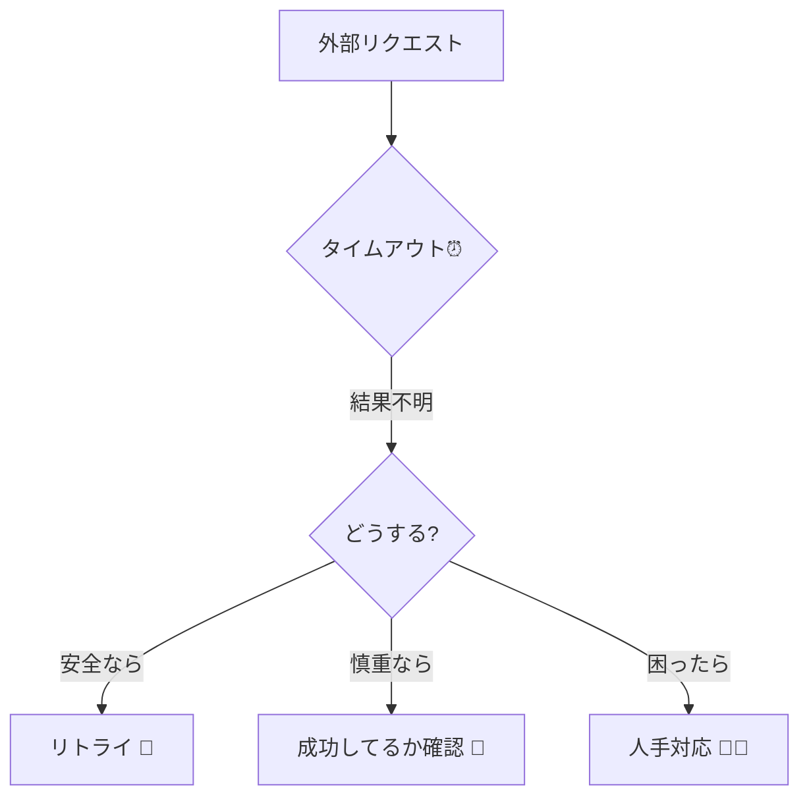
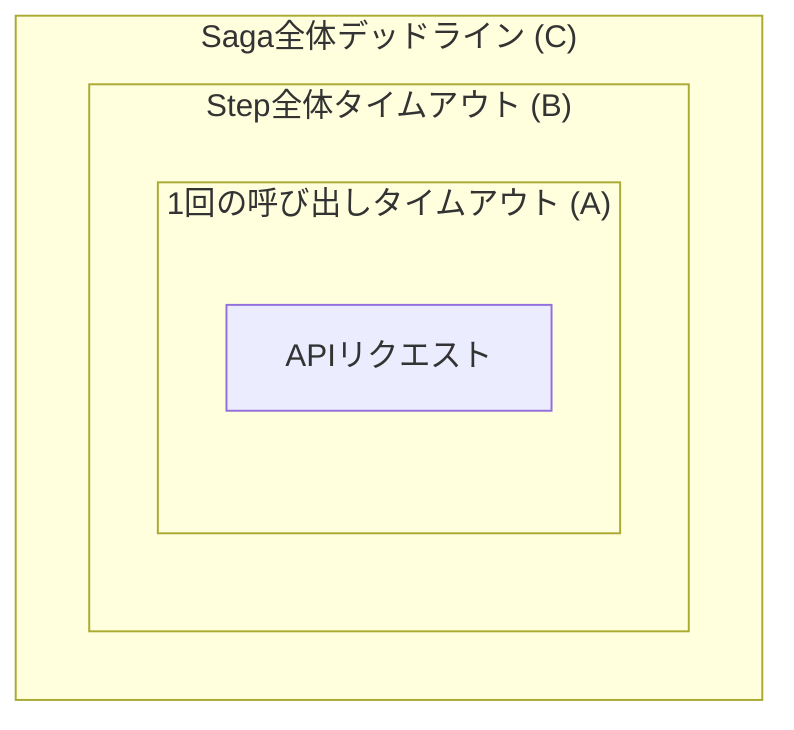
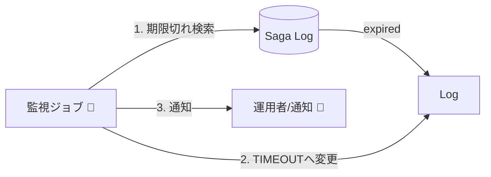

# 第21章：タイムアウト設計（止めどきが大事）⏰🛑

## 21.1 タイムアウトって、なんでそんなに大事？🥺💥

Sagaの世界は「外部I/O（ネットワーク・別サービス）」が前提になりがちです🌍📡
外部I/Oは、**遅くなる・止まる・返事が来ない**が普通に起きます😇

タイムアウトが無いとどうなる？👇

* リクエストがず〜っと待ち続けて、スレッド/コネクション/メモリを食い続ける🍔🧠
* 「どこまで進んだか分からない」まま、Sagaが迷子になる🚶‍♀️💫
* リトライが遅れて、復旧がさらに遅くなる🐢💦
* 最悪、待ち続けが増えてサービスが詰む（雪だるま）⛄💥

なのでタイムアウトは、**“止めどきのルール”**＝設計そのものです✍️✨

---

## 21.2 まず整理！タイムアウトは1種類じゃないよ📚🧩

ざっくり、タイムアウトには「どこまで待つ？」が複数あります👇（用語は実装やライブラリで多少ズレます）

* **接続タイムアウト（connect timeout）**：そもそも繋がらない…の待ち時間🔌⏳
* **ヘッダ受信タイムアウト（headers timeout）**：相手が応答開始しない…の待ち時間📨⌛
* **ボディ受信タイムアウト（body timeout）**：応答は始まったけど、完了しない…の待ち時間📦🕰️
* **全体デッドライン（deadline）**：この処理はトータルでここまで！という上限⏰🧱

「connect」「read」などの概念整理は、このへんが分かりやすいです📖✨ ([Zalando Engineering][1])

---

## 21.3 Saga視点での結論：タイムアウトは “失敗” じゃなくて “不明” 😵‍💫❓

ここが超重要です🔑💖

外部呼び出しでタイムアウトしたとき、こういう状態になりがち👇

* **自分**：返事が来てない
* **相手**：実は成功して処理を完了してるかも
* **ネットワーク**：途中で返事が落ちただけかも

つまりタイムアウトは、しばしば **「失敗」ではなく「結果が分からない（Unknown）」** です😵‍💫

だからSagaでは、タイムアウトを受けたら次のどれにするかを決めます👇

1. **冪等キーつきで安全にリトライ**する🔁🔑
2. **照会APIで“成功したか確認”**してから次へ進む🔎✅
3. **人手/運用フローへエスカレーション**する🧑‍💼📣
4. **補償へ入る**（ただし「相手が成功してるかも」を踏まえて慎重に）🧯⚖️



---

## 21.4 “3段階タイムアウト”で考えると迷子にならない🧠🗺️

Sagaでのおすすめ思考はコレ👇（超よく効きます✨）

* **(A) 1回の外部呼び出しのタイムアウト**（例：8秒）📡⏱️
* **(B) Step全体のタイムアウト**（例：リトライ含め30秒）🧩⏳
* **(C) Saga全体のデッドライン**（例：10分、または業務都合で24時間）🧾⏰

(A)が短くても、(B)と(C)があると「しつこく粘る/諦める」を整理できます🙂✨



逆に(C)が無いと、永遠に “保留Saga” が溜まっていきます📚😇

---

## 21.5 TypeScriptでの実装：まずは “AbortSignalで止める” が基本🥳✂️

今どきは **AbortController / AbortSignal** でキャンセル（中断）を統一するのが超王道です✋✨
特に `AbortSignal.timeout()` は「指定時間で自動中断」できて便利です⏰🛑 ([MDNウェブドキュメント][2])

### 21.5.1 fetch にタイムアウトを付ける（いちばんシンプル）🌟

```ts
// タイムアウトつき fetch（AbortSignal.timeout を使う）
export async function fetchWithTimeout(url: string, timeoutMs: number) {
  const res = await fetch(url, {
    signal: AbortSignal.timeout(timeoutMs),
  });
  return res;
}
```

`AbortSignal.timeout()` は指定時間で自動的に abort されるシグナルを返します（＝自動タイマー付き）⏲️✨ ([MDNウェブドキュメント][2])

### 21.5.2 互換用：AbortController + setTimeout 版（保険）🧯

環境によっては `AbortSignal.timeout()` が無い/挙動差が気になることもあるので、保険としてこの形も覚えておくと安心です🙂‍↕️🧡

```ts
export async function fetchWithControllerTimeout(url: string, timeoutMs: number) {
  const ac = new AbortController();

  const timerId = setTimeout(() => {
    ac.abort(); // 中断
  }, timeoutMs);

  try {
    const res = await fetch(url, { signal: ac.signal });
    return res;
  } finally {
    clearTimeout(timerId); // 成功でも失敗でもタイマー片付ける🧹
  }
}
```

AbortController/AbortSignal は Node の標準APIとしても載っています📚 ([Node.js][3])

---

## 21.6 Nodeのfetchは「内部タイムアウト」もあるので注意⚠️🧠

Nodeの `fetch` は内部で undici を使うため、**headers/body のタイムアウト既定値**が存在します（環境や版で変動しやすいです）🧨
型定義上、`headersTimeout` の既定が `300e3`（300秒）として記述されている例もあります📝 ([fossies.org][4])

さらに、`fetch` 自体は仕様上それらをオプションで直接いじれないので、必要なら **custom dispatcher（Agent）** を渡す、という案内がされています🧰✨ ([GitHub][5])

> 実務の安全策：**自分で “外側タイムアウト（AbortSignal）” を必ず付ける**
> （内部既定に期待しないのが事故りにくいです🙂）

---

## 21.7 Axios を使う場合：timeout は “ミリ秒”＆既定は無制限👀⏱️

Axiosは `timeout` オプションで「何msで打ち切るか」を指定できます🔧
そして既定は `0`（= タイムアウト無し）です😱 ([axios-http.com][6])

```ts
import axios from "axios";

export async function payWithAxios(orderId: string) {
  const res = await axios.post(
    "https://example.com/pay",
    { orderId },
    { timeout: 8000 } // 8秒で打ち切り
  );
  return res.data;
}
```

---

## 21.8 Sagaに組み込む：Stepごとに TimeoutPolicy を持たせよう🧩⏰✨

ここからが「Sagaの教材としての本題」です📌💕

### 21.8.1 Step定義に timeoutMs を入れる（最小形）🧱

```ts
type StepContext = {
  sagaId: string;
  // 冪等キーや相関IDなども本当は持たせたいけど、ここでは最小で😊
};

type StepResult = { ok: true } | { ok: false; reason: string };

type StepDefinition = {
  name: string;
  timeoutMs: number;
  run: (ctx: StepContext, signal: AbortSignal) => Promise<StepResult>;
  compensate: (ctx: StepContext) => Promise<void>;
};

async function runStep(step: StepDefinition, ctx: StepContext): Promise<StepResult> {
  try {
    const signal = AbortSignal.timeout(step.timeoutMs);
    return await step.run(ctx, signal);
  } catch (e: any) {
    const name = e?.name ?? "UnknownError";

    // タイムアウトは「不明」になりやすいので、reason を分ける✨
    if (name === "TimeoutError" || name === "AbortError") {
      return { ok: false, reason: "TIMEOUT" };
    }
    return { ok: false, reason: "ERROR" };
  }
}
```

`AbortSignal.timeout()` を使うことで、Step実行を「時間で止める」仕組みが作れます⏰🛑 ([MDNウェブドキュメント][2])

### 21.8.2 Stepの中で signal を渡して “本当に止める” 🛑📡

```ts
const reserveStockStep: StepDefinition = {
  name: "ReserveStock",
  timeoutMs: 6000,
  run: async (ctx, signal) => {
    const res = await fetch("https://example.com/stock/reserve", {
      method: "POST",
      headers: { "content-type": "application/json" },
      body: JSON.stringify({ sagaId: ctx.sagaId }),
      signal,
    });

    if (!res.ok) return { ok: false, reason: "HTTP_" + res.status };
    return { ok: true };
  },
  compensate: async (ctx) => {
    await fetch("https://example.com/stock/cancel", {
      method: "POST",
      headers: { "content-type": "application/json" },
      body: JSON.stringify({ sagaId: ctx.sagaId }),
    });
  },
};
```

ポイントはこれ👇

* `Promise.race` で “見かけ上” タイムアウトしても、裏で通信が続いたら意味ない😇
* `signal` を渡して **通信自体を止める**のが大事🛑✨

---

## 21.9 タイムアウト値、どう決める？ふわっと決めないコツ🧁📏

### 21.9.1 まずは “遅延の分布（p95/p99）” を見る👀📈

* 平均だけ見て決めると、たまに起きる遅さで事故る😵‍💫
* まずは **p95/p99** を観測して、そこから決めるのが現実的です📊✨（運用で調整しやすい）
  ※タイムアウト設計は「接続/応答/読み取り」など段階を意識するのが大事、という整理も役立ちます🧠 ([Zalando Engineering][1])

### 21.9.2 “ユーザーの許容時間” から逆算（予算）💰⏱️

* 例：ユーザーが待てるのが2秒なら、内部サービス合計はそれ以下に収めたい
* だから **Saga全体デッドライン(C)** を先に決めると、各Stepに配れる時間が決まる🧩✨

### 21.9.3 目安（超ざっくり）📌

* 同一DC/同一ネットワークの内部呼び出し：数秒単位が多い
* 外部API：数秒〜十数秒（相手SLA次第）
* “長い処理” は同期で待たず、非同期化（受付→後で完了通知）も検討対象📮✨

---

## 21.10 タイムアウト時の分岐ルール（Saga用）🚦🧯

タイムアウトが起きたら、**必ずどの道に行くかを決める**のが設計です✍️✨

おすすめの最小ルール👇

* **TIMEOUT**（結果不明）

  * まずは **冪等キー** があるなら **安全にリトライ**🔁🔑
  * 可能なら **照会で確定**（成功してたら次へ、失敗なら補償へ）🔎✅
  * それも無理なら **“保留” 状態にして運用へ**（後で人やバッチが解決）🧑‍💼📌
* **ERROR**（明確に失敗）

  * 即補償へ🧯
* **HTTP_4xx**（業務的にダメ）

  * リトライしない（間違いを直してね系）🙅‍♀️🧾
* **HTTP_5xx**（相手都合）

#   * リトライ候補（でも回数/間隔は第22章のテーマ）🔁📉

---

## 21.11 “Saga全体のタイムアウト” を実装する考え方（ウォッチドッグ）🐶⏰

Sagaは途中で止まることがあるので、**放置しない仕組み**が必要です📌

* Saga状態に `deadlineAt`（いつまでに終えるか）を保存🗓️
* 定期ジョブで「deadlineを超えたSaga」を検出🔎
* 超えてたら `TimedOut` にして、運用通知 or 自動補償（慎重に）📣🧯

これだけで「永遠にPendingが溜まる」事故が激減します✨



---

## 21.12 AI活用ミニ（雛形を出させて、人が安全に直す）🤖🧠✅

Copilot/Codexに投げると便利なお願い例👇

* 「StepDefinition に timeoutMs と retryPolicy を含めた型を作って」🧩
* 「AbortSignal.timeout が無い環境向けのフォールバック関数も作って」🧯
* 「TIMEOUT/ERROR/HTTP_4xx/HTTP_5xx を分類する関数を書いて」🚦

出てきたコードは、ここまでのルール（特に **TIMEOUT=不明**）に合ってるかチェックしてね👀✨

---

## 21.13 章末ミニ演習📝💕

### 演習1：タイムアウト予算を配ってみよう💰⏱️

注文Saga（全体デッドライン 20秒）で👇のStepがあるとするよ🛒📦

* 決済：p95=4秒 / p99=9秒
* 在庫確保：p95=1秒 / p99=3秒
* 配送依頼：p95=2秒 / p99=6秒

1. 各Stepの「1回の呼び出しタイムアウト(A)」を決めてみてね✍️
2. リトライ込みの「Stepタイムアウト(B)」も決めてみてね🔁
3. 合計が全体20秒(C)を超えないように調整してみてね🧠✨

### 演習2：TIMEOUTの扱いを決めよう😵‍💫❓

「決済のタイムアウト」が起きたとき、次のどれにする？（理由も）👇

* すぐ補償（注文キャンセル）🧯
* 冪等キーでリトライ🔁
* 決済照会をして確定してから次へ🔎
* 保留にして運用へ📣

---

## 21.14 チェックリスト✅✨（ここだけ押さえれば勝ち！）

* タイムアウトは必ず入れる（外部I/Oは止まる前提）⏰🛑
* タイムアウトは「失敗」ではなく「不明」になりうる😵‍💫❓
* (A)呼び出し (B)Step (C)Saga全体 の3段階で設計する🧩🧠
* 止めた後の行き先（リトライ/照会/運用/補償）を決める🚦🧯
* `AbortSignal.timeout()` は便利（自動でabortする）⏲️✨ ([MDNウェブドキュメント][2])
* Axiosは既定だとタイムアウト無し（0）なので注意⚠️ ([axios-http.com][6])
* Nodeのfetch/undiciの内部タイムアウトは環境差が出るので、自分で外側タイムアウトを持つのが安全🧯🧰 ([GitHub][5])

[1]: https://engineering.zalando.com/posts/2023/07/all-you-need-to-know-about-timeouts.html?utm_source=chatgpt.com "All you need to know about timeouts"
[2]: https://developer.mozilla.org/en-US/docs/Web/API/AbortSignal/timeout_static?utm_source=chatgpt.com "AbortSignal: timeout() static method - Web APIs | MDN"
[3]: https://nodejs.org/api/globals.html?utm_source=chatgpt.com "Global objects | Node.js v25.5.0 Documentation"
[4]: https://fossies.org/linux/node/deps/undici/src/types/client.d.ts?utm_source=chatgpt.com "Node.js: deps/undici/src/types/client.d.ts"
[5]: https://github.com/nodejs/undici/discussions/1989?utm_source=chatgpt.com "How can I increase the headersTimeout with Node.js's fetch?"
[6]: https://axios-http.com/docs/req_config?utm_source=chatgpt.com "Request Config | Axios Docs"
