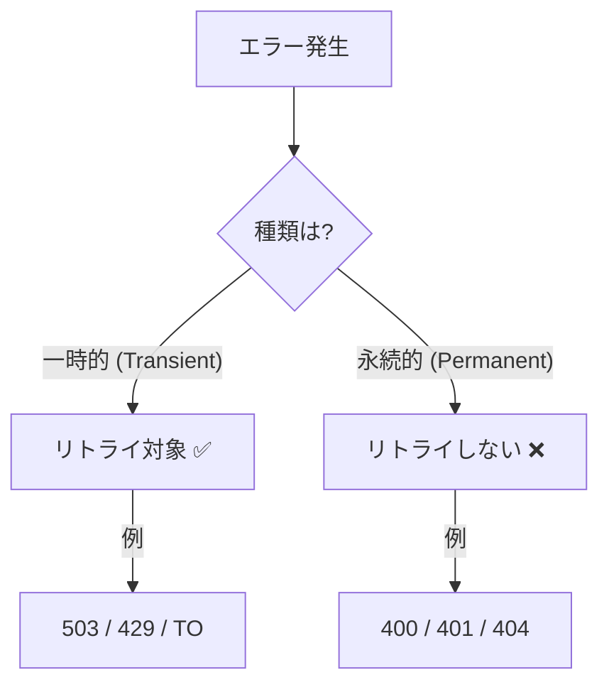
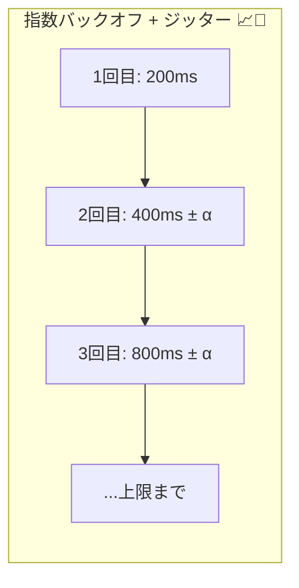
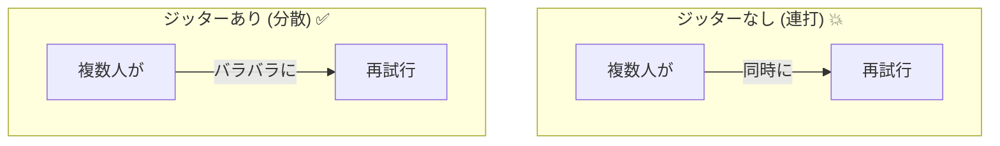
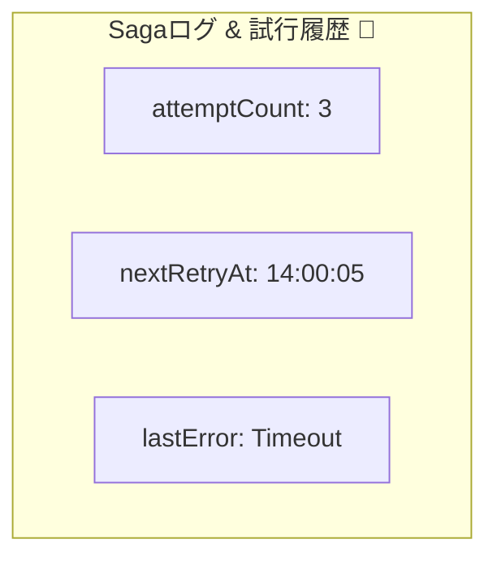

# 第22章：リトライ設計（回数・間隔・バックオフ）🔁📉

## 1) リトライって、そもそも何を“守る”ため？🛡️✨

リトライ（再試行）は「たまたま失敗しただけの通信・処理」を、ちょっと待ってからやり直して成功率を上げるための仕組みだよ😊📶
ただし！やり方を間違えると、失敗してる相手にさらに負荷をかけて、復旧を邪魔しちゃうこともあるの…😵‍💫💥（リトライは“効くけど強い薬”みたいなもの）([Amazon Web Services, Inc.][1])

---

## 2) まず超重要：何でもリトライしちゃダメ🙅‍♀️⚠️

### ✅ リトライ向き（＝一時的：transient）🌦️

代表例：

* ネットワーク瞬断、接続リセット、タイムアウト⏳📡
* HTTPなら **408 / 429 / 5xx** みたいな「一時的」っぽいもの🧯

Google Cloudのガイドも「一時的エラーだけをリトライしてね」ってはっきり言ってるよ📌([Google Cloud Documentation][2])

### ❌ リトライしない方がいい（＝永続的：permanent）🧱

代表例：

* 認証ミス（401/403）🔑❌
* リクエストが変（400）🧩❌
* そもそも存在しない（404）👻❌

こういうのは、待っても直らないから「原因を直す」方向に進むのが正解だよ🛠️✨([Google Cloud Documentation][2])



---

## 3) リトライの“三点セット”🎁✨（タイムアウト＋バックオフ＋ジッター）

リトライを安全にする基本セットはこれ👇

### (A) タイムアウト⏰

「いつまで待つか」を決めないと、1回の試行がズルズル長引いて全体が崩れるよ😵‍💫
Azureのガイドでも、タイムアウトとリトライ間隔と回数を合わせた“総時間”を必ず考えようね、って言ってる📌([Microsoft Learn][3])

### (B) バックオフ（待ち時間を伸ばす）📈

失敗したら **すぐ連打しない**！
指数バックオフ（exponential backoff）で、待ち時間を増やしていくのが定番だよ🔁📉([Microsoft Learn][3])

### (C) ジッター（ランダムな揺らぎ）🎲

みんなが同時に「2秒後に再試行！」ってなると、また同時に殺到して再び落ちるの…😱🌀
だから“ちょいランダム”を混ぜて、再試行タイミングをバラけさせるのがコツだよ🎯([Amazon Web Services, Inc.][4])




---

## 4) 回数・間隔の決め方（初心者向けの鉄板ルール）🧠✨

### ルール①：まず「総リミット時間」を決める⏳🎯

例：このStepは最大でも30秒以内にケリをつけたい、みたいにね。
その範囲で「タイムアウト＋待ち＋回数」を設計するのが基本だよ📌([Microsoft Learn][3])

### ルール②：最初の1回だけ“即リトライ”はアリ（でも1回だけ）⚡

一瞬の通信ブレなら、即リトライで通ることがあるよ😊
でも連打は禁止！「即リトライは最大1回まで」って考えるのが安全✨([Microsoft Learn][3])

### ルール③：バックオフは“上限（cap）”を必ず付ける🧢

指数バックオフは放置すると待ちが長くなりすぎるから、上限で止めるよ（例：最大30秒）⛔
AWSも「上限を付けよう」って強調してる📌([Amazon Web Services, Inc.][1])

---

## 5) Sagaでの“リトライ設計”はここが肝🔥🧩

Sagaは分割処理だから、リトライを雑に入れると事故りやすいよ〜！😵‍💫💣

### 肝①：リトライは“1か所”でやる意識（多段リトライ地獄を回避）🧯

サービス呼び出しが何段も重なってると、各段で3回リトライ…みたいにすると、下流への負荷が爆増しちゃう🥶
AWSは「レイヤーごとに勝手にリトライが増えると、負荷が掛け算で増える」って具体例まで出して警告してるよ⚠️([Amazon Web Services, Inc.][1])

👉 だからSagaでは基本、

* **オーケストレーター（司令塔）側で“まとめて制御”**
* Stepの内部では“むやみに独自リトライしない”
  って設計がわかりやすいよ🎻✨

### 肝②：冪等性がないStepは、リトライが凶器🔪😱

リトライ＝同じStepが複数回走る可能性がある、ってこと。
「二重決済」「二重出荷」みたいな地獄が起きるから、**冪等性（第16〜17章）とセット**で考えるのが大前提だよ🔑💕

### 肝③：Sagaログに「試行回数」「次回実行予定」を残す📒🖊️

最低でもこんな感じを持つと運用しやすい👇

* attemptCount（何回目？）🔢
* nextRetryAt（次はいつ？）🗓️
* lastError（最後の失敗理由）🧯
* status（RETRYING / FAILED など）🚦

---

## 6) バックオフ＋ジッターの定番：Full Jitter（超よく使う）🎲📉

AWSの解説では、ジッターの入れ方として **Full Jitter** みたいなバリエーションが紹介されてるよ✨([Amazon Web Services, Inc.][4])



イメージ（ざっくり）👇

* 指数バックオフで上限まで増やす（capあり）📈🧢
* その範囲内でランダムな待ち時間にする🎲

---

## 7) TypeScriptで“使い回せる”リトライ関数を作ろう🧑‍💻💖

### 7-1) エラー分類（リトライする？しない？）🧩

HTTPを想定するなら、とりあえずこの方針が安全寄り👇

* 408 / 429 / 5xx → リトライ候補✅
* それ以外 → 原因修正・補償・失敗確定へ❌([Google Cloud Documentation][2])



### 7-2) 実装例（指数バックオフ＋Full Jitter）🔁🎲

```typescript
type RetryDecision =
  | { ok: true }
  | { ok: false; reason: string };

type RetryOptions = {
  maxAttempts: number;       // 合計試行回数（例：5）
  baseDelayMs: number;       // 最初の基準（例：200ms）
  maxDelayMs: number;        // 上限（例：30_000ms）
  timeoutPerAttemptMs: number; // 1回あたりのタイムアウト（例：2_000ms）
  // もし外から中断したいとき（Saga全体のタイムアウト等）
  signal?: AbortSignal;
  // テストしやすくするため、乱数を差し替えられるように
  rng?: () => number;
};

function sleep(ms: number, signal?: AbortSignal): Promise<void> {
  return new Promise((resolve, reject) => {
    if (signal?.aborted) return reject(new Error("aborted"));

    const t = setTimeout(resolve, ms);
    const onAbort = () => {
      clearTimeout(t);
      reject(new Error("aborted"));
    };

    signal?.addEventListener("abort", onAbort, { once: true });
  });
}

// Full Jitter: 0〜cap の範囲でランダム
function fullJitterDelayMs(
  attemptIndex: number, // 0,1,2...
  baseDelayMs: number,
  maxDelayMs: number,
  rng: () => number
): number {
  const exp = baseDelayMs * Math.pow(2, attemptIndex);
  const cap = Math.min(exp, maxDelayMs);
  return Math.floor(rng() * cap);
}

// 例：HTTPっぽいエラー判定（必要に応じて拡張してOK）
function shouldRetryHttpStatus(status: number): RetryDecision {
  if (status === 408 || status === 429) return { ok: true };
  if (status >= 500 && status <= 599) return { ok: true };
  return { ok: false, reason: `non-retryable status: ${status}` };
}

// 1回の試行にタイムアウトを付ける
async function withTimeout<T>(p: Promise<T>, ms: number, signal?: AbortSignal): Promise<T> {
  const timeout = new Promise<never>((_, reject) => {
    const t = setTimeout(() => reject(new Error("timeout")), ms);
    if (signal) {
      signal.addEventListener("abort", () => {
        clearTimeout(t);
        reject(new Error("aborted"));
      }, { once: true });
    }
  });
  return Promise.race([p, timeout]);
}

export async function withRetry<T>(
  runOnce: (attempt: number) => Promise<T>,
  decideRetry: (err: unknown) => RetryDecision,
  opt: RetryOptions
): Promise<T> {
  const rng = opt.rng ?? Math.random;

  for (let attempt = 1; attempt <= opt.maxAttempts; attempt++) {
    try {
      // 1回の試行自体をタイムアウトで区切る
      return await withTimeout(runOnce(attempt), opt.timeoutPerAttemptMs, opt.signal);
    } catch (err) {
      // 最後の失敗はそのまま投げる
      if (attempt === opt.maxAttempts) throw err;

      const decision = decideRetry(err);
      if (!decision.ok) throw err;

      // 次の待ち（Full Jitter）
      const attemptIndex = attempt - 1; // 1回目失敗後=0
      const delay = fullJitterDelayMs(attemptIndex, opt.baseDelayMs, opt.maxDelayMs, rng);

      // ここでログ：attempt / delay / err などを出すと運用しやすい
      await sleep(delay, opt.signal);
    }
  }

  // ここには来ない想定
  throw new Error("unreachable");
}
```

---

## 8) SagaのStepに当てはめるとこうなるよ🧩🚶‍♀️🔁

例：Step「在庫確保」を呼ぶときに、司令塔側でこう包むイメージ👇

* Step本体は“純粋に処理する”
* リトライ回数・間隔は“司令塔が決める”
* 冪等キーで二重実行を防ぐ（第16〜17章の考え方）🔑✨

リトライが尽きたら、そこで初めて「補償へ進む」「失敗で止める」「人に渡す」みたいに分岐するよ🧯🧑‍💼

---

## 9) “やりがち事故”図鑑 😇→😱

### 事故①：バックオフなしで連打🔫💥

即リトライ連打は、カスケード障害（連鎖的に落ちる）を起こしやすい…！
Google Cloudも「バックオフなしリトライはアンチパターン」って注意してるよ⚠️([Google Cloud Documentation][2])

### 事故②：冪等じゃない処理を無条件リトライ🧨

「削除」「上書き」「決済」みたいな副作用系は危険💣
“冪等性の条件を理解して、無条件リトライしないでね”って明言されてるよ📌([Google Cloud Documentation][2])

### 事故③：各レイヤーが勝手にリトライして負荷が掛け算📛

「Aが3回、Bも3回、Cも3回」みたいに積み重なると、下流がとんでもないことに…😱
AWSの例がまさにこれ⚠️([Amazon Web Services, Inc.][1])

### 事故④：Retry-After を無視する🙈

503などで「Retry-After（何秒後に試してね）」が返る場合があるよ。
こういうヒントがあるなら、それに合わせるのが賢い設計✨([Microsoft Learn][3])

---

## 10) 章末ミニ演習📝💖

1. 上の **withRetry** を自分のSagaのStep呼び出しに1つだけ適用してみよう🔁
2. 失敗パターンを作って、ログに **attempt / delay / error** を出してみよう👀🧾
3. 429相当（混雑）を想定して、待ちが伸びていくのを確認しよう📉🎲
4. 「最後まで失敗したら補償へ」までつなげてみよう🧯✨

---

## 11) チェックリスト✅✨（この章のゴール）

* 一時的エラーだけをリトライ対象にできる🌦️
* タイムアウト＋バックオフ＋ジッターの三点セットで組める⏰📈🎲([Microsoft Learn][3])
* “総時間”を意識して回数と間隔を決められる⏳🎯([Microsoft Learn][3])
* Sagaでは「司令塔でリトライ制御」「多段リトライ回避」を意識できる🎻🚦([Amazon Web Services, Inc.][1])

[1]: https://aws.amazon.com/builders-library/timeouts-retries-and-backoff-with-jitter/ "Timeouts, retries and backoff with jitter"
[2]: https://docs.cloud.google.com/storage/docs/retry-strategy "Retry strategy  |  Cloud Storage  |  Google Cloud Documentation"
[3]: https://learn.microsoft.com/en-us/azure/well-architected/design-guides/handle-transient-faults "Recommendations for handling transient faults - Microsoft Azure Well-Architected Framework | Microsoft Learn"
[4]: https://aws.amazon.com/blogs/architecture/exponential-backoff-and-jitter/ "Exponential Backoff And Jitter | AWS Architecture Blog"
