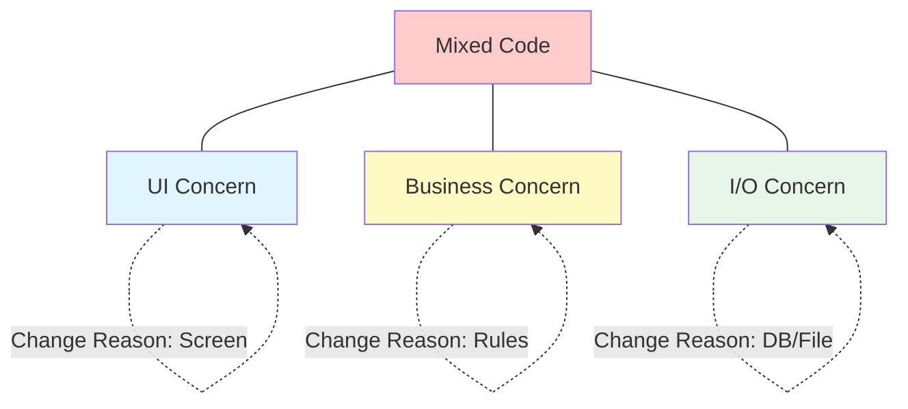
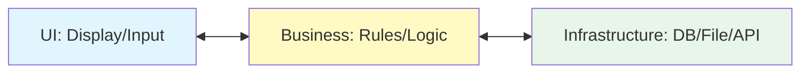

# 第01章：SoCって何？まずは一言で掴む📌😊

## 0. この章のゴール🎯✨

この章が終わったら、最低限ここまでできれば勝ちです🙆‍♀️🌸

* SoC（関心の分離）を**一言で説明**できる😊
* コードを見て「ここ混ざってる〜😇」を**発見**できる🔍
* 大ざっぱに「これはUIっぽい / 業務っぽい / 外部I/Oっぽい」を**仕分け**できる📦✨

---

## 1) SoCを“超一言”で言うと？📌

**SoC（Separation of Concerns）＝「変更理由の違うものは、混ぜない」**です🧩✨

* 画面の見た目を変えたい（UIの都合）🖥️
* 値引きルールを変えたい（業務の都合）🧠
* 保存先をDB→ファイルに変えたい（外部の都合）🗄️

この「都合（＝関心）」が違うのに、1か所にギュッと混ぜると……後で地獄が来ます😇💥

> ちなみに“今の最新ライン”で言うと、C# 14 が最新で、.NET 10 がLTSです（2025年11月リリース）。なので教材のコード感もこの世代が基準でOK👌✨
> ([Microsoft Learn][1])

---

## 2) 「関心（Concern）」って結局なに？🤔💭




むずかしく言わないでいくね😊

**関心＝「このコードが変わる理由」**です📌✨
つまり「何が変わったら、このコードも直す？」って質問に答えると、関心が見えてきます👀

例：

* 「ボタンの文言や入力欄が増えた」→ UIの関心🖥️
* 「割引が10%→12%になった」→ 業務の関心🧠
* 「保存先がSQL→APIになった」→ 外部I/Oの関心🌐

---

## 3) “混ぜると地獄”が起きる理由😇💥（超リアル編）

混ざると何が起きるか、現場あるあるでいきます🤣

### 地獄あるある①：UI変更で業務が壊れる🖥️💣

画面側に業務ルールがベタ書きされてると、
UIをちょい変更しただけで、なぜか計算結果がズレたりします😵‍💫

### 地獄あるある②：DB変更で画面が崩れる🗄️💥

イベントハンドラの中にSQLがいて、ついでに画面更新もしてると、
DB都合の修正なのに画面の挙動まで巻き添えになります😭

### 地獄あるある③：影響範囲が読めない🔍🌀

混ざったコードって、**どこを触ると何が壊れるか予想できない**んです。
これが一番しんどい…😇

---

## 4) SoCの“最初の型”はこれだけでOK🙆‍♀️🪄（3つの箱📦）





最初は難しい設計用語いりません😊
まずはこの3箱で仕分けできるだけで強いです💪✨

1. **表示（UI）**：入力・表示・イベント（クリック等）🖥️
2. **ルール（業務）**：計算・判定・制約・状態遷移🧠
3. **外部（I/O）**：DB、ファイル、HTTP、時計（現在時刻）など🗄️🌐⏰

> ポイント：**「業務」は真ん中に置いて守る**イメージ🧠🛡️
> （この“守る”が後でDIP/DIにつながっていくよ〜！ただし今章は雰囲気だけでOK😊）

---

## 5) ミニ体験：混ざったコードを見て「うわっ😇」を味わう💥

まずは、わざと混ぜた例を見ます👀
（Consoleアプリにしてるのは、UIが軽くて本質が見やすいからだよ😊）

```csharp
using System.Text.Json;

Console.Write("商品価格を入力してね: ");
var input = Console.ReadLine();

// UIのつもりで書き始めたのに…
if (!decimal.TryParse(input, out var price))
{
    Console.WriteLine("数字でお願い🙏");
    return;
}

// 業務ルール（割引）
var discounted = price >= 10000m ? price * 0.9m : price;

// 外部I/O（保存）※本当はここは外に出したい
var receipt = new { Price = price, Discounted = discounted, At = DateTimeOffset.Now };
File.WriteAllText("receipt.json", JsonSerializer.Serialize(receipt));

Console.WriteLine($"割引後: {discounted} 円だよ〜✨（保存した！）");
```

### どこが“混ざってる”の？🔍

* UI：`Console.ReadLine/WriteLine` 🖥️
* 業務：`price >= 10000 ? 0.9` 🧠
* 外部：`File.WriteAllText`, `DateTimeOffset.Now` 🗄️⏰

**この3つが1本の流れでベタ混ざり**してます😇💥
今は短いから平気に見えるけど、これがフォームや画面になると一気に地獄化します🔥

---

## 6) “分離の第一歩”は、分けて書くことじゃなくて「線を引くこと」✍️✨

いきなり綺麗に分けなくてOK🙆‍♀️
最初はこれだけやってください👇

### ✅ 今日からできるSoCの練習（超かんたん）

**コードに3色のコメントを付ける**だけ🎨✨
（色の代わりにタグでもOK！）

* `[UI]`
* `[BUSINESS]`
* `[IO]`

さっきのコードに付けると、こんな感じ👇

```csharp
// [UI]
Console.Write("商品価格を入力してね: ");
var input = Console.ReadLine();

// [UI]
if (!decimal.TryParse(input, out var price))
{
    Console.WriteLine("数字でお願い🙏");
    return;
}

// [BUSINESS]
var discounted = price >= 10000m ? price * 0.9m : price;

// [IO]
var receipt = new { Price = price, Discounted = discounted, At = DateTimeOffset.Now };
File.WriteAllText("receipt.json", JsonSerializer.Serialize(receipt));

// [UI]
Console.WriteLine($"割引後: {discounted} 円だよ〜✨（保存した！）");
```

**この“見える化”ができた時点で、もうSoCが始まってます**😊🌱
次章以降で、ここから「じゃあどう切る？」を段階的にやるよ🔧✨

---

## 7) 仕分けミニクイズ🎮✨（1分でOK）

次の処理、どの箱？📦（UI / 業務 / 外部I/O）

1. 「入力された文字列を数値に変換してエラー表示する」
2. 「会員ランクにより送料を0円にする」
3. 「HTTPで外部APIから在庫数を取る」
4. 「今日の日付を使ってキャンペーン判定する」

### 答え合わせ✅✨

1. UI（エラー表示や入力はUI寄り）🖥️
2. 業務🧠
3. 外部I/O🌐
4. 外部I/O寄り⏰（“時間”は外部要因＝テストしにくさの元！後で分離すると超ラクになるよ）

---

## 8) AI（Copilot等）を使う“第1章らしい”安全な使い方🤖💡

この章では、AIに「分離案を丸投げ」じゃなくて、**仕分けの補助**に使うのが◎です😊✨

例プロンプト👇

* 「このC#コードをUI/業務/I-Oの3つにコメントで色分けして」
* 「変更理由（関心）が何かを箇条書きで教えて」
* 「混ざっていることで起きそうなバグ例を3つ挙げて」

AIの回答を見て、「たしかに！」って納得できたら勝ち🏆✨

---

## 9) まとめ🧁✨（今日持ち帰る1枚）

* SoCは **変更理由の違うものを混ぜない** 🧩
* 最初は **UI / 業務 / 外部I/O** の3箱で仕分け📦
* いきなり分割しなくてOK。まず **線を引いて見える化** ✍️✨

次章は、「混ざったコードが生む修正地獄あるある」を、もう少しリアルな例（フォームっぽい流れ）で体験します😇🔥

[1]: https://learn.microsoft.com/ja-jp/dotnet/csharp/whats-new/csharp-14?utm_source=chatgpt.com "C# 14 の新機能"
