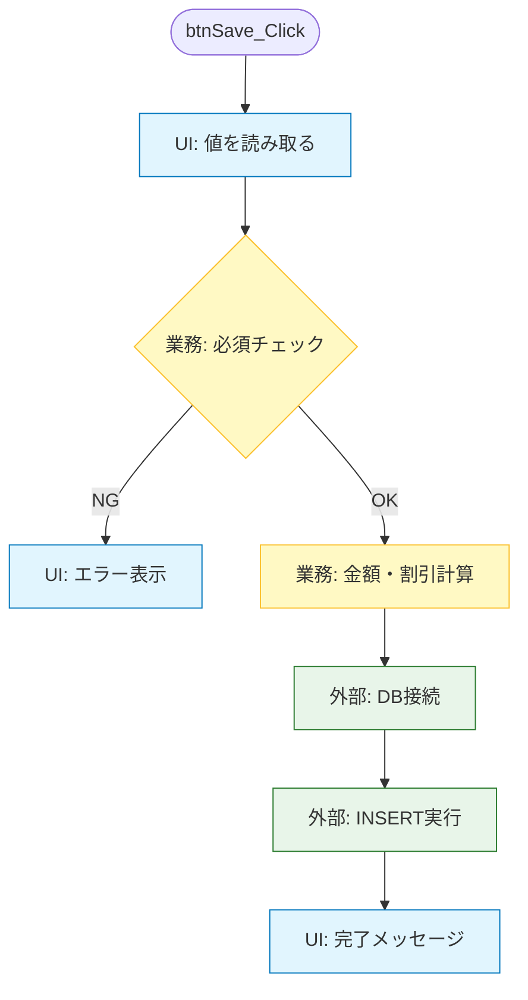

# 第02章：混ざったコードが生む“修正地獄”あるある😇💥

この章はね、**「SoCって大事らしい」**を頭で覚えるんじゃなくて、
**「うわ…これ、実際に地獄だ…」**を体で分かる章だよ〜🫠🔥

（ちなみに今のC#まわりは **.NET 10（LTS）＋C# 14＋Visual Studio 2026** が軸になってきてるよ〜✨ ([Microsoft for Developers][1])）

---

# 1) まず結論：混ざると“変更”が爆発する💣💥


「UI」「業務ロジック」「DBアクセス」が1か所に混ざると、こうなるよ👇

* ちょっとUIを変えただけなのに、**計算やルールが壊れる**😇
* DBの列名が変わっただけで、**画面が真っ白**😇
* 影響範囲が読めなくて、**修正が怖い**😱
* 直したはずが別の場所が壊れて、**モグラ叩き**🐹🔨

これが“修正地獄”の正体〜〜〜😭

---

# 2) 今日の主人公：なんでも詰め込みフォーム（あるある）📦🫠


たとえば、ありがちな「注文登録」ボタンのクリックイベント。
**UI**も**ルール**も**DB**も全部ここ！みたいなやつね😇

```csharp
// WinFormsでもWPFでも「イベントの中に全部」は同じ地獄になるよ…！
private void btnSave_Click(object sender, EventArgs e)
{
    // ① UIの値を読む（表示の関心）
    var customerName = txtName.Text;
    var qty = int.Parse(txtQty.Text);
    var price = decimal.Parse(txtPrice.Text);
    var isMember = chkMember.Checked;

    // ② 業務ルール（業務の関心）
    if (string.IsNullOrWhiteSpace(customerName))
    {
        MessageBox.Show("名前は必須です");
        return;
    }

    var subtotal = qty * price;
    var discountRate = isMember ? 0.1m : 0m; // 会員は10%OFF
    var total = subtotal * (1 - discountRate);

    // ③ DBアクセス（外部の関心）
    using var con = new SqlConnection(_connectionString);
    con.Open();

    var sql = $"""
        INSERT INTO Orders(CustomerName, Qty, Price, IsMember, Total)
        VALUES (@name, @qty, @price, @isMember, @total)
        """;

    using var cmd = new SqlCommand(sql, con);
    cmd.Parameters.AddWithValue("@name", customerName);
    cmd.Parameters.AddWithValue("@qty", qty);
    cmd.Parameters.AddWithValue("@price", price);
    cmd.Parameters.AddWithValue("@isMember", isMember);
    cmd.Parameters.AddWithValue("@total", total);
    cmd.ExecuteNonQuery();

    // ④ 表示の更新（表示の関心）
    MessageBox.Show($"登録しました！ 合計: {total:#,0}円");
    txtName.Text = "";
    txtQty.Text = "1";
    txtPrice.Text = "0";
    chkMember.Checked = false;
}
```



見ての通り、**“変更理由が3つ以上あるコード”**になってるのがポイントだよ🧨
これがSoCの入口〜〜〜🚪✨

---

## 3) 修正地獄あるある①：UI変更で業務が壊れる🖥️➡️🧠💥


## 💥ある日、こう言われる

「数量、手入力やめて**コンボボックス**にして〜😊」
「価格、カンマ付き表示にして〜😊（例：1,200）」

この瞬間、地獄のスイッチON🔛😇

### なぜ壊れるの？

* 業務ロジックが **UIの形式に依存**してるから！

  * `int.Parse(txtQty.Text)` ← UIの見た目変更に弱い
  * `decimal.Parse(txtPrice.Text)` ← `1,200`で落ちる可能性💥

つまり…
**UIをちょっと整えただけで、業務計算が死ぬ** ☠️

---

# 4) 修正地獄あるある②：DB変更で画面が崩れる🗄️➡️🖥️💥


## 💥ある日、こう言われる

「Ordersテーブル、列名 `Price` じゃなくて `UnitPrice` に変えたよ〜😊」
「あと税率も入れるね😊」

混ざってるコードは、DBの都合が直撃する⚡

* SQLがイベント内にベタ書き
* 列名・テーブル名が直接登場
* 画面がDB構造にくっついてる

結果👇
**保存で例外 → 画面の動作が止まる → 直す場所が“画面側”**😇

---

# 5) 修正地獄あるある③：「影響範囲が読めない」が一番つらい😭📚🌀


これが一番メンタル削れるやつ…！

## 💥ある日、こう言われる（最強）

「会員は10%OFFじゃなくて、

* 5000円以上なら15%OFF
* さらに初回購入は+5%
  にして〜😊」

あなたの脳内👇
「えっと…どこにルール書いてあったっけ…？」😵‍💫
「DBも絡む？UIも変える？」😨
「似た計算、別画面にもある気がする…」🫠

混ざってるコードは、だいたいこう👇

* 同じ計算があちこちにコピペ🧟‍♀️
* 修正箇所が芋づる式🐙
* “一応動く”けど、どこが正しいか分からない😇

---

# 6) “混ざってるコード”を見分けるチェックリスト✅😇


以下がイベントやメソッドに同居してたら、だいたい混ざってる〜！

* UI要素名（`txt`, `lbl`, `grid`, `MessageBox`）が出る🖥️
* 業務っぽい単語（割引、在庫、状態遷移、上限チェック）が出る🧠
* DB/外部（`SqlConnection`, `HttpClient`, `File`, SQL文字列）が出る🗄️🌐
* 1メソッドが長い（目安：**30行超えたら黄色信号**🟡）
* if文が増殖して「条件の森」🌳🌳🌳

---

# 7) ミニ演習：どこが“混ざりポイント”か探そう🔍✨

上の `btnSave_Click` を見ながら、次をやってみてね📝💕

1. **表示の関心**に当たる行に「🖥️」
2. **業務の関心**に当たる行に「🧠」
3. **外部の関心**に当たる行に「🗄️」

そして最後に一言👇
「このメソッド、変更理由が何個ある？」って数えてみて！
（答え：だいたい3個じゃ済まないこと多い…😇）

---

# 8) AI（Copilot/Codex）活用：混ざりを“言語化”させる🤖💡

Visual Studio 2026 では Copilot がより深く統合されてきて、右クリック等からのアクションも増えてるよ🧰✨ ([Microsoft Learn][2])
ここでは“いきなり分離させる”じゃなく、**混ざりを整理する**ために使おう〜！

## そのまま使えるプロンプト例🪄

* 「このメソッドの処理を **UI / Business / DataAccess** に分類して箇条書きして」
* 「変更要求：『会員割引ルール変更』が来た。影響範囲が広がる理由を説明して」
* 「副作用（DB保存、MessageBoxなど）と純粋計算を分けてリスト化して」

## ⚠️注意（超大事）

AIが出した分離案は便利だけど、**そのまま採用しない**でね🙏

* “それっぽい分割”で、境界が逆に変になることある😇
* まずは **分類・言語化**までをAIに任せるのが安全だよ🧡

---

# 9) この章のまとめ🎀✨

* 混ざったコードは、**変更が連鎖して爆発**する💥
* UI変更・DB変更・ルール変更が、全部1か所に刺さる🫠
* 一番つらいのは「影響範囲が読めない」こと😭
* 次の章以降で、**どう分けるか（SoC）**をちゃんと身につけていこうね🧩✨

---

次は第3章（SoCとSOLID/SRPの関係）に進む前に、
この章の“混ざりコード”をあなたの過去プロジェクトで思い出してみるとめっちゃ効くよ〜😆💭
「これ、うちにもあったわ…」って1個でも思い当たれば、もう勝ちです🏆💕

[1]: https://devblogs.microsoft.com/dotnet/announcing-dotnet-10/?utm_source=chatgpt.com "Announcing .NET 10"
[2]: https://learn.microsoft.com/en-us/visualstudio/releases/2026/release-notes?utm_source=chatgpt.com "Visual Studio 2026 Release Notes"
