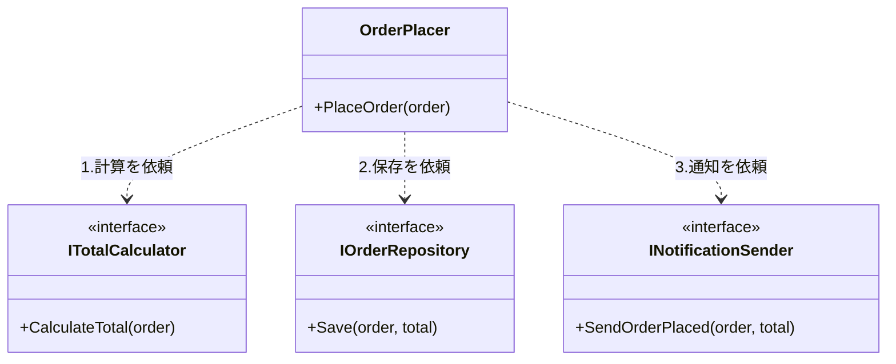

# 第03章：SoCとSOLID（特にSRP）の関係🧩✨

（＝「分ける」の“判断基準”を手に入れる回だよ〜！🥳）

---

### 0) この章のゴール🎯

この章を終えると、こんな判断ができるようになるよ👇✨

* 「ここ、分けた方がいい？」を**SRP（単一責務）**で説明できる🗣️
* **責務＝変更理由**って言われたときに、ちゃんと使える🧠💡
* 「分けすぎ怖い…😵‍💫」も、**“まとめる基準”**で落ち着いて判断できる😌

※ちなみに本日時点のC#まわりは、**C# 14 が最新で .NET 10 上でサポート**されてるよ〜（章の例もこの世代の前提でOK）([Microsoft Learn][1])

---

## 1) まず整理：SoCとSOLIDってどう違うの？🧭✨

### SoC（関心の分離）って？

ざっくり言うと、**種類の違う関心ごとを混ぜない**ことだよ🧺❌
例：

* 画面の見た目（UI）🖥️
* ルール（業務）🧠
* DBや外部通信（I/O）🗄️🌐

こういう“性質が違うもの”が1か所に混ざると、修正のたびに事故りやすい😇💥

### SOLIDって？（超ざっくり）

「オブジェクト指向の設計のコツ5つ」だよ📚✨
この章では、その中でも **SRP** に絞るよ〜！

---

## 2) SRP（単一責務）＝SoCの“実戦ルール”になりやすい🧩✨

### SRPの有名な言い方👑

SRPはよくこう説明されるよ👇

* 「クラスは、**たった1つの変更理由**だけを持つべき」
* あるいは「**1つのアクター（利害関係者）**に対して責任を持つべき」

この“アクター”って考え方もSRPの大事ポイントだよ([ウィキペディア][2])

---

## 3) 超重要：**責務＝変更理由** 🧠💡（これが“線引きの定規”📏）

### ✅ 変更理由ってなに？

「そのクラスが変更される理由」だよ🛠️
そしてSRP的にはこう考えるのが強い👇

* **同じ理由で一緒に変わるものは、まとめてOK**🤝
* **違う理由で別々に変わるものは、分けよう**✂️

これはRobert C. Martinの説明でも、別表現としてよく出てくる考え方だよ([ウィキペディア][2])

---

## 4) “アクター”で考えると一気に分かりやすい👭✨


たとえば「注文処理」のコードがあったとして…

* 割引ルールを変えたい人：営業・マーケ💰
* 画面表示を変えたい人：UI担当🖥️
* DBの保存形式を変えたい人：DB担当🗄️
* メール文面を変えたい人：CS（サポート）📩

この人たち（＝アクター）が違うのに、**同じクラスを触る**なら…
それ、責務が混ざってる可能性めっちゃ高い😇🔥

---

## 5) 例：SRP違反の“なんでも屋クラス”🙅‍♀️📦

「注文を確定する」だけのはずなのに、1クラスが全部やってるパターン👇

```csharp
public class OrderService
{
    public void PlaceOrder(Order order)
    {
        // 1) 入力チェック（業務ルール）
        if (order.Items.Count == 0) throw new InvalidOperationException("No items.");

        // 2) 価格計算（業務ルール）
        decimal total = 0;
        foreach (var item in order.Items)
            total += item.Price * item.Quantity;

        // 3) DB保存（外部I/O）
        using var conn = new SqlConnection("...");
        conn.Open();
        // ここでINSERT/UPDATE...（省略）

        // 4) メール送信（外部I/O）
        using var smtp = new SmtpClient("smtp.example.com");
        smtp.Send("shop@example.com", order.Email, "Thanks!", $"Total: {total}");
    }
}
```

### 何がまずいの？😵‍💫

このクラス、変更理由が少なくとも4つあるよね👇

* ルール変更（チェック/計算）🧠
* DB都合🗄️
* メール都合📩
* ついでにログ追加とかも入りがち😇

**変更理由が複数＝SRP違反のサイン**になりやすいよ([ウィキペディア][2])

---

## 6) SRPで直すとこうなる✨（“まとめる・分ける”のバランス版）

ポイントは「**責務を“言葉”にしてから分ける**」だよ✍️✨
（いきなりクラス増やすと迷子になりやすい😵‍💫）

### ステップ1：責務をラベル付け🏷️

* 合計金額を計算する（業務）🧠
* 保存する（I/O）🗄️
* 通知する（I/O）📩

### ステップ2：分ける（最小構成でOK）✂️

```csharp
public class OrderPlacer
{
    private readonly ITotalCalculator _calculator;
    private readonly IOrderRepository _repo;
    private readonly INotificationSender _notifier;

    public OrderPlacer(ITotalCalculator calculator, IOrderRepository repo, INotificationSender notifier)
    {
        _calculator = calculator;
        _repo = repo;
        _notifier = notifier;
    }

    public void PlaceOrder(Order order)
    {
        _calculator.Validate(order);
        var total = _calculator.CalculateTotal(order);

        _repo.Save(order, total);
        _notifier.SendOrderPlaced(order, total);
    }
}

public interface ITotalCalculator
{
    void Validate(Order order);
    decimal CalculateTotal(Order order);
}

public interface IOrderRepository
{
    void Save(Order order, decimal total);
}

public interface INotificationSender
{
    void SendOrderPlaced(Order order, decimal total);
}
```

#### ここが大事💡

* “注文を確定する”は、**流れの指揮（オーケストラ）**だけ🎻✨
* 計算・保存・通知は、それぞれの担当へ👩‍💻👩‍💻👩‍💻

この形にすると、

* DB変更はRepository側だけ🗄️
* メール変更はNotification側だけ📩
* ルール変更はCalculator側だけ🧠
  ってなって、影響範囲がスパッと読めるようになるよ〜！😄✨



---

## 7) よくある勘違い3つ⚠️（ここ踏むとつらい😇）

### 勘違い①「1クラス＝1メソッドってこと？」

ちがうよ〜！🙅‍♀️
**“同じ理由で一緒に変わるなら”** メソッドが複数でもOK👌✨

### 勘違い②「SRPって、とにかく細かく分ければいい？」

それも違う😵‍💫
**分けすぎ**は「探すのが大変」「つなぐのが大変」になる💥
だからこそ、判断基準はこれ👇

* **変更理由が同じならまとめる**🤝
* **変更理由が違うなら分ける**✂️ ([ウィキペディア][2])

### 勘違い③「責務って“機能”のこと？」

半分だけ正解！
SRPで強いのは **“誰の都合（アクター）で変わるか”** だよ👭([ウィキペディア][2])

---

## 8) “責務を言葉にする”練習✍️✨（ここ超大事！）

次のクラス名を見て、責務を1行で言ってみてね👇😊
（※1クラスに2行以上出たら、混ざってるサイン🚨）

* OrderService
* UserManager
* ReportUtil
* DataHandler

🌟コツ：

* 「〜を**計算**する」
* 「〜を**保存**する」
* 「〜を**表示**する」
* 「〜を**送信**する」
  みたいに **動詞**で言うとラクだよ🎯

---

## 9) ミニ仕分けクイズ🎮✨（SRPの感覚づくり）

次の変更が来た！どこを直すのが自然？🤔

1. 割引率が「会員ランク」で変わるようになった💳
2. DBのテーブルが分割された🗄️
3. 注文完了メールに「配送予定日」を追加したい📩
4. 入力チェックに「住所必須」を追加したい🏠
5. メール送信を外部API（HTTP）に置き換えたい🌐

**答え（例）**✅

1. Calculator（業務）🧠
2. Repository（保存）🗄️
3. Notification（通知）📩
4. Calculator（Validate）（業務）🧠
5. Notification（通知）📩

こうやって「変更理由」で置き場が決まると、設計が気持ちよくなるよ〜😄✨

---

## 10) Copilot/Codexに頼るならこの聞き方🤖💡（短くて効く！）

※AIは“採用する前に自分で責務チェック”ね✅

* 「このクラスの責務（変更理由）を箇条書きで出して」📝
* 「責務が混ざっているなら、分割案を3パターン提案して」🧩
* 「分けすぎにならない最小の分割にして」✂️🙂

---

## まとめ🎀✨（この章の持ち帰り）

* SoCは「混ぜない方針」🧭
* SRPは「クラス単位の線引き定規」📏
* **責務＝変更理由**、そして「アクター」で考えると強い👭([ウィキペディア][2])
* **同じ理由で変わるならまとめる／違う理由なら分ける**が最強ルール🤝✂️([ウィキペディア][2])

---

次の章（第4章）は、いよいよ「表示・ルール・外部」の**3つに仕分ける基本形**へ行くよ〜！🙆‍♀️🪄

[1]: https://learn.microsoft.com/en-us/dotnet/csharp/whats-new/csharp-14?utm_source=chatgpt.com "What's new in C# 14"
[2]: https://en.wikipedia.org/wiki/Single-responsibility_principle?utm_source=chatgpt.com "Single-responsibility principle"
