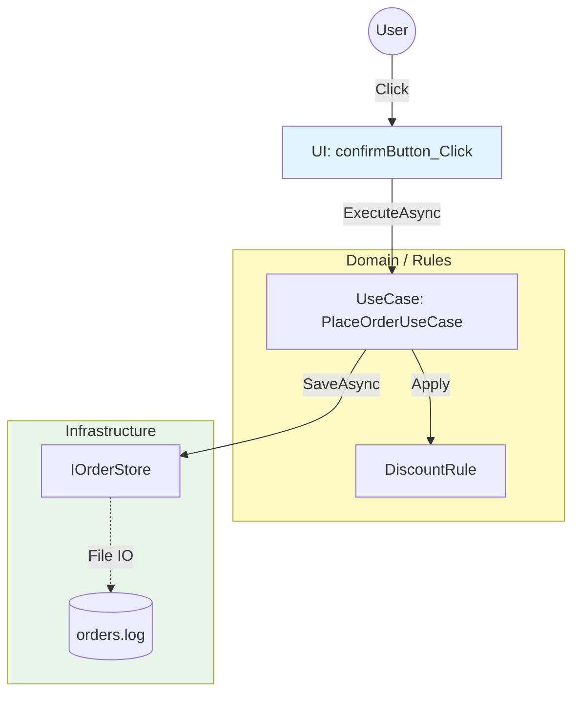

# 第04章：分離の基本はこの3つだけ覚えればOK🙆‍♀️🪄

**（表示/UI・ルール/業務・外部/DB/ファイル/HTTP）**

---

### 0) 今日のゴール🎯✨

この章が終わったら、あなたはもうこう言えます👇

* 「このコード、**UI**だね🖥️」
* 「これは**業務ルール**だね🧠」
* 「これは**外部**（DB/HTTP/ファイル）だね🗄️🌐」

つまり、**“分け方の地図”**を頭に入れる回です🗺️💕

ちなみに2026年1月時点だと、開発側は **.NET 10（LTS）** が公開済みで、サポートは **2028-11-10** まで続く想定です。C# は **C# 14** が最新で、.NET 10 対応です。([Microsoft for Developers][1])

---

## 1) まずは「3つの箱」モデル📦📦📦


SoC（関心の分離）は難しく考えなくてOK🙆‍♀️
**“コードを3つの箱に仕分けする”**だけで一気に分かりやすくなります✨

### 箱①：表示（UI）🖥️🎨

**役割：ユーザーと会話する担当**

* 画面に表示する（ラベル・一覧・色・フォント…）
* 入力を受け取る（ボタン、テキスト、チェック…）
* クリックされたら「次に何をするか」を決めて呼び出す（だけ！）

✅ UIっぽい単語のにおい👃

* `TextBox.Text` / `MessageBox.Show` / `Button_Click`
* 画面レイアウト、入力チェック（「空欄はダメ」など見た目寄り）

> UIは「司会者」🎤✨
> しゃべるのは得意。でも、**ルールの中身まで決めだすと事故る**💥

---

### 箱②：ルール（業務）🧠⚖️

**役割：正しさを決める担当（このアプリの“魂”）**

* 値引き・手数料・在庫の減らし方
* 状態遷移（下書き→確定→発送…）
* 禁止ルール（未成年NG、上限超えNG…）

✅ ルールっぽいにおい👃

* 「こういう場合はこうする」
* 「この条件ならエラー」
* 「合計金額はこう計算」

> ルールは「校則」📏✨
> 画面が変わっても、DBが変わっても、**校則は校則**。なるべく中心に置くと強い💪

Microsoftのアーキテクチャ解説でも、**表示（UI）・業務ロジック・データアクセス**を分ける考え方が紹介されています。([Microsoft Learn][2])

---

### 箱③：外部（DB/ファイル/HTTP）🗄️🌐📁

**役割：アプリの外の世界と話す担当**

* DBアクセス（SQL、ORM、接続文字列…）
* ファイル操作（読み書き、パス…）
* HTTP通信（API、認証、タイムアウト…）
* OSや環境の都合（時刻、環境変数、ネットワーク…）

✅ 外部っぽいにおい👃

* `SqlConnection` / `HttpClient` / `File.ReadAllText`
* `DateTime.Now`（※“今”は外から来る情報）
* `Environment.GetEnvironmentVariable`

> 外部は「宅配便」📦🚚
> 届く/届かない・遅れる・壊れる、がある。
> だから**中心（ルール）に持ち込まない**のがコツ😌✨

---

## 2) 迷ったらこれ！「3つの質問」🧩✨

コードを見て、次の質問を順番に当ててください👇

### Q1：それ、ユーザーに見せたり入力を受けたりしてる？🖥️

→ YESなら **UI**！

### Q2：それ、このアプリの“正しさ”を決めてる？🧠

（割引・制約・状態・計算など）
→ YESなら **ルール**！

### Q3：それ、DB/ファイル/ネット/API/OSと話してる？🗄️🌐

→ YESなら **外部**！

✅ だいたいこれで8割仕分けできます🙆‍♀️✨
（残り2割は「どっち寄り？」って悩むやつ。でも今はOK！）

---

## 3) “混ざってる”例を見てみよ〜😇💥（超あるある）

例：ボタンを押したら「注文確定」する画面だと思ってください🛒✨

### ❌混ざってるコード（UIに全部入っちゃう）

```csharp
private async void confirmButton_Click(object sender, EventArgs e)
{
    // UI
    var userId = userIdTextBox.Text;
    var coupon = couponTextBox.Text;

    // 外部（HTTP）
    var client = new HttpClient();
    var response = await client.GetStringAsync($"https://example.com/users/{userId}");
    
    // ルール（業務）
    var total = int.Parse(totalTextBox.Text);
    if (coupon == "STUDENT10") total = (int)(total * 0.9);

    // 外部（DBっぽい）
    File.AppendAllText("orders.log", $"{userId},{total}{Environment.NewLine}");

    // UI
    MessageBox.Show($"注文確定！合計 {total} 円");
}
```

### 何がツラいの？😭

* UI変更したいだけなのに、HTTP/計算/保存まで触るハメ😵‍💫
* テストしようとしても、ネット・ファイルが絡んで詰む🧪💥
* バグった時「どこが原因？」が読めない🔍

---

## 4) ✅3つの箱に仕分けた“形”はこうなる✨

ポイントは「UIは司会者、ルールが主役、外部は裏方」🎭✨

### 4-1) UI：入力を集めて、呼ぶだけ🖥️

```csharp
private async void confirmButton_Click(object sender, EventArgs e)
{
    var userId = userIdTextBox.Text;
    var coupon = couponTextBox.Text;
    var total = int.Parse(totalTextBox.Text);

    var message = await _placeOrderUseCase.ExecuteAsync(userId, total, coupon);

    MessageBox.Show(message);
}
```

### 4-2) ルール：割引など“正しさ”をここで決める🧠

```csharp
public static class DiscountRule
{
    public static int Apply(int total, string coupon)
    {
        if (coupon == "STUDENT10") return (int)(total * 0.9);
        return total;
    }
}
```

### 4-3) 外部：保存や通信はここ（中身はあとで育てればOK）🗄️🌐

```csharp
public interface IOrderStore
{
    Task SaveAsync(string userId, int total);
}

public sealed class FileOrderStore : IOrderStore
{
    public Task SaveAsync(string userId, int total)
    {
        File.AppendAllText("orders.log", $"{userId},{total}{Environment.NewLine}");
        return Task.CompletedTask;
    }
}
```

### 4-4) 3つをつなぐ“まとめ役”（ここは「ルール側寄り」）🧩

```csharp
public sealed class PlaceOrderUseCase
{
    private readonly IOrderStore _store;

    public PlaceOrderUseCase(IOrderStore store) => _store = store;

    public async Task<string> ExecuteAsync(string userId, int total, string coupon)
    {
        var finalTotal = DiscountRule.Apply(total, coupon);
        await _store.SaveAsync(userId, finalTotal);
        return $"注文確定！合計 {finalTotal} 円";
    }
}
```

> この「UseCase」みたいな子は、**UIでも外部でもない**中間まとめ役🧩
> でもやってることは「業務の流れ」なので、気持ち的には**ルール側**に置くのが相性いいです😊



---

## 5) 分けると何が嬉しいの？🎁✨（超重要）

* UIを変えても、ルールは壊れにくい🛡️
* DBを変えても、ルールはそのままにしやすい🔁
* ルールが単体テストしやすくなる🧪✨

Microsoftのガイドでも「UIはUIに、データアクセスはインフラに、業務ロジックは中心へ」という整理が説明されています。([Microsoft Learn][3])

---

## 6) どれに属する？ミニ仕分けクイズ🎮✨

次のコード（/行動）は **UI / ルール / 外部** のどれ？😊
（直感でOK！）

1. `MessageBox.Show("エラー")`
2. `if (age < 20) throw new Exception("NG");`
3. `HttpClient.GetStringAsync(...)`
4. `textBoxName.Text` を読む
5. 「合計が1万円以上なら送料無料」
6. `File.ReadAllText("config.json")`
7. 「在庫が0なら注文できない」
8. `DateTime.Now` を使う
9. 「見た目を赤くする（エラー表示）」
10. `SqlConnection` でDBに接続する

### ✅答え合わせ🎉

1. UI🖥️
2. ルール🧠
3. 外部🌐
4. UI🖥️
5. ルール🧠
6. 外部📁
7. ルール🧠
8. 外部（OSから来る“今”）⏰
9. UI🖥️
10. 外部🗄️

> 8) がひっかけっぽいけど大事！
>    “現在時刻”はアプリの外から来る情報なので、混ざりやすい子です⏰💦（テストでも困りがち）

---

## 7) 今日から使える「仕分けメモ」📝✨

コードを見たら、コメントでこうメモしていくの超おすすめ👇

* `// UI`
* `// ルール`
* `// 外部`

これだけで「どこが混ざってるか」が目に見えるようになります👀✨
最初は設計うまくやろうとしなくてOK！**見える化した時点で勝ち**です🙆‍♀️🌸

---

## 8) Copilot/Codexに頼るときのプロンプト例🤖💡

そのままコピペOK✨

* 「次のメソッドを **UI/業務ルール/外部** に分類し、混ざっている箇所を指摘して。分離後のクラス案も3つ提案して」
* 「このイベントハンドラから、**業務ロジック**を別メソッドに抽出して。抽出先の名前も候補を出して」
* 「File/HTTP/DBアクセスを **外部層**に追い出したい。インターフェース案（I〇〇）と実装クラス案を出して」

※AIが出すコードは便利だけど、**“箱の判断”だけは人間が握る**のが安定です🔑😊

---

## 9) まとめ🌸

* SoCの最初の一歩は **3つの箱に仕分け**📦📦📦
* **UI = 司会**、**ルール = 主役**、**外部 = 裏方**🎭✨
* 迷ったら「ユーザー？正しさ？外の世界？」の3問で決める🧩

次の第5章では、この3箱を前提にして、実際にコードへ**“境界線（線引き）”**を引く練習をします✍️✨
「どこから切れば安全？」っていう“手順”の話に入っていくよ〜😊🌟

[1]: https://devblogs.microsoft.com/dotnet/announcing-dotnet-10/ "Announcing .NET 10 - .NET Blog"
[2]: https://learn.microsoft.com/en-us/dotnet/architecture/modern-web-apps-azure/common-web-application-architectures "Common web application architectures - .NET | Microsoft Learn"
[3]: https://learn.microsoft.com/en-us/dotnet/architecture/modern-web-apps-azure/architectural-principles "Architectural principles - .NET | Microsoft Learn"
