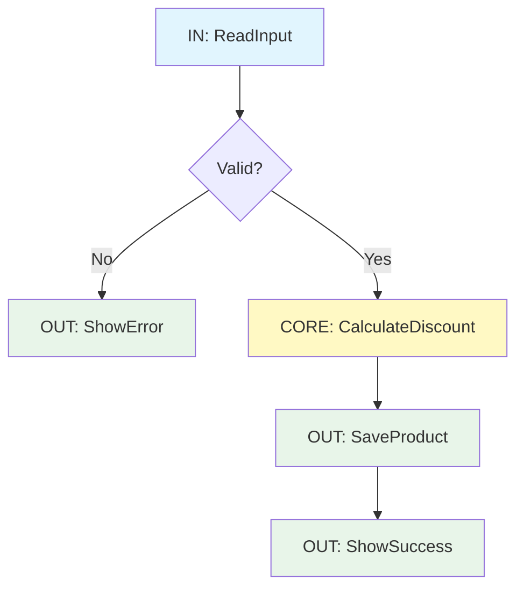

# 第05章：境界線を引く練習（最初は線引きだけで勝ち）✍️✨

この章のゴールはシンプルだよ〜！😊
**「UI」「業務ルール」「外部（DB/ファイル/HTTP）」が混ざってる場所を見つけて、境界線を“引ける”ようになる**こと✨
まだ分離しきらなくてOK！**線を引けるだけで、次の章以降が一気にラク**になるよ〜！🧡

---

## 0) まずはイメージ：アプリの中には「入口」と「出口」がある🚪➡️🚪


アプリってね、だいたいこの形👇

* **入口（入力）**：ユーザー操作・HTTPリクエスト・ファイル読み込み…など
* **真ん中（判断）**：業務ルール・計算・状態遷移・バリデーション…など
* **出口（出力）**：DB保存・画面表示・ログ・HTTP送信…など

SoCで一番やりたいのは、
**「入口と出口を“端”に寄せて、真ん中をスッキリさせる」**ことだよ🧼✨

---

## 1) 「入口（入力）」と「出口（出力）」を見つける練習🔍✨

### 入口（入力）にありがちなもの🎮

* TextBox / ComboBox / CheckBox の値を読む
* ボタン押下イベント、画面イベント（SelectionChanged とか）
* `args` や `Request` から値を読む（Web系）
* ファイルから読み込む（`File.ReadAllText` とか）

### 出口（出力）にありがちなもの📤

* DBへ保存・検索（SQL/ORM/Repository呼び出し）
* 画面に表示（Label.Text更新、MessageBox、Dialog表示）
* HTTP送信（`HttpClient`）
* ファイル書き込み（`File.WriteAllText`）
* ログ出力（Serilog/NLog/ILogger など）

**ポイント：入口と出口は“悪者”じゃないよ！**😆
ただし、**入口/出口が真ん中（業務）と混ざると地獄**になるの…😇💥

---

## 2) “混ざってる場所”を発見するコツ🔍💣

### コツA：1つのメソッドに「UI単語」と「DB単語」が同居してたら赤信号🚨

例：

* `textBoxPrice.Text` を読んでるのに、同じメソッド内で `SqlConnection` が出てくる
* `MessageBox.Show` しながら、同じメソッドで割引計算もしてる

👉 **それ、境界が溶けてるサイン**🫠

### コツB：「副作用（side effect）」が多いほど外側寄り🌪️

副作用＝“やった結果、外の世界が変わる”やつね！

* DB保存した
* 画面を書き換えた
* ファイル書いた
* ネット送った
* 時刻を取った（`DateTime.Now`）
* 乱数を取った（`Random`）

このへんが真ん中に入ってると、テストもしんどいし修正も怖い😵‍💫

---

## 3) 境界線を引く「超・具体的」な手順✍️✨（これだけで勝ち）


ここからが本番〜！🌸
**“線引きだけ”の最短手順**を教えるね😊

### 手順①：入口・出口を「マーキング」する🖍️

コードを見て、コメントでこう書く👇

* `// IN:` 入口
* `// OUT:` 出口
* `// CORE:` 真ん中（業務）

### 手順②：「CORE（真ん中）」を1か所に集める🧲

最初はクラス分けしなくてOK！
まずはメソッド抽出で、真ん中だけを寄せよう✨

### 手順③：入口→CORE→出口の“流れ”に整える🌊

最終形の理想はこれ👇

1. 入口：入力を集める（読むだけ）
2. CORE：判断する（副作用なしが理想）
3. 出口：保存/表示する（外に出す）

---

## 4) 実例でやってみよ！（線引き練習）✍️🧡

### Before：混ざりコード（あるある）😇💥

```csharp
private void btnRegister_Click(object sender, EventArgs e)
{
    // IN: UI入力
    var name = txtName.Text;
    var priceText = txtPrice.Text;

    if (string.IsNullOrWhiteSpace(name))
    {
        // OUT: 画面出力
        MessageBox.Show("名前が空だよ〜！");
        return;
    }

    if (!int.TryParse(priceText, out var price))
    {
        // OUT: 画面出力
        MessageBox.Show("価格は数字で入れてね！");
        return;
    }

    // CORE: 業務ルール（割引）
    var discounted = price;
    if (chkStudent.Checked)
    {
        discounted = (int)(price * 0.9);
    }

    // OUT: DB保存（例として直書き）
    using var conn = new SqlConnection(_connectionString);
    conn.Open();

    using var cmd = conn.CreateCommand();
    cmd.CommandText = "INSERT INTO Products(Name, Price) VALUES(@Name, @Price)";
    cmd.Parameters.AddWithValue("@Name", name);
    cmd.Parameters.AddWithValue("@Price", discounted);
    cmd.ExecuteNonQuery();

    // OUT: 画面出力
    lblResult.Text = $"登録OK！価格={discounted}";
}
```

この時点で**線引きだけ**やってみよう！✍️
見ての通り、1メソッドに **IN / CORE / OUT** がぜーんぶ入ってるよね😵‍💫

---

## 5) 「直す順番」の基本（危険度の低いところから）🧯✨

いきなりDB周りを動かすのは危ない！😖
だから順番はこう👇

### ✅ Step 1：まずは“COREだけ”を抜く（安全度：高）🛟

* 計算・判定をメソッドに抽出
* 入出力はそのままでOK

### ✅ Step 2：次に“IN”をまとめる（安全度：高）🎒

* 入力を1か所に集める（読むだけにする）

### ✅ Step 3：最後に“OUT”をまとめる（安全度：中〜低）🧨

* DB保存や画面更新は、影響が出やすいので最後

---

## 6) After（まだ分離しきらない。でも“境界が見える”✨）

目標は「別プロジェクト化！」じゃないよ？
この章では**“境界が見える形”にするだけでOK**🙆‍♀️

```csharp
private void btnRegister_Click(object sender, EventArgs e)
{
    // IN: 入力を集める
    var input = ReadInput();
    if (!input.IsValid)
    {
        // OUT: 表示
        MessageBox.Show(input.ErrorMessage);
        return;
    }

    // CORE: ルール（副作用なしの計算に寄せる）
    var discounted = CalculateDiscountedPrice(input.Price, input.IsStudent);

    // OUT: 保存
    SaveProduct(input.Name, discounted);

    // OUT: 表示
    lblResult.Text = $"登録OK！価格={discounted}";
}

private (bool IsValid, string ErrorMessage, string Name, int Price, bool IsStudent) ReadInput()
{
    var name = txtName.Text;
    var priceText = txtPrice.Text;

    if (string.IsNullOrWhiteSpace(name))
        return (false, "名前が空だよ〜！", "", 0, false);

    if (!int.TryParse(priceText, out var price))
        return (false, "価格は数字で入れてね！", "", 0, false);

    return (true, "", name, price, chkStudent.Checked);
}

private int CalculateDiscountedPrice(int price, bool isStudent)
{
    if (!isStudent) return price;
    return (int)(price * 0.9);
}

private void SaveProduct(string name, int price)
{
    using var conn = new SqlConnection(_connectionString);
    conn.Open();

    using var cmd = conn.CreateCommand();
    cmd.CommandText = "INSERT INTO Products(Name, Price) VALUES(@Name, @Price)";
    cmd.Parameters.AddWithValue("@Name", name);
    cmd.Parameters.AddWithValue("@Price", price);
    cmd.ExecuteNonQuery();
}
```

どう？✨
これだけで、

* 「真ん中（CORE）」がどこか分かる
* 次章（UIを痩せさせる）で、どこを削るか分かる
* DB分離（第8章）にも繋がる

**つまり、線引きだけで勝ち**なんだよ〜！🏆💕



---

## 7) ミニ仕分けクイズ🎮✨（境界線センスを鍛える）

次の行はどれ？
A: IN（入口） / B: CORE（業務） / C: OUT（出口）

1. `var userId = txtUserId.Text;`
2. `total = subtotal - discount;`
3. `File.WriteAllText(path, json);`
4. `MessageBox.Show("OK");`
5. `httpClient.PostAsync(url, content);`

答え👇
1=A、2=B、3=C、4=C、5=C ✨

---

## 8) AI（Copilot/Codex）に“線引き”を手伝わせるプロンプト例🤖✨

最近のIDEはAI連携が強くて、Visual Studio 2026でもCopilot系がかなり統合されてるよ〜（エージェント系機能も増えてる）📈✨ ([Microsoft Learn][1])
だから「線引き」はAIにめっちゃ向いてる！

### プロンプト例①：入口と出口を列挙させる📋

* 「このメソッドの **入力（入口）** と **出力（出口）** を箇条書きにして。副作用のある行も教えて」

### プロンプト例②：CORE候補だけ抽出させる🧠

* 「このコードから **業務ロジック（副作用なしの部分）** を別メソッドに抽出して。メソッド名案も5つ」

### プロンプト例③：安全な順でリファクタ計画を出させる🧯

* 「挙動を変えずにSoCに近づけたい。危険度が低い順に、3ステップの修正プランを出して」

※ Copilot Chat は Visual Studio でも使えて、バージョン要件なども公式に案内されてるよ〜📌 ([GitHub Docs][2])

---

## 9) 今日のまとめチェックリスト✅✨（ここまでできたら合格！）

* [ ] 「入口（入力）」っぽい行を見つけられる
* [ ] 「出口（出力）」っぽい行を見つけられる
* [ ] 1メソッド内で混ざってたら“混線”だと気づける
* [ ] `IN → CORE → OUT` の流れに並べ替える発想がある
* [ ] まずは**CORE抽出が安全**って分かる

---

## （ちょい豆知識）2026時点の“最新C#/.NET”の空気感🌸

いまの最新ど真ん中は、**.NET 10（LTS）**が2025年11月にリリースされてて、長期サポート枠だよ〜📦✨ ([Microsoft][3])
それに合わせて **C# 14** も2025年11月リリースとして整理されてるよ🧡 ([Microsoft Learn][4])
でもね！ここが超重要👇
**言語が進化しても、SoCの「境界を引く」価値はむしろ上がる**よ（AI時代ほどね🤖✨）

---

次の第6章では、この章で見えるようになった境界線を使って、**イベントハンドラ（UI）をスッキリ痩せさせる**よ〜🖥️🍃✨

[1]: https://learn.microsoft.com/en-us/visualstudio/releases/2026/release-notes "Visual Studio 2026 Release Notes | Microsoft Learn"
[2]: https://docs.github.com/copilot/get-started/quickstart?utm_source=chatgpt.com "Quickstart for GitHub Copilot"
[3]: https://dotnet.microsoft.com/ja-jp/platform/support/policy/dotnet-core?utm_source=chatgpt.com ".NET および .NET Core の公式サポート ポリシー"
[4]: https://learn.microsoft.com/ja-jp/dotnet/csharp/whats-new/csharp-version-history?utm_source=chatgpt.com "C# の歴史"
