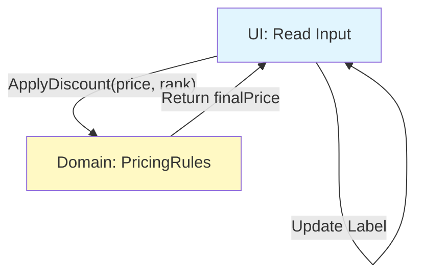

# 第07章：業務ロジックの関心を分ける（ルールの置き場所）🧠✨

この章はひとことで言うと、**「アプリの“ルール”を、画面から引っこ抜いて“ちゃんと住まわせる”章**です🏠💡
（UIが痩せると、バグも減るし、改修も速くなるよ〜！🚀）

---

## 0. まずゴール🎯✨（この章を終えるとできること）

* ✅ **“業務の言葉”**でメソッド名を付けられる（例：`ApplyDiscount` / `CanShip` / `ChangeStatusToPaid`）🗣️✨
* ✅ **割引・状態遷移・制約チェック**みたいな“ルール”を、UIから分離できる💪
* ✅ UI都合（画面の表示・入力・ボタンの押し方）を **業務に混ぜない**で済む🙅‍♀️🧼
* ✅ ルールが **テストしやすく**なる🧪✨

（ちなみに今どきのC#は **C# 14 / .NET 10** が最新ラインで、VSも .NET 10 を含む世代が出ています。([Microsoft Learn][1])）

---

## 1. “業務ロジック”って何？🤔💭

業務ロジック＝**画面やDBに関係なく成立する「ルール」**のことだよ🧠✨

たとえば…👇

* 🏷️ **割引**：会員ランクがGoldなら10%オフ
* 🔁 **状態遷移**：注文は「支払い済み」になったら「発送可能」になる
* 🚫 **制約チェック**：在庫0なら注文できない
* ✅ **判定**：キャンセル可能なのは「発送前」だけ

ここがUIに混ざると…

* UI変更でルールが壊れる😇
* ルール変更で画面が壊れる😇
* どこを直せばいいか分からない😇
  …っていう地獄が始まるよ〜💥

---

## 2. ルールの“置き場所”はここ！📦🧱


イメージはこれ👇✨

* 🖥️ **UI**：入力を受け取る／結果を表示する（＝薄くする）
* 🧭 **Application（UseCase）**：手順をつなぐ（「AしてBしてC」）
* 🧠 **Domain（業務ルール）**：ルールそのもの（割引・判定・状態遷移など）

ポイントはこれだけ👇

> **“ルール”は Domain に置く。**
> UIは「呼ぶだけ」に寄せる。📞✨

---

## 3. “業務の言葉”でメソッドを作るコツ🗣️✨

ここ、めちゃ大事！🧠💡
ルールを分けるときは、**技術の言葉じゃなくて業務の言葉**で切るよ〜！

### ✅ 良い命名（業務の言葉）🌸

* `ApplyDiscount(...)`（割引を適用する）
* `CanOrder(...)`（注文できる？）
* `ChangeStatusToPaid()`（支払い済みにする）
* `IsCancelable(...)`（キャンセル可能？）

### ❌ ありがちな命名（画面都合・技術都合）😵‍💫

* `OnClickDiscountButton()`（UIの都合）
* `Calc()`（意味が薄い）
* `DoBusiness()`（雑すぎ）
* `UpdateLabel()`（表示の都合）

---

## 4. 実践①：割引ルールを“画面から救出”する🏷️🚑✨

### 4-1. Before：UIにルールが直書き😇💥

（こういうの、めっちゃあるある！）

```csharp
// UI側（例：ボタン押下）
var price = int.Parse(txtPrice.Text);
var isGold = chkGold.Checked;

if (isGold)
{
    price = (int)(price * 0.9);
}

lblResult.Text = price.ToString();
```

問題点👇

* UIがルールを知ってる（= UI変更で壊れやすい）😇
* ルール追加が来たら UI が肥大化🍔
* テストがつらい🧪💦

---

### 4-2. After：ルールをDomainへ移動🧠✨

まずは **“割引”という業務語**でメソッドを作るよ！

```csharp
public enum MemberRank
{
    Regular,
    Gold
}

public static class PricingRules
{
    public static int ApplyDiscount(int originalPrice, MemberRank rank)
    {
        if (originalPrice < 0) throw new ArgumentOutOfRangeException(nameof(originalPrice));

        return rank switch
        {
            MemberRank.Gold => (int)Math.Round(originalPrice * 0.9),
            _ => originalPrice
        };
    }
}
```

UIはこうなる👇（呼ぶだけ！最高にスッキリ！🧼✨）

```csharp
var price = int.Parse(txtPrice.Text);
var rank = chkGold.Checked ? MemberRank.Gold : MemberRank.Regular;

var finalPrice = PricingRules.ApplyDiscount(price, rank);

lblResult.Text = finalPrice.ToString();
```

✅ これで「割引ルールが変わる」時は **Domainだけ**を直せばOK！🎉



---

## 5. 実践②：状態遷移（ステート）を業務として扱う🔁📦✨

状態遷移って、UIに混ぜると一瞬でカオス化する分野だよ😇💥

### 5-1. まず“業務の単語”を型にする🧠✨

```csharp
public enum OrderStatus
{
    Draft,
    Paid,
    Shipped,
    Cancelled
}
```

### 5-2. ルールをDomainに置く（状態遷移の門番🚪）

```csharp
public static class OrderRules
{
    public static bool CanShip(OrderStatus status)
        => status == OrderStatus.Paid;

    public static OrderStatus ChangeStatusToPaid(OrderStatus current)
    {
        if (current != OrderStatus.Draft)
            throw new InvalidOperationException("Draftの注文だけが支払いに進めます。");

        return OrderStatus.Paid;
    }

    public static bool IsCancelable(OrderStatus status)
        => status is OrderStatus.Draft or OrderStatus.Paid;
}
```

UIは「今の状態を渡して聞く」だけ📞✨

* 「発送ボタン押せる？」→ `CanShip(status)`
* 「支払いに進める？」→ `ChangeStatusToPaid(status)`

✅ UIが “状態遷移の複雑さ” を持たなくなるよ〜！🎊

---

## 6. UI都合を業務に混ぜないコツ（ここが落とし穴！🕳️）

### ❌ 混ざりがちなもの😵‍💫

* `MessageBox` を業務側で出す
* UI部品（TextBox/Label/ComboBox）を業務側に渡す
* 「画面の入力形式（文字列）」のまま業務で計算する
* 「ボタンが2回押された」みたいなUI事情をルールで扱う

### ✅ こう切ると安定するよ🙆‍♀️✨

* Domainは **値（int/decimal/enum/DateTimeなど）** だけ受け取る
* 画面の文字列 → 画面側で「型」に直してから Domainへ渡す
* Domainは **“判断”** を返す（true/false、結果の値、次の状態など）

---

## 7. ミニ仕分けクイズ🎮✨（どこに置く？）

### Q1

「会員ランクがGoldなら10%割引」
→ どこ？

* A：UI
* B：Domain
* C：DBアクセス

✅ 正解：**B（Domain）** 🧠✨

### Q2

「入力欄が空なら“入力してください”と表示」
✅ 正解：**UI** 🖥️✨（表示はUIの責務！）

### Q3

「注文がPaidなら発送ボタンを有効化」
✅ 正解：**判断（CanShip）はDomain**、**ボタン有効化はUI** 🔥
（分けると気持ちよすぎるやつ！）

---

## 8. AI（Copilot/Codex等）を味方にする使い方🤖✨

### 💡プロンプト例（そのまま使ってOK）

* 「このイベントハンドラの中から“業務ルール”だけ抽出して、Domainクラスに移して」
* 「`ApplyDiscount` / `CanShip` / `IsCancelable` みたいに、業務用語で命名案を10個出して」
* 「このルールに対するテストケースを列挙して、失敗ケースも含めて」

### ✅ AIの提案を採用する前のチェック✅

* そのメソッド名、**業務の人が聞いて意味わかる？**🗣️
* UI部品やDB都合が混ざってない？🧼
* 入力と出力が **値** になってる？📦

（ちなみにVSでCopilotを使うには、一定以上のVSバージョンが必要だよ〜。([GitHub Docs][2])）

---

## 9. まとめ🎁✨（今日の勝ち筋）

* 🧠 **ルールはDomainへ**（割引・状態遷移・制約チェック）
* 🖥️ UIは **呼ぶだけ** にして痩せる🍃
* 🗣️ メソッド名は **業務の言葉**（これが最強）
* 🧪 ルールが分かれると、テストも超ラクになる✨

---

次の第8章は、**「DBの都合を外に追い出す」**🗄️🚪✨
業務がDB直呼びしてると何が怖いのか、そして “保存する人” を分ける最小形を作っていくよ〜！🔥😊

[1]: https://learn.microsoft.com/en-us/dotnet/csharp/whats-new/csharp-14?utm_source=chatgpt.com "What's new in C# 14"
[2]: https://docs.github.com/copilot/get-started/quickstart?utm_source=chatgpt.com "Quickstart for GitHub Copilot"
