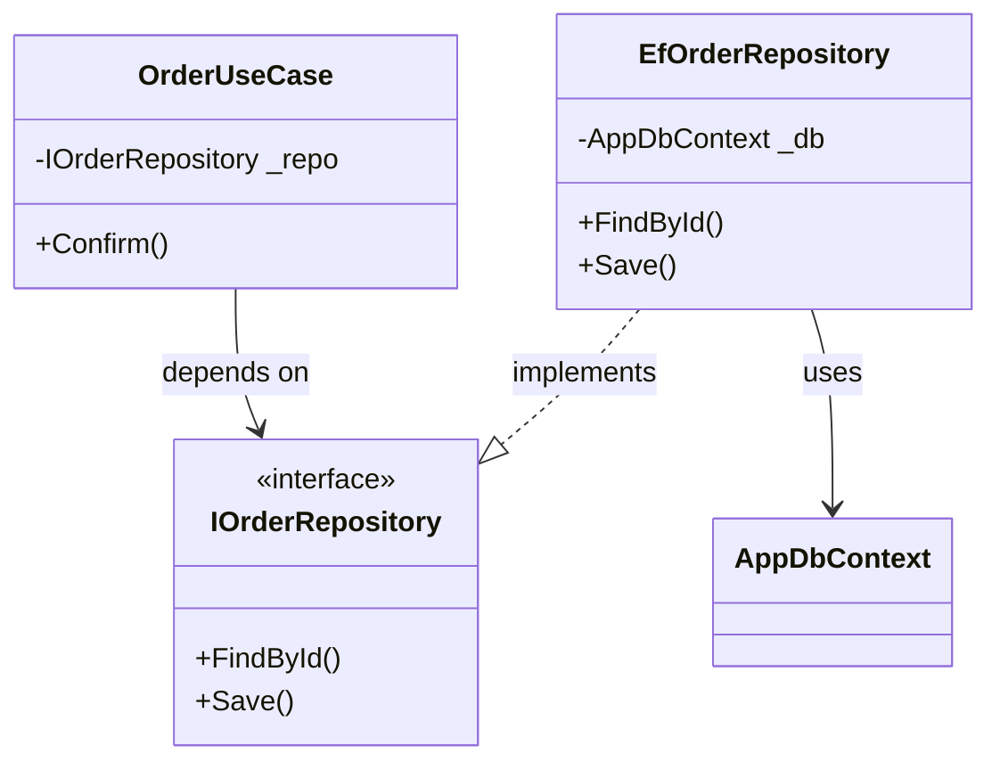

# 第08章：データアクセスの関心を分ける（DBの都合を外に追い出す）🗄️🚪

### この章のゴール🎯😊

この章が終わったら、あなたは👇ができるようになります！

* 業務ロジックから **DB都合（SQL/テーブル/DbContext/接続/トランザクション）を追い出す** 🧹✨
* 「保存する人」を別にして、**修正の影響を止める壁🧱**を作れる
* Repositoryっぽい最小形（ライト版）で、**分けすぎずに勝つ**🙆‍♀️💕

（※2026-01-10時点だと、C#の最新は **C# 14**、.NETの最新LTSは **.NET 10**、Visual Studioも **2026** が出ています。教材のコードもその前提でOKです🆕✨） ([Microsoft Learn][1])

---

## 1) まず結論：DB直呼びが「なにを壊す」の？😇💥


### ありがちな地獄パターン🔥

業務ロジックの中にこういうのが混ざると……👇

* `SELECT ...` や `INSERT ...` が業務メソッドに直書き📄💦
* `DbContext`（EF Core）や `SqlConnection` が業務側に登場🧷
* テーブル名・列名が業務コードにベタ埋め🪦
* 例外がDB由来なのか業務由来なのか分からなくなる😵‍💫
* テストがしんどい（DBがないと動かない）🧪❌

つまり、「業務の関心🧠」と「DBの関心🗄️」 がぐちゃっと混ざって、変更が怖くなるんです😭

---

## 2) SoC的に“正しい距離感”の絵🧩✨


ポイントはこれだけ👇

* **業務（中心）**は、DBの具体を知らない🙈
* **DB（外側）**が、業務に合わせて実装を変える🔧
* つなぎ目は **interface（差し替え口🚪）** にする

イメージ：

UI 🖥️ → UseCase/Service 🧠 → `IOrderRepository` 🚪 → EF Core / SQL 実装 🗄️ → DB

「中心は純粋に、外側が頑張る」って形です✨

---

## 3) “Repositoryっぽい最小形（ライト版）”って何？🧩✨


Repositoryって聞くと「難しそう😨」ってなりがちなんだけど、ここではライト版でOK🙆‍♀️

### ライト版のルール🌱

* **ユースケースに必要なメソッドだけ**置く（汎用化しすぎない）
* 返す型はなるべく **業務の型（Domain）** に寄せる
* EF CoreやSQLの匂い（`IQueryable` とか）を **外に漏らさない**🚫

たとえば注文なら👇くらいで十分！

* `FindById(orderId)`
* `Save(order)`
* `NextNumber()`（採番が必要なら）

「CRUD全部！」みたいにしなくてOKです🙆‍♀️✨

---

## 4) 例で体験しよ！「注文確定」ボタンの分離🍔🧾✨


### Before：業務の中にDBがいる😇（やりがち）

* UIイベント → 業務計算 → SQL/DbContext → 保存
  が1か所に混ざってる状態💥

### After：3つに分ける😍✨

* UI：ボタン押したらUseCase呼ぶだけ🖥️🍃
* 業務：割引・状態遷移・制約チェックだけ🧠✨
* DB：保存・検索だけ🗄️🔧

---

## 5) 実装してみよう：最小構成のサンプル（ライト版）✍️😊

### 5-1. 業務側（DBを知らない）🧠✨

```csharp
public sealed class OrderUseCase
{
    private readonly IOrderRepository _repo;

    public OrderUseCase(IOrderRepository repo)
    {
        _repo = repo;
    }

    public ConfirmResult Confirm(Guid orderId, DateTime now)
    {
        var order = _repo.FindById(orderId)
            ?? throw new InvalidOperationException("注文が見つかりません");

        // ✅ ここは業務の関心だけ！
        order.AssertCanConfirm();
        order.ApplyCampaignDiscountIfNeeded(now);
        order.Confirm(now);

        _repo.Save(order);

        return new ConfirmResult(order.Id, order.TotalPrice);
    }
}

public sealed record ConfirmResult(Guid OrderId, decimal TotalPrice);
```

ここ、超大事💡
`OrderUseCase` の中に **SQLもDbContextも一切出てこない** のが勝ちです🏆✨

---

### 5-2. つなぎ目（interface = 差し替え口🚪）🧩

```csharp
public interface IOrderRepository
{
    Order? FindById(Guid orderId);
    void Save(Order order);
}
```

この `IOrderRepository` を境界線にすると、DBが変わっても業務は無傷になりやすいです🧱✨

---

### 5-3. DB側（EF Coreで保存する人）🗄️🔧


EF Coreは .NETのリリースに合わせて進み、.NET 10世代では **EF Core 10** が軸になります（次のメジャーとしてEF Core 11は2026年11月予定、という案内もあります）。 ([Microsoft Learn][2])

ここでは「DB側だけでEF Coreを使う」構成にします👇

```csharp
public sealed class EfOrderRepository : IOrderRepository
{
    private readonly AppDbContext _db;

    public EfOrderRepository(AppDbContext db)
    {
        _db = db;
    }

    public Order? FindById(Guid orderId)
    {
        var row = _db.Orders.SingleOrDefault(x => x.Id == orderId);
        if (row is null) return null;

        // Chapter10で本格的にやる「詰め替え」の超ミニ版🔄
        return new Order(row.Id, row.TotalPrice, row.Status, row.ConfirmedAt);
    }

    public void Save(Order order)
    {
        var row = _db.Orders.SingleOrDefault(x => x.Id == order.Id);
        if (row is null)
        {
            row = new OrderRow { Id = order.Id };
            _db.Orders.Add(row);
        }

        row.TotalPrice = order.TotalPrice;
        row.Status = order.Status;
        row.ConfirmedAt = order.ConfirmedAt;

        _db.SaveChanges();
    }
}
```

> 詰め替え（Mapping）は第10章でガッツリやるけど、
> 第8章の段階では「DB都合を外に出す」ことが最優先です🙆‍♀️✨



---

### 5-4. UI側（ボタン押したら呼ぶだけ）🖥️🍃

```csharp
public partial class MainForm : Form
{
    private readonly OrderUseCase _useCase;

    public MainForm()
    {
        InitializeComponent();

        var db = new AppDbContext();          // 本当は設定が必要だけど流れ優先でOK🙆‍♀️
        var repo = new EfOrderRepository(db);
        _useCase = new OrderUseCase(repo);
    }

    private void confirmButton_Click(object sender, EventArgs e)
    {
        var orderId = Guid.Parse(orderIdTextBox.Text);
        var result = _useCase.Confirm(orderId, DateTime.Now);

        MessageBox.Show($"確定OK🎉 合計: {result.TotalPrice}円");
    }
}
```

UIがスッキリ〜！🌿✨
「画面は画面の都合だけ」で生きられます😍

---

## 6) よくある落とし穴（ここ踏むと分離が崩れる）⚠️😵‍💫


### ❌ Repositoryから `IQueryable` を返す

* EF Coreの都合が業務側に漏れます💦
* “クエリの自由”が一見便利だけど、境界線が溶ける🫠

✅ 代わりに：必要な検索メソッドを足す
例：`FindUnconfirmedOlderThan(DateTime cutoff)` みたいにユースケース名で👌

### ❌ 業務が `DbContext` を触る

* 「結局なにがどこで保存されるの？」が不透明に😇
  ✅ 触るのはInfraだけ！

### ❌ SQL文字列を業務メソッドに書く

* テーブル変更で業務が壊れる💥
  ✅ SQLは外側へ！

---

## 7) ミニ仕分けクイズ🎮✨（SoC脳を鍛える！）


次のうち「DBの関心」どれ？🗄️（複数OK）

1. 注文を確定できる条件チェック（未確定か？期限内か？）
2. `Orders` テーブルの列名 `ConfirmedAt`
3. 割引率の計算（会員ランクで変わる）
4. `DbContext.SaveChanges()`
5. 画面に「確定しました」を表示

答え👇

* DBの関心：**2, 4** 🗄️
* 業務の関心：**1, 3** 🧠
* UIの関心：**5** 🖥️

---

## 8) 演習（30〜60分）🔧🌱

### 演習A：DB直呼びを追い出そう🧹✨

あなたのコード（または練習用コード）で👇を探してね🔍

* `SqlConnection` / `SqlCommand`
* `DbContext`
* SQLっぽい文字列（`SELECT`, `INSERT`）

見つけた場所から順に👇をやる！

1. そのメソッドがやってる「DB作業」を抜き出す
2. interfaceを1個作る（`I〇〇Repository`）
3. UseCaseは interface だけを見る
4. 実装はInfrastructureへ

---

## 9) AI（Copilot/Codex）に頼むと爆速になるところ🤖💡✨

そのまま使えるプロンプト例だよ〜！👇

### ✨ 分離案を出してもらう

* 「このメソッドからDBアクセス部分を抽出して、`IOrderRepository` と実装クラス案を3パターン出して。業務ロジックはUseCase側に残して」

### ✨ interfaceを作らせる

* 「このクラスが必要としている永続化操作から、最小のRepository interfaceを提案して。汎用CRUDにしないで“ユースケース寄り”にして」

### ✨ テストしやすさチェック

* 「このUseCaseがDBなしで単体テストできる形になってる？もしダメなら、どこが漏れてるか指摘して修正案を出して」

---

## まとめ🎀✨（この章で一番大事なこと）

* **業務はDBを知らない** 🙈🧠
* **保存する人（Repository実装）は外側** 🗄️🚪
* つなぎ目は **interface** で壁を作る 🧱✨
* Repositoryはまず **ライト版でOK**（分けすぎない）🙆‍♀️🌱

次の第9章では、この分離が効いてくる「God Class（万能クラス）回避📦🙅‍♀️」に進むよ〜！✨

[1]: https://learn.microsoft.com/en-us/dotnet/csharp/whats-new/csharp-14?utm_source=chatgpt.com "What's new in C# 14"
[2]: https://learn.microsoft.com/en-us/ef/core/what-is-new/ "EF Core releases and planning | Microsoft Learn"
