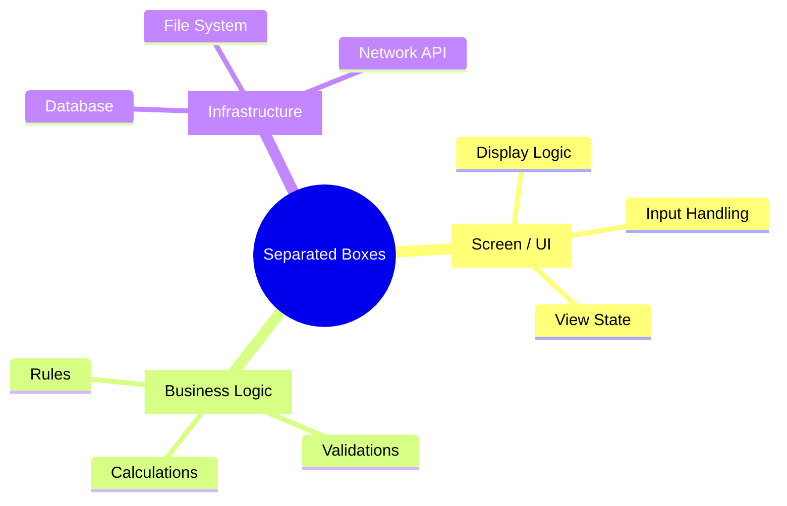

# 第09章：なぜ「データの箱」を分けるの？（God Classの回避）📦🙅‍♀️

## この章のゴール🎯💖

この章を終えると、こんな判断ができるようになります👇✨

* 「このクラス、なんでも入っててヤバい…😇」を見抜ける
* **“分けるべきデータの箱”** と **“まだ一緒でもOK”** の境界が分かる
* 分けることで、**変更の影響が止まる壁🧱** を作れる

---

## 1) そもそも「データの箱」って何？📦📝

ここでいう「データの箱」は、ざっくり言うと👇

* **プロパティを持ってデータを運ぶクラス**（または record）
* 例：画面に表示する情報、DBから取った情報、業務で扱う情報…などなど

で、初心者がやりがちなのがこれ👇💥

> **「全部入り最強クラス」1個で全部やろうとする**（通称：万能クラス／God Class）😇🔥

---

## 2) 万能クラス（God Class）が起こす悲劇あるある😇💣


万能クラスは、最初だけ気持ちいいです。
だって「ここ見れば全部ある」からね…！🥹✨
でも、しばらくするとこうなります👇

### ✅ 悲劇その1：変更理由が多すぎて、毎回どこか壊れる🧨

* 画面の表示変更 → クラス変更
* DBの列追加 → クラス変更
* 業務ルール変更 → クラス変更

「変更理由」が多い＝**責務が混ざってる**サインです🚨

### ✅ 悲劇その2：見た目都合が業務に侵食する🫠

* 画面で表示したいから `FullName = LastName + " " + FirstName` を業務クラスに入れる
* 日付表示のために `string BirthDayText` とか増える

こういうのが増えると、**業務ロジックが“UIの都合”で汚れていく**んです😵‍💫

### ✅ 悲劇その3：DB都合が業務に侵食する🗄️🫣

* EF Core用の都合（キー、ナビゲーション、遅延ロード、マッピング事情…）が入り込む
* 結果、**業務の言葉**より**DBの言葉**が増える

Microsoftの設計ガイドでも、永続化の関心をドメインの外に置く（Repository など）考え方が紹介されています📚✨ ([Microsoft Learn][1])

### ✅ 悲劇その4：うっかり情報漏えい🫨🔓

画面に返すつもりじゃない情報が、万能クラスに入ってると…

* `PasswordHash`
* `IsAdmin`
* 内部メモ欄 など

**DTO/画面用にそのまま渡して漏れる**事故、ほんとに起きます😱
（DTOは「ネットワーク越しにどう送るか」を定義する箱、という説明がMicrosoftにもあります） ([Microsoft Learn][2])

---

## 3) 「分ける」って、つまり何？🧱✨

結論：
**“関心（変更理由）”が違うデータは、箱を分ける** です🙆‍♀️🌸

特に分けたくなる代表がこの3つ👇

### ① 画面用の箱（表示・入力の都合）🖥️💄

* 表示のための整形（文字列化、単位つき、色や状態表示など）
* 画面の入力補助（選択肢リスト、チェック状態など）

MVVMでも「Model / View / ViewModel は目的が違う」って明確に分けて説明されています🧩 ([Microsoft Learn][3])

### ② DB用の箱（保存の都合）🗄️🔧

* テーブル構造、外部キー、正規化の結果
* ORMの追跡やマッピングの事情

EF Coreは、永続化レイヤー側でマッピングして、ドメインモデルを“汚さずに”扱えるよ、という方向性が示されています🧠✨ ([Microsoft Learn][4])

### ③ 業務用の箱（ルールの都合）🧠⚖️

* 「割引」「状態遷移」「制約チェック」など、業務の言葉
* 画面やDBが変わっても、なるべく揺れない中心



---

## 4) 万能クラスの“匂いチェック”👃💥（God Class検知！）

次のうち **2つ以上当てはまったら**、分離の検討ラインです🙋‍♀️✨

* ✅ プロパティがやたら多い（20個超えが常連）
* ✅ `ToString()` や表示用プロパティが混ざってる（`DisplayName` など）
* ✅ DBっぽい都合の名前が混ざってる（`RowVersion`, `CreatedAt`, `Fk...`）
* ✅ 業務っぽいメソッドも混ざってる（`ApplyDiscount()` とか）
* ✅ 画面からDBまで、どこからでも参照されてる（参照が蜘蛛の巣🕸️）
* ✅ 変更が入るたびに「影響範囲ガチャ」になる🎰😇

---

## 5) 具体例：万能クラスがどう混ざるか（ダメな例）😇💣

「ありがちな全部入り」を、あえて作るとこんな感じ👇

```csharp
public class Customer
{
    // DB都合
    public int Id { get; set; }
    public DateTime CreatedAt { get; set; }
    public string? PasswordHash { get; set; }

    // 画面都合
    public string FullNameText => $"{LastName} {FirstName}";
    public bool IsSelected { get; set; }  // 一覧チェック用とか

    // 業務データ
    public string FirstName { get; set; } = "";
    public string LastName { get; set; } = "";
    public int Point { get; set; }

    // 業務ロジック
    public void AddPoint(int value)
    {
        if (value <= 0) throw new ArgumentException("ポイントは正の数ね！😤");
        Point += value;
    }
}
```

これ、最初は便利なんだけど…

* 画面要件が増えるたびに Customer が肥大化🍔🍟
* DB要件が増えるたびに Customer が肥大化🍰🍩
* 業務要件が増えるたびに Customer が肥大化🍕🍜

結果：**変更のたびに Customer を触る** → **壊れる確率が上がる**📈😇

---

## 6) 「分ける」判断のコツ：この3問だけでOK🙆‍♀️✨


迷ったら、次の質問を自分にします👇

### Q1：画面の都合で、この箱を変える？🖥️

→ Yes なら **画面用の箱** を分ける候補！

### Q2：DBの都合で、この箱を変える？🗄️

→ Yes なら **DB用の箱** を分ける候補！

### Q3：業務ルールの都合で、この箱を変える？🧠

→ Yes なら **業務用の箱** は“中心”として守りたい！

そして超大事ポイント👇

> **Yes が複数つくなら、混ざってる確率が高い**＝分けどき🧱✨

---

## 7) ミニ仕分けクイズ🎮💡（SoCの筋トレ）

次の要素、どの箱に置きたい？📦✨
（A:画面用 / B:DB用 / C:業務用）

1. `BirthDayText`（例：`"2001/01/01"` みたいに表示したい）
2. `RowVersion`（同時更新対策）
3. `ApplyDiscount()`（割引ルール）
4. `IsSelected`（一覧のチェックボックス用）
5. `CustomerId`（DB主キー）

### こたえ合わせ🎉

1:A　2:B　3:C　4:A　5:B
こうやって「置き場所」を分けて考えられるだけで、設計力かなり上がります🧠✨

---

## 8) AI（Copilot/Codex）で一気に上達する使い方🤖💖

AIには「分け方そのもの」より、まず **混ざりポイント発見🔍** をやらせると強いです✨

### 🔥おすすめプロンプト例

* 「このクラスの責務を *UI/DB/業務* に分類して、混ざってる理由を箇条書きで教えて」
* 「God Classっぽい匂いがある箇所と、分離案を3パターン出して」
* 「“変更理由”を3種類（画面/DB/業務）に分けて、このクラスがなぜ危険か説明して」

### ✅ AIの提案を採用する前チェック

* それ、**変更理由が減ってる？**（重要！🧱）
* “業務の言葉”が中心に残ってる？🧠
* 画面の都合／DBの都合が業務に混ざってない？🧼✨

---

## まとめ💐✨（この章の結論）

* 「データの箱」を分ける理由はカンタン：**関心（変更理由）を分けるため**🧱
* 万能クラスは「便利」→「地獄」になりやすい😇🔥
* 迷ったら **画面・DB・業務** の3問で判定🙆‍♀️✨
* Microsoftの設計ガイドでも、永続化の関心をドメインの外に置く（Repository/マッピングなど）考え方が紹介されています📚 ([Microsoft Learn][1])
* 次の第10章で、いよいよ **ViewModel / DTO / Entity の“詰め替え”** を気持ちよくやっていきます🔄💖

---

もしよければ、次のメッセージで
**「あなたの現場にありがちな“万能クラス”パターン」**（例：受注、ユーザー、商品、請求…）を1個だけ教えてください😊✨
それを題材にして、「どこが混ざってるか」「どう分けると壁🧱ができるか」を超わかりやすく図解っぽく解説します💖📦

[1]: https://learn.microsoft.com/en-us/dotnet/architecture/microservices/microservice-ddd-cqrs-patterns/infrastructure-persistence-layer-design?utm_source=chatgpt.com "Designing the infrastructure persistence layer - .NET"
[2]: https://learn.microsoft.com/en-us/aspnet/web-api/overview/data/using-web-api-with-entity-framework/part-5?utm_source=chatgpt.com "Create Data Transfer Objects (DTOs)"
[3]: https://learn.microsoft.com/en-us/dotnet/architecture/maui/mvvm?utm_source=chatgpt.com "Model-View-ViewModel (MVVM)"
[4]: https://learn.microsoft.com/en-us/dotnet/architecture/microservices/microservice-ddd-cqrs-patterns/infrastructure-persistence-layer-implementation-entity-framework-core?utm_source=chatgpt.com "Implementing the infrastructure persistence layer with ..."
