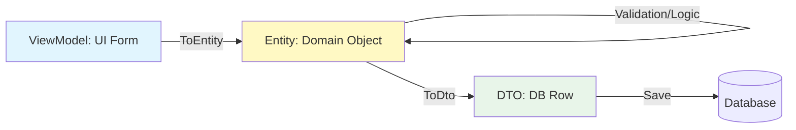

# 第10章：実践！データの詰め替え（ViewModel / DTO / Entity）🔄✨

この章は、**SoCの“壁”をちゃんと機能させるための必殺技**だよ〜！🥷💖
結論から言うと…

> **詰め替え（Mapping）＝「責務の違う箱どうしを、直接つながないための保険」**🛡️✨

---

## 1) 今日のゴール🎯💡

### できるようになること✅

* ViewModel / DTO / Entity を **「用途の違う箱」**として説明できる📦📦📦
* どこで詰め替えるのが安全か（置き場所）を決められる🧭
* **手動マッピング**で“壊れにくい形”が書ける✍️✨
* （おまけ）AutoMapper などのツール導入の判断ができる🤔🛠️
  ※AutoMapperは最近 **.NET 10 対応の v16** が出てるよ ([Jimmy Bogard][1])

---

## 2) まず3つの箱をイメージしよ〜📦✨

### 🖥️ ViewModel（画面の箱）

* 画面表示に便利な形（例：`string`で表示、ボタン状態、エラー文言）
* UIの都合が入ってOK（むしろ入る）😙💕

例：郵便番号ハイフン入り、価格の「¥1,200」表示、入力中の未確定値など

---

### 🌍 DTO（外の世界の箱）

* API/DB/ファイルなど **外部とやり取りするための形**📡🗄️
* JSONにしやすい、DBに保存しやすい、など “外の都合” が入る

例：`snake_case`、nullable多め、IDが文字列、日時がUTC文字列…などあるある😭

---

### 🧠 Entity（業務ルールの箱）

* **業務のルールが守られる形**（ここが中心❤️）
* 画面都合・DB都合を混ぜない🙅‍♀️

例：
「金額はマイナス禁止」「ステータス遷移のルール」「割引条件」など

---

## 3) じゃあ「詰め替え」はどこでやるの？🧭✨

おすすめはだいたいココ👇

* **UI → UseCase に渡す前**（ViewModel → コマンド/入力モデル → Entity）
* **外部I/Oの境界**（DTO ↔ Entity）
* “中心（Entity）” を守るために、**境界に変換所（Mapper）を置く**イメージ🚧🏠

> ✨ポイント：Entityに「DTOを受け取るコンストラクタ」みたいなのを作ると、外部都合が内側に侵入しがちなので注意だよ〜！😵‍💫🌀

---

## 4) ハンズオン：ミニ例で「詰め替え」を体験しよ🧪💕


題材は「商品編集画面」🛒✨
画面で編集 → 業務ルールで検証 → 保存用DTOにしてDB/APIへ、って流れ！

---

### 4-1) Entity（業務ルールの箱）🧠🧱

```csharp
public sealed class Product
{
    public ProductId Id { get; }
    public string Name { get; private set; }
    public Money Price { get; private set; }

    public Product(ProductId id, string name, Money price)
    {
        if (string.IsNullOrWhiteSpace(name)) throw new ArgumentException("商品名は必須です");
        Id = id;
        Name = name.Trim();
        Price = price; // Money側で不正（負数など）を防ぐ想定
    }

    public void Rename(string newName)
    {
        if (string.IsNullOrWhiteSpace(newName)) throw new ArgumentException("商品名は必須です");
        Name = newName.Trim();
    }

    public void ChangePrice(Money newPrice) => Price = newPrice;
}

public readonly record struct ProductId(Guid Value);

public readonly record struct Money(decimal Value)
{
    public Money(decimal value)
    {
        if (value < 0) throw new ArgumentOutOfRangeException(nameof(value), "金額はマイナス不可");
        Value = value;
    }

    public override string ToString() => Value.ToString("0.##");
}
```

💡ここが中心！**UIの文字列**とか**DTOの都合**は一切出てこないのが理想✨

---

### 4-2) ViewModel（画面の箱）🖥️🌸

```csharp
public sealed class ProductEditViewModel
{
    public string Id { get; set; } = "";          // 画面は string が便利
    public string Name { get; set; } = "";
    public string PriceText { get; set; } = "";   // 入力中は "1200" とか "1,200" とかある
    public string? ErrorMessage { get; set; }     // 画面表示用
}
```

---

### 4-3) DTO（外部の箱）🌍📦

例えば保存APIがこういう形だとするね：

```csharp
public sealed class ProductDto
{
    public string id { get; set; } = "";     // 外部都合で lower/snake だったりする
    public string name { get; set; } = "";
    public decimal price { get; set; }
}
```

---

## 5) 手動マッピング：まずは“王道の型”から👑✍️

### 5-1) ViewModel → Entity（入力を業務の形にする）🔄🧠

コツは **「変換で失敗したら、Entityを作らない」** だよ✅✨

```csharp
public static class ProductMapping
{
    public static Product ToEntity(this ProductEditViewModel vm)
    {
        // 1) ID変換
        if (!Guid.TryParse(vm.Id, out var guid))
            throw new ArgumentException("IDが不正です");

        // 2) Price変換（画面の文字列 → decimal）
        if (!decimal.TryParse(vm.PriceText.Replace(",", ""), out var priceValue))
            throw new ArgumentException("価格が数字じゃないよ");

        // 3) Entity生成（ここでルールが守られる）
        return new Product(
            new ProductId(guid),
            vm.Name,
            new Money(priceValue)
        );
    }
}
```

✨いいところ

* 画面入力のグチャグチャ（カンマとか）を **Entityに持ち込まない**🙅‍♀️
* 例外やエラーは **境界で止められる**🧱

---

それぞれの箱に合った「型」で話すのが一番平和なんです🕊️✨



### 5-2) Entity → DTO（保存/通信の形にする）📡🗄️

```csharp
public static class ProductDtoMapping
{
    public static ProductDto ToDto(this Product entity)
        => new()
        {
            id = entity.Id.Value.ToString(),
            name = entity.Name,
            price = entity.Price.Value
        };

    public static Product ToEntity(this ProductDto dto)
        => new(
            new ProductId(Guid.Parse(dto.id)),
            dto.name,
            new Money(dto.price)
        );
}
```

---

### 5-3) リストの詰め替え（地味に超よく使う）📚✨

```csharp
var dtos = products.Select(p => p.ToDto()).ToList();
```

---

## 6) 「詰め替えが面倒😵‍💫」が“保険”になる理由🛡️✨

詰め替えがあると、こうなる👇

* UIを変えても Entity は守られる🖥️🚫🧠
* DB/APIの都合が変わっても Entity は守られる🗄️🚫🧠
* 影響範囲が **Mapperに集まる**（修正が一点で済む）🎯✨

> 「面倒だからやらない」は、だいたい後で **もっと面倒**になるやつ…！😇💥

---

## 7) よくある落とし穴（先に踏み抜きを防ぐよ）🧨😆

### 落とし穴1：ViewModelに業務ルールを書き始める😵‍💫

* 「割引計算を画面で…」みたいなのは危険⚠️
  → 画面は **呼び出すだけ** が基本だよ🖥️➡️🧠

### 落とし穴2：EntityがDTOに依存しちゃう📦➡️🧠

* Entityが `ProductDto` を知り始めると、外部都合が侵入😱
  → Mapperで止めよう🧱✨

### 落とし穴3：日時・通貨・Enumの変換が雑🕒💴🎛️

* UTC/ローカル混在で事故る💥
* 金額の丸めが揺れる💥
* Enumの数値が外部で増えて落ちる💥
  → 変換は **Mapperに集約**＋**テスト**が最強🧪✨

---

## 8) AutoMapperはいつ使う？（“魔法”の扱い方）🪄🤔

AutoMapperは **手書きの量を減らせる**便利ツールだけど、最近の状況として：

* **.NET 10対応を含む v16 がリリース**されてるよ ([Jimmy Bogard][1])
* そして **商用版（デュアルライセンス）**の流れがあるよ（RPL 1.5 と商用ライセンス） ([Jimmy Bogard][2])

だから教材としてのおすすめはこう👇

### まず手動がおすすめな理由🙆‍♀️✨

* “何がどこで変換されてるか”が見える👀
* 変換の例外・丸め・null対応を自分で管理できる🧯
* SoCの感覚が育つ🌱

### AutoMapperが向くタイミング✅

* 変換が大量で、手動がボトルネックになってきた
* チームで「運用ルール」と「テスト方針」が決まってる
* ライセンス面も含めて採用判断できる

---

## 9) （参考）“生成系Mapper”という選択肢もあるよ🤖⚙️

最近は **Source Generatorでマッピングコードを生成**するタイプも人気✨
例えば **Mapperly** は「ビルド時にマッピングコードを生成して、実行時オーバーヘッドを小さくできる」系だよ ([GitHub][3])

でも超入門の今は、まず手動で感覚を作ってからでOK🙆‍♀️💕

---

## 10) AI（Copilot/Codex）で詰め替えを爆速にするコツ🤖💨✨

AIに丸投げすると事故るので、**お願いの仕方テンプレ**いくね💖

### プロンプト例①：手動Mapperを作らせる✍️

```text
C#で、ProductEditViewModel -> Product(Entity) の手動マッピングを作って。
条件:
- Id は Guid.TryParse で検証
- PriceText はカンマ除去して decimal.TryParse
- 失敗時は ArgumentException
- Entityのルールは Product/Money 側に寄せる
- Mapperは static クラス + 拡張メソッド
コードだけ出して
```

### プロンプト例②：漏れチェック✅

```text
次の3クラス間のマッピングで、変換漏れ・危険な変換（null、丸め、enum）をレビューして。
改善案も箇条書きで。
```

### AIの提案を採用する前のチェック✅👀

* 変換失敗時に Entity を作ってない？（中途半端生成してない？）
* 画面の都合が Entity に入ってない？
* 例外メッセージやエラーがUIに流せる形？
* 金額・日時・Enumが雑じゃない？

---

## 11) ミニ課題（やると一気に身につくよ）🎮✨

### 課題A：入力の詰め替え✍️

* `UserEditViewModel { EmailText, AgeText }` から
  `User(Entity)`（Email形式チェック、年齢0以上）を作ってみよ📩🎂

### 課題B：ネスト構造の詰め替え🏠

* `AddressViewModel` → `Address(Entity)` を追加して
  `User` の中に入れよう！

### 課題C：詰め替えテスト🧪

* 変換成功ケース / 失敗ケース（ID不正、価格不正）をテストにして、
  “境界で止まる” を体験しよ✨

---

## まとめ🌸✨

* ViewModel / DTO / Entity は **責務が違う箱**📦💖
* **詰め替え（Mapping）は境界に置く**とSoCが強くなる🧱✨
* 最初は手動でOK！→ 慣れたら AutoMapper や生成系も検討🛠️
  （AutoMapperは .NET 10対応の更新がありつつ、商用ライセンス面の確認も大事だよ） ([Jimmy Bogard][1])
* 開発環境的には **Visual Studio 2026 / .NET 10 / C# 14** の流れが来てるよ ([Microsoft Learn][4])

---

次の章（第11章）は、ここで作った「境界」をさらに強くする **依存の向き（DIPの入口）**に進むよ〜🧲🌟
この章の例を「WinForms版/WPF版のイベント → UseCase呼び出し」まで広げたサンプルも、必要なら同じノリで作るよ😊💖

[1]: https://www.jimmybogard.com/automapper-16-0-0-and-mediatr-14-0-0-released-with-net-10-support/ "AutoMapper 16.0.0 and MediatR 14.0.0 Released with .NET 10 Support"
[2]: https://www.jimmybogard.com/automapper-and-mediatr-commercial-editions-launch-today/ "AutoMapper and MediatR Commercial Editions Launch Today"
[3]: https://github.com/riok/mapperly?utm_source=chatgpt.com "riok/mapperly: A .NET source generator ..."
[4]: https://learn.microsoft.com/en-us/visualstudio/releases/2026/release-notes "Visual Studio 2026 Release Notes | Microsoft Learn"
