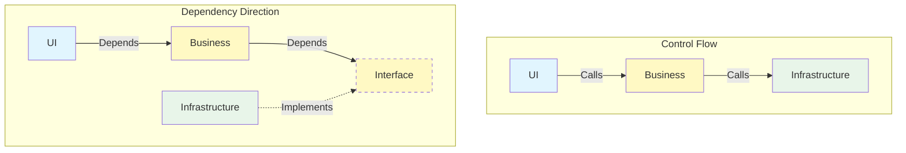

# 第11章：依存の向き（DIPの入口）をSoCで体験🧲🌟

（キーワード：**「中心（業務）を守る」**、**interface＝差し替え口🚪**）

---

### 0) 今日のゴール🎯✨

この章が終わったら、あなたはこうできるようになります👇

* ✅ 「**業務（中心）**」が **DB/ファイル/HTTP** に振り回されない設計にできる🧱
* ✅ **依存の矢印**を“正しい向き”に直せる🧭
* ✅ `interface` を **差し替え口🚪**として使える（テストや将来変更が楽になる）🧪✨

そして超大事な一言👇
**「処理の流れ」と「依存（参照）の向き」は別モノ**です😳⚡

---

## 1) まず「依存」ってなに？🤔🔗

C#でいう依存は、めちゃ雑に言うと👇

* `new` してる
* 具体クラス名を知ってる（`SqlOrderRepository` とか）
* プロジェクト参照してる（UIがInfrastructure参照…みたいな）

つまり、コードがこうなってたら依存強め👇😇

```csharp
var repo = new SqlOrderRepository(); // ← 具体クラスに依存
```

---

## 2) SoCの“中心”を守ると、依存の向きが見えてくる🧠💡

SoCで分けた3つ、覚えてます？👇

* 🖥️ UI（表示）
* 🧠 業務（ルール）
* 🗄️ 外部（DB/ファイル/HTTP）

この中で**守りたい中心は「業務」**です🛡️✨
外部の都合（DBの列名変更とか）で業務ロジックが壊れるの、最悪ですよね😭

そこで出てくるのが **DIP（依存性逆転の原則）** です🧲
DIPの有名な要点はこれ👇（超ざっくり意訳）

* **上位（業務）は下位（DBなど）に依存しない**
* **どっちも抽象（interface）に依存する**
* **詳細（DB等）が抽象にぶら下がる** 🌿

この考え方は、Robert C. Martin（通称 Uncle Bob）のDIP解説でも中心の主張になってます。 ([objectmentor.com][1])

---

## 3) 超重要：処理の流れ🌀 と 依存の向き➡️ は別！


ここ、混乱ポイントなので絵でいきます🖍️😆

### ✅ 処理の流れ（実行時）

UI → 業務 → 外部（保存）
これは自然👏

### ✅ 依存の向き（コードの参照）

**業務 → interface（抽象） ← 外部（実装）**
こうするのが狙い🎯✨



#### ✨イメージ（依存を逆転させる）

* 業務：「保存したい。細かい方法は知らん！😤」
* 外部：「了解！その“保存口（interface）”に合わせて実装するね🙆‍♀️」

---

## 4) interface＝差し替え口🚪✨（“口”は中心側に作る）

ここが本章の核心です🧠🌟

### ✅ ルール：interfaceは「使う側（中心側）」に置く

たとえば「注文を保存したい」なら、保存を使うのは業務側ですよね？
だから interface は **業務側（Domain/Application側）**に置くのが基本🙆‍♀️

---

## 5) 実例で体験しよう📚🔥（Before → After）

題材：**注文を保存するUseCase** 🧾✨

### 😇 Before：業務がDB実装に直依存（つらい）

```csharp
public sealed class PlaceOrderUseCase
{
    public void Execute(Order order)
    {
        var repo = new SqlOrderRepository("..."); // 😇業務がDB都合を知ってる
        repo.Save(order);
    }
}
```

これが何を生むかというと👇

* DB変更でUseCase修正💥
* テストが地獄（DB必須）😇
* 将来「ファイル保存にしたい」等が来たら詰む😵‍💫

---

### 😎 After：業務はinterfaceだけ知る（勝ち）

#### ① まず“差し替え口”を中心側に作る🚪

```csharp
public interface IOrderRepository
{
    void Save(Order order);
}
```

#### ② UseCaseは interface を受け取る（まだDIコンテナ不要🙆‍♀️）

```csharp
public sealed class PlaceOrderUseCase
{
    private readonly IOrderRepository _repo;

    public PlaceOrderUseCase(IOrderRepository repo)
    {
        _repo = repo;
    }

    public void Execute(Order order)
    {
        _repo.Save(order); // ✅具体実装を知らない
    }
}
```

#### ③ 外側（DB側）が interface を実装する🗄️✨

```csharp
public sealed class SqlOrderRepository : IOrderRepository
{
    private readonly string _connectionString;

    public SqlOrderRepository(string connectionString)
    {
        _connectionString = connectionString;
    }

    public void Save(Order order)
    {
        // ここにDB保存（詳細）
    }
}
```

#### ④ “組み立て”は一箇所でやる（Composition Root）🧩🌟

ここだけが「new祭り」OKな場所です🙆‍♀️
（WinForms/WPFなら `Program.cs` など）

```csharp
var repo = new SqlOrderRepository("...");
var useCase = new PlaceOrderUseCase(repo);

// UIに渡す（例）
var form = new MainForm(useCase);
Application.Run(form);
```

💡 これで **依存の矢印が逆転**しました🧲✨
業務は **DBを知らない**。DBが **業務が決めた口に合わせる**。

---

## 6) ありがち事故あるある🚑😇

### ❌ interfaceをInfrastructureに置いちゃう

「DBの人が作るんだから…」って `Infrastructure` に置くと👇

* **Application/DomainがInfrastructure参照**する羽目に😱
* 依存の向きが崩れる（中心が外側に引っ張られる）💥

✅ **“口（interface）を決めるのは中心”** です🚪✨

---

## 7) ミニ演習コーナー🎮✨（手を動かすと一気に分かる）

### 演習A：依存の矢印を見つけよう🔍➡️

次のうち「中心を汚す依存」はどれ？（複数OK）

* ① UseCaseが `SqlConnection` を使う
* ② UseCaseが `File.ReadAllText` を呼ぶ
* ③ UseCaseが `HttpClient` を直接newする
* ④ UseCaseが `IClock` を使う

✅ 答え：①②③（外部I/O直結はだいたいアウト）
④はOK（抽象に依存してる）🙆‍♀️✨

---

### 演習B：File直読みを“差し替え口化”してみよう📄➡️🚪

**お題**：このコード、業務がファイル都合に依存しすぎ😭
`ITextStorage` を作って直してみてね！

（Before）

```csharp
public sealed class LoadConfigUseCase
{
    public string Execute()
    {
        return File.ReadAllText("config.json");
    }
}
```

✅ ゴールの形（ヒント）

* `ITextStorage.ReadAllText(path)` を作る
* UseCaseは `ITextStorage` を受け取る
* 外側で `FileTextStorage : ITextStorage` を実装

---

## 8) “分ける理由”が腹落ちするチェックリスト✅🧡

実務で迷ったらこれ見てください👀✨

* ✅ **中心（業務）が外側の型名を知ってない？**（`Sql...` / `Http...` / `File...` とか）
* ✅ **I/Oが中心に混ざってない？**（DB/ファイル/HTTP）
* ✅ **interfaceは中心側にある？**（使う側が決める）
* ✅ **newは端っこ（組み立て場所）に寄ってる？**
* ✅ **プロジェクト参照が内→外になってない？**（これは超重要🧨）

---

## 9) AI（Copilot/Codex）に頼むときのプロンプト例🤖✨

“そのまま採用”じゃなくて、**候補を出させて選ぶ**のがコツです😆👍

### プロンプト例1：差し替え口の設計案を3つ出して

```text
次のUseCaseが File/DB/HTTP など外部I/Oに直接依存しています。
DIPになるように interface（差し替え口）を中心側に置く前提で、
設計案を3パターン（interface名/メソッド/責務）提案してください。
過剰に抽象化しない方針でお願いします。
```

### プロンプト例2：Before→Afterの差分パッチっぽく

```text
このコードを、UseCaseが具体クラスに依存しない形にリファクタしてください。
1) interface作成
2) UseCaseのコンストラクタ注入
3) 具体実装クラスの作成
4) 組み立てコード例
の順で、差分が分かるようにコードを提示してください。
```

### プロンプト例3：依存矢印レビューして

```text
以下のプロジェクト構成（UI/Application/Domain/Infrastructure）で、
参照関係がDIPに沿っているかレビューしてください。
間違っていたら、理想の参照矢印と、修正手順もください。
```

---

## 10) まとめ🎀✨

* SoCで守りたい中心は **業務（ルール）** 🛡️
* **依存の向き**は「実行の流れ」と別！🌀➡️
* **interface＝差し替え口🚪**を中心側に置くと、外側の都合を中に入れずに済む
* その結果、変更に強くて、テストもしやすい設計に近づく🧪✨

ちなみに今のC#の最新ラインは **.NET 10（LTS）** が2025年11月にリリースされ、C#も **C# 14** が前提として案内されています（Visual Studio 2026 / .NET 10 SDKで試せる、という位置づけ）。 ([Microsoft][2])

---

次の第12章は、この章で作った「差し替え口🚪」を **もっと楽に配線する方法（DI）** に入ります💉😊
もし今の時点で、あなたの既存コード（UIに全部入り😇）っぽいサンプルがあるなら、そこから“依存の矢印”だけ先に直すルートも一緒に作れますよ🧭✨

[1]: https://objectmentor.com/resources/articles/dip.pdf?utm_source=chatgpt.com "The Dependency Inversion Principle - Object Mentor"
[2]: https://dotnet.microsoft.com/en-us/platform/support/policy/dotnet-core?utm_source=chatgpt.com "NET and .NET Core official support policy"
