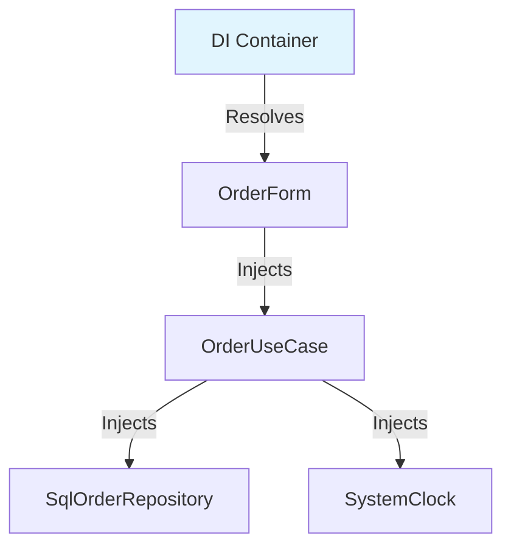

# 第12章：DI（依存性注入）の超入門（まずはコンストラクタ注入）💉😊

この章は「**SoCを守るための“配線の技術”**」を身につける回だよ〜！✨
最新の .NET は **.NET 10（LTS）**、言語は **C# 14**、IDEは **Visual Studio 2026** が中心になってるよ（2025年11月リリース）。([Microsoft][1])

---

## 0. 今日のゴール🎯✨

読み終わったら、こんな状態になってればOK！😊

* ✅ `new` だらけのコードが **なぜツラいのか**説明できる
* ✅ **コンストラクタ注入**で「渡して使う」形にできる
* ✅ DIコンテナ（`ServiceCollection`）で **登録→解決**ができる
* ✅ 「Scopedって何？デスクトップだとどうするの？」の基本がわかる🪄

---

## 1. DIってなに？超ざっくり言うと…🧠💡


DI（Dependency Injection）は、

> **必要な部品（依存）を、自分で作らずに外から渡してもらう**
> （“newしないで、受け取って使う”）

っていう考え方だよ😊

これをやると、

* 🔥 **差し替えが簡単**（本物⇄テスト用）
* 🔥 **UIがDBや外部都合に引っ張られにくい**（SoCが守れる）
* 🔥 **変更に強くなる**（影響範囲が縮む）

…みたいな嬉しさが出てくるの✨

---

## 2. まず「new地獄」の何が困るの？😇💥

### 2-1. 典型パターン（イベント内でnew）😵‍💫

```csharp
public class OrderForm : Form
{
    private void btnSave_Click(object sender, EventArgs e)
    {
        var repo = new SqlOrderRepository("Server=...");
        var clock = new SystemClock();
        var service = new OrderUseCase(repo, clock);

        service.PlaceOrder(txtCustomer.Text, int.Parse(txtAmount.Text));
        MessageBox.Show("保存したよ！");
    }
}
```

これ、ぱっと見は動くけど問題があるの…😭

* 🧨 **UIがインフラを知りすぎ**（接続文字列とか…）
* 🧨 **差し替え不能**（テストしたくても SqlOrderRepository 固定）
* 🧨 **依存が増えるほど画面が太る**（イベントが肥満化🍔）

SoC観点だと、UIは「ボタン押した→ユースケース呼ぶ」くらいに痩せたいのに、**作る責任**まで持っちゃってるのがキツいんだよね💦

---

## 3. コンストラクタ注入：いちばん基本のDI💉🌸

### 3-1. “作らないで、受け取る”に変える✨

```csharp
public class OrderForm : Form
{
    private readonly OrderUseCase _useCase;

    public OrderForm(OrderUseCase useCase)
    {
        InitializeComponent();
        _useCase = useCase;
    }

    private void btnSave_Click(object sender, EventArgs e)
    {
        _useCase.PlaceOrder(txtCustomer.Text, int.Parse(txtAmount.Text));
        MessageBox.Show("保存したよ！");
    }
}
```

✅ UIがやることがスッキリした〜！😍
ここでのポイントはこれ👇

* `OrderForm` は **OrderUseCaseを“作らない”**
* かわりに **コンストラクタで受け取る**（= 注入💉）

---

## 4. 「じゃあ誰が作るの？」→ “組み立て係”を1か所に作る🧩✨

DIの世界では、

* **作る場所**（配線・組み立て）＝ だいたいアプリの入口（`Program.cs`など）
* **使う場所**（UI/業務）＝ 受け取って使うだけ

に分けるよ😊
この「組み立て係」を **Composition Root**（構成ルート）って呼ぶこともあるよ✨

---

## 5. まずはDIコンテナなしでOK（手動DI）🙆‍♀️🧵

最初はこれで十分だよ〜！

```csharp
// Program.cs（組み立て係）
var repo = new SqlOrderRepository("Server=...");
var clock = new SystemClock();
var useCase = new OrderUseCase(repo, clock);
var form = new OrderForm(useCase);

Application.Run(form);
```

✅ これでもう **UIからnewが消える**👏✨
ただし依存が増えると、この組み立てが大変になってくる…！

---

## 6. DIコンテナ入門：ServiceCollectionで「登録→自動組み立て」🤖🧰

.NET には定番のDI基盤（`Microsoft.Extensions.DependencyInjection`）があって、`IServiceCollection` に登録して使うよ😊
（`AddSingleton / AddScoped / AddTransient` のライフタイムもここ！）([Microsoft Learn][2])

### 6-1. 最小構成：登録して、フォームを解決する✨

```csharp
using Microsoft.Extensions.DependencyInjection;

var services = new ServiceCollection();

// 依存の登録（配線表）
services.AddSingleton<IClock, SystemClock>();
services.AddTransient<IOrderRepository>(_ => new SqlOrderRepository("Server=..."));
services.AddTransient<OrderUseCase>();
services.AddTransient<OrderForm>();

using var provider = services.BuildServiceProvider();

ApplicationConfiguration.Initialize();
var form = provider.GetRequiredService<OrderForm>();
Application.Run(form);
```

ここで起きてることはシンプルで、

* `OrderForm` が `OrderUseCase` を欲しがる
* `OrderUseCase` が `IOrderRepository` と `IClock` を欲しがる
* コンテナが **芋づる式に組み立ててくれる**🍠✨

って感じだよ😊



> こういう「登録して使う」スタイルは、MicrosoftのDI解説やチュートリアルでも基本の形だよ。([Microsoft Learn][3])

---

## 7. ライフタイム超入門（AddTransient / Scoped / Singleton）⏳✨

### 7-1. ざっくり表🎀

* **Transient**：呼ばれるたびに新しい（軽い部品向け）
* **Singleton**：アプリ全体で1つ（設定・時計・キャッシュなど）
* **Scoped**：ある“まとまり”の間だけ同じ（Webなら「1リクエスト」）([Microsoft Learn][4])

### 7-2. デスクトップでScopedはどうするの？🖥️🤔

Webは「リクエスト」が勝手にスコープになるけど、デスクトップは自分で作ることが多いよ。

たとえば「1画面（または1処理）＝ 1スコープ」にしたいなら👇

```csharp
using Microsoft.Extensions.DependencyInjection;

using var scope = provider.CreateScope();
var dialog = scope.ServiceProvider.GetRequiredService<SomeDialog>();
dialog.ShowDialog();
```

MicrosoftのDIドキュメントでも、Scopedサービスは **暗黙のスコープ（Web）か、`CreateScope()`で作った明示スコープの中で使う**のが基本だよ〜！([Microsoft Learn][4])

---

## 8. よくある落とし穴あるある😵‍💫➡️😄

### 8-1. 「どこでも provider.GetService()」にしちゃう（サービスロケータ地獄）🚫

* 便利そうに見えるけど、依存が見えなくなるよ😭
* ✅ **基本はコンストラクタ注入**で、`GetRequiredService` は入口だけ！

### 8-2. コンストラクタの引数が10個になった😇

* それ、だいたい **責務が多すぎ**サインだよ🧱
* ✅ UseCaseを分割したり、UIのやることを減らしたりしよう！

### 8-3. SingletonがScopedを抱えて死ぬ💥

* 例えば `DbContext` 系（よくScoped）をSingletonに持たせると事故りやすい
* ✅ 必要なら **スコープを切って使う**（`CreateScope()`）発想へ✨

---

## 9. ミニ演習（手を動かすと一気にわかるよ）🧪🌟

### 演習A：newを探して“外に追い出す”🔍

1. `Form` / `View` のイベント内にある `new` を3つ探す
2. それを「コンストラクタで受け取る」に変える
3. 組み立ては `Program.cs` に寄せる

### 演習B：差し替えテスト気分を味わう🎭

`IClock` を作って、テスト用時計に差し替える：

```csharp
public interface IClock { DateTime Now { get; } }

public sealed class SystemClock : IClock
{
    public DateTime Now => DateTime.Now;
}

public sealed class FixedClock : IClock
{
    public FixedClock(DateTime now) => Now = now;
    public DateTime Now { get; }
}
```

`FixedClock` を注入できるだけで、**日付依存バグ**が一気にテストしやすくなるよ〜！🫶✨

---

## 10. Copilot / Codexに頼むときのプロンプト例🤖📝✨

そのままコピペで使える感じにするね😊

* 「この `btnSave_Click` の中の `new` を消して、**コンストラクタ注入**にリファクタして。UIはUseCaseを呼ぶだけにしたい」
* 「`SqlOrderRepository` を直接newしてるので、`IOrderRepository` を作って **差し替え可能**にして」
* 「`ServiceCollection` を使ってDI登録を書いて。`AddSingleton / AddTransient` の判断も理由つきで提案して」
* 「依存が増えすぎてるかも。**責務の分割案**を3つ出して（UseCase分割 / 画面の痩せ化 / DTO導入など）」

⚠️AIが出したコードは、最後にこれチェック✅

* 依存が `GetService()` で隠れてない？
* UIがインフラ詳細を知ってない？
* ライフタイムが変じゃない？（SingletonにScoped混ぜてない？）([Microsoft Learn][4])

---

## 11. まとめ🌸✨

* DIは「**作らずに、渡してもらう**」💉
* 最初は **コンストラクタ注入**だけで勝ち🏆
* 組み立ては入口（`Program.cs`）に寄せる🧩
* 依存が増えたら `ServiceCollection` で自動組み立て🧰
* Scopedはデスクトップだと **必要に応じて `CreateScope()`** で区切る🖥️✨([Microsoft Learn][4])

---

次の第13章は、今日のDIがそのまま効いてくる「テストしやすいSoC」だよ〜！🧪💖
（DIできてるだけで、テスト難易度がガクッと下がる…！）

[1]: https://dotnet.microsoft.com/en-us/platform/support/policy?utm_source=chatgpt.com "The official .NET support policy"
[2]: https://learn.microsoft.com/ja-jp/dotnet/core/extensions/dependency-injection-basics?utm_source=chatgpt.com "依存関係の挿入の基礎 - .NET"
[3]: https://learn.microsoft.com/en-us/dotnet/core/extensions/dependency-injection-usage?utm_source=chatgpt.com "Tutorial: Use dependency injection in .NET"
[4]: https://learn.microsoft.com/ja-jp/dotnet/core/extensions/dependency-injection?utm_source=chatgpt.com "NET での依存関係の挿入"
