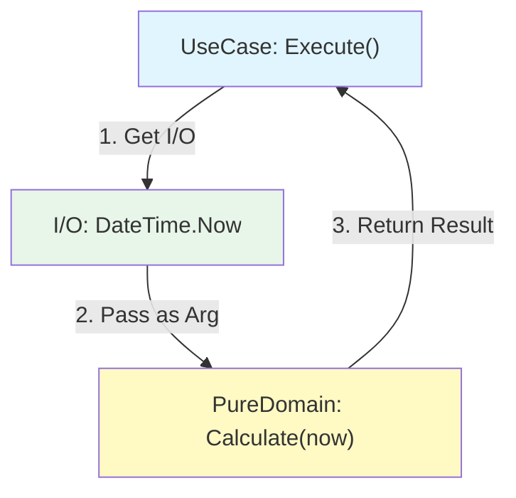

# 第13章：テストしやすいSoC（I/O境界の分離）🧪✨

（テーマ：**「テスト不能の原因＝I/O混入」**をスパッと解決するよ〜！😆🪄）

---

## 13.0 この章のゴール🎯💖

この章が終わったら、あなたはこうなれるよ👇✨

* ✅ **「テストできないコード」って何が悪いか**説明できる
* ✅ **I/O（外の世界）を境界で分ける**感覚がつかめる
* ✅ **“純粋ロジック”中心の設計**に直して、ユニットテストが書ける
* ✅ スタブ/モックにビビらなくなる🙆‍♀️🧸（最小でOK！）

---

## 13.1 そもそも I/O って何？🚪🌍

I/O（Input/Output）って、ざっくり言うと **「外の世界とのやり取り」**だよ〜！🌏✨

### I/O の例📌

* DBアクセス🗄️
* ファイル読み書き📁
* HTTP通信🌐
* 時刻（`DateTime.Now`）🕒
* 乱数（`Random`）🎲
* 環境変数・OS情報・マシン名🖥️
* UI（ボタン/テキストボックス）🖱️

### なぜI/Oが混ざるとテストが死ぬの？😇💥

I/Oが入るとテストはこうなる👇😭

* ❌ 遅い（DB/HTTP待ち）🐢
* ❌ 不安定（ネットワーク/時刻/環境差）🌪️
* ❌ 準備が重い（DB起動、データ投入…）🧱
* ❌ 失敗しても原因が分からない（外部要因）🕵️‍♀️💦

---

## 13.2 “純粋ロジック”って何？🍵✨

**純粋ロジック**は超ざっくりこれ👇

> 同じ入力なら、いつでも同じ出力になる関数（処理）💡

つまり

* 時刻を見ない🕒❌
* DB触らない🗄️❌
* ファイル書かない📁❌
* ネット叩かない🌐❌

だから…
**速い！安定！テストが超ラク！**😆🧪✨

---

## 13.3 SoC的に最強の形：「純粋コア + I/Oシェル」🥚🛡️


イメージはこれだよ👇✨

* 🧠 **中心（コア）**：純粋ロジック（テストの主役）
* 🧤 **外側（シェル）**：I/O（DB/HTTP/時刻/ファイル/UI）

中心を守るほど、設計が強くなる💪🌟
（この考え方、Clean Architecture / Hexagonal っぽい世界観にもつながるよ〜🌀）

---

## 13.4 まずは“テスト不能コード”を見てみよ😇💥（Before）

例えば「会員ランクと時間帯で割引が変わる」処理があるとして…🛍️✨

```csharp
public class CheckoutService
{
    public decimal CalculateFinalPrice(decimal price, bool isMember)
    {
        // 時刻I/O混入🕒
        var now = DateTime.Now;

        // ルール：会員は10%引き
        if (isMember)
            price *= 0.9m;

        // ルール：平日18〜20時はさらに5%引き
        if (now.DayOfWeek is >= DayOfWeek.Monday and <= DayOfWeek.Friday
            && now.Hour is >= 18 and <= 20)
        {
            price *= 0.95m;
        }

        return price;
    }
}
```

### これ、何が困るの？😵‍💫

* テストが **時刻に依存**しちゃう🕒💥

  * 18:01だと通るけど、17:59だと落ちる…みたいな「地獄」👻
* CI（自動テスト）で時間ズレると壊れることもある😭

---

## 13.5 I/O境界の分離：最小の勝ちパターン🏆✨（After）

やることはシンプルだよ👇😊

### ✅ 1) 時刻を“入力”として受け取る

```csharp
public class DiscountRules
{
    public decimal CalculateFinalPrice(decimal price, bool isMember, DateTime now)
    {
        if (isMember)
            price *= 0.9m;

        if (now.DayOfWeek is >= DayOfWeek.Monday and <= DayOfWeek.Friday
            && now.Hour is >= 18 and <= 20)
        {
            price *= 0.95m;
        }

        return price;
    }
}
```

### ✅ 2) “外側”で `DateTime.Now` を取る（I/Oは外へ🚪）

```csharp
public class CheckoutUseCase
{
    private readonly DiscountRules _rules = new();

    public decimal Execute(decimal price, bool isMember)
    {
        var now = DateTime.Now; // I/Oはここ（外側）に閉じ込める🕒
        return _rules.CalculateFinalPrice(price, isMember, now);
    }
}
```

これだけで、**中心のロジックがテスト可能**になるよ！🧪✨



---

## 13.6 ユニットテスト書いてみよ🧪💖（超ラクになる！）

例：xUnit でテスト（もちろん MSTest でもOKだよ🙆‍♀️）

```csharp
using Xunit;

public class DiscountRulesTests
{
    [Fact]
    public void MemberGets10PercentOff()
    {
        var rules = new DiscountRules();
        var now = new DateTime(2026, 1, 10, 12, 0, 0); // いつでも固定🧊

        var result = rules.CalculateFinalPrice(1000m, isMember: true, now);

        Assert.Equal(900m, result);
    }

    [Fact]
    public void WeekdayHappyHourGetsExtra5PercentOff()
    {
        var rules = new DiscountRules();
        var now = new DateTime(2026, 1, 9, 18, 30, 0); // 金曜18:30🕡

        var result = rules.CalculateFinalPrice(1000m, isMember: false, now);

        Assert.Equal(950m, result);
    }
}
```

### 何が嬉しい？😍

* いつ実行しても同じ結果✅
* 速い⚡
* 安定🧊
* “条件分岐のテスト”が気持ちよく書ける😆✨

---

## 13.7 でもさ…「毎回now渡すのダルい」問題😗💭


うん、分かる😂
そこで **.NETの “TimeProvider”** が便利だよ〜！🕒✨
TimeProviderは「時間の抽象化」で、テストしやすくするための仕組みだよ（.NET 8で導入）📦✨ ([Microsoft Learn][1])

### TimeProviderを使う形（おすすめ）🌟

```csharp
public class DiscountRules2
{
    private readonly TimeProvider _time;

    public DiscountRules2(TimeProvider time)
    {
        _time = time;
    }

    public decimal CalculateFinalPrice(decimal price, bool isMember)
    {
        var now = _time.GetLocalNow().DateTime;

        if (isMember)
            price *= 0.9m;

        if (now.DayOfWeek is >= DayOfWeek.Monday and <= DayOfWeek.Friday
            && now.Hour is >= 18 and <= 20)
        {
            price *= 0.95m;
        }

        return price;
    }
}
```

### テストでは FakeTimeProvider を使えるよ🧪🧊

`Microsoft.Extensions.TimeProvider.Testing` に `FakeTimeProvider` があるよ〜！ ([nuget.org][2])

（これで「時間を自由に進める/止める」ができる😆）

---

## 13.8 スタブ？モック？怖くないよ🙆‍♀️🧸

初心者は、まずこれだけ覚えてOK👇✨

* 🧸 **フェイク（Fake）**：簡易な偽物実装（メモリ上のRepositoryとか）
* 🎭 **モック（Mock）**：呼ばれ方を検証する偽物（「Sendが1回呼ばれた？」みたいな）
* 🧪 **スタブ（Stub）**：戻り値だけ返す偽物（固定値返すだけ）

### 結論：最初は“フェイク”最強💪✨

自作クラスで十分なこと、めっちゃ多いよ😆

---

## 13.9 「ユニットテスト」と「統合テスト」も分けよう🧩✨

* 🧪 **ユニットテスト**：純粋ロジック中心（速い・大量に回す）⚡
* 🧱 **統合テスト**：DB/HTTPなどI/O込み（数は少なめ・重要シナリオだけ）🔍

SoC的には、
**ユニットテストで“中心”をガチガチに固めて**、統合テストは“外側の接続確認”にするのが気持ちいいよ〜😌🛡️

---

## 13.10 テスト環境の「今どき」メモ📝✨（2026）

* .NETは **.NET 10（LTS）** が現行の大きな軸だよ（2025/11/11リリース、LTS） ([Microsoft][3])
* C# は **C# 14** が .NET 10 世代での新しめライン（VS 2026 / .NET 10 SDKで試せる） ([Microsoft Learn][4])
* Visual Studio は **Visual Studio 2026** 世代が前提にできる（メジャー版は年次、LTSCなどの方針も公開されてるよ） ([Microsoft Learn][5])

### MSTestの最近の動き（けっこう便利になってる）🧪🌟

MSTest 3.8 では、Retry属性や条件付きテスト、Throws系の拡充などが入ってるよ✨ ([Microsoft for Developers][6])
さらに MSTest v3 への移行ガイドも用意されてる（モダン .NET 対応を強める流れ）📘 ([Microsoft Learn][7])

---

## 13.11 ハンズオン演習✍️💖（手を動かすよ〜！）

### 演習1：I/Oを見つけるゲーム🔍🎮

次のうち I/O はどれ？（複数）

* A: `price * 0.9m`
* B: `DateTime.Now`
* C: `HttpClient.GetStringAsync(...)`
* D: `if (x > 0)`
* E: `File.ReadAllText(...)`

✅答え：B, C, E（外の世界）🕒🌐📁

---

### 演習2：時刻依存を“入力化”してテスト🧪✨

`DateTime.Now` を使ってるメソッドを1個選んで、

* (1) `now` を引数にする
* (2) テストを書く（境界：17:59 / 18:00 / 20:00 / 20:01 を入れる）🕔🕕

---

### 演習3：Repositoryをフェイクにする📦✨

`IUserRepository` を作って、

* 本物：DBにつなぐ（ここはまだ仮でOK）
* テスト：`InMemoryUserRepository` を自作する🧸

「DBなしでユースケースがテストできた！」を体験してね😆🎉

---

## 13.12 よくある事故あるある😇💥（回避テク付き）

### 😭 事故1：テストの中で `DateTime.Now` を使う

👉 **固定時刻**にする（入力化 or TimeProvider）🧊✨

### 😭 事故2：UIイベント内にロジックが増殖

👉 UIは「呼ぶだけ」にして、ロジックは別クラスへ🖥️➡️🧠

### 😭 事故3：静的（static）が便利すぎて依存が隠れる

👉 依存は “渡す” が正義（DIの章とセットで効く）💉✨

---

## 13.13 AI（Copilot/Codex）に手伝わせるプロンプト例🤖💡

そのままコピペで使える系いくよ〜！😆✨

### ① I/O分離リファクタ依頼🛠️

* 「このメソッド内の I/O（時刻/DB/HTTP/ファイル）を列挙して、純粋ロジックと外側I/Oに分離してください。純粋ロジックは引数/戻り値だけで完結させてください。」

### ② テストケース洗い出し🧪

* 「この割引ロジックの境界値テストを列挙して、xUnitのテストコードを書いてください（AAAで、同じ入力なら同じ結果になる形にしてください）。」

### ③ フェイクリポジトリ作成🧸

* 「IUserRepository の InMemory 実装を作ってください。スレッド安全性は不要、テスト用途でOKです。」

---

## 13.14 まとめ🎀✨

* テスト不能のラスボスは **I/O混入**😈
* SoC的に、**中心を純粋ロジックに寄せる**と強い🛡️✨
* I/Oは **外側に閉じ込める**（境界を作る）🚪
* スタブ/モックは最小でOK、まずは **フェイク最強**🧸💖
* 時刻は **TimeProvider** がかなり助けてくれる🕒✨ ([Microsoft Learn][1])

---

次の章（第14章）は「小さなリファクタでSoCに近づく手順」🔧🌱だよね！
もし、この章の題材コードを「WinForms/WPFっぽいイベント地獄」に寄せた例も欲しかったら、同じ思想で差し替え版も作るよ〜😆🖥️💕

[1]: https://learn.microsoft.com/ja-jp/dotnet/standard/datetime/timeprovider-overview?utm_source=chatgpt.com "TimeProvider クラスとは - .NET"
[2]: https://www.nuget.org/packages/Microsoft.Extensions.TimeProvider.Testing/8.10.0?utm_source=chatgpt.com "Microsoft.Extensions.TimeProvider.Testing 8.10.0"
[3]: https://dotnet.microsoft.com/en-us/platform/support/policy/dotnet-core?utm_source=chatgpt.com "NET and .NET Core official support policy"
[4]: https://learn.microsoft.com/en-us/dotnet/csharp/whats-new/csharp-14?utm_source=chatgpt.com "What's new in C# 14"
[5]: https://learn.microsoft.com/en-us/visualstudio/releases/2026/servicing-vs?utm_source=chatgpt.com "Visual Studio Product Lifecycle and Servicing"
[6]: https://devblogs.microsoft.com/dotnet/mstest-3-8-highlights/?utm_source=chatgpt.com "MSTest 3.8: Top 10 features to supercharge your .NET tests!"
[7]: https://learn.microsoft.com/en-us/dotnet/core/testing/unit-testing-mstest-migration-from-v1-to-v3?utm_source=chatgpt.com "MSTest migration to v3 - .NET"
