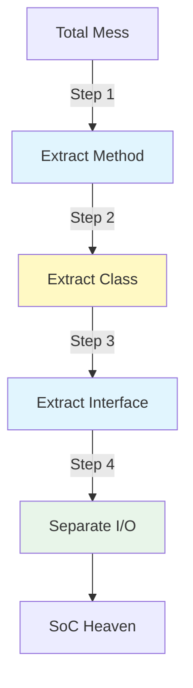

# 第14章：小さなリファクタでSoCに近づく手順🔧🌱

この章は「**ぐちゃっと混ざったコード**」を、**壊さずに・少しずつ** SoC（関心の分離）へ寄せていくための“手順書”だよ〜！😊✨
ポイントはただ1つ：

**一気に直さない！小さく刻んで、ずっと動く状態をキープする！🪄🔁**

---

## 14-1. まず最初に知っておくべき真実😌🧠

SoCに寄せるリファクタで失敗する典型はコレ👇

* 「よし！今日中に全部きれいにするぞ！」🔥
  → **途中で動かなくなる**😇
  → **戻せなくなる**😱
  → **心が折れる**🫠

だからこの章では、**“いつでも戻れる”** と **“いつでも動く”** を最優先にするよ✅✨

---

## 14-2. リファクタ前の“安全ネット”を張ろう🪂✅

リファクタって「動きは変えないで、構造だけ変える」作業なのね。
つまり、**動きが変わったら負け**🤣💦

そこで最初にやるのが **安全ネット**！

### ✅ 安全ネットの3点セット

1. **コミットを切る（退避地点）**🧷
2. **動作確認の手順をメモ**📝（最低限でOK）
3. **テストを1〜3本だけ作る**🧪（作れそうな所だけ）

.NET は毎月の更新（Patch Tuesday周辺）もあるので、リファクタ中に環境差で揺れないよう「まず現状を固定」して進めるのがラクだよ〜🔒😊 ([Microsoft][1])

---

## 14-3. どこから切る？“1枚だけ”選ぶコツ🔍🍰


SoC化は「プロジェクト全体」を相手にすると重すぎるので、**最小の一切れ**から🍰✨

おすすめの切り方👇

* ✅ 「ボタン1個」
* ✅ 「画面の保存処理だけ」
* ✅ 「API 1本」
* ✅ 「バリデーション1種類」

選ぶ基準はこれだけ👇

**30分〜2時間で終わりそうなサイズ**⌛✨
（終わらなそうなら “さらに半分”！🔪）

---

## 14-4. ステップ0：混ざり方を“見える化”しよう🎨👀

リファクタ前にやると爆速になるのが **色分け思考**🌈

頭の中でいいので、ざっくり👇

* 🖥️ UI（画面、イベント、表示、MessageBox）
* 🧠 業務（ルール、計算、状態遷移、制約）
* 🗄️ 外部（DB、HTTP、ファイル、時刻、乱数）

そして目標はコレ👇

**🧠業務を“単体で動く”塊にする**
（＝UI/DBが無くても計算できる状態💡）



---

## 14-5. ステップ1：メソッド抽出（最初はここだけで勝ち）✂️🥇

最初の一手はだいたい **Extract Method（メソッド抽出）** でOK！🙆‍♀️✨

### 🎯 狙い

* UIイベントの中の処理を短くする（イベントを痩せさせる🍃）
* 「名前」で意味を分ける（見出しを付ける感じ🏷️）

### ✅ “抽出していい塊”の見つけ方

* 同じようなコードが2回出てくる
* コメントで説明したくなってる
* if が増殖してる
* 例外処理が混ざって読めない

Visual Studio はリファクタ操作がかなり強力で、Extract Method みたいな日常系がサクサクできるよ🛠️✨（最新の Visual Studio 2026 でももちろん中心機能！） ([Microsoft Learn][2])

---

## 14-6. ステップ2：クラス抽出（UseCase を作る）📦✨

メソッド抽出で「塊」が見えてきたら、次は **クラスに引っ越し**🏠💨

この章での合言葉はコレ👇

**画面の外に “実行役” を作る**🎬✨

よくある形👇

* `SaveOrderUseCase`
* `RegisterUserUseCase`
* `CalculateDiscountService`

命名は難しく考えなくてOK！
**「やってることを日本語で言って、それを英語にする」**くらいで十分だよ😊💡

---

## 14-7. ステップ3：依存を外へ（interfaceで“差し替え口”を作る）🧲🚪

UseCase を作ったのに、まだ中で `SqlConnection` とか触ってたら、**外部の都合が侵入**してる状態😵‍💫

ここでやるのが👇

* `IOrderRepository` みたいな **差し替え口（interface）** を作る
* UseCase は interface だけ知ってればOKにする

これで「中心（業務）」を守りやすくなるよ🛡️✨
（いわゆる依存の向きの体験に繋がるやつ！）

---

## 14-8. ステップ4：I/O境界を切る（DB/HTTP/ファイルは外側へ）🚪🗄️

**I/O（外部入出力）って、テストしにくさの親玉**👑💥
だから SoCでは、I/O を “外側” に押し出すのが基本だよ〜！

### ✅ I/O を外に出せたサイン

* UseCase の中に `DateTime.Now` が無い🕒❌
* UseCase の中に `SqlConnection` が無い🗄️❌
* UseCase の中に `HttpClient` が無い🌐❌
* UseCase が「入力→出力」を返すだけになってる📥➡️📤✨

---

## 14-9. “動くまま切る”ための実戦テク集🧰🔥

### 🧩 テク①：ラップして逃がす（Wrap & Delegate）🎁

いきなり置き換えないで、旧処理を包む👇

* 旧コードを `LegacyOrderSaver` に移す
* 新コードは `OrderRepository` に作る
* しばらくは「旧を呼ぶ」でもOK

**目的：まず混ざりを止める🧱✨**

### 🧩 テク②：ブランチを小さく刻む（小コミット）🔖

* Extract Method したらコミット✅
* クラス抽出したらコミット✅
* interface 切ったらコミット✅

**1コミット＝1つの意図** が最高に強いよ💪✨

### 🧩 テク③：一時的な二重管理を許す（短期だけ）🫣

* DTOとEntityの両方がある
* Mapperが増える
* ちょい面倒

でもこれ、**将来の保険**💰✨
（後で修正が爆速になるやつ）

---

## 14-10. ミニ演習：ボタン1つをSoC化してみよ〜🖥️🔄✨

### ❌ Before：全部入りイベント😇💥

```csharp
private void btnSave_Click(object sender, EventArgs e)
{
    if (string.IsNullOrWhiteSpace(txtName.Text))
    {
        MessageBox.Show("名前は必須です");
        return;
    }

    var price = decimal.Parse(txtPrice.Text);
    var discount = chkMember.Checked ? price * 0.1m : 0m;
    var finalPrice = price - discount;

    using var conn = new SqlConnection(_connectionString);
    conn.Open();

    using var cmd = new SqlCommand("INSERT INTO Orders(Name, FinalPrice) VALUES (@n, @p)", conn);
    cmd.Parameters.AddWithValue("@n", txtName.Text);
    cmd.Parameters.AddWithValue("@p", finalPrice);
    cmd.ExecuteNonQuery();

    MessageBox.Show("保存しました！");
}
```

---

### ✅ Step1：メソッド抽出✂️

```csharp
private void btnSave_Click(object sender, EventArgs e)
{
    var input = ReadInput();
    if (!Validate(input, out var error))
    {
        MessageBox.Show(error);
        return;
    }

    Save(input);
    MessageBox.Show("保存しました！");
}

private OrderInput ReadInput() =>
    new(txtName.Text, txtPrice.Text, chkMember.Checked);

private bool Validate(OrderInput input, out string error)
{
    if (string.IsNullOrWhiteSpace(input.Name))
    {
        error = "名前は必須です";
        return false;
    }
    if (!decimal.TryParse(input.PriceText, out _))
    {
        error = "価格が不正です";
        return false;
    }

    error = "";
    return true;
}

private void Save(OrderInput input)
{
    // まだ全部入りでもOK！次で外に出す✨
}
public record OrderInput(string Name, string PriceText, bool IsMember);
```

---

### ✅ Step2：UseCase クラス抽出📦

```csharp
public class SaveOrderUseCase
{
    public void Execute(SaveOrderCommand command)
    {
        var price = decimal.Parse(command.PriceText);
        var finalPrice = CalculateFinalPrice(price, command.IsMember);

        // まだDB直書きでもOK（次で分離）✨
    }

    public decimal CalculateFinalPrice(decimal price, bool isMember)
        => price - (isMember ? price * 0.1m : 0m);
}

public record SaveOrderCommand(string Name, string PriceText, bool IsMember);
```

ここで `CalculateFinalPrice` は **純粋ロジック**になったから、テストしやすいよ〜🧪✨

---

### ✅ Step3：Repository を切って I/O を外へ🚪🗄️

```csharp
public interface IOrderRepository
{
    void Insert(string name, decimal finalPrice);
}

public class SaveOrderUseCase
{
    private readonly IOrderRepository _repo;

    public SaveOrderUseCase(IOrderRepository repo)
        => _repo = repo;

    public void Execute(SaveOrderCommand command)
    {
        var price = decimal.Parse(command.PriceText);
        var finalPrice = CalculateFinalPrice(price, command.IsMember);

        _repo.Insert(command.Name, finalPrice);
    }

    public decimal CalculateFinalPrice(decimal price, bool isMember)
        => price - (isMember ? price * 0.1m : 0m);
}
```

これで UseCase は **DBを知らない**🎉✨
SoCの “中心を守る形” に一気に近づいたね〜！🧡

---

## 14-11. よくある事故と回避法😱🧯

* 😵「抽出したら挙動が変わった」
  → **先にテスト（or動作確認手順）を固定**🪂

* 😵「引数が増えすぎて泣いた」
  → **Command/Request を record でまとめる**📦

* 😵「どこに置けばいいか迷子」
  → **一旦 “Application（UseCase）” に置いてOK**🧭✨
  （後で移動すればいい！）

---

## 14-12. Copilot/Codex を“リファクタ相棒”にする🤖💞

最近の Visual Studio では Copilot まわりが統合されて、より自然に使える流れになってるよ✨ ([Visual Studio][3])
さらに Visual Studio 2026 系でも AI 機能が深く統合されてるよ〜！ ([Microsoft for Developers][4])

### 💡 使えるプロンプト例（そのまま貼ってOK）✨

* 「この `btnSave_Click` を、**動作を変えずに** Extract Method で分割して」
* 「業務ロジックを `UseCase` に移したい。**最小ステップで**提案して」
* 「DBアクセスを `IOrderRepository` に切り出して。**差分（before/after）**で出して」
* 「この処理に対して、**境界（I/O）を残したまま**テストを書ける形にして」

GitHub公式も「Copilotでリファクタする考え方」を案として出してるので、**“案出し担当”**として使うのがめっちゃ相性いいよ🤝✨ ([GitHub Docs][5])

---

## 14-13. 章末チェックリスト✅💮

* ✅ 変更は “小さく刻んだ”
* ✅ 途中でも常にビルドが通る
* ✅ UIイベントが短くなった（見通しUP）
* ✅ 業務ロジックが “単体で動く塊” になった
* ✅ I/O（DB/HTTP/ファイル）が外へ逃げた
* ✅ interface で差し替え口ができた

できてたら、もうこの章はクリアだよ〜！🎉😊✨

---

## 14-14. 次章につながるよ📚🔥

次の第15章は、いよいよ **ケーススタディ（フォーム地獄→3分離）** で、
今日の手順を「まるごと1本」通してやる感じになるよ〜！🍿✨

[1]: https://dotnet.microsoft.com/en-us/platform/support/policy/dotnet-core?utm_source=chatgpt.com "NET and .NET Core official support policy"
[2]: https://learn.microsoft.com/en-us/visualstudio/releases/2026/release-notes?utm_source=chatgpt.com "Visual Studio 2026 Release Notes"
[3]: https://visualstudio.microsoft.com/github-copilot/?utm_source=chatgpt.com "Visual Studio With GitHub Copilot - AI Pair Programming"
[4]: https://devblogs.microsoft.com/visualstudio/visual-studio-2026-is-here-faster-smarter-and-a-hit-with-early-adopters/?utm_source=chatgpt.com "Visual Studio 2026 is here: faster, smarter, and a hit with ..."
[5]: https://docs.github.com/en/copilot/tutorials/refactor-code?utm_source=chatgpt.com "Refactoring code with GitHub Copilot"
